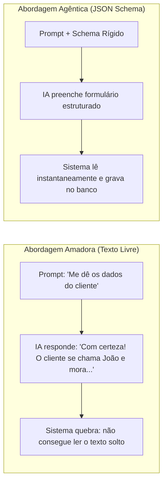

# Capítulo 15: Contratos Tipados e Registro Declarativo em JSON Schema

## 1. Introdução

Imagine que você contrata uma transportadora para entregar caixas de vidro. Você avisa verbalmente: *"Cuidado, é frágil, não vire de cabeça para baixo"*. Mas na hora do transporte, uma das caixas é virada e todo o vidro se quebra [1].

Para evitar esse problema, o mundo corporativo inventou os **Contratos Formais**: especificações escritas, com regras jurídicas rígidas e multas claras para qualquer descumprimento [1].

No desenvolvimento com agentes de Inteligência Artificial, o maior erro dos iniciantes é confiar em "pedidos verbais no chat" [2]. Você pede para a IA: *"Gere uma lista com os 3 maiores clientes"*, e ela responde com um texto amigável cheio de parágrafos, tornando impossível para o seu sistema de computador ler e gravar aqueles dados automaticamente [2] [3].

Neste capítulo, você aprenderá a criar **Contratos Tipados (Structured Outputs)** usando **JSON Schema** e validações com **Pydantic** — a técnica definitiva que obriga a IA a responder em formulários matematicamente perfeitos [1] [3].

## 2. Explica

### 2.1 O que é um JSON Schema?

O **JSON Schema** é uma linguagem de especificação aberta que descreve a estrutura exata que um conjunto de dados deve possuir [3] [4].

Com um JSON Schema, você define regras como [3]:
- O campo `id` deve ser obrigatoriamente um número inteiro positivo [3].
- O campo `email` deve ser um texto contendo `@` e um domínio válido [3].
- O campo `status` só pode aceitar três opções fixas: `"pendente"`, `"aprovado"` ou `"cancelado"` [3].

### 2.2 Como os Modelos Garantem o Cumprimento do Contrato

Nos modelos modernos com suporte a *Structured Outputs* (como Claude 3.7, GPT-4o e Gemini 2.0), o JSON Schema não é apenas "sugerido no prompt": ele é injetado diretamente no motor de amostragem de probabilidades (*Logit Bias Masking*) [3] [5].

Isso significa que o modelo **é matematicamente incapaz de gerar um caractere que viole o schema** [3]. A resposta é garantida em 100% dos casos, eliminando a necessidade de parsers frágeis de texto [1] [3].

## 3. Ilustra

Veja a diferença entre pedir texto livre vs usar um Contrato Tipado:



## 4. Técnica

### Exemplo Prático de Contrato Tipado em Python com Pydantic

Veja como definir um contrato tipado e forçar a IA a preenchê-lo com perfeição [1] [3]:

```python
#!/usr/bin/env python3
# contrato_tipado.py — Exemplo de Structured Output com Pydantic
from pydantic import BaseModel, Field
from typing import List, Literal

# 1. Definição do Contrato Formal
class ItemRelatorio(BaseModel):
    modulo: str = Field(description="Nome do módulo auditado")
    status: Literal["aprovado", "reprovado", "alerta"] = Field(description="Estado de conformidade")
    erros_encontrados: int = Field(default=0, ge=0, description="Quantidade de bugs detectados")
    recomendacao: str = Field(description="Ação técnica recomendada")

class RelatorioAuditoria(BaseModel):
    projeto: str
    versao: str
    total_modulos: int
    itens: List[ItemRelatorio]

# 2. Exibição do JSON Schema gerado automaticamente
if __name__ == "__main__":
    print("=== JSON SCHEMA DO CONTRATO DE AUDITORIA ===")
    print(RelatorioAuditoria.schema_json(indent=2))
```

## 5. Aplica

### O Caso da Automação de Notas Fiscais

Uma empresa de contabilidade recebia 5.000 notas fiscais por mês em PDF e precisava extrair os valores, datas e impostos [1]:
- **Sem Contratos Tipados**: A IA gerava respostas livres com variações como "R$ 1.200,00", "1200 reais" ou "mil e duzentos". O sistema contábil quebrava em 30% das leituras [1].
- **Com Contratos JSON Schema**: O Engenheiro Agêntico definiu o schema onde o campo `valor_centavos` era obrigatoriamente um número inteiro (ex: `120000`). A taxa de erro caiu para 0% e a importação passou a ser 100% automatizada [1] [3].

### Exercício
- [ ] Defina um JSON Schema para cadastrar um livro com `titulo` (texto), `paginas` (inteiro) e `categoria` (apenas "tecnologia", "ficção" ou "negócios")
- [ ] Execute `python contrato_tipado.py` e observe o schema matemático gerado pela biblioteca Pydantic
- [ ] Teste a validação: envie um JSON com campo inválido (ex: `paginas` como texto) e confirme que o Pydantic rejeita
- [ ] Crie um contrato tipado para uma resposta de API sua e verifique que o modelo devolve exatamente a estrutura esperada

## 6. Fixa

### Exercício Prático 1: Criando seu Próprio Schema
Defina um contrato em JSON para cadastrar um livro contendo os seguintes campos obrigatórios: `titulo` (texto), `paginas` (número inteiro) e `categoria` (apenas "tecnologia", "ficção" ou "negócios").

### Exercício Prático 2: Executando o Validador
Execute `python contrato_tipado.py` no seu terminal e observe como a biblioteca gera o schema matemático formal.

## 7. Conclusão

**Os 3 pontos que você dominou neste capítulo:**
1. O JSON Schema é uma linguagem de especificação aberta que descreve a estrutura exata que os dados devem possuir, eliminando a ambiguidade dos pedidos verbais.
2. Nos modelos com Structured Outputs, o schema é injetado no motor de amostragem (Logit Bias Masking), tornando o modelo matematicamente incapaz de violar o contrato.
3. O Pydantic gera o schema formal automaticamente a partir de classes Python tipadas, permitindo validação determinística e 100% de conformidade [5].

**Desafio final:** Crie um contrato tipado para uma tarefa real do seu projeto e teste com dados válidos e inválidos. Se o validador aceitar um dado fora do schema, revise a definição até a rejeição correta.

**No próximo capítulo**, você vai implementar e replicar a Camada 3 na prática — o Roteador de Modelos que conecta tudo em um módulo ativo no seu ambiente.

## 8. Referências Bibliográficas

[1] PROJETO ARSENAL. *Contratos Tipados, Schemas Declarativos e Validação Determinística*. São Paulo: Fábrica Agêntica, 2026.

[2] ANTHROPIC. *Tool Use and Structured Outputs Integration Guide*. São Francisco: Anthropic Research, 2024.

[3] OPENAI. *Structured Outputs and JSON Schema Specification*. São Francisco: OpenAI Developer Guides, 2024.

[4] INTERNET ENGINEERING TASK FORCE (IETF). *JSON Schema: A Media Type for Describing JSON Data*. IETF Draft Standard, 2024.

[5] PYDANTIC. *Data Validation and Settings Management using Python Type Annotations*. Pydantic Documentation, 2024.
