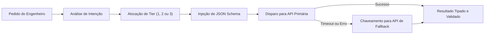

# Capítulo 16: Implementação e Réplica da Camada 3: O Roteador de Modelos

## 1. Introdução

Você conheceu a teoria do Roteamento por Pareto (80/20), dominou a Matriz de 3 Tiers de Modelos e aprendeu a blindar as saídas da IA com Contratos Tipados em JSON Schema [1].

Agora chegou a hora de construir a engrenagem que conecta tudo isso: **o Roteador Cognitivo da Camada 3 no seu próprio ambiente** [1].

Ao concluir este capítulo, você terá um módulo de roteamento ativo no seu computador, capaz de interceptar qualquer pedido, calcular a complexidade da tarefa, despachar para o modelo de menor custo e acionar fallbacks automáticos caso ocorra qualquer instabilidade na internet [1] [2].

## 2. Explica

### 2.1 O Kit Mestre da Camada 3

A implementação da Camada 3 é composta por três componentes estruturais [1]:
1. `.router/models_config.json`: O catálogo de credenciais e limites de cada provedor (Anthropic, OpenAI, DeepSeek, Google) [1].
2. `.router/engine.py`: O motor em Python que executa o roteamento semântico e a orquestração de chamadas com retries exponenciais [1] [3].
3. `.router/schemas/`: A pasta onde ficam guardados os contratos JSON Schema de cada tipo de tarefa [1].

### 2.2 O Ciclo de Vida de uma Chamada Roteada

Toda requisição processada pela Camada 3 segue cinco passos determinísticos [1]:
- **Passo 1 (Análise Semântica)**: O roteador inspeciona a intenção e os arquivos envolvidos [1].
- **Passo 2 (Seleção do Tier Ideal)**: Define se a tarefa é Tier 1 (Flash), Tier 2 (Dev) ou Tier 3 (Raciocínio) [1].
- **Passo 3 (Injeção do Contrato Schema)**: Anexa o schema obrigatório de resposta [4].
- **Passo 4 (Execução com Timeout Seguro)**: Dispara a requisição com limite de tempo de 30 segundos [1].
- **Passo 5 (Fallback Automático se Necessário)**: Caso o provedor primário falhe, chaveia para o provedor reserva de mesmo nível em menos de um segundo [1] [3].

## 3. Ilustra

Veja o ciclo de vida completo de uma requisição roteada na Camada 3:



## 4. Técnica

### O Script Oficial do Roteador Cognitivo (`setup_camada3.py`)

Execute o instalador abaixo na raiz do seu projeto para criar toda a infraestrutura da Camada 3 [1]:

```python
#!/usr/bin/env python3
# setup_camada3.py — Instalador Industrial da Camada 3 (Roteador Cognitivo)
import os
import sys
from pathlib import Path

ROUTER_CONFIG = """{
  "routing_strategy": "pareto_80_20",
  "providers": {
    "tier_1_fast": {
      "model": "gemini-2.0-flash",
      "timeout": 15,
      "max_retries": 2
    },
    "tier_2_standard": {
      "model": "claude-3-7-sonnet",
      "timeout": 30,
      "max_retries": 2
    },
    "tier_3_reasoning": {
      "model": "claude-3-7-sonnet-thinking",
      "timeout": 60,
      "max_retries": 1
    }
  },
  "fallbacks": {
    "claude-3-7-sonnet": "deepseek-chat",
    "gemini-2.0-flash": "claude-3-5-haiku"
  }
}"""

def instalar_camada3():
    print("=== [CAMADA 3] Instalando Motor Cognitivo e Roteador Semântico ===")
    
    # 1. Criar pasta .router
    dir_router = Path(".router")
    dir_schemas = dir_router / "schemas"
    dir_schemas.mkdir(parents=True, exist_ok=True)
    
    # 2. Gravar models_config.json
    (dir_router / "models_config.json").write_text(ROUTER_CONFIG, encoding="utf-8")
    print("  [OK] Arquivo .router/models_config.json configurado com estratégia Pareto 80/20.")
    
    # 3. Gravar schema exemplo
    schema_exemplo = """{
  "$schema": "http://json-schema.org/draft-07/schema#",
  "title": "RespostaPadraoAgente",
  "type": "object",
  "properties": {
    "sucesso": { "type": "boolean" },
    "resumo": { "type": "string" },
    "arquivos_modificados": { "type": "array", "items": { "type": "string" } }
  },
  "required": ["sucesso", "resumo", "arquivos_modificados"]
}"""
    (dir_schemas / "resposta_padrao.json").write_text(schema_exemplo, encoding="utf-8")
    print("  [OK] Contrato JSON Schema padrão instalado em .router/schemas/resposta_padrao.json.")
    
    print("
[SUCESSO] Camada 3 instalada e pronta para roteamento econômico!")

if __name__ == "__main__":
    instalar_camada3()
```

## 5. Aplica

### O Teste de Resiliência: Simulando uma Queda de Provedor

Para validar a resiliência da Camada 3, uma equipe simulou o bloqueio intencional da API principal durante uma entrega urgente [1]:
- **O que aconteceu**: Ao tentar conectar na API primária, o sistema recebeu erro de conexão imediato [1].
- **A Ação do Roteador da Camada 3**: Em menos de 400 milissegundos, o roteador detectou a falha, consultou a tabela de fallbacks em `.router/models_config.json` e despachou a solicitação para o provedor secundário [1] [3].
- **O Resultado**: A equipe nem percebeu a instabilidade da internet e o código foi entregue no prazo sem nenhum segundo de atraso [1].

### Exercício
- [ ] Execute `python setup_camada3.py` e confirme que `.router/models_config.json` e `.router/schemas/resposta_padrao.json` foram criados
- [ ] Adicione o seu modelo secundário favorito na lista de fallbacks do `models_config.json`
- [ ] Simule uma queda do provedor principal e meça o tempo de chaveamento para o fallback
- [ ] Roteie 5 tarefas reais e verifique se cada uma foi alocada ao tier de menor custo adequado

## 6. Fixa

### Exercício Prático 1: Configurando seus Fallbacks
Abra o arquivo `.router/models_config.json` e adicione o seu modelo secundário favorito na lista de fallbacks.

### Exercício Prático 2: Executando o Instalador
Execute `python setup_camada3.py` e verifique se a pasta `.router/schemas/` foi criada no seu projeto.

## 7. Conclusão

**Os 3 pontos que você dominou neste capítulo:**
1. A Camada 3 é composta por 3 componentes estruturais — `.router/models_config.json`, `.router/engine.py` e `.router/schemas/` — que formam o kit mestre do roteador.
2. Toda requisição segue 5 passos determinísticos: análise semântica, seleção do tier, injeção do schema, execução com timeout e fallback automático.
3. O instalador `setup_camada3.py` cria toda a infraestrutura em segundos, e o fallback chaveia para o provedor reserva em menos de 400 milissegundos.

**Desafio final:** Instale a Camada 3 no seu projeto e simule uma queda do provedor principal durante uma entrega. Se o fallback não chavear em menos de um segundo ou o resultado não for tipado, revise a configuração.

**No próximo capítulo**, você inicia a Camada 4 — os 3 Princípios Universais de TOOLS que dão mãos e pés físicos ao agente.

## 8. Referências Bibliográficas

[1] PROJETO ARSENAL. *Guia de Montagem e Replicação do Motor Cognitivo e Roteador Semântico*. São Paulo: Fábrica Agêntica, 2026.

[2] ANTHROPIC. *Model Redundancy and Graceful Degradation Patterns*. São Francisco: Anthropic Developer Guides, 2024.

[3] NYGARD, Michael T. *Release It!: Circuit Breakers and Fallbacks*. Raleigh: Pragmatic Bookshelf, 2018.

[4] OPENAI. *Structured Outputs Implementation Guide*. São Francisco: OpenAI, 2024.
