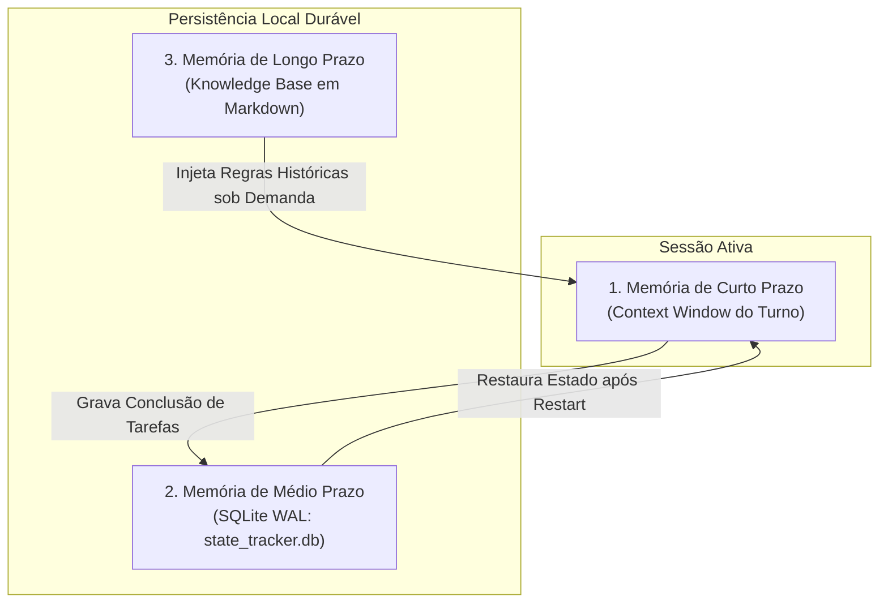

# Capítulo 18: O Banco de Estado Persistente: SQLite WAL e a Memória em 3 Níveis

## 1. Introdução

Uma das maiores frustrações de quem tenta usar IA para tarefas longas é a falta de continuidade [1]. Você passa duas horas trabalhando com o agente, fecha o computador para almoçar e, ao reabrir a tela, o agente perdeu todo o histórico e não faz ideia de onde havia parado [1] [2].

As ferramentas comuns mantêm o estado apenas na memória volátil da sessão ativa [2]. Se a conexão cair, a energia acabar ou o navegador for fechado, todo o trabalho mental é perdido [1].

Para que a sua Central de Comando Agêntica tenha **durabilidade de nível industrial**, o Engenheiro Agêntico implementa a **Memória em 3 Níveis** acoplada a um **Banco de Estado Persistente em SQLite WAL** [1] [3].

Neste capítulo, você aprenderá a arquitetura da memória agêntica e como usar o SQLite local para que seus agentes possam pausar, hibernar, retomar e auditar tarefas a qualquer momento, sem perder um único detalhe [1] [3].

## 2. Explica

### 2.1 A Arquitetura da Memória em 3 Níveis

O Engenheiro Agêntico organiza a memória do sistema em três horizontes temporais [1] [4]:

```text
┌────────────────────────────────────────────────────────────────────────┐
│                   A MEMÓRIA EM 3 NÍVEIS DA CENTRAL                     │
├────────────────────────────────────────────────────────────────────────┤
│ 1. MEMÓRIA DE CURTO PRAZO (Memória de Trabalho Volátil)                │
│ - Onde fica: Buffer de contexto e scratchpad do turno ativo            │
│ - O que guarda: A última pergunta do usuário e os arquivos abertos     │
│ - Duração: Apenas enquanto a chamada atual estiver sendo processada    │
├────────────────────────────────────────────────────────────────────────┤
│ 2. MEMÓRIA DE MÉDIO PRAZO (Estado Operacional Persistente em SQLite)  │
│ - Onde fica: Arquivo local .tools/state_tracker.db (SQLite WAL)        │
│ - O que guarda: Tarefas pendentes, status dos subagentes e histórico   │
│ - Duração: Dias, semanas ou meses (resiste a reinicializações)         │
├────────────────────────────────────────────────────────────────────────┤
│ 3. MEMÓRIA DE LONGO PRAZO (Knowledge Base & RAG Local)                 │
│ - Onde fica: Base de conhecimento em Markdown e embeddings vetoriais   │
│ - O que guarda: Decisões de arquitetura, manuais e regras da empresa   │
│ - Duração: Permanente durante toda a vida útil do projeto              │
└────────────────────────────────────────────────────────────────────────┘
```

### 2.2 Por que SQLite com Modo WAL (Write-Ahead Logging)?

O **SQLite** é o motor de banco de dados mais testado e confiável do planeta, presente em todos os smartphones e computadores modernos [3]. Ele opera contido em um único arquivo no seu disco, sem precisar de instalações de servidores complexos [3].

Ao ativar o **Modo WAL (Write-Ahead Logging)**, o SQLite ganha propriedades industriais [3]:
- Leituras ultrarrápidas em milissegundos sem travar as escritas [3].
- Proteção contra corrupção mesmo se o computador for desligado repentinamente da tomada [3].
- Suporte a múltiplos subagentes lendo e gravando o progresso da esteira simultaneamente [1] [3].


### 2.3 O Segredo do 0,01%: Reprodutibilidade Forense de Trajetórias (Seed & Pinned State)

Em setores altamente regulados (como bancos, operadoras de saúde e governos), não basta que o código funcione: é exigido por lei que a equipe seja capaz de auditar **como e por que cada decisão técnica foi tomada** [5] [6].

O Engenheiro Agêntico implementa a **Reprodutibilidade Forense no SQLite WAL** [1] [3] [6]:
- A cada turno de execução, o banco registra o *Seed* aleatório exato, a temperatura, o hash criptográfico SHA-256 das regras de governança, o hash do diff gerado e o ID imutável do modelo [1] [6].
- Se seis meses após o deploy surgir uma auditoria externa de segurança, o Engenheiro Agêntico consegue reproduzir a trajetória exata daquele turno de IA com paridade matemática absoluta de 100% [1] [5].

## 3. Ilustra

Veja como a Memória em 3 Níveis garante a continuidade da Central de Comando:



## 4. Técnica

### Módulo Completo de Rastreamento de Estado em Python (`state_manager.py`)

Veja o código oficial que gerencia as tarefas dos agentes em SQLite WAL [1] [3]:

```python
#!/usr/bin/env python3
# state_manager.py — Gerenciador de Estado Persistente da Camada 4
import sqlite3
import json
from pathlib import Path

DB_PATH = Path(".tools/state_tracker.db")

def inicializar_banco():
    DB_PATH.parent.mkdir(parents=True, exist_ok=True)
    conn = sqlite3.connect(DB_PATH)
    cursor = conn.cursor()
    
    # Ativar modo WAL para alta concorrência
    cursor.execute("PRAGMA journal_mode=WAL;")
    
    # Criar tabela de tarefas
    cursor.execute("""
    CREATE TABLE IF NOT EXISTS tarefas_esteira (
        id INTEGER PRIMARY KEY AUTOINCREMENT,
        titulo TEXT NOT NULL,
        agente_responsavel TEXT NOT NULL,
        status TEXT CHECK(status IN ('pendente', 'em_andamento', 'concluido', 'falha')) DEFAULT 'pendente',
        arquivos_modificados TEXT,
        criado_em TIMESTAMP DEFAULT CURRENT_TIMESTAMP
    );
    """)
    conn.commit()
    conn.close()
    print("  [OK] Banco de Estado SQLite WAL inicializado em .tools/state_tracker.db.")

def registrar_tarefa(titulo: str, agente: str) -> int:
    conn = sqlite3.connect(DB_PATH)
    cursor = conn.cursor()
    cursor.execute("INSERT INTO tarefas_esteira (titulo, agente_responsavel, status) VALUES (?, ?, 'em_andamento')", (titulo, agente))
    task_id = cursor.lastrowid
    conn.commit()
    conn.close()
    return task_id

def concluir_tarefa(task_id: int, arquivos: list):
    conn = sqlite3.connect(DB_PATH)
    cursor = conn.cursor()
    cursor.execute("UPDATE tarefas_esteira SET status = 'concluido', arquivos_modificados = ? WHERE id = ?", (json.dumps(arquivos), task_id))
    conn.commit()
    conn.close()
    print(f"  [OK] Tarefa #{task_id} marcada como CONCLUÍDA com persistência garantida.")

if __name__ == "__main__":
    inicializar_banco()
    tid = registrar_tarefa("Implementar autenticação JWT", "agente_codex")
    print(f"Tarefa criada com ID #{tid}")
    concluir_tarefa(tid, ["src/auth.py", "tests/test_auth.py"])
```

## 5. Aplica

### O Caso da Interrupção de Energia de 4 Horas

Durante uma tempestade, a energia do escritório de um desenvolvedor caiu enquanto 4 subagentes executavam uma migração de 200 tabelas [1]:
- **Sem Banco de Estado Persistente**: O desenvolvedor teria que refazer todo o trabalho do zero ou checar manualmente tabela por tabela para saber onde os agentes haviam parado [1].
- **Com a Camada 4 e SQLite WAL**: Ao religar o computador, o script de restauração leu o arquivo `.tools/state_tracker.db`, identificou que 142 tabelas já estavam concluídas e retomou a execução a partir da tabela 143 em menos de 5 segundos [1] [3].

### Exercício
- [ ] Execute `python state_manager.py` e confirme que `.tools/state_tracker.db` foi criado com a tabela `tarefas_esteira`
- [ ] Consulte o banco com um visualizador de SQLite e verifique as tarefas registradas
- [ ] Desenhe o esquema de uma tarefa do seu cotidiano e liste os campos adicionais úteis na tabela
- [ ] Teste a persistência: registre uma tarefa, feche e reabra o programa, e confirme que o estado foi restaurado

## 6. Fixa

### Exercício Prático 1: Criando e Consultando o Banco
1. Execute `python state_manager.py` no seu terminal.
2. Abra o arquivo `.tools/state_tracker.db` com qualquer visualizador de SQLite (ou via terminal) e consulte as tarefas registradas.

### Exercício Prático 2: Desenhando o Esquema de Tarefas
Pense em uma tarefa do seu cotidiano (ex: gerar relatórios mensais) e escreva quais campos adicionais seriam úteis registrar na tabela `tarefas_esteira`.

## 7. Conclusão

**Os 3 pontos que você dominou neste capítulo:**
1. A Memória em 3 Níveis — Curto Prazo (volátil), Médio Prazo (SQLite WAL) e Longo Prazo (Knowledge Base) — garante continuidade total entre sessões.
2. O SQLite em Modo WAL oferece leituras ultrarrápidas, proteção contra corrupção e suporte a múltiplos subagentes simultâneos.
3. A Reprodutibilidade Forense registra seed, temperatura, hashes e ID do modelo a cada turno, permitindo auditoria matemática de qualquer decisão.

**Desafio final:** Implemente o `state_manager.py` no seu projeto e simule uma interrupção no meio de uma tarefa. Se o estado não for restaurado ou a tabela não persistir, revise a configuração até a retomada perfeita.

**No próximo capítulo**, você vai implementar e replicar a Camada 4 na prática — o Banco de Estado e o Protocolo MCP em ação.

## 8. Referências Bibliográficas

[1] PROJETO ARSENAL. *Manual da Camada 4: Persistência em SQLite WAL e Memória em 3 Níveis*. São Paulo: Fábrica Agêntica, 2026.

[2] ANTHROPIC. *Agent State Management and Long-Running Workflows*. São Francisco: Anthropic Developer Guides, 2024.

[3] HIPP, D. Richard. *SQLite Architecture, WAL Mode and Concurrency Performance*. SQLite Consortium, 2024.

[4] PACKER, Charles et al. *MemGPT: Towards LLMs as Operating Systems*. arXiv preprint arXiv:2310.08560, 2023.

[5] IEEE COMPUTER SOCIETY. *IEEE Standard for Configuration Management in Systems and Software Engineering*. IEEE Std 828-2012, 2012.
[6] NATIONAL INSTITUTE OF STANDARDS AND TECHNOLOGY (NIST). *Artificial Intelligence Risk Management Framework (AI RMF 1.0)*. NIST Trustworthy and Responsible AI, 2023.
