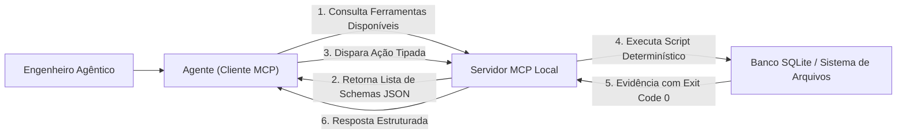

# Capítulo 19: Servidores MCP e a Usina de Scripts Determinísticos

## 1. Introdução

Imagine que você comprou um novo mouse sem fio para o seu computador. Você não precisa abrir o gabinete, soldar fios na placa-mãe nem reprogramar o sistema operacional: você apenas conecta o cabo USB na porta lateral e tudo funciona instantaneamente [1].

O padrão USB mudou a história do hardware porque criou uma **porta universal e segura de conexão** [1].

No final de 2024, a Anthropic revolucionou o universo das IAs ao lançar o **Model Context Protocol (MCP)** — o padrão aberto que se tornou o "USB Universal das ferramentas de Inteligência Artificial" [1] [2].

Antes do MCP, conectar uma IA a um banco de dados ou a um navegador exigia criar dezenas de códigos complexos e frágeis [2]. Com o MCP, qualquer agente de IA pode se conectar a qualquer ferramenta através de um protocolo limpo, seguro e baseado no padrão da internet JSON-RPC [2].

Neste capítulo, você aprenderá o funcionamento do protocolo MCP e como construir os seus próprios **Servidores MCP e Scripts Determinísticos** para automatizar qualquer tarefa no seu computador [1] [2].

## 2. Explica

### 2.1 Como Funciona o Protocolo MCP (Model Context Protocol)

O protocolo MCP divide a comunicação em três papéis simples [1] [2]:

```text
┌────────────────┐      Protocolo MCP       ┌────────────────────────┐
│  CLIENTE MCP   │  (Mensagens JSON-RPC)    │      SERVIDOR MCP      │
│  (Agente de IA)│ ◄──────────────────────► │ (Suas Ferramentas/APIs)│
└────────────────┘                          └────────────────────────┘
                                                         │
                                            ┌────────────┴───────────┐
                                            ▼                        ▼
                                     [Banco de Dados]        [Sistema de Arquivos]
```

1. **Cliente MCP (O Agente de IA)**: É a inteligência que precisa de informações ou que deseja executar uma ação (ex: Claude Code, Antigravity, Cursor) [2].
2. **Servidor MCP (A sua Usina de Ferramentas)**: É um programa leve em Python ou Node.js que expõe ferramentas de forma controlada e segura [2].
3. **Recursos e Ferramentas**:
   - **Tools (Ferramentas)**: Funções que o agente pode chamar para executar ações (ex: `salvar_relatorio`, `consultar_cep`, `executar_query`) [2].
   - **Resources (Recursos)**: Dados que o agente pode ler de forma estática (ex: documentações, logs, esquemas de banco) [2].

### 2.2 O Poder dos Scripts Determinísticos

Um script é chamado de **determinístico** quando seu comportamento não depende de "opiniões ou probabilidades": para a mesma entrada, ele sempre produz a mesma saída com precisão matemática [1] [3].

O Engenheiro Agêntico combina a flexibilidade criativa da IA com a rigidez mecânica dos scripts determinísticos (como o pipeline `renderizar-diagramas.py` e `compilar-para-pdf.py` com Typst e Playwright da Fábrica de Livros) [1]:
- A IA decide **o que** precisa ser feito com base no contexto [1].
- O Servidor MCP executa a tarefa através de um script determinístico testado e seguro [1] [2].

## 3. Ilustra

Veja o protocolo MCP operando como o conector universal da sua Central de Comando:



## 4. Técnica

### Criando seu Primeiro Servidor MCP em Python (`servidor_mcp_simples.py`)

Veja como criar um Servidor MCP funcional e padronizado em menos de 40 linhas de código [1] [2]:

```python
#!/usr/bin/env python3
# servidor_mcp_simples.py — Servidor MCP Oficial da Camada 4
import sys
import json

def processar_requisicao(req_json: str) -> str:
    try:
        dados = json.loads(req_json)
        metodo = dados.get("method")
        
        # 1. Descoberta de Ferramentas (tools/list)
        if metodo == "tools/list":
            return json.dumps({
                "tools": [
                    {
                        "name": "calcular_soma",
                        "description": "Calcula a soma determinística de dois números inteiros",
                        "inputSchema": {
                            "type": "object",
                            "properties": {
                                "a": { "type": "integer" },
                                "b": { "type": "integer" }
                            },
                            "required": ["a", "b"]
                        }
                    }
                ]
            })
            
        # 2. Execução de Ferramenta (tools/call)
        elif metodo == "tools/call":
            params = dados.get("params", {})
            args = params.get("arguments", {})
            resultado = args.get("a", 0) + args.get("b", 0)
            return json.dumps({
                "content": [{"type": "text", "text": str(resultado)}],
                "isError": False
            })
            
    except Exception as e:
        return json.dumps({"isError": True, "error": str(e)})
        
    return json.dumps({"isError": True, "error": "Método desconhecido"})

if __name__ == "__main__":
    # Teste de execução direta
    teste_req = json.dumps({"method": "tools/call", "params": {"arguments": {"a": 15, "b": 27}}})
    print("=== RESPOSTA DO SERVIDOR MCP ===")
    print(processar_requisicao(teste_req))
```

## 5. Aplica

### Integrando a IA a um Sistema Financeiro Legado via MCP

Uma empresa possuía um sistema de faturamento antigo em banco de dados local que não possuía API na nuvem [1]:
- **O Desafio**: A empresa precisava que o agente gerasse relatórios diários de faturamento sem colocar o banco de dados em risco na internet [1].
- **A Solução com Servidor MCP**:
  1. O Engenheiro Agêntico criou um servidor MCP local que expunha apenas uma ferramenta de leitura segura: `consultar_faturamento_dia(data)` [1] [2].
  2. O agente consultou os dados através do protocolo MCP local, gerou a análise executiva em minutos e gravou os gráficos na pasta de relatórios [1].
- **O Resultado**: Automação 100% segura, com zero exposição de credenciais e sem tocar no código legado [1].

### Exercício
- [ ] Execute `python servidor_mcp_simples.py` alterando a chamada de teste para `{"method": "tools/list"}` e observe a descoberta de ferramentas
- [ ] Adicione ao script uma segunda ferramenta `multiplicar_numeros` com o seu schema correspondente
- [ ] Teste a execução tipada: chame `calcular_soma` com argumentos válidos e inválidos e confirme a resposta estruturada
- [ ] Crie um script determinístico seu (ex: `renderizar-diagramas.py`) e comprove que a mesma entrada produz sempre a mesma saída

## 6. Fixa

### Exercício Prático 1: Testando a Descoberta de Ferramentas
Execute o script `servidor_mcp_simples.py` alterando a chamada de teste para `{"method": "tools/list"}` e veja como o servidor informa suas capacidades para o cliente MCP.

### Exercício Prático 2: Criando uma Nova Ferramenta MCP
Adicione ao script uma segunda ferramenta chamada `multiplicar_numeros` com o seu schema correspondente.

## 7. Conclusão

**Os 3 pontos que você dominou neste capítulo:**
1. O Model Context Protocol (MCP) é o "USB Universal das ferramentas de IA" — um padrão aberto baseado em JSON-RPC que conecta qualquer agente a qualquer ferramenta de forma limpa e segura.
2. O protocolo divide a comunicação em Cliente MCP (agente), Servidor MCP (usina de ferramentas) e Recursos/Ferramentas, com descoberta via `tools/list` e execução via `tools/call`.
3. Os Scripts Determinísticos combinam a flexibilidade criativa da IA com a rigidez mecânica dos scripts testados, garantindo evidência com Exit Code 0.

**Desafio final:** Construa um Servidor MCP com pelo menos 2 ferramentas e conecte-o a um agente real. Se a descoberta ou a execução tipada falhar, revise o schema até a resposta estruturada perfeita.

**No próximo capítulo**, você recebe a ferramenta suprema da Central de Comando — o Super-Auditor Universal que inspeciona as quatro camadas e emite o certificado de conformidade.

## 8. Referências Bibliográficas

[1] PROJETO ARSENAL. *Manual da Camada 4: Servidores MCP, Protocolos JSON-RPC e Usina Determinística*. São Paulo: Fábrica Agêntica, 2026.

[2] MODEL CONTEXT PROTOCOL. *MCP Specification, Architecture and Transports*. Open Source Standard, 2024. Disponível em: https://modelcontextprotocol.io.

[3] RAYMOND, Eric S. *The Art of UNIX Programming*. Boston: Addison-Wesley, 2003.

[4] JSON-RPC WORKING GROUP. *JSON-RPC 2.0 Specification*. jsonrpc.org, 2010.
