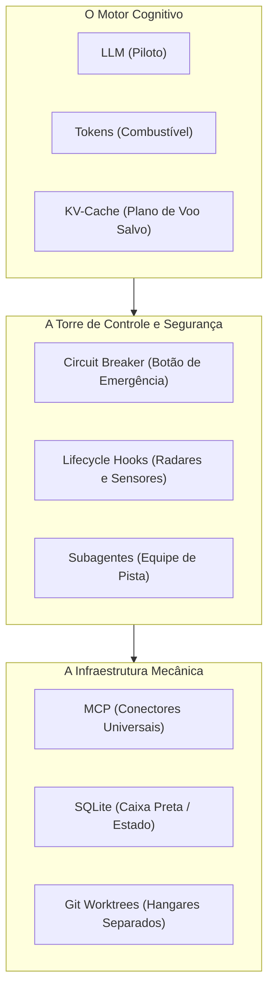

# Capítulo 2: O Dicionário do Iniciante: Glossário Descomplicado

## 1. Introdução

Quando uma pessoa sem formação técnica abre fóruns ou documentações sobre Inteligência Artificial e desenvolvimento de software, ela é imediatamente bombardeada por dezenas de siglas misteriosas: LLM, KV-Cache, Hooks, MCP, Token, Hardlink, Worktree [1]. Parece uma língua estrangeira criada deliberadamente para afastar os iniciantes.

A boa notícia é que você não precisa ser fluente no "jargão dos programadores" para dominar a sua Central de Comando Agêntica. Todos esses termos descrevem conceitos muito simples e lógicos quando explicados através de analogias do mundo real [1] [2].

Este capítulo é a sua chave de tradução universal. Aqui, apresentamos o glossário essencial do Engenheiro Agêntico — organizado em quatro grupos práticos que você consultará sempre que tiver dúvidas durante a sua jornada [1].

## 2. Explica

### 2.1 Grupo 1: Os Conceitos Fundamentais de Inteligência Artificial

- **LLM (Large Language Model / Grande Modelo de Linguagem)**: É o "cérebro matemático" da IA (como Claude, GPT-4, Gemini ou DeepSeek). Trata-se de um motor preditivo treinado em bilhões de textos, capaz de entender instruções em linguagem natural e gerar respostas lógicas ou códigos de software [3].
- **Token**: É a unidade básica de medida usada pelas IAs. Um token equivale a aproximadamente 4 caracteres ou três quartos de uma palavra em português [4]. Quando você lê "o gato bebeu leite", a IA processa isso como cerca de 4 a 5 tokens. Toda a cobrança de custos de uma IA é calculada por blocos de mil ou um milhão de tokens processados.
- **Context Window (Janela de Contexto)**: É a "memória de curto prazo" do modelo em uma conversa. Imagine uma mesa de trabalho física: se a mesa tem 200.000 tokens de espaço, você só consegue colocar documentos até esse limite [5]. Se colocar mais papéis, os antigos caem da mesa e a IA perde o contexto.
- **Invariância de Prefixo (Prompt Caching / KV-Cache)**: É a capacidade dos provedores modernos de memorizar o início estático das suas instruções. Se o seu arquivo de regras não mudar de lugar nem de conteúdo, a IA reaproveita o cálculo anterior e cobra até **90% menos** por essa leitura [6].

### 2.2 Grupo 2: A Segurança e a Execução (Harness & Ciclo de Vida)

- **Harness (Cinto de Segurança / Arnês de Execução)**: É a camada de código e configuração que envolve o agente para protegê-lo contra erros. Assim como um arnês segura um alpinista para que ele não caia no abismo, o Harness impede que a IA delete pastas erradas ou gaste dinheiro em loops infinitos [7].
- **Circuit Breaker (Disjuntor de Segurança)**: Inspirado nos disjuntores da rede elétrica da sua casa. Se a IA tentar executar uma ação proibida ou entrar em repetição excessiva, o disjuntor "desarma" na hora e paralisa a execução antes que qualquer dano aconteça [7].
- **Lifecycle Hooks (Ganchos de Ciclo de Vida)**: São sensores automáticos que disparam ações em momentos específicos da conversa [8]. Por exemplo: o hook `pre_tool_call` inspeciona o comando que o agente quer rodar antes de executá-lo no computador.
- **Subagentes e Equipes Multiagentes**: Em vez de ter uma única IA tentando resolver tudo sozinha, você despacha pequenos ajudantes especializados (subagentes), como um "Pesquisador", um "Redator de Testes" e um "Auditor de Código" [2].

### 2.3 Grupo 3: Ferramentas, Protocolos e Estado

- **MCP (Model Context Protocol / Protocolo de Contexto do Modelo)**: É o "cabo USB universal" das IAs [9]. Foi criado pela Anthropic como padrão aberto para permitir que qualquer IA conecte com segurança a bancos de dados, navegadores web e ferramentas locais sem precisar de integrações personalizadas complicadas.
- **SQLite WAL (Write-Ahead Logging)**: Um banco de dados leve, rápido e contido em um único arquivo no seu disco, ideal para salvar o histórico e as tarefas dos agentes sem exigir a instalação de servidores complexos [10].
- **Structured Outputs (Contratos JSON Schema)**: É a garantia matemática de que a IA responderá em um formulário estruturado e estritamente tipado, em vez de texto solto e imprevisível [3].

### 2.4 Grupo 4: O Controle de Versão e o Sistema de Arquivos

- **Git & Worktrees**: O Git é a máquina do tempo do código [11]. O *Worktree* é uma tecnologia nativa do Git que permite que três agentes trabalhem no mesmo projeto em três pastas isoladas ao mesmo tempo, sem que um sobrescreva as alterações do outro.
- **Exit Code (Código de Saída)**: É o sinal que um programa devolve ao terminar sua execução no computador [12]. Se o programa terminar com `Exit Code 0`, significa "sucesso absoluto". Qualquer número diferente de zero significa que ocorreu um erro.

## 3. Ilustra

Para consolidar esses conceitos de forma visual, veja a analogia do aeroporto operacional:

O piloto (LLM) consome combustível (Tokens) seguindo um plano de voo memorizado (KV-Cache). A torre de controle (Harness) monitora o voo com radares (Hooks) e disjuntores de segurança. A equipe de solo conecta a aeronave aos serviços por meio de conectores universais (MCP) e grava cada evento na caixa preta (SQLite) [1].

## 4. Técnica

### Tabela de Tradução Operacional do Engenheiro Agêntico

| Termo em Inglês | O que Significa no Mundo Real | Como o Engenheiro Agêntico Utiliza |
|---|---|---|
| **Prompt Caching** | Memória estática de instruções repetidas | Deixa o arquivo `CLAUDE.md` fixo no topo para obter 90% de desconto [6]. |
| **Circuit Breaker** | Trava automática contra loops ou comandos destrutivos | Configura limite de 15 turnos e bloqueio de `rm -rf` no `settings.json` [7]. |
| **Lifecycle Hook** | Interceptor de eventos em tempo real | Bloqueia comandos não autorizados antes que atinjam o terminal [8]. |
| **Model Context Protocol** | Interface padrão de conexão entre LLM e sistemas | Conecta o agente a pastas locais e navegadores web [9]. |
| **JSON Schema** | Formulário rígido que a IA é obrigada a preencher | Evita que o modelo responda com textos soltos ou formatos errados [3]. |
| **Git Worktree** | Cópias isoladas da mesma base de código | Permite que múltiplos agentes trabalhem em paralelo sem conflito [11]. |

## 5. Aplica

### O Impacto Prático do Glossário no Dia a Dia

Considere Lucas, um empreendedor que desejava criar um assistente automatizado para responder dúvidas de clientes [1]:
- **Sem dominar os conceitos básicos**: Lucas ouvia falar de "bancos de dados complexos" e tentava configurar servidores caros na nuvem. Gastava tokens mandando o histórico inteiro de mensagens a cada clique e não entendia por que o agente travava [3].
- **Com o domínio do vocabulário agêntico**:
  1. Utilizou **Structured Outputs (JSON Schema)** para garantir que o agente só devolvesse dados organizados [3].
  2. Implementou **Prompt Caching** no cabeçalho das regras da empresa, reduzindo o custo operacional para centavos por dia [6].
  3. Adicionou um **Circuit Breaker** que impedia o agente de tentar mais de 3 respostas caso a conexão caísse [7].
  4. Salvou o histórico das conversas em um arquivo local **SQLite WAL** rápido e seguro [10].

### Exercício
- [ ] Defina em suas próprias palavras o que são LLM, MCP, Token e SQLite — escreva como se explicasse para um colega de trabalho leigo
- [ ] Crie um glossário pessoal com pelo menos 10 termos do capítulo que você mais usa ou pretende usar no dia a dia
- [ ] Identifique 3 termos que ainda lhe causam confusão e pesquise cada um até dominar o conceito
- [ ] Explique para alguém leigo o que é um "agente de IA" usando apenas analogias do mundo real

## 6. Fixa

### Exercício Prático 1: Caça ao Jargão
1. Explique com suas próprias palavras qual é a diferença entre um *Token* e uma *Palavra*.
2. Por que manter o início do prompt de instruções idêntico (Invariância de Prefixo) gera desconto nas faturas de IA?

### Exercício Prático 2: Configurando seu Primeiro Contrato de Saída
Imagine que você precisa que o agente analise um texto e responda com o sentimento e a nota de 1 a 5. Como você definiria esse contrato para a IA em vez de pedir texto livre?

## 7. Conclusão

**Os 3 pontos que você dominou neste capítulo:**
1. O vocabulário agêntico se divide em 4 grupos práticos — IA (LLM, Token, KV-Cache), Segurança (Harness, Disjuntor, Hooks), Ferramentas (MCP, SQLite, JSON Schema) e Controle de Versão (Git, Exit Code).
2. Cada termo técnico corresponde a um conceito simples do mundo real quando explicado com a analogia correta.
3. Dominar o glossário é pré-requisito para operar a Central de Comando com segurança e eficiência.

**Desafio final:** Pegue o último projeto em que você trabalhou com IA e identifique, em cada conversa, quais termos deste glossário estavam presentes — mesmo que você não soubesse nomeá-los na época.

**No próximo capítulo**, você vai enfrentar a Crise do Desenvolvimento com IA: os 4 problemas catastróficos que destroem quem opera sem governança, com dados reais e estudos científicos que comprovam cada falha.

## 8. Referências Bibliográficas

[1] PROJETO ARSENAL. *Dicionário de Arquitetura Agêntica e Terminologia de Sistemas Autônomos*. São Paulo: Fábrica Agêntica, 2026.

[2] ANTHROPIC. *The Anatomy of an Autonomous Agent: Patterns and Primitives*. São Francisco: Anthropic Research, 2024.

[3] OPENAI. *Structured Outputs and JSON Schema Specification*. São Francisco: OpenAI Developer Guides, 2024. Disponível em: https://platform.openai.com/docs/guides/structured-outputs.

[4] JURAFSKY, Dan; MARTIN, James H. *Speech and Language Processing*. 3. ed. Stanford: Stanford University, 2024.

[5] LIU, Nelson F. et al. *Lost in the Middle: How Language Models Use Long Contexts*. Transactions of the Association for Computational Linguistics, v. 12, p. 157-173, 2024.

[6] ANTHROPIC. *Prompt Caching in Claude: Architecture and Economics*. São Francisco: Anthropic Engineering, 2024.

[7] NYGARD, Michael T. *Release It!: Design and Deploy Production-Ready Software*. Raleigh: Pragmatic Bookshelf, 2018.

[8] FOWLER, Martin. *Patterns of Enterprise Application Architecture*. Boston: Addison-Wesley, 2002.

[9] MODEL CONTEXT PROTOCOL. *Specification, Tools and Transports*. Open Source Standard, 2024. Disponível em: https://modelcontextprotocol.io.

[10] HIPP, D. Richard. *SQLite Write-Ahead Logging Architecture and Concurrency*. SQLite Consortium, 2024.

[11] CHACON, Scott; STRAUB, Ben. *Pro Git*. 2. ed. Nova York: Apress, 2014.

[12] STEVENS, W. Richard; RAGO, Stephen A. *Advanced Programming in the UNIX Environment*. 3. ed. Boston: Addison-Wesley, 2013.
