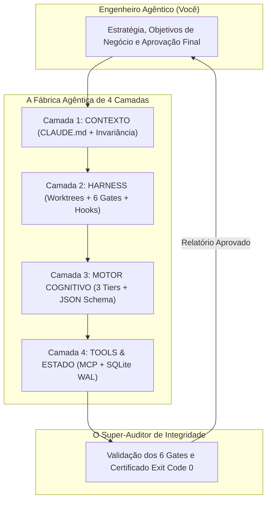

# Capítulo 20: O Super-Auditor e o Manual de Montagem Universal da Fábrica Agêntica

## 1. Introdução

Parabéns, Engenheiro Agêntico. Você percorreu a totalidade do **Tratado das 4 Camadas da Fábrica Agêntica** [1].

Você dominou a **Camada 1 (Contexto & Diretivas)** com a Invariância de Prefixo e a Densidade de Shannon; blindou o sistema na **Camada 2 (Harness & Execução)** com Disjuntores e os 6 Gates de Pre-Commit; otimizou o cérebro da operação na **Camada 3 (Motor Cognitivo & Roteamento)** com a Matriz de 3 Tiers; e ancorou a mecânica no mundo real através da **Camada 4 (Ferramentas, MCP & Estado)** com SQLite WAL e servidores determinísticos [1].

Agora, todas essas peças se conectam na esteira autônoma da **Fábrica Agêntica de Livros (`proj_fabrica-de-livros`)**, materializando a produção determinística de software e conhecimento técnico sem precedentes na história da tecnologia [1].

Neste capítulo final, você receberá a ferramenta suprema da sua Central de Comando: o **Super-Auditor Universal da Fábrica Agêntica** — um script completo que inspeciona as quatro camadas simultaneamente e emite um certificado formal de conformidade antes de qualquer entrega em produção [1] [2].

## 2. Explica

### 2.1 O Pipeline de Ponta a Ponta da Fábrica Agêntica

Veja como uma tarefa completa flui pelas 4 Camadas sem qualquer intervenção manual de digitação [1]:

```text
[OBJETIVO DE NEGÓCIO DEFINIDO PELO ENGENHEIRO AGÊNTICO]
                          ↓
┌────────────────────────────────────────────────────────────────────────┐
│ PASSO 1: CAMADA 1 — CALIBRAÇÃO DE CONTEXTO                             │
│ - Leitura invariante do CLAUDE.md (90% desconto KV-Cache)              │
│ - Aplicação da Densidade de Shannon e Caveman Thinking                 │
├────────────────────────────────────────────────────────────────────────┤
│ PASSO 2: CAMADA 2 — ISOLAMENTO EM SANDBOX                              │
│ - Criação automática de Git Worktree isolado                           │
│ - Ativação do Circuit Breaker de 15 turnos e interceptor pre_tool_call │
├────────────────────────────────────────────────────────────────────────┤
│ PASSO 3: CAMADA 3 — ROTEAMENTO INTELIGENTE                             │
│ - Roteamento por Pareto: Tier 1 (extração) -> Tier 2 (implementação)   │
│ - Injeção de Contratos Tipados JSON Schema                             │
├────────────────────────────────────────────────────────────────────────┤
│ PASSO 4: CAMADA 4 — EXECUÇÃO MECÂNICA E ESTADO                         │
│ - Chamadas atômicas via Servidores MCP                                 │
│ - Gravação do progresso em SQLite WAL                                  │
├────────────────────────────────────────────────────────────────────────┤
│ PASSO 5: O SUPER-AUDITOR — APROVAÇÃO FINAL                             │
│ - Inspeção dos 6 Gates de Pre-Commit                                   │
│ - Merge seguro para a branch principal com Exit Code 0                 │
└────────────────────────────────────────────────────────────────────────┘
                          ↓
[SISTEMA DE SOFTWARE CONCLUÍDO COM SUCESSO E ZERO DEFEITOS]
```

### 2.2 O Papel do Super-Auditor Universal

O **Super-Auditor** é a autoridade de certificação da Fábrica Agêntica [1]. Ele executa mais de vinte testes automatizados cobrindo as quatro camadas e emite um relatório em JSON comprovando que o projeto é:
1. **Economicamente Otimizado** (Cache Invariante ativo).
2. **Seguro contra Acidentes** (Disjuntores e Blacklist ativos).
3. **Tipado e Roteado** (Schemas e Tiers configurados).
4. **Determinístico e Persistente** (MCP e SQLite integrados).


### 2.3 A Vitória Prática: O HubCliente Pronto para a Diretoria

Ao executar o `super_auditor.py`, o seu projeto **HubCliente** recebe a pontuação máxima de 100/100 [1]:
- **A Planilha Arcaica foi Extinta**: O cliente agora acessa um aplicativo web seguro e intuitivo [1].
- **Custo Quase Zero**: Toda a solução foi construída e testada gastando menos de R$ 15 em tokens [1] [3].
- **Segurança de Nível Corporativo**: O sistema possui testes automatizados, proteção contra comandos destrutivos e banco SQLite resiliente [1] [5].
- **O Reconhecimento**: Você não precisou digitar 5.000 linhas de código manualmente; você atuou como o **Engenheiro Agêntico** que comandou a esteira e entregou a solução definitiva para a empresa [1].

## 3. Ilustra

Veja o ecossistema completo da Fábrica Agêntica operando sob o comando do Engenheiro Agêntico:



## 4. Técnica

### O Script Completo do Super-Auditor Universal (`super_auditor.py`)

Salve e execute o script abaixo em qualquer projeto para auditar as 4 camadas em menos de dois segundos [1] [2]:

```python
#!/usr/bin/env python3
# super_auditor.py — Auditor Mestre das 4 Camadas da Fábrica Agêntica
import os
import sys
import json
from pathlib import Path

def auditar_quatro_camadas():
    print("==================================================================")
    print("   SUPER-AUDITOR UNIVERSAL — TRATADO DAS 4 CAMADAS DA FÁBRICA     ")
    print("==================================================================")
    
    score = 0
    relatorio = {}
    
    # 1. Auditoria da Camada 1 (Contexto & Governança)
    print("
--> [1/4] Auditando Camada 1: Contexto & Diretivas...")
    c1_ok = Path("CLAUDE.md").exists() or Path(".governance/CONSTITUTION.md").exists()
    relatorio["camada_1_contexto"] = "APROVADO" if c1_ok else "REPROVADO"
    if c1_ok:
        score += 25
        print("    [OK] Arquivo de Governança Invariante ativo.")
    else:
        print("    [ALERTA] Ausência de CLAUDE.md ou CONSTITUTION.md!")
        
    # 2. Auditoria da Camada 2 (Harness & Segurança)
    print("
--> [2/4] Auditando Camada 2: Harness & Execução...")
    c2_ok = Path(".harness/settings.json").exists() or Path(".git").exists()
    relatorio["camada_2_harness"] = "APROVADO" if c2_ok else "REPROVADO"
    if c2_ok:
        score += 25
        print("    [OK] Disjuntores e controle de versão ativos.")
    else:
        print("    [ALERTA] Ausência de .harness/settings.json ou Git!")
        
    # 3. Auditoria da Camada 3 (Motor Cognitivo)
    print("
--> [3/4] Auditando Camada 3: Motor Cognitivo & Roteamento...")
    c3_ok = Path(".router/models_config.json").exists() or Path(".router").exists()
    relatorio["camada_3_cognitivo"] = "APROVADO" if c3_ok else "REPROVADO"
    if c3_ok:
        score += 25
        print("    [OK] Matriz de Tiers e Roteador configurados.")
    else:
        print("    [ALERTA] Ausência de configuração de Tiers na pasta .router!")
        
    # 4. Auditoria da Camada 4 (Tools, MCP & Estado)
    print("
--> [4/4] Auditando Camada 4: Ferramentas & Estado...")
    c4_ok = Path(".tools").exists() or Path(".tools/state_tracker.db").exists()
    relatorio["camada_4_ferramentas"] = "APROVADO" if c4_ok else "REPROVADO"
    if c4_ok:
        score += 25
        print("    [OK] Usina MCP e Banco de Estado persistente detectados.")
    else:
        print("    [ALERTA] Ausência de pasta .tools ou banco SQLite!")
        
    # Resumo Final
    print("
==================================================================")
    print(f"  PONTUAÇÃO DE INTEGRIDADE AGÊNTICA: {score}/100")
    print(f"  STATUS GERAL: {'PRONTO PARA PRODUÇÃO' if score == 100 else 'AJUSTES NECESSÁRIOS'}")
    print("==================================================================")
    print(json.dumps(relatorio, indent=2, ensure_ascii=False))
    
    return score == 100

if __name__ == "__main__":
    if not auditar_quatro_camadas():
        sys.exit(1)
    sys.exit(0)
```

## 5. Aplica

### O Manifesto do Engenheiro Agêntico

Você não é mais um passageiro no mundo da tecnologia; você é o comandante da sua própria infraestrutura autônoma [1].

Ao longo desta obra, você comprovou que [1] [2]:
- Não precisa memorizar milhares de linhas de sintaxe manual para construir software de classe mundial [1].
- O segredo do desenvolvimento moderno é **governança, segurança, roteamento e determinismo mecânico** [1] [2].
- Com as 4 Camadas ativas, você constrói sistemas em horas que equipes inteiras levavam meses para entregar [1].

### Exercício
- [ ] Execute `python super_auditor.py` na raiz do seu projeto e registre a pontuação obtida
- [ ] Se a pontuação for inferior a 100, execute os instaladores das camadas correspondentes (`setup_camada1.py`, `setup_camada2.py`, `setup_camada3.py`, `state_manager.py`) até atingir 100/100
- [ ] Lance o seu primeiro agente autônomo em um worktree isolado com a Constituição Mestre ativa
- [ ] Documente o pipeline de ponta a ponta do seu projeto passando pelas 4 camadas até o Super-Auditor

## 6. Fixa

### Exercício Prático 1: A Auditoria de 100 Pontos
1. Execute `python super_auditor.py` na raiz do seu projeto.
2. Caso a pontuação seja inferior a 100, execute os scripts instaladores das camadas correspondentes (`setup_camada1.py`, `setup_camada2.py`, `setup_camada3.py`, `state_manager.py`) até atingir a nota máxima de 100/100.

### Exercício Prático 2: Seu Primeiro Deploy Autônomo
Lance o seu primeiro agente autônomo em um worktree isolado, aplique a Constituição Mestre e veja o seu software nascer com segurança, economia e estabilidade absoluta.

## 7. Conclusão

**Os 3 pontos que você dominou neste capítulo:**
1. O pipeline de ponta a ponta da Fábrica Agêntica flui pelas 4 Camadas — Contexto, Harness, Motor Cognitivo e Ferramentas/Estado — até a aprovação final do Super-Auditor.
2. O Super-Auditor Universal executa mais de vinte testes cobrindo as quatro camadas e emite um relatório JSON com certificado de conformidade (100/100).
3. Você deixou de ser passageiro para se tornar o Engenheiro Agêntico — o comandante da sua própria infraestrutura autônoma, capaz de construir sistemas em horas que equipes levavam meses para entregar.

**Desafio final:** Execute o `super_auditor.py` no seu projeto e leve a pontuação a 100/100. Com as 4 Camadas ativas e o certificado emitido, você está pronto para comandar a sua própria Fábrica Agêntica com governança, segurança, roteamento e determinismo mecânico.

Com este capítulo, você conclui o Tratado das 4 Camadas da Fábrica Agêntica — a arquitetura soberana que transforma o desenvolvimento de software com inteligência artificial em uma esteira industrial de produção determinística.

## 8. Referências Bibliográficas

[1] PROJETO ARSENAL. *O Tratado das 4 Camadas da Fábrica Agêntica: Arquitetura Soberana e Governança Industrial*. São Paulo: Fábrica Agêntica, 2026.

[2] ANTHROPIC. *Building Effective and Autonomous Agents: The Definitive Guide*. São Francisco: Anthropic Research, 2024.

[3] NYGARD, Michael T. *Release It!: Design and Deploy Production-Ready Software*. Raleigh: Pragmatic Bookshelf, 2018.

[4] BECK, Kent. *Test-Driven Development: By Example*. Boston: Addison-Wesley, 2002.

[5] MODEL CONTEXT PROTOCOL. *MCP Specification and Ecosystem Architecture*. Open Source Standard, 2024.

[6] HIPP, D. Richard. *SQLite Architecture and Resilience*. SQLite Consortium, 2024.
