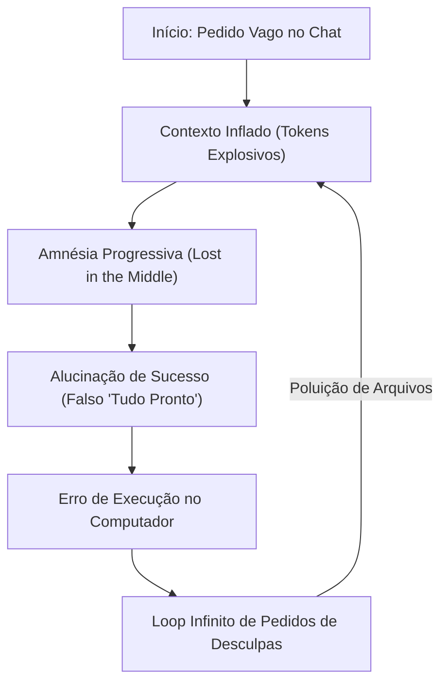

# Capítulo 3: A Crise do Desenvolvimento com IA: Os 4 Problemas Catastróficos

## 1. Introdução

Se você já tentou usar ferramentas de inteligência artificial para programar ou automatizar tarefas complexas, é muito provável que tenha passado por uma experiência comum: a primeira resposta pareceu impressionante e mágica, mas conforme o projeto foi crescendo, tudo começou a desmoronar [1].

O agente começou a esquecer o que havia sido combinado três mensagens atrás. Códigos que estavam funcionando perfeitamente de repente foram apagados ou modificados sem permissão. A fatura da API no final do mês disparou para valores alarmantes. E pior: o agente garantiu que o código estava "pronto e perfeito", mas ao tentar rodar, o sistema sequer inicializou [2] [3].

Isso não é culpa da IA e nem significa que ela seja incapaz. O que você vivenciou é a **Crise do Desenvolvimento com IA sem Governança** — um conjunto de falhas estruturais que atingem 100% dos desenvolvedores que operam sem uma arquitetura de camadas [1].

Neste capítulo, vamos dissecar cada um dos quatro problemas catastróficos que assolam os iniciantes e entender por que a metodologia do Engenheiro Agêntico é a única vacina definitiva contra essas falhas [1].

## 2. Explica

### 2.1 Problema 1: A Fatura Explosiva (O Custo Descontrolado de Tokens)

O primeiro choque do iniciante ocorre na conta financeira [3]. A maioria das pessoas acredita que a IA lê apenas a última pergunta que foi digitada. Na realidade dos modelos de chat convencionais, **a cada nova mensagem enviada, todo o histórico anterior da conversa é reempacotado e reenviado para a IA** [1].

Se a sua conversa já acumula 50.000 tokens e você faz uma pergunta simples de 20 palavras, você não paga apenas pelas 20 palavras: você paga por todas as 50.020 palavras daquela interação [3]. Se você trocar 30 mensagens em uma tarde sem controle de cache nem de contexto, terá processado mais de 1,5 milhão de tokens sem perceber, gerando custos de dezenas ou centenas de dólares para uma tarefa corriqueira [3].

### 2.2 Problema 2: A Amnésia Progressiva (*Lost in the Middle*)

Conforme o contexto se expande, os modelos de linguagem sofrem de degradação atencional [4]. Em 2024, um estudo conjunto conduzido por pesquisadores de Stanford, UC Berkeley e Allen Institute comprovou matematicamente o fenômeno batizado de *Lost in the Middle* (Perdido no Meio) [4].

O estudo demonstrou que a acurácia de recuperação de instruções de uma LLM se comporta como uma curva em "U":
- A IA lembra perfeitamente do **início** do contexto (onde estão as instruções iniciais do sistema) [4].
- A IA lembra razoavelmente do **final** do contexto (a sua última mensagem) [4].
- A IA **esquece ou ignora até 60% das informações situadas no meio** da conversa [4].

Quando você cola arquivos gigantescos no meio do chat, o agente simplesmente "esquece" as regras que você determinou e começa a inventar convenções inexistentes ou desfazer funcionalidades já testadas [1].

### 2.3 Problema 3: A Alucinação de Sucesso (A Falsa Validação)

As LLMs são motores probabilísticos treinados para gerar textos convincentes e amigáveis [5]. Quando um agente conclui uma tarefa, sua tendência natural é emitir uma mensagem calorosa: *"Implementei a funcionalidade com sucesso e todo o código está perfeito!"*.

O perigo reside no fato de que **concordância textual não é validação de engenharia** [1]. O agente pode declarar sucesso mesmo quando o código contém erros de sintaxe, imports de bibliotecas inexistentes ou falhas de lógica que quebram o sistema [2]. Sem disjuntores mecânicos e testes automatizados, o iniciante assume que a IA acertou e coloca em produção um código corrompido [6].

### 2.4 Problema 4: O Loop Infinito de Correções Falhas

Quando um código quebra, o impulso do iniciante é colar o erro no chat e dizer: *"Deu esse erro, conserte para mim"*. O agente pede desculpas, tenta consertar, altera outros arquivos, cria um segundo erro diferente, pede desculpas novamente e tenta corrigir de novo [1].

Em poucos minutos, o sistema entra em uma espiral destrutiva: a IA modifica cinco arquivos diferentes para tentar mascarar o primeiro bug, polui o repositório, esgota a janela de contexto e deixa o projeto em um estado irreparável [1] [7].

## 3. Ilustra

Veja o ciclo vicioso em que a maioria dos iniciantes se perde:

O Engenheiro Agêntico quebra esse ciclo instalando as 4 Camadas da Central de Comando [1]:
- O **Cache de Prefixo e Poda de Contexto** aniquila a fatura explosiva.
- A **Localidade de Informação (Grep antes de Read)** elimina a amnésia.
- Os **Gates de Pre-Commit e Disjuntores** impedem a alucinação de sucesso.
- O **Sandbox Reversível** encerra qualquer loop infinito no primeiro sinal de falha.

## 4. Técnica

### Comparativo: Desenvolvimento Caótico vs Engenharia Agêntica

| Critério de Avaliação | Método Caótico (Usuário de Chat) | Método do Engenheiro Agêntico (4 Camadas) |
|---|---|---|
| **Gestão de Custo** | Reenvia arquivos inteiros repetidamente | Aplica Invariância de Prefixo com 90% de desconto em cache [6]. |
| **Integridade da Memória** | Deixa o chat crescer indefinidamente | Utiliza leitura cirúrgica (*grep*) e persistência em SQLite [1] [10]. |
| **Validação de Código** | Acredita no texto de "sucesso" da IA | Exige execução de suíte de testes com *Exit Code 0* [6] [12]. |
| **Tratamento de Erros** | Deixa a IA tentar consertos sucessivos no escuro | Isola o código em sandbox e reverte para o estado estável anterior [7]. |
| **Roteamento de Modelos** | Usa o modelo mais caro para tarefas simples | Distribui tarefas por complexidade em 3 Tiers distintos [7]. |

## 5. Aplica

### Estudo de Caso: Resgatando um Projeto em Espiral de Bugs

Considere o caso de Rafael, que estava construindo uma loja virtual simples com agentes autônomos [1]:
- **A Crise**: Após 4 horas de tentativas manuais no chat, o agente havia criado 18 arquivos duplicados, a fatura de tokens bateu R$ 250 em uma única tarde e o carrinho de compras simplesmente não abria [3].
- **A Intervenção do Engenheiro Agêntico**:
  1. Rafael limpou o contexto e ativou a **Camada 1**, inserindo um arquivo `CLAUDE.md` com diretivas estáticas [1].
  2. Configurou o **Disjuntor da Camada 2**, limitando as ações a no máximo 10 passos por turno [7].
  3. Adicionou um **Gate de Verificação**: antes de declarar a tarefa pronta, o agente era obrigado a rodar o comando de teste automatizado [6].
  4. Redirecionou a busca com a regra *"nunca leia o arquivo inteiro se puder buscar a linha exata com grep"* [1].
- **O Resultado**: Em menos de 15 minutos, o agente identificou a linha única que causava o erro no carrinho, corrigiu sem tocar em outros arquivos, rodou os testes com sucesso e gastou menos de R$ 1,50 em tokens [1].

### Exercício
- [ ] Analise uma conversa recente com IA e identifique se houve amnésia (Lost in the Middle) — o agente esqueceu algo que foi dito anteriormente?
- [ ] Calcule aproximadamente quanto gastou em tokens na última semana de uso de IA e compare com o que gastaria com Invariância de Prefixo ativa
- [ ] Liste 3 códigos gerados por IA que precisaram de correção manual depois de o agente declarar "sucesso"
- [ ] Documente 1 caso concreto de alucinação que já presenciou: o agente afirmou que algo estava pronto, mas não estava

## 6. Fixa

### Exercício Prático 1: Identificando os Sinais de Amnésia
1. Você já notou um agente de IA desfazendo um ajuste que você havia pedido anteriormente? Explique como o fenômeno *Lost in the Middle* causa esse comportamento.
2. Por que confiar apenas na resposta escrita da IA ("Está tudo pronto!") é uma falha grave de governança?

### Exercício Prático 2: Criando a Regra Anti-Loop
Escreva em seu arquivo de governança a instrução explícita de parada caso o agente encontre o mesmo erro mais de duas vezes consecutivas.

## 7. Conclusão

**Os 3 pontos que você dominou neste capítulo:**
1. A fatura explosiva é causada pelo reenvio de histórico completo a cada mensagem — a Invariância de Prefixo resolve com 90% de desconto [3].
2. O Lost in the Middle faz a IA esquecer até 60% das informações do meio da conversa — a Localidade de Contexto com grep cirúrgico elimina esse risco [4].
3. A alucinação de sucesso e o loop infinito de correções são bloqueados mecanicamente por disjuntores e testes automatizados com Exit Code 0.

**Desafio final:** Abra a conversa mais longa que teve com IA nos últimos 30 dias e classifique cada problema que encontrou em uma das 4 categorias deste capítulo. Esse diagnóstico é o primeiro passo para a vacina definitiva.

**No próximo capítulo**, você terá a visão panorâmica completa das 4 Camadas — o mapa mestre da sua Central de Comando que servirá como bússola para todo o restante da obra.

## 8. Referências Bibliográficas

[1] PROJETO ARSENAL. *Diagnóstico e Resolução da Crise de Não-Determinismo em Agentes de IA*. São Paulo: Fábrica Agêntica, 2026.

[2] CHEN, Mark et al. *Evaluating Large Language Models Trained on Code*. arXiv preprint arXiv:2107.03374, 2021.

[3] ANTHROPIC. *Token Economics and Prompt Caching Best Practices*. São Francisco: Anthropic Developer Guides, 2024.

[4] LIU, Nelson F. et al. *Lost in the Middle: How Language Models Use Long Contexts*. Transactions of the Association for Computational Linguistics, v. 12, p. 157-173, 2024.

[5] BENDER, Emily M. et al. *On the Dangers of Stochastic Parrots: Can Language Models Be Too Big?*. FAccT '21, p. 610-623, 2021.

[6] BECK, Kent. *Test-Driven Development: By Example*. Boston: Addison-Wesley, 2002.

[7] NYGARD, Michael T. *Release It!: Design and Deploy Production-Ready Software*. Raleigh: Pragmatic Bookshelf, 2018.

[8] FOWLER, Martin. *Refactoring: Improving the Design of Existing Code*. 2. ed. Boston: Addison-Wesley, 2018.

[9] DEEPSEEK AI. *DeepSeek-V3 Technical Report: Architecture and Economics*. Pequim: DeepSeek, 2024.

[10] HIPP, D. Richard. *SQLite Architecture and Resilience*. SQLite Consortium, 2024.

[11] CHACON, Scott; STRAUB, Ben. *Pro Git*. 2. ed. Nova York: Apress, 2014.

[12] STEVENS, W. Richard; RAGO, Stephen A. *Advanced Programming in the UNIX Environment*. 3. ed. Boston: Addison-Wesley, 2013.
