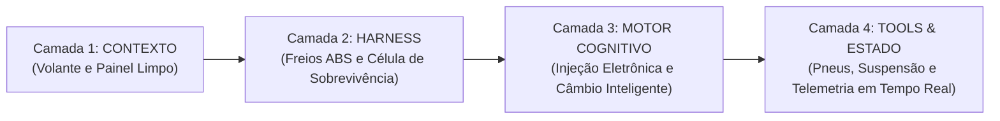

# Capítulo 4: Visão Geral das 4 Camadas: A Arquitetura Completa

## 1. Introdução

Agora que você compreendeu a origem histórica da engenharia agêntica, dominou o vocabulário básico e conheceu as quatro armadilhas que derrotam os amadores, é hora de abrir a planta baixa completa da sua Central de Comando [1].

Construir software com inteligência artificial não requer genialidade técnica prévia; requer **arquitetura de camadas** [1]. Assim como um arranha-céu moderno não desaba porque sua estrutura é dividida em fundação sólida, pilares de sustentação, instalações hidráulicas e acabamento de fachada, um ecossistema de IA só opera com estabilidade quando cada responsabilidade está rigorosamente isolada [2].

Este capítulo apresenta a visão panorâmica do **Tratado das 4 Camadas da Fábrica Agêntica**, tendo como referência viva o motor da **Fábrica de Livros (`proj_fabrica-de-livros`)** [1] — o mapa mestre que servirá como sua bússola em todos os projetos que você construir a partir de hoje [1].

## 2. Explica

### 2.1 O Mapa Mestre da Central de Comando

A metodologia organiza o desenvolvimento com IA em quatro painéis operacionais perfeitamente integrados [1] [2]:

```text
┌────────────────────────────────────────────────────────────────────────┐
│               CENTRAL DE COMANDO DO ENGENHEIRO AGÊNTICO                │
├────────────────────────────────────────────────────────────────────────┤
│  CAMADA 1: CONTEXTO & DIRETIVAS (A TELA DA CENTRAL)                    │
│  - Governança Invariante (CLAUDE.md / .rules)                          │
│  - Prompt Caching (90% desconto KV-Cache)                              │
│  - Densidade de Shannon (Zero Prosa, Poda Semântica)                   │
├────────────────────────────────────────────────────────────────────────┤
│  CAMADA 2: HARNESS & EXECUÇÃO (O PAINEL DE SEGURANÇA)                  │
│  - Circuit Breakers (Disjuntores de Timeout e Turnos)                  │
│  - Sandboxes Reversíveis e Worktrees Paralelos                         │
│  - Pre-Commit com 6 Gates de Integridade e Lifecycle Hooks             │
├────────────────────────────────────────────────────────────────────────┤
│  CAMADA 3: MOTOR COGNITIVO & ROTEAMENTO (O PAINEL DE DECISÃO)          │
│  - Roteamento Semântico em 3 Tiers (Flash, Standard, Reasoning)        │
│  - Lei de Pareto (80% tarefas rápidas, 20% raciocínio profundo)        │
│  - Contratos Tipados JSON Schema e Degradação Graciosa                 │
├────────────────────────────────────────────────────────────────────────┤
│  CAMADA 4: FERRAMENTAS, MCP & ESTADO (A USINA MECÂNICA)                │
│  - Servidores MCP (Model Context Protocol Universal)                   │
│  - Banco de Estado Persistente (SQLite WAL)                            │
│  - Idempotência Algorítmica e Auditoria Determinística                 │
└────────────────────────────────────────────────────────────────────────┘
```

### 2.2 O Papel e a Missão de Cada Camada

#### Camada 1: CONTEXTO & DIRETIVAS (O que a IA sabe e como enxerga)
É a porta de entrada da informação cognitiva [1]. Sua missão é calibrar a visão do modelo, eliminando saudações desnecessárias, estabelecendo regras de ouro inegociáveis e mantendo o início do prompt estático para capturar o desconto de até 90% em cache de prefixo (*KV-Cache Invariance*) [3].

#### Camada 2: HARNESS & EXECUÇÃO (O cinto de segurança e a governança)
É o cinto de segurança do sistema [4]. Impede que a IA execute comandos perigosos na máquina do usuário, estabelece limites rígidos de tempo e turnos (evitando loops infinitos) e instala ganchos (*Hooks*) que validam se os testes passaram com sucesso antes de permitir qualquer commit [5].

#### Camada 3: MOTOR COGNITIVO & ROTEAMENTO (O cérebro estratégico)
É o painel que decide **qual modelo de IA deve resolver cada tarefa** [6]. Em vez de gastar dinheiro usando o modelo mais caro para ler um arquivo simples, o roteador envia a tarefa mecânica para um modelo ultra-rápido de baixo custo (Tier 1) e reserva o modelo de raciocínio profundo (Tier 3) apenas para decisões arquiteturais críticas [6].

#### Camada 4: FERRAMENTAS, MCP & ESTADO (A execução no mundo real)
É a usina mecânica do sistema [7]. Conecta os agentes a ferramentas externas através do padrão aberto MCP (Model Context Protocol), grava cada passo da esteira em um banco SQLite persistente e garante que as operações sejam **idempotentes** — ou seja, possam ser executadas várias vezes sem corromper os dados [8].

## 3. Ilustra

Pense na construção de um carro de Fórmula 1 de alto desempenho [1]:



- A **Camada 1** é o volante com displays nítidos: mostra apenas a telemetria essencial, sem distrações [1].
- A **Camada 2** são os freios ABS e o chassi de sobrevivência: se o piloto perder o controle em uma curva, o sistema trava o carro e protege o piloto de qualquer acidente [4].
- A **Camada 3** é o câmbio inteligente: engata a marcha leve na reta para economizar combustível e ativa a potência máxima na ultrapassagem [6].
- A **Camada 4** são as rodas e a telemetria: convertem a energia do motor em movimento real na pista e registram cada segundo na central de dados [7].

## 4. Técnica

### O Contrato de Passagem entre Camadas

Para que a estação opere de forma 100% determinística, as quatro camadas comunicam-se através de um contrato padronizado de eventos e saídas [1]:

```json
{
  "transacao_agentica": {
    "camada_1_contexto": {
      "invariancia_prefixo": true,
      "regras_ativas": 18,
      "densidade_tokens": "shannon_max"
    },
    "camada_2_harness": {
      "circuit_breaker_limite_turnos": 15,
      "sandbox_isolada": true,
      "gate_precommit_ativo": true
    },
    "camada_3_cognitivo": {
      "modelo_selecionado": "claude-3-7-sonnet",
      "tier": 2,
      "contrato_schema": "StructuredOutput_v1"
    },
    "camada_4_ferramentas": {
      "protocolo": "mcp_json_rpc",
      "persistencia": "sqlite_wal",
      "exit_code_esperado": 0
    }
  }
}
```

## 5. Aplica

### O Impacto da Visão Integrada no Desenvolvimento de Iniciantes

Considere a jornada de Juliana, uma profissional de design que nunca havia programado e decidiu criar uma plataforma própria de agendamento de consultas [1]:
- **Sem o Mapa das 4 Camadas**: Juliana misturava tudo na mesma tela de chat. Pedia para o modelo desenhar a tela, criar o banco de dados, configurar a segurança e testar, tudo ao mesmo tempo. O agente alucinava, esquecia os requisitos e quebrava o layout a cada nova frase [1].
- **Aplicando a Visão Integrada das 4 Camadas**:
  1. No painel de **Contexto (C1)**, Juliana definiu o escopo visual e o design system do projeto [1].
  2. No painel de **Harness (C2)**, travou o agente para só alterar arquivos da pasta de frontend, sem mexer no banco de dados [4].
  3. No painel **Cognitivo (C3)**, utilizou o modelo econômico para gerar o HTML/CSS e o modelo de raciocínio avançado para desenhar as regras de cancelamento de consultas [6].
  4. No painel de **Ferramentas (C4)**, utilizou servidores MCP para testar o formulário automaticamente no navegador embutido e salvar o estado das reservas em SQLite [7] [8].
- **O Resultado**: A plataforma ficou pronta em três dias, com segurança de nível profissional e custo de desenvolvimento inferior a R$ 20 em tokens [1].

### Exercício
- [ ] Esboce em papel ou Markdown como as 4 camadas se conectam no seu projeto atual — use o modelo da Fórmula 1 como referência visual
- [ ] Identifique em qual das 4 camadas seu projeto está mais fraco hoje e Justifique por quê
- [ ] Crie um plano de implementação para a Camada 1 (Contexto & Diretivas) com pelo menos 3 ações concretas
- [ ] Mapeie as ferramentas que você usa hoje e classifique cada uma em qual camada ela opera

## 6. Fixa

### Exercício Prático 1: O Teste das 4 Perguntas
Antes de iniciar qualquer tarefa com IA, responda mentalmente:
1. **Contexto (C1)**: A IA recebeu apenas o que precisa ou o prompt está cheio de ruído?
2. **Harness (C2)**: Existe uma trava de segurança impedindo a IA de apagar arquivos sem querer?
3. **Cognitivo (C3)**: Estou usando o modelo mais econômico para esta tarefa específica?
4. **Ferramentas (C4)**: Como vou verificar matematicamente (*Exit Code 0*) se o resultado funcionou de verdade?

### Exercício Prático 2: Desenhando seu Primeiro Mapa de Projeto
Pegue uma folha de papel e divida em quatro quadrantes (C1, C2, C3, C4). Preencha o que você colocará em cada camada para o seu próximo projeto de software.

## 7. Conclusão

**Os 3 pontos que você dominou neste capítulo:**
1. A arquitetura das 4 Camadas isola cada responsabilidade — Contexto, Harness, Motor Cognitivo e Ferramentas — como um arranha-céu divide fundação, pilares, hidráulica e fachada.
2. Cada camada tem uma missão clara: a Camada 1 calibra a visão, a Camada 2 protege a execução, a Camada 3 decide o modelo ideal e a Camada 4 conecta ferramentas e persiste estado.
3. As camadas comunicam-se por um contrato padronizado de eventos e saídas, garantindo determinismo de ponta a ponta.

**Desafio final:** Pegue o mapa das 4 Camadas e desenhe o seu próprio projeto nele — preencha cada quadrante com as ferramentas, regras e decisões que você usará. Esse mapa será seu guia de implementação nos próximos 16 capítulos.

**No próximo capítulo**, você mergulhará na Camada 1 — os 3 Princípios Universais da TELA, o painel de visibilidade que governa o contexto e as diretivas.

## 8. Referências Bibliográficas

[1] PROJETO ARSENAL. *Tratado das 4 Camadas: Arquitetura, Governança e Autonomia Agêntica*. São Paulo: Fábrica Agêntica, 2026.

[2] FOWLER, Martin. *Patterns of Enterprise Application Architecture*. Boston: Addison-Wesley, 2002.

[3] ANTHROPIC. *Prompt Caching in Claude: Architecture, Latency and Economics*. São Francisco: Anthropic Research, 2024.

[4] NYGARD, Michael T. *Release It!: Design and Deploy Production-Ready Software*. Raleigh: Pragmatic Bookshelf, 2018.

[5] BECK, Kent. *Test-Driven Development: By Example*. Boston: Addison-Wesley, 2002.

[6] DEEPSEEK AI. *DeepSeek-V3 Technical Report: Multi-Tier Cognitive Architecture*. Pequim: DeepSeek, 2024.

[7] MODEL CONTEXT PROTOCOL. *MCP Specification and Transports*. Open Source Standard, 2024. Disponível em: https://modelcontextprotocol.io.

[8] HIPP, D. Richard. *SQLite Architecture, WAL Mode and Concurrency*. SQLite Consortium, 2024.

[9] LIU, Nelson F. et al. *Lost in the Middle: How Language Models Use Long Contexts*. Transactions of the Association for Computational Linguistics, v. 12, p. 157-173, 2024.

[10] CHACON, Scott; STRAUB, Ben. *Pro Git*. 2. ed. Nova York: Apress, 2014.

[11] SHANNON, Claude E. *A Mathematical Theory of Communication*. Bell System Technical Journal, v. 27, p. 379-423, 1948.

[12] STEVENS, W. Richard; RAGO, Stephen A. *Advanced Programming in the UNIX Environment*. 3. ed. Boston: Addison-Wesley, 2013.
