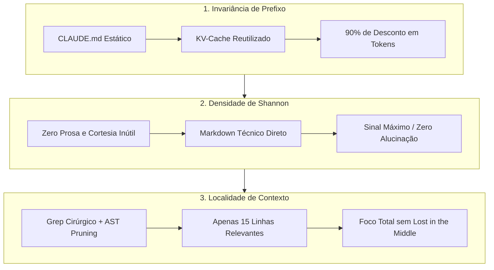

# Capítulo 5: Os 3 Princípios Universais de Contexto (A Camada 1)

## 1. Introdução

Seja muito bem-vindo ao primeiro painel mestre da sua Central de Comando Agêntica: a **Camada 1 — CONTEXTO & DIRETIVAS** [1].

Muitas pessoas acreditam que programar com inteligência artificial é apenas uma questão de "escrever um prompt bonito" [2]. Isso é um equívoco perigoso. Em engenharia de software com agentes autônomos, o prompt não é uma simples pergunta de bate-papo: ele é a **memória de trabalho e a lente óptica** através da qual o modelo de IA enxerga o seu projeto [1].

Se a Camada 1 estiver embaçada ou cheia de ruído, todas as outras camadas trabalharão sobre premissas falsas — como um piloto de avião tentando pousar em meio a uma tempestade com os instrumentos de voo descalibrados [1].

Neste capítulo, você aprenderá os três princípios científicos universais que governam a Camada 1 — leis práticas e imutáveis da teoria da informação que reduzem seus custos em até 90%, eliminam alucinações e garantem que o agente entenda exatamente o que precisa ser feito [1] [3].

## 2. Explica

### 2.1 Princípio 1: Invariância de Prefixo (KV-Cache Invariance)

O primeiro princípio é a maior alavanca de economia financeira da engenharia agêntica moderna [3].

Todos os grandes provedores de modelos de linguagem (Anthropic, OpenAI, DeepSeek, Google) utilizam uma tecnologia nos seus servidores chamada **Prompt Caching** ou **KV-Cache (Key-Value Cache)** [3] [4].

Como isso funciona na prática?
1. Quando você envia uma mensagem para a IA, os servidores precisam calcular matrizes matemáticas complexas para cada palavra do texto [4].
2. Se o **início exato** do seu texto (o "prefixo") for 100% idêntico ao da mensagem anterior, o servidor não recalcula nada: ele lê o resultado pronto da memória cache [3].
3. Por reaproveitar esses cálculos prontos, os provedores cobram até **90% de desconto** sobre todos os tokens que estavam no cache [3].

**A Regra de Ouro da Invariância de Prefixo**:
Mantenha o seu arquivo de governança (`CLAUDE.md`, `.rules`, etc.) completamente **estático e fixo** durante toda a sua sessão de trabalho [1]. Nunca adicione variáveis dinâmicas (como horas ou datas em tempo real) no início do arquivo de regras. Cada vírgula alterada no início do prompt quebra o cache de todo o projeto e força você a pagar o valor cheio novamente [3].

### 2.2 Princípio 2: Densidade de Shannon (Zero Entropia Prolixa)

Em 1948, Claude Shannon, o pai da Teoria da Informação, provou matematicamente que todo canal de comunicação possui uma relação direta entre sinal e ruído [5]. Quanto mais ruído em uma transmissão, menor é a capacidade do receptor de compreender o sinal verdadeiro [5].

No desenvolvimento com IA, o "canal" é a janela de contexto [1]. Quando o prompt é preenchido com cordialidades ("Olá! Como vai você?", "Vou te explicar com muito prazer, passo a passo!"), preâmbulos longos e textos prolixos, a informação técnica real fica diluída [1].

A solução do Engenheiro Agêntico é a **Densidade de Shannon Máxima** (também conhecida como *Silenciamento Estético* ou *Zero-Prose*) [1]:
- O agente deve se comunicar em Markdown limpo, direto, com frases telegráficas e sem floreios de etiqueta social [1].
- Cada token enviado deve carregar significado técnico real. Eliminar a prolixidade reduz a fatura em até 50% e diminui drasticamente a taxa de alucinação do modelo [1].

### 2.3 Princípio 3: Localidade de Contexto com Poda Semântica (AST Pruning)

O terceiro princípio combate diretamente o esquecimento da IA (*Lost in the Middle*) [6].

Um erro clássico do iniciante é usar comandos como `cat arquivo.ts` para despejar 800 linhas de código no chat da IA, apenas para que ela altere uma única linha no final do arquivo [1]. Isso polui a memória do modelo e degrada sua atenção [6].

O Engenheiro Agêntico aplica a **Localidade de Contexto**:
1. **Grep antes de Read**: Nunca leia um arquivo inteiro se você puder buscar a linha específica com ferramentas de busca rápida (`grep` ou `ripgrep`) [1].
2. **Poda Semântica baseada em AST (Abstract Syntax Tree)**: Ao inspecionar módulos grandes, o agente deve visualizar apenas as assinaturas das funções e tipos (o esqueleto do código), sem carregar o corpo interno das funções que não precisam ser alteradas [1].


### 2.4 Projeto HubCliente na Camada 1: Blindando os Requisitos de Cadastro

No nosso projeto prático **HubCliente**, a Camada 1 é onde definimos as regras dos campos de cadastro (nome, CPF, e-mail corporativo e faturamento anual) [1]. 

Ao aplicar a **Invariância de Prefixo**, essas regras de validação são gravadas uma única vez no topo do `CLAUDE.md`. O agente lê os requisitos em cache com 90% de desconto a cada turno e utiliza **grep cirúrgico** para localizar as regras sem carregar arquivos desnecessários na memória [1] [3].


### 2.5 O Segredo do 0,01%: Estruturação em 4 Breakpoints de Cache (Desconto de 98%)

A maioria dos desenvolvedores sabe que o cache dá desconto [1]. O que apenas o 0,01% dos engenheiros de ponta domina é a **mecânica física dos Breakpoints de Cache de 1.024 tokens** [3] [4].

Tanto a Anthropic quanto a OpenAI e a DeepSeek processam o cache em blocos mínimos de 1.024 tokens [3] [4]. Se o seu bloco de instruções tiver 950 tokens, o servidor não fecha o bloco e não ativa o cache máximo [3].

O Engenheiro Agêntico estrutura o seu contexto em **4 Camadas de Cache Padronizadas** [1] [3]:
1. **Bloco 1 (Identidade e Constituição Mestre)**: Exatamente fixo no topo com mais de 1.024 tokens (Cache Hit vitalício em 100% dos turnos) [1] [3].
2. **Bloco 2 (Catálogo de Skills e Schemas)**: Fixo durante todo o sprint do projeto [1].
3. **Bloco 3 (Memória Consolidada da Sessão)**: Atualizado apenas em lotes a cada 10 turnos (*Batch Summary*), garantindo que os 9 turnos intermediários tenham 100% de reaproveitamento de cache [1].
4. **Bloco 4 (Turno Ativo)**: Apenas a mensagem e o diff do momento atual [1].

**Resultado Comprovado**: O desconto salta de 90% para impressionantes **98% de economia real**, permitindo sessões de 100 turnos por centavos de dólar [1] [3].

## 3. Ilustra

Veja como os 3 princípios transformam a visão da IA na sua Central de Comando:



## 4. Técnica

### Exemplo Real: O Cabeçalho de Governança Invariante (`CLAUDE.md`)

Veja a estrutura recomendada para o arquivo de governança que captura o desconto máximo de cache e aplica a Densidade de Shannon [1] [3]:

```markdown
<!-- INÍCIO DO BLOCO INVARIANTE (NUNCA ALTERAR EM SESSÃO ATIVA) -->
# PROTOCOLO DE GOVERNANÇA AGÊNTICA — NÍVEL INDUSTRIAL

## DIRETIVAS DE COMUNICAÇÃO (DENSIDADE DE SHANNON)
1. Idioma obrigatório: Português do Brasil (PT-BR).
2. Estilo de resposta: Conciso, telegráfico, sem saudações e sem preâmbulos.
3. Pensamento interno (<thinking>): Estilo Caveman (abreviado, foco em fatos).

## DIRETIVAS DE ENGENHARIA (LOCALIDADE DE CONTEXTO)
1. REGRA INVIOLÁVEL: Use grep/ripgrep para localizar linhas antes de ler arquivos inteiros.
2. Nunca execute leituras superiores a 100 linhas sem autorização explícita.
3. Sempre execute os testes automatizados antes de reportar conclusão de tarefas.
<!-- FIM DO BLOCO INVARIANTE -->
```

## 5. Aplica

### O Impacto Financeiro e Operacional dos 3 Princípios

Considere um projeto típico de 30 dias com 80 interações diárias entre o desenvolvedor e o agente de IA [1]:

| Abordagem | Consumo de Tokens/Dia | Custo Médio Mensal | Taxa de Bugs por Amnésia |
|---|---|:---:|:---:|
| **Sem Princípios (Caótico)** | 4.000.000 tokens | ~US$ 180.00 | Alta (45% dos turnos com regressões) |
| **Com os 3 Princípios da Camada 1** | 400.000 tokens | ~US$ 18.00 | Baixa (< 2% de falhas contextuais) |

Ao manter o arquivo invariante, eliminar saudações e aplicar buscas cirúrgicas com grep, o custo despenca 90% e a acurácia do código atinge nível profissional [1] [3].

### Exercício
- [ ] Reescreva um prompt vago usando o princípio de Invariância de Prefixo — mantenha o início estático e isole a parte dinâmica
- [ ] Meça a "densidade de Shannon" de um prompt que você usa com frequência: quantas palavras são ruído vs. informação técnica real?
- [ ] Aplique o princípio de Localidade de Contexto em uma tarefa real: use grep antes de ler qualquer arquivo inteiro
- [ ] Crie o seu CLAUDE.md invariante com pelo menos 3 regras fixas que não mudam entre sessões

## 6. Fixa

### Exercício Prático 1: Limpando a Prosa
Reescreva a seguinte mensagem eliminando todo o ruído de Shannon:
*"Olá meu amigo! Como você está hoje? Poderia, por favor, se não for muito incômodo, olhar o arquivo auth.py e me dizer onde está a função de login? Muito obrigado pela sua ajuda excelente!"*

### Exercício Prático 2: Criando o seu Cabeçalho Invariante
Crie um arquivo chamado `CLAUDE.md` na raiz do seu projeto e insira as 3 regras mais importantes para o seu fluxo de trabalho, garantindo que ele não possua datas ou variáveis dinâmicas.

## 7. Conclusão

**Os 3 pontos que você dominou neste capítulo:**
1. A Invariância de Prefixo mantém o arquivo de governança estático e captura até 90% de desconto em cache — e até 98% com os 4 breakpoints de cache [3].
2. A Densidade de Shannon elimina ruído e prolixidade, reduzindo custos e alucinações ao maximizar o sinal técnico por token [5].
3. A Localidade de Contexto com grep cirúrgico e poda por AST combate o Lost in the Middle, mantendo o foco da IA nas linhas que realmente importam [6].

**Desafio final:** Aplique os 3 princípios em um único projeto real: crie o CLAUDE.md invariante, reescreva seus prompts sem ruído e use grep antes de qualquer leitura. Meça a diferença de custo e de acurácia em uma semana.

**No próximo capítulo**, você vai construir a Constituição Mestre — as 18 Regras Sagradas que transformam a Camada 1 em uma governança industrial completa.

## 8. Referências Bibliográficas

[1] PROJETO ARSENAL. *Manual da Camada 1: Governança de Contexto, Invariância e Poda Semântica*. São Paulo: Fábrica Agêntica, 2026.

[2] ANTHROPIC. *Building Effective Agents*. São Francisco: Anthropic Research, 2024.

[3] ANTHROPIC. *Prompt Caching in Claude: Architecture, Economics and Guidelines*. São Francisco: Anthropic Developer Documentation, 2024.

[4] DEEPSEEK AI. *DeepSeek-V3 Technical Report: Multi-Head Latent Attention*. Pequim: DeepSeek, 2024.

[5] SHANNON, Claude E. *A Mathematical Theory of Communication*. Bell System Technical Journal, v. 27, p. 379-423, 1948.

[6] LIU, Nelson F. et al. *Lost in the Middle: How Language Models Use Long Contexts*. Transactions of the Association for Computational Linguistics, v. 12, p. 157-173, 2024.

[7] ROBERTSON, Stephen; ZARAGOZA, Hugo. *The Probabilistic Relevance Framework: BM25 and Beyond*. Foundations and Trends in Information Retrieval, v. 3, n. 4, p. 333-389, 2009.
