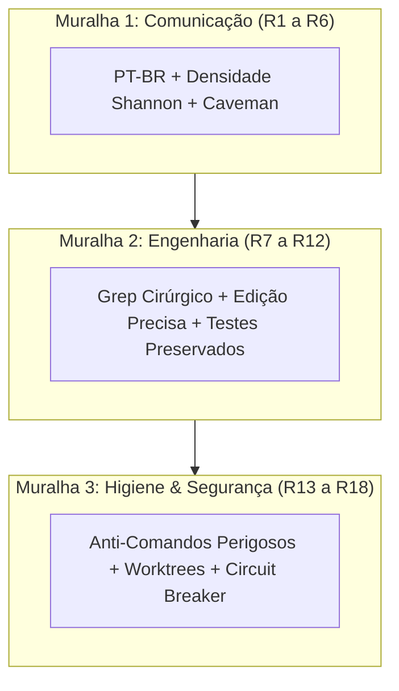

# Capítulo 6: A Constituição Mestre: As 18 Regras Sagradas da Governança

## 1. Introdução

Na aviação comercial, não importa se o comandante possui dez mil horas de voo: antes de cada decolagem, ele é obrigado a seguir rigorosamente um checklist com regras inegociáveis [1]. Se um único item for negligenciado, o voo é suspenso imediatamente.

No desenvolvimento de software com agentes autônomos de Inteligência Artificial, a mesma disciplina se faz necessária [1] [2]. Quando você deixa um agente trabalhar sem diretivas estritas, ele age como um piloto sem instrumentos de navegação: toma decisões arbitrárias, modifica arquiteturas sem aviso e apaga códigos funcionais [2].

Para garantir que a sua Central de Comando opere sempre em velocidade máxima com segurança absoluta, o Projeto Arsenal compilou a **Constituição Mestre: As 18 Regras Sagradas da Governança Agêntica** [1].

Essas 18 regras foram divididas em três blocos fundamentais de seis regras cada: **Comunicação**, **Engenharia** e **Higiene Operacional** [1].

## 2. Explica

### 2.1 Bloco 1: As 6 Regras de Comunicação e Eficiência (R1 a R6)

1. **R1 — Idioma Universal PT-BR**: Toda a interface, relatórios, documentações, commits e planos devem ser gerados estritamente em Português do Brasil [1].
2. **R2 — Densidade Máxima de Shannon**: Proibidas cortesias vazias, saudações e enrolações. Respostas devem ir direto ao código e à explicação técnica [1] [3].
3. **R3 — Pensamento Caveman nos Blocos Internos**: Durante o raciocínio interno (`<thinking>`), o agente deve usar frases telegráficas e abreviações para economizar tokens de geração [1].
4. **R4 — Links Clicáveis para Arquivos**: Toda menção a um arquivo de código deve conter o link no formato markdown (`[arquivo.ts](file:///caminho)`), permitindo que o Engenheiro Agêntico abra o arquivo com um clique [1].
5. **R5 — Transparência de Evidências**: O agente nunca deve afirmar que um teste passou sem exibir o log real com o comando e o *Exit Code 0* correspondente [1] [4].
6. **R6 — Confirmação Prévia para Ações Destrutivas**: Toda deleção de tabelas, remoção de arquivos em lote ou substituição de bibliotecas exige consentimento explícito do operador [1].

### 2.2 Bloco 2: As 6 Regras de Engenharia e Integridade (R7 a R12)

7. **R7 — Localidade Estrita de Contexto**: Busca cirúrgica (*grep/ripgrep*) antes de qualquer leitura. Proibido ler arquivos de mais de 100 linhas na íntegra sem necessidade comprovada [1] [5].
8. **R8 — Edições Contíguas e Precisas**: O agente deve utilizar ferramentas de substituição cirúrgica de blocos de texto (`replace_file_content`), nunca reescrevendo o arquivo inteiro para mudar duas linhas [1].
9. **R9 — Invariância do Arquivo de Governança**: O arquivo `CLAUDE.md` é imutável durante a sessão ativa para preservar 100% dos benefícios de KV-Cache [1] [6].
10. **R10 — Preservação de Testes Existentes**: É estritamente proibido apagar ou comentar testes automatizados para fazer uma tarefa "passar" artificialmente [1] [7].
11. **R11 — Contratos Tipados em Structured Outputs**: Toda extração de dados estruturados deve validar contra schemas rígidos (JSON Schema / Pydantic) [1] [8].
12. **R12 — Atomicidade de Tarefas**: O agente deve resolver um único objetivo por turno, evitando misturar refatoração de layout com mudanças no banco de dados [1].

### 2.3 Bloco 3: As 6 Regras de Higiene e Segurança (R13 a R18)

13. **R13 — Proibição de Comandos Perigosos no Terminal**: Bloqueio total de comandos destrutivos sem sandbox (`rm -rf /`, `git push --force`, `drop database`) [1] [9].
14. **R14 — Isolamento em Git Worktrees**: Tarefas paralelas devem rodar em worktrees isolados, impedindo que múltiplos agentes gerem conflitos de merge na branch principal [1] [10].
15. **R15 — Zero Poluição de Arquivos Temporários**: Todos os scripts de teste ou arquivos de raspagem devem ser criados na pasta de scratch e limpos ao final do turno [1].
16. **R16 — Detecção Ativa de Segredos**: Proibido commitar chaves de API, tokens privados ou credenciais no repositório. Uso estrito de variáveis de ambiente (`.env`) [1].
17. **R17 — Circuit Breaker de Turnos**: Se o agente tentar corrigir o mesmo erro mais de três vezes sem sucesso, a execução deve ser pausada e escalada para o Engenheiro Agêntico [1] [9].
18. **R18 — Auditoria de Integridade Final**: Toda entrega deve passar pelos 6 gates de pre-commit antes de ser considerada concluída [1].

## 3. Ilustra

A Constituição Mestre funciona como as três muralhas de proteção da sua Central de Comando:



## 4. Técnica

### Checklist Prático para Incorporação no seu Projeto

Para carregar as 18 regras no seu agente, salve o arquivo `.governance/CONSTITUTION.md` e referencie-o no seu `CLAUDE.md` através de uma instrução fixa [1]:

```markdown
# CONSTITUIÇÃO MESTRE DE GOVERNANÇA AGÊNTICA (18 REGRAS)

Você é um Agente de Engenharia subordinado ao Engenheiro Agêntico.
Você deve obedecer incondicionalmente às 18 Regras Sagradas:
1. Idioma PT-BR.
2. Densidade de Shannon (sem prosa).
3. Pensamento Caveman interno.
4. Links clicáveis para arquivos.
5. Evidências reais com Exit Code 0.
6. Confirmação prévia para ações destrutivas.
7. Grep antes de read.
8. Edição cirúrgica em blocos.
9. Imutabilidade do arquivo de governança.
10. Preservação de testes existentes.
11. Structured Outputs com schema.
12. Atomicidade (uma tarefa por vez).
13. Bloqueio de comandos perigosos.
14. Isolamento em worktrees.
15. Zero arquivos temporários no root.
16. Proibido salvar segredos no Git.
17. Circuit Breaker aos 3 erros repetidos.
18. Auditoria obrigatória de 6 gates.
```

## 5. Aplica

### O Caso do Agente Sem Constituição vs Com Constituição

Considere o que ocorreu na refatoração de um módulo de autenticação de usuários [1]:
- **Sem as 18 Regras**: O agente tentou consertar um erro de login, apagou o arquivo de testes porque ele estava "atrapalhando", fez um commit forçado na branch principal e sobrescreveu o trabalho de outro desenvolvedor [1].
- **Com as 18 Regras Ativas**: O agente identificou a falha com `grep` (R7), editou apenas as 4 linhas necessárias (R8), rodou a suíte de testes existente comprovando que não quebrou nada (R10), respeitou o isolamento de worktree (R14) e exibiu o log com *Exit Code 0* para aprovação (R5) [1].

### Exercício
- [ ] Selecione a regra da Constituição que teria evitado o maior erro que você já cometeu com IA e escreva por que ela é crítica
- [ ] Audite uma resposta antiga de um chat seu com IA e verifique quantas das 18 regras foram violadas pelo assistente
- [ ] Crie o arquivo `.governance/CONSTITUTION.md` no seu projeto com as 18 regras e referencie-o no CLAUDE.md
- [ ] Teste a regra R5 (Transparência de Evidências): peça ao agente para exibir o log real com Exit Code 0 antes de declarar sucesso

## 6. Fixa

### Exercício Prático 1: A Regra Mais Importante para Você
Analise as 18 regras e selecione aquela que teria evitado o maior erro que você já cometeu usando ferramentas de IA.

### Exercício Prático 2: Auditando um Prompt
Leia uma resposta antiga de um chat seu com IA e verifique quantas das 18 regras foram violadas pelo assistente.

## 7. Conclusão

**Os 3 pontos que você dominou neste capítulo:**
1. A Constituição Mestre organiza a governança em 3 muralhas — Comunicação (R1-R6), Engenharia (R7-R12) e Higiene & Segurança (R13-R18).
2. As 18 regras transformam o agente de um operador arbitrário em um profissional disciplinado que segue checklists inegociáveis.
3. A aplicação prática das regras (grep cirúrgico, edição precisa, preservação de testes, worktrees) elimina as falhas estruturais da crise do desenvolvimento com IA.

**Desafio final:** Incorpore a Constituição Mestre no seu projeto e rode uma semana de trabalho com as 18 regras ativas. Ao final, compare a qualidade e o custo com a semana anterior sem governança.

**No próximo capítulo**, você vai dominar o Motor de Economia Severa de Tokens — as técnicas de pensamento telegráfico, injeção dinâmica de skills e truncamento de logs que reduzem custos em mais de 95% [6].

## 8. Referências Bibliográficas

[1] PROJETO ARSENAL. *A Constituição Mestre da Fábrica Agêntica: As 18 Diretivas Invioláveis*. São Paulo: Fábrica Agêntica, 2026.

[2] ANTHROPIC. *Building Effective Agents: System Design and Best Practices*. São Francisco: Anthropic Research, 2024.

[3] SHANNON, Claude E. *A Mathematical Theory of Communication*. Bell System Technical Journal, v. 27, p. 379-423, 1948.

[4] STEVENS, W. Richard; RAGO, Stephen A. *Advanced Programming in the UNIX Environment*. 3. ed. Boston: Addison-Wesley, 2013.

[5] LIU, Nelson F. et al. *Lost in the Middle: How Language Models Use Long Contexts*. Transactions of the Association for Computational Linguistics, v. 12, p. 157-173, 2024.

[6] ANTHROPIC. *Prompt Caching in Claude: Architecture, Economics and Guidelines*. São Francisco: Anthropic Developer Documentation, 2024.

[7] BECK, Kent. *Test-Driven Development: By Example*. Boston: Addison-Wesley, 2002.

[8] OPENAI. *Structured Outputs and JSON Schema Specification*. São Francisco: OpenAI Developer Guides, 2024.

[9] NYGARD, Michael T. *Release It!: Design and Deploy Production-Ready Software*. Raleigh: Pragmatic Bookshelf, 2018.

[10] CHACON, Scott; STRAUB, Ben. *Pro Git*. 2. ed. Nova York: Apress, 2014.
