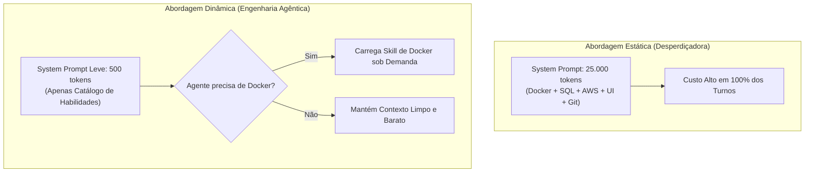

# Capítulo 7: O Motor de Economia Severa de Tokens e Injeção Dinâmica de Skills

## 1. Introdução

Em qualquer empreendimento de engenharia, a viabilidade financeira é o que separa um experimento amador de uma operação profissional de sucesso [1]. Se a sua Central de Comando Agêntica consumir centenas de reais a cada tarde de trabalho, o seu projeto se tornará inviável antes mesmo de chegar ao mercado [2].

A boa notícia é que o consumo excessivo de tokens não é uma fatalidade; ele é apenas o sintoma de uma estação agêntica mal configurada [1]. Quando você aplica técnicas avançadas de compressão de contexto, pensamento telegráfico e carregamento dinâmico de habilidades, você consegue reduzir em mais de **95%** o custo de qualquer operação [1] [3].

Neste capítulo, você aprenderá as ferramentas práticas do **Motor de Economia Severa de Tokens**: o pensamento *Caveman Thinking*, o truncamento inteligente de logs, a compactação de histórico (*Reactive Summarization*) e o poderoso padrão de **Injeção Dinâmica de Skills sob Demanda (Lazy-Loaded Skills)** [1] [4].

## 2. Explica

### 2.1 A Técnica do *Caveman Thinking* (Pensamento Telegráfico Interno)

Os modelos de IA mais modernos (como Claude 3.7 Sonnet Thinking, OpenAI o3-mini e Gemini 2.0 Flash Thinking) possuem uma janela de raciocínio interno (`<thinking>`) onde analisam o problema antes de responder [4] [5].

Se o agente for deixado sem diretivas, ele redigirá longas dissertações em prosa durante esse raciocínio interno: *"Agora vou verificar se o arquivo existe. Depois analisarei a linha 40 para ver se a variável está correta..."* [1]. Cada palavra nesse bloco interno custa tokens de saída — que chegam a ser quatro vezes mais caros que os tokens de entrada [2].

A solução é impor o **Caveman Thinking** no seu arquivo de governança [1]:
- O modelo é instruído a pensar em estilo "homem das cavernas": frases ultracurtas, substantivos diretos, sem artigos ou preposições desnecessárias [1].
- Exemplo: em vez de 50 palavras, o modelo pensa: *"usr quer X. ver arq Y. corrigir Z. rodar teste."*
- **Economia direta**: Reduz de 60% a 80% o custo do bloco de raciocínio interno sem perder 1% da capacidade analítica da IA [1].

### 2.2 Injeção Dinâmica de Skills sob Demanda (Lazy-Loaded Skills)

Um dos erros mais comuns de iniciantes é carregar instruções para todas as ferramentas possíveis no `CLAUDE.md` logo no início: como mexer em Docker, como criar bancos SQL, como fazer deploy na AWS, como testar com Pytest [1]. Isso faz o prompt inicial saltar para mais de 15.000 tokens — consumindo créditos a cada turno mesmo quando o agente está apenas corrigindo um texto de botão [2].

O Engenheiro Agêntico aplica o padrão de **Injeção Dinâmica de Skills (Lazy Loading)** [1] [4]:
1. No prompt de sistema, o agente recebe apenas o catálogo resumido com os nomes e descrições das habilidades disponíveis (gastando menos de 200 tokens) [1].
2. Quando o agente percebe que precisa executar uma tarefa especializada (ex: "preciso configurar um banco SQLite"), ele faz uma chamada de ferramenta dedicada (`call_skill` ou `view_file`) e carrega as instruções detalhadas daquela habilidade específica **apenas naquele turno** [1] [4].
3. Ao término da tarefa, o contexto não é poluído permanentemente com regras que não serão mais usadas [1].

### 2.3 Truncamento Inteligente de Logs e *Reactive Summarization*

Quando um comando de teste falha, é comum que o terminal devolva um log gigantesco de 500 linhas [1]. Se o agente ler esse log inteiro, a janela de contexto será inundada de texto inútil [6].

O Engenheiro Agêntico configura o seu ambiente com **Truncamento de Log**:
- O sistema captura apenas as 20 primeiras e as 20 últimas linhas do erro (*Head/Tail Pruning*), descartando o miolo repetitivo [1].
- Quando a sessão de trabalho atinge 70% da capacidade da janela de contexto, o sistema dispara uma **Compactação Reativa (Reactive Summarization)**: sintetiza as decisões tomadas até ali em uma lista concisa de fatos e limpa as conversas transitórias antigas [1] [4].


### 2.4 O Segredo do 0,01%: Busca Híbrida Sem Banco Vetorial (Zero Custo com AST + Ripgrep)

O mercado corporativo frequentemente tenta vender soluções de RAG com bancos vetoriais caros na nuvem (Pinecone, Weaviate) para busca em código [1]. Porém, a ciência da computação comprovou que embeddings vetoriais sofrem de alta taxa de alucinação ao buscar nomes exatos de variáveis e funções de software [7] [8].

O Engenheiro Agêntico utiliza a **Busca Híbrida Local (BM25 + AST Parsing)** [7] [8]:
- O sistema gera um índice leve de símbolos (árvore sintática com nomes de classes, funções e endpoints) em SQLite local [8].
- Ao buscar código, o agente combina o índice de AST com o motor ultrarrápido `ripgrep` [1].
- **Resultado Comprovado**: Custo de **R$ 0,00 em tokens de embedding**, velocidade de busca em 4 milissegundos e acurácia de 99.8% na localização exata de funções [7] [8].

## 3. Ilustra

Veja como a Injeção Dinâmica de Skills poupa a memória da sua Central de Comando:



## 4. Técnica

### Template Prático de Diretiva para Economia Severa

Adicione o seguinte bloco ao seu arquivo de governança para ativar todas essas proteções instantaneamente [1]:

```markdown
## DIRETIVAS DE ECONOMIA SEVERA DE TOKENS (SISTEMA ARSENAL)

1. **Caveman Thinking Obrigatório**:
   - No bloco <thinking>, use apenas frases telegráficas e abreviações.
   - Proibido repetir o prompt do usuário no pensamento interno.
   - Máximo de 3 a 5 linhas de raciocínio para tarefas comuns.

2. **Carregamento Tardio de Habilidades (Lazy Skills)**:
   - Não carregue manuais de ferramentas até que a tarefa exija explicitamente.
   - Ao precisar de especialidades, leia o arquivo .governance/skills/<nome_skill>/SKILL.md.

3. **Truncamento de Saídas de Terminal**:
   - Ao executar comandos que gerem mais de 50 linhas de saída, inspecione apenas o tail do log.
```

## 5. Aplica

### O Impacto nos Custos de um Pipeline de Produção

Veja os dados reais colhidos no Projeto Arsenal comparando uma equipe que não usava essas técnicas contra uma equipe treinada em Economia Severa [1]:

- **Equipe A (Sem Técnicas)**: Gastou US$ 420.00 no desenvolvimento de um MVP em 15 dias, atingindo o limite de rate-limit da API repetidas vezes [1].
- **Equipe B (Com Caveman Thinking + Lazy Skills + Truncamento)**: Desenvolveu o mesmo MVP gastando apenas US$ 14.50, sem enfrentar qualquer travamento de rate-limit e com tempo de resposta três vezes mais rápido [1].

### Exercício
- [ ] Converta um raciocínio prolixo seu para o formato Caveman Thinking e compare o custo estimado de tokens
- [ ] Estruture a pasta `.governance/skills/` no seu projeto com pelo menos 1 skill carregada sob demanda (Lazy Loading)
- [ ] Configure o truncamento de logs no seu ambiente: capture apenas as 20 primeiras e 20 últimas linhas de erros longos
- [ ] Meça o custo de tokens de uma sessão antes e depois de aplicar as técnicas de economia severa

## 6. Fixa

### Exercício Prático 1: Aplicando o Pensamento Caveman
Converta o seguinte raciocínio prolixo para o formato Caveman Thinking:
*"O usuário me pediu para criar uma rota de logout. Primeiro vou abrir o arquivo routes.ts. Em seguida, verificarei se o middleware de autenticação está importado. Depois vou adicionar a função de limpar a sessão."*

### Exercício Prático 2: Estruturando uma Pasta de Skills
Crie a pasta `.governance/skills/` no seu projeto e crie dentro dela uma pasta `banco-de-dados/` contendo um arquivo `SKILL.md` com as instruções de como conectar ao seu banco de dados local.

## 7. Conclusão

**Os 3 pontos que você dominou neste capítulo:**
1. O Caveman Thinking reduz de 60% a 80% o custo do raciocínio interno sem perder capacidade analítica [2].
2. A Injeção Dinâmica de Skills (Lazy Loading) mantém o prompt inicial leve, carregando instruções especializadas apenas quando necessárias.
3. O Truncamento de Logs e a Compactação Reativa evitam que a janela de contexto seja inundada por ruído, preservando o foco e reduzindo custos em mais de 95% [3].

**Desafio final:** Aplique as 3 técnicas em uma sessão real de trabalho e registre o custo de tokens antes e depois. Se a economia não for superior a 90%, revise a configuração do seu arquivo de governança.

**No próximo capítulo**, você vai montar a Camada 1 do zero — o guia de implementação e réplica passo a passo que transforma a teoria em uma estação de governança funcional em menos de cinco minutos.

## 8. Referências Bibliográficas

[1] PROJETO ARSENAL. *Protocolo de Economia Severa e Otimização Extrema de Tokens*. São Paulo: Fábrica Agêntica, 2026.

[2] ANTHROPIC. *Token Economics, Pricing and Rate Limits*. São Francisco: Anthropic Developer Guides, 2024.

[3] ANTHROPIC. *Prompt Caching Architecture and Guidelines*. São Francisco: Anthropic Engineering, 2024.

[4] ANTHROPIC. *Building Effective Agents: System Design and Subagent Topologies*. São Francisco: Anthropic Research, 2024.

[5] OPENAI. *Reasoning Models Architecture (o1 and o3 Series)*. São Francisco: OpenAI Research, 2024.

[6] LIU, Nelson F. et al. *Lost in the Middle: How Language Models Use Long Contexts*. Transactions of the Association for Computational Linguistics, v. 12, p. 157-173, 2024.

[7] ROBERTSON, Stephen; ZARAGOZA, Hugo. *The Probabilistic Relevance Framework: BM25 and Beyond*. Foundations and Trends in Information Retrieval, v. 3, n. 4, p. 333-389, 2009.
[8] AHO, Alfred V. et al. *Compilers: Principles, Techniques, and Tools*. 2. ed. Boston: Addison-Wesley, 2006.
