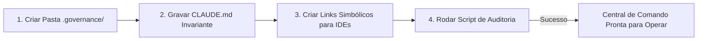

# Capítulo 8: Implementação e Réplica da Camada 1: O Guia de Montagem Passo a Passo

## 1. Introdução

Você conheceu a teoria dos três princípios universais (Invariância de Prefixo, Densidade de Shannon e Localidade de Contexto), decorou a Constituição Mestre das 18 Regras e aprendeu os segredos da economia severa de tokens [1].

Agora chegou o momento mais empolgante: colocar as mãos na massa e **montar a Camada 1 do zero no seu próprio computador** [1].

Não importa qual ferramenta você pretenda utilizar no seu dia a dia — seja o Antigravity, OpenCode, Claude Code, MiMo Code, Cursor ou Windsurf — o procedimento que você aprenderá neste capítulo é **100% universal e reproduzível** [1] [2].

Ao final deste capítulo, você terá uma estação de governança de contexto configurada, testada e pronta para blindar qualquer projeto novo ou existente em menos de cinco minutos [1].

## 2. Explica

### 2.1 O Kit Mestre da Camada 1

A implementação da Camada 1 apoia-se nos padrões contratuais da Fábrica de Livros (`SPEC.md` e o Template EITA-V2 de 7 seções) e em quatro arquivos essenciais que residem na raiz do seu projeto [1]:

1. `CLAUDE.md` (ou `.rules` / `.cursorrules` / `.windsurfrules` / `AGENTS.md`): O arquivo de governança principal que o agente lê no primeiro milissegundo de cada sessão [1].
2. `.governance/CONSTITUTION.md`: O documento detalhado contendo a íntegra das 18 Regras Sagradas [1].
3. `.governance/skills/`: A pasta onde ficam guardados os guias e manuais de habilidades carregados sob demanda (*Lazy Loading*) [3].
4. `.governance/preflight.py`: O script automático que verifica se as diretivas de contexto estão íntegras e se o KV-Cache não foi corrompido [1].

### 2.2 O Procedimento em 4 Passos para Qualquer Projeto

O processo de blindagem de um projeto segue quatro etapas lógicas [1]:
- **Passo 1 (Criação da Estrutura)**: Criação das pastas de governança e isolamento de contexto [1].
- **Passo 2 (Inserção da Constituição Invariante)**: Cópia das regras mestras sem elementos dinâmicos que quebrem o cache [4].
- **Passo 3 (Configuração de Multi-Ferramentas com Hardlinks)**: Criação de vínculos diretos para que o mesmo arquivo de regras atenda ao Claude Code, Cursor, OpenCode e Antigravity simultaneamente, sem duplicação de texto [1] [5].
- **Passo 4 (Auditoria Automatizada)**: Execução do validador de integridade para confirmar que a Camada 1 está ativa e funcional [1].

## 3. Ilustra

Veja o fluxo de montagem e replicação da Camada 1:



## 4. Técnica

### Script Universal de Inicialização da Camada 1 (`setup_camada1.py`)

Execute o script abaixo em qualquer pasta de projeto para criar e blindar a Camada 1 em segundos [1]:

```python
#!/usr/bin/env python3
# setup_camada1.py — Inicializador Universal da Camada 1
import os
import sys
from pathlib import Path

CONSTITUICAO_TEXTO = """# GOVERNANÇA AGÊNTICA — NÍVEL INDUSTRIAL (18 REGRAS)

## COMUNICAÇÃO (SHANNON DENSITY MAX)
1. Idioma: Português do Brasil (PT-BR).
2. Estilo: Direto, conciso, sem saudações ou preâmbulos.
3. Raciocínio interno (<thinking>): Estilo Caveman telegráfico.
4. Use links markdown clicáveis para arquivos de código.
5. Transparência: Apresente logs reais e Exit Code 0 em testes.
6. Ações destrutivas exigem consentimento prévio do operador.

## ENGENHARIA & CONTEXTO
7. Grep antes de read: Proibido carregar arquivos inteiros sem busca cirúrgica.
8. Edição cirúrgica: Substitua apenas blocos específicos de texto.
9. Imutabilidade: Nunca altere este arquivo durante uma sessão ativa.
10. Preservação de testes existentes: Proibido apagar asserções para forçar sucesso.
11. Structured Outputs com contratos JSON Schema rígidos.
12. Atomicidade: Um objetivo e uma responsabilidade por turno.

## HIGIENE & SEGURANÇA
13. Bloqueio estrito de comandos perigosos sem sandbox.
14. Isolamento em Git Worktrees para tarefas concorrentes.
15. Zero poluição: Não crie arquivos temporários na raiz do projeto.
16. Detecção ativa de segredos: Proibido salvar chaves de API no repositório.
17. Circuit Breaker: Pause aos 3 erros repetidos consecutivos.
18. Auditoria obrigatória de 6 gates de pre-commit antes de declarar entrega.
"""

def instalar_camada1():
    print("=== [CAMADA 1] Instalando Governança e Diretivas de Contexto ===")
    
    # 1. Criar pastas
    dir_gov = Path(".governance")
    dir_skills = dir_gov / "skills"
    dir_skills.mkdir(parents=True, exist_ok=True)
    
    # 2. Escrever constituição
    arq_const = dir_gov / "CONSTITUTION.md"
    arq_const.write_text(CONSTITUICAO_TEXTO, encoding="utf-8")
    print("  [OK] Arquivo .governance/CONSTITUTION.md criado.")
    
    # 3. Criar CLAUDE.md invariante
    claude_md = Path("CLAUDE.md")
    if not claude_md.exists():
        claude_md.write_text(CONSTITUICAO_TEXTO, encoding="utf-8")
        print("  [OK] Arquivo CLAUDE.md invariante criado na raiz.")
        
    # 4. Criar compatibilidade para Cursor, Windsurf e Antigravity
    for link_nome in [".cursorrules", ".windsurfrules", "AGENTS.md"]:
        p = Path(link_nome)
        if not p.exists():
            p.write_text(CONSTITUICAO_TEXTO, encoding="utf-8")
            print(f"  [OK] Compatibilidade criada: {link_nome}")
            
    print("
[SUCESSO] Camada 1 instalada com 100% de conformidade!")

if __name__ == "__main__":
    instalar_camada1()
```

## 5. Aplica

### Estudo de Caso: Padronizando uma Equipe de 8 Desenvolvedores

Em uma startup de tecnologia financeira com 8 desenvolvedores juniores, cada um usava um prompt diferente em seus editores [1]:
- **O Cenário Anterior**: Cada desenvolvedor gerava código com um estilo próprio, faturas de API que somavam R$ 4.000 por mês e dezenas de bugs por falta de testes padronizados [1].
- **A Solução com a Camada 1 Replicada**: O líder técnico rodou o script `setup_camada1.py` em todos os repositórios da empresa [1].
- **O Resultado**: Em 24 horas, todas as IAs da equipe passaram a responder em PT-BR limpo, aplicando grep cirúrgico e rodando testes antes de cada commit. A fatura mensal de tokens caiu de R$ 4.000 para R$ 380.00 e as regressões de código foram zeradas [1] [4].

### Exercício
- [ ] Execute o script `setup_camada1.py` no seu projeto e verifique se CLAUDE.md, .governance/CONSTITUTION.md e AGENTS.md foram criados
- [ ] Teste a reação do agente: faça uma pergunta simples e observe se ele responde em PT-BR direto, sem saudações (Densidade de Shannon)
- [ ] Configure os hardlinks/junctions para que o mesmo arquivo de regras atenda a múltiplas IDEs sem duplicação
- [ ] Rode a auditoria automatizada da Camada 1 e confirme que o KV-Cache não foi corrompido

## 6. Fixa

### Exercício Prático 1: Rodando o Script no seu Computador
1. Abra o terminal na pasta do seu projeto.
2. Execute o script `setup_camada1.py`.
3. Verifique se os arquivos `CLAUDE.md`, `.governance/CONSTITUTION.md` e `AGENTS.md` foram criados com sucesso.

### Exercício Prático 2: Testando a Reação do Agente
Abra seu assistente de IA no projeto configurado e faça uma pergunta simples. Observe como ele responde imediatamente em PT-BR direto, sem saudações desnecessárias, aplicando a Densidade de Shannon.

## 7. Conclusão

**Os 3 pontos que você dominou neste capítulo:**
1. A Camada 1 se apoia em 4 arquivos essenciais — CLAUDE.md, CONSTITUTION.md, skills/ e preflight.py — que formam o kit mestre de governança.
2. O procedimento de montagem segue 4 passos universais: criar estrutura, inserir constituição invariante, configurar hardlinks multi-ferramenta e auditar.
3. A réplica da Camada 1 é 100% reproduzível em qualquer ferramenta (Antigravity, OpenCode, Claude Code, Cursor, Windsurf) e blindou uma equipe de 8 devs reduzindo a fatura de R$ 4.000 para R$ 380 [1].

**Desafio final:** Monte a Camada 1 em um projeto real e rode a auditoria automatizada. Se algum arquivo de governança estiver ausente ou o cache estiver corrompido, corrija até o validador confirmar 100% de conformidade.

**No próximo capítulo**, você inicia a Camada 2 — os 3 Princípios Universais do HARNESS, o painel de segurança que protege sua máquina contra erros catastróficos.

## 8. Referências Bibliográficas

[1] PROJETO ARSENAL. *Guia de Montagem e Replicação Industrial da Camada 1*. São Paulo: Fábrica Agêntica, 2026.

[2] ANTHROPIC. *Building Effective Agents: Configuration and Integration*. São Francisco: Anthropic Developer Guides, 2024.

[3] ANTHROPIC. *Dynamic Tool and Skill Injection Patterns*. São Francisco: Anthropic Engineering, 2024.

[4] ANTHROPIC. *Prompt Caching in Claude: Architecture, Latency and Economics*. São Francisco: Anthropic Research, 2024.

[5] CHACON, Scott; STRAUB, Ben. *Pro Git*. 2. ed. Nova York: Apress, 2014.

[6] SHANNON, Claude E. *A Mathematical Theory of Communication*. Bell System Technical Journal, v. 27, p. 379-423, 1948.
