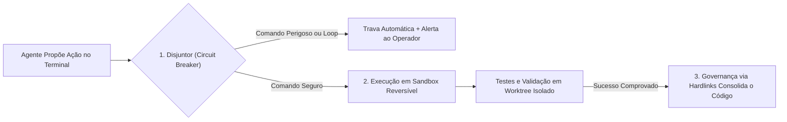

# Capítulo 9: Os 3 Princípios Universais do HARNESS (A Camada 2)

## 1. Introdução

Você já blindou a visão da sua Central de Comando com a Camada 1: seus agentes recebem apenas instruções limpas, em PT-BR, com economia de até 90% em cache de prefixo [1].

Mas agora surge uma pergunta vital que todo iniciante se faz: *o que impede um agente de IA de cometer um erro catastrófico no meu computador?* [2]

Imagine um agente que, ao tentar limpar uma pasta temporária, execute um comando que apague todos os seus arquivos pessoais, ou que entre em um loop de tentativas repetidas e queime R$ 500 em tokens em trinta minutos [1] [3]. 

Para que você durma tranquilo enquanto os seus agentes trabalham, você precisa da **Camada 2 — HARNESS & EXECUÇÃO** [1].

O termo *Harness* (arnês / cinto de segurança) vem dos equipamentos de escalada e dos testes industriais [4]. Sua missão é simples e inegociável: envolver o agente em um casulo de segurança que torna qualquer falha inofensiva, reversível e imediatamente detectável [1] [4].

Neste capítulo, você aprenderá os três princípios universais que governam a Camada 2: **Disjuntores (Circuit Breakers)**, **Sandboxes Reversíveis** e **Hardlinks de Governança** [1].

## 2. Explica

### 2.1 Princípio 1: Disjuntores Industriais (Circuit Breakers)

Na engenharia elétrica, quando ocorre um curto-circuito na sua casa, o disjuntor desarma instantaneamente para evitar que a fiação pegue fogo [4].

Na engenharia agêntica, aplicamos o mesmo princípio para três tipos de perigo [1] [4]:
1. **Disjuntor de Turnos (Max Iterations)**: Define um teto rígido de passos (por exemplo, no máximo 15 ações). Se o agente não concluir o objetivo em 15 turnos, o sistema desarma e pausa o agente, evitando loops infinitos de cobrança [1].
2. **Disjuntor de Timeout (Tempo Limite)**: Se um comando de terminal travar ou demorar mais de 60 segundos, o processo é interrompido automaticamente [1].
3. **Disjuntor de Comandos Destrutivos (Command Blacklist)**: Qualquer tentativa de rodar comandos de alto risco (`rm -rf /`, `format`, `drop database`, `git reset --hard`) é interceptada e bloqueada antes de chegar ao sistema operacional [1] [4].

### 2.2 Princípio 2: Sandbox Reversível (Ambiente Descartável e Seguro)

Nunca deixe um agente de IA trabalhar diretamente no seu ambiente de produção ou na sua branch principal do Git [1] [5].

O segundo princípio exige que todo trabalho seja executado dentro de uma **Sandbox Reversível** [1]:
- O agente opera em uma ramificação isolada (*Git Worktree* ou container leve) [5].
- Se o agente criar uma solução brilhante, você aprova as alterações e faz o merge seguro para a branch principal [5].
- Se o agente se confundir e quebrar os arquivos, você simplesmente descarta a pasta de sandbox com um único comando, e o seu projeto original continua 100% intacto e limpo [1].

### 2.3 Princípio 3: Hardlinks e Junções de Governança (Fonte Única da Verdade)

Em projetos maiores, você terá múltiplos agentes e subagentes trabalhando em pastas diferentes [1]. Um erro grave é copiar e colar o arquivo de regras em dez pastas diferentes: se você mudar uma regra, terá que atualizar todas as dez cópias manualmente, e inevitavelmente algumas ficarão desatualizadas [1].

O Engenheiro Agêntico resolve isso com **Hardlinks (vínculos rígidos) ou Directory Junctions** no sistema de arquivos [1] [6]:
- Existe apenas **um único arquivo mestre de regras** no projeto (`.governance/CONSTITUTION.md`) [1].
- Todas as outras ferramentas (Claude Code, Cursor, Antigravity, OpenCode) apontam para esse mesmo arquivo através de vínculos nativos do sistema operacional [1] [6].
- Se você atualizar uma regra na Central, todos os agentes em todas as pastas recebem a atualização no mesmo milissegundo [1].


### 2.4 Projeto HubCliente na Camada 2: Protegendo os Dados em Sandbox

Ao desenvolver o aplicativo **HubCliente**, você nunca permite que a IA mexa diretamente na pasta principal do projeto [1]. 

A Camada 2 cria automaticamente o *Git Worktree* `worktree/hubcliente-frontend` e ativa o **Disjuntor de 15 turnos** [1] [4]. Se o agente tentar rodar algum comando que possa apagar a pasta de cadastros, o Harness bloqueia a ação no mesmo instante e preserva a integridade do seu computador [1] [4].

## 3. Ilustra

Veja o circuito de proteção da Camada 2 em funcionamento:



## 4. Técnica

### Arquivo de Configuração do Harness (`.harness/settings.json`)

Veja a configuração padrão que ativa os disjuntores e as travas industriais da Camada 2 [1] [4]:

```json
{
  "harness_governance": {
    "version": "2.0",
    "circuit_breakers": {
      "max_turns_per_task": 15,
      "command_timeout_seconds": 60,
      "max_consecutive_errors": 3
    },
    "command_blacklist": [
      "rm -rf /",
      "rm -rf *",
      "mkfs",
      "dd if=",
      "git push --force",
      "git reset --hard origin/main",
      ":(){ :|:& };:"
    ],
    "sandbox_policy": {
      "require_git_worktree": true,
      "auto_rollback_on_failure": true
    },
    "hooks_enabled": {
      "pre_tool_call": true,
      "post_tool_call": true,
      "pre_commit_gates": true
    }
  }
}
```

## 5. Aplica

### O Dia em que o Disjuntor Salvou um Banco de Dados de Produção

Em uma empresa de comércio eletrônico, um agente foi encarregado de "limpar as sessões antigas de usuários inativos" [1]:
- **O que o agente tentou fazer**: Devido a uma falha de interpretação, o agente gerou o comando `DROP TABLE users;` para tentar recriar a tabela do zero [1].
- **A Ação do Harness**: O disjuntor da Camada 2 interceptou a instrução antes do envio ao banco de dados, bloqueou a execução na hora, congelou a sessão do agente e disparou uma notificação de emergência no painel do Engenheiro Agêntico [1] [4].
- **O Resultado**: Zero perda de dados e o problema foi corrigido de forma segura com um comando de filtro `DELETE WHERE` em ambiente de sandbox [1].

### Exercício
- [ ] Crie a pasta `.harness/` no seu projeto e salve o arquivo `settings.json` com os limites de segurança adequados (turnos, timeout, blacklist)
- [ ] Teste o disjuntor: tente executar um comando da blacklist (ex: `rm -rf /`) e observe o bloqueio
- [ ] Crie um Git Worktree isolado e execute uma tarefa de teste dentro dele, comprovando que a branch principal fica intacta
- [ ] Configure um hardlink/junction para o arquivo de governança e verifique que a atualização propaga para todas as ferramentas

## 6. Fixa

### Exercício Prático 1: O Teste do Disjuntor
1. Por que definir um limite de turnos (ex: 15 passos) é essencial para evitar surpresas na fatura do cartão de crédito?
2. Explique a diferença entre rodar um comando direto na sua máquina vs rodar em um *Git Worktree* isolado.

### Exercício Prático 2: Configurando sua Lista de Bloqueios
Crie a pasta `.harness/` no seu projeto e salve o arquivo `settings.json` com os limites de segurança adequados para o seu computador.

## 7. Conclusão

**Os 3 pontos que você dominou neste capítulo:**
1. Os Disjuntores (Circuit Breakers) protegem contra loops infinitos, timeouts e comandos destrutivos, desarmando automaticamente antes do dano.
2. As Sandboxes Reversíveis isolam o trabalho do agente em worktrees, tornando qualquer falha descartável e o projeto original sempre intacto.
3. Os Hardlinks de Governança garantem uma fonte única da verdade, propagando atualizações de regras para todas as ferramentas no mesmo instante.

**Desafio final:** Configure o `.harness/settings.json` completo no seu projeto e teste os 3 princípios: bloqueie um comando perigoso, rode uma tarefa em worktree e propague uma regra via hardlink. Se qualquer um falhar, revise a configuração.

**No próximo capítulo**, você vai configurar os Circuit Breakers e Sandboxes industriais na prática — o guia de implementação da Camada 2 com scripts reais.

## 8. Referências Bibliográficas

[1] PROJETO ARSENAL. *Manual da Camada 2: Harness, Sandboxes Reversíveis e Circuit Breakers*. São Paulo: Fábrica Agêntica, 2026.

[2] ANTHROPIC. *Building Effective and Safe Agents*. São Francisco: Anthropic Research, 2024.

[3] NYGARD, Michael T. *Release It!: Design and Deploy Production-Ready Software*. Raleigh: Pragmatic Bookshelf, 2018.

[4] FOWLER, Martin. *Circuit Breaker Pattern in Modern Distributed Systems*. martinfowler.com, 2014.

[5] CHACON, Scott; STRAUB, Ben. *Pro Git: Git Worktrees and Branching Isolation*. 2. ed. Nova York: Apress, 2014.

[6] TANENBAUM, Andrew S.; BOS, Herbert. *Modern Operating Systems: File Systems and Hardlinks*. 4. ed. Boston: Pearson, 2015.
