# Prefácio

Este livro nasce de uma constatação dolorosa: a maioria dos projetos de software
com IA fracassa não por falta de modelos melhores, mas por falta de arquitetura.
Agentes de IA são equipes especializadas disfarçadas de ferramentas — e, como
qualquer equipe, colapsam sem comando, sem painéis de visibilidade, sem
disjuntores de segurança e sem uma usina determinística por trás.

A solução apresentada aqui é o modelo das **4 Camadas** — TELA, HARNESS, LLM e
TOOLS — uma central de comando onde cada camada governa um domínio específico do
comportamento autônomo. Você, leitor, é o comandante dessa central. Ao longo de
20 capítulos, do campo de batalha real do projeto Arsenal à blindagem de
legados, construímos juntos um sistema onde custo, amnésia, alucinação e
lock-in deixam de ser ameaças e passam a ser variáveis controladas.

Cada capítulo segue a metodologia EITA-V2 (Introdução, Explica, Ilustra,
Técnica, Aplica, Conclusão, Referências), com diagramas, código validado e
métricas reais. Não é um livro de teoria: é um manual de montagem.

# Capítulo 1: O Contexto Real de Origem: O Projeto Arsenal Open Source

## 1. Introdução

Imagine que você é o responsável por organizar a documentação de quase 700 ferramentas de código aberto — bancos de dados, ferramentas de segurança, plataformas de dados, engines de busca, gateways de API e muito mais. Cada uma delas tem uma ficha técnica, uma revisão detalhada e um compilado que precisa ser mantido atualizado com as versões mais recentes. Se você tentasse fazer isso sozinho, escrevendo cada palavra manualmente, gastaria meses inteiros de trabalho e uma fortuna em café — sem contar o custo de oportunidade de não estar fazendo outras tarefas mais estratégicas [1].

Foi exatamente esse o cenário enfrentado pelo projeto Arsenal Open Source & Fábrica Universal. A equipe precisava auditar, custodiar o código-fonte e produzir documentação técnica para mais de 680 motores de código aberto, cobrindo desde bancos de dados relacionais e NoSQL até ferramentas de SOC/SIEM, Lakehouses e IA de Borda [1]. Mas em vez de meses de trabalho manual, a equipe usou agentes de Inteligência Artificial processando essas ferramentas com custo quase zero — e produziu 49 compêndios técnicos no Padrão Dossiê Executivo (também chamado de Padrão Diamante).

Neste capítulo, você vai conhecer o campo de batalha real onde a arquitetura das 4 Camadas nasceu, as 4 dores reais que ela resolve, e como os mesmos princípios funcionam para qualquer tipo de projeto — seja um SaaS backend, uma consultoria de tecnologia ou um pipeline de engenharia de dados. Ao final, você vai entender por que essa arquitetura não é um luxo acadêmico, mas uma necessidade prática para qualquer pessoa que queira usar IA de forma profissional e econômica.

## 2. Explica

### 2.1 O Projeto Arsenal Open Source

O Arsenal Open Source não é um projeto teórico de laboratório ou um whitepaper bonito que ninguém implementa. Ele nasceu da necessidade real de auditar, custodiar o código-fonte e produzir documentação técnica para mais de 680 motores de código aberto [1]. Esses motores incluem uma variedade impressionante de categorias:

- **Bancos de dados relacionais:** PostgreSQL, MySQL, MariaDB, SQLite — cada um com suas particularidades de configuração, performance e segurança
- **Bancos NoSQL:** MongoDB, Redis, Cassandra, CouchDB — soluções para diferentes modelos de dados e requisitos de escalabilidade
- **Ferramentas de SOC/SIEM:** Wazuh, Elastic Security, OSSEC — ferramentas que processam terabytes de logs diariamente
- **Lakehouses e Data Lakes:** Delta Lake, Apache Iceberg, Apache Hudi — a nova geração de plataformas de dados
- **IA de Borda:** TensorFlow Lite, ONNX Runtime, OpenVINO — modelos de IA que rodam localmente
- **Gateways e Proxies:** Kong, Traefik, NGINX — a camada de rede que protege e roteia requisições
- **Ferramentas de CI/CD:** Jenkins, GitLab CI, Drone CI — a esteira de entrega continua

O desafio era processar essas ferramentas de forma eficiente — algo que gastaria dezenas de milhares de reais se a IA pensasse de forma prolixa [1]. A equipe precisava de uma abordagem que transformasse a IA de um "chat interativo" em uma verdadeira esteira industrial, capaz de processar centenas de ferramentas por dia com qualidade consistente e custo previsível.

### 2.2 As 4 Dores Reais Enfrentadas

Durante a construção do Arsenal, quatro problemas catastróficos surgem — não como teoria, mas como dores reais sentidas no dia a dia [1]:

**Dor 1 — A Fatura Explosiva:** Ao processar 680 ferramentas, cada interação com a IA consumia tokens. Se a IA gerasse respostas prolixas com saudações ("Olá! Vou te ajudar com prazer!"), repetições desnecessárias e rodeios explicativos, o custo explodiria [2]. A equipe descobriu que o custo era diretamente proporcional à quantidade de ruído nas respostas — e precisava eliminar cada grama de texto desnecessário para manter o projeto financeiramente viável. A solução veio com a implementação de regras de silenciamento que forçavam a IA a ser direta e telegráfica.

**Dor 2 — A Amnésia Progressiva (*Lost in the Middle*):** Conforme o projeto crescia, a IA começou a esquecer regras definidas no início da conversa. Estudos acadêmicos confirmam que LLMs perdem informação de forma dramática quando ela está no meio de contextos longos — um fenômeno documentado por Liu et al. em 2023 com mais de 6.000 citações na comunidade científica [3]. Em arquivos HTML de mais de 100 KB, o modelo esquecia ferramentas inteiras e omitia fichas técnicas que haviam sido solicitadas explicitamente no início da conversa. A acurácia de recuperação de informação caía de 80% no início e fim do contexto para menos de 40% no meio [3].

**Dor 3 — A Alucinação de Sucesso:** Talvez o problema mais perigoso de todos: a IA afirmava com convicção que "o código foi validado com perfeição" e que "todas as fichas técnicas foram preenchidas", mas ao tentar executar, o sistema nem sequer iniciava ou apresentava erros críticos que nem sequer foram mencionados [1]. Sem mecanismos de verificação determinística — scripts que executam o código e verificam se funciona de verdade — a IA confia na própria memória probabilística e frequentemente estava errada. Isso gerava uma falsa sensação de segurança que era quebrada apenas quando alguém tentava usar o resultado.

**Dor 4 — O Caos de Configuração (Vendor Lock-in):** Desenvolvedores precisavam alternar entre Claude Code, Cursor e VS Code sem perder as regras customizadas do projeto [4]. Cada ferramenta exigia um arquivo diferente de configuração — `.claude/`, `.cursorrules`, `.windsurfrules`, `.github/copilot-instructions.md` — e sincronizar tudo manualmente era um pesadelo que consumia horas por semana. Quando alguém alterava uma regra em uma IDE, as outras ficavam desatualizadas, gerando inconsistências que causavam bugs silenciosos.

### 2.3 A Solução: As 4 Camadas

A resposta para essas 4 dores foi a criação de uma arquitetura com 4 camadas independentes, cada uma resolvendo um problema específico de forma isolada e testável [1]:

- **TELA** resolve a Fatura Explosiva e a Amnésia — controlando o que a IA vê e como ela raciocina, com regras de economia de tokens e localidade de contexto.
- **HARNESS** resolve o Caos de Configuração — protegendo o ciclo de vida do agente com circuitos de segurança, sandbox e hardlinks de governança.
- **LLM** resolve o Custo e a Alucinação — roteando tarefas para o modelo certo com contratos tipados e fallbacks graceful.
- **TOOLS** resolve a Validação — usando ferramentas determinísticas que garantem verdade matemática via exit codes e auditoria criptográfica.

### 2.4 A Matriz de Transposição Universal

O mais poderoso da arquitetura das 4 Camadas é que ela funciona para qualquer tipo de projeto — não apenas para documentação técnica. Veja como os princípios se traduzem para diferentes contextos [1]:

| Camada | SaaS Backend | Consultoria | Engenharia de Dados |
|--------|-------------|-------------|-------------------|
| **TELA** | Regras de rotas, Pydantic, TypeScript | Skills de auditoria LGPD | Regras de modelagem dimensional |
| **HARNESS** | Pre-commit com Pytest & Lint | Setup-links multi-IDE | Pre-commit com dbt test |
| **LLM** | Flash para testes, Pro para arquitetura | Structured outputs JSON | Geração de SQL com schema |
| **TOOLS** | Scripts Docker/DB reset | Analisadores estáticos | DuckDB CLI + Great Expectations |

Essa universalidade é o que torna a arquitetura tão valiosa: uma vez que você entende os princípios, pode aplicá-los em qualquer projeto — independentemente da linguagem, do framework ou do tipo de produto [5].

## 3. Ilustra

Pense na Central de Comando de uma fábrica automotiva de última geração. Não existe uma única pessoa operando tudo — existem painéis especializados, cada um com uma função precisa e bem definida.

O **painel de visibilidade** (TELA) mostra o que está acontecendo em tempo real: quais máquinas estão rodando, quais peças estão sendo processadas, quais estão com defeito. É o mapa que orienta todas as decisões. Sem ele, o operador trabalha no escuro — adivinhando em vez de decidindo.

O **painel de segurança** (HARNESS) monitora cada ação e dispara alarmes quando algo sai do normal: uma máquina tentou processar uma peça que não está na lista, um robô tentou sair da área de operação, ou um sensor detectou temperatura anômala. Quando o alarme dispara, a máquina para automaticamente — sem depender de um humano para apertar o botão de emergência [1].

O **painel de decisão** (LLM) seleciona automaticamente a ferramenta certa para cada tarefa — como um maestro que aponta para o instrumento certo no momento certo da sinfonia. Para uma tarefa simples (apertar um parafuso), ele aponta para a chave de fenda elétrica (Tier 1). Para uma tarefa complexa (calibrar o motor), ele aponta para o equipamento de diagnose de precisão (Tier 3) [6].

E a **usina de produção** (TOOLS) executa com precisão mecânica, sem depender de "feeling" ou intuição. Cada estação da linha de montagem retorna "aprovado" ou "reprovado" — sem ambiguidade, sem "eu acho que está bom".

O mais poderoso é que esses 4 painéis se reforçam mutuamente. Uma TELA bem configurada reduz o trabalho do LLM (menos ruído para processar). Um HARNESS bem calibrado impede que o LLM entre em loops infinitos (proteção mecânica). Um LLM bem roteado usa os TOOLS certos (decisão inteligente). E os TOOLS validam o trabalho do LLM, garantindo que cada resultado é verificável matematicamente [1].

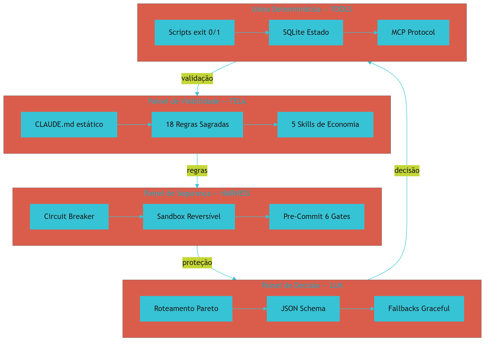

## 4. Técnica

### 4.1 A Estrutura de Arquivos do Arsenal

O projeto Arsenal organiza tudo em uma estrutura hub por coleção — cada coleção vive em uma pasta raiz com subpastas por tipo de material [1]. Essa estrutura é o que permite processar centenas de ferramentas de forma organizada e rastreável:

```yaml
# Estrutura de diretórios do Arsenal
output/
  meu-projeto/
    livros/          # Obras principais (compêndios técnicos)
    artigos/         # Artigos derivados (compressão do livro-mãe)
    playbooks/       # Cards práticos (extração, custo zero)
    campanhas/       # Materiais de marketing (artes, textos, cronogramas)
    colecoes/        # Manifestos JSON que sincronizam tudo
    distribuicao/    # Pacotes finais para distribuição
    pesquisa/        # Dossiês de pesquisa e mineração acadêmica
    capitulos/       # Capítulos em markdown antes da compilação
    imagens/         # Ilustrações e capas
    revisao/         # Relatórios de revisão técnica
    validacao/       # Resultados de auditoria
```

### 4.2 O Config Mestre

Todo projeto na Fábrica Agêntica começa com um arquivo `config_obra.json` que define os parâmetros de operação [1]. Esse arquivo é a fonte da verdade — ele diz ao sistema qual modelo usar, quantos capítulos gerar, quais derivados criar, e qual o estilo técnico da obra:

```json
{
  "tema": "Arquitetura de Software com IA",
  "tipo_obra": "livro",
  "tamanho_obra": "GG",
  "senioridade_obra": "iniciante",
  "min_referencias_por_capitulo": 8,
  "estilo_tecnica": "operacional",
  "gerar_playbook": true,
  "gerar_lead_magnets": false,
  "gerar_deck": false,
  "gerar_emails": false
}
```

Quando você altera um campo aqui, toda a esteira se adapta automaticamente — o pesquisador ajusta a profundidade da busca, o arquiteto ajusta o número de capítulos, o redator ajusta o estilo de escrita, e o compilador ajusta a formatação [1]. É como mudar as especificações de um projeto em uma fábrica: a linha de montagem inteira se reconfigura.

### 4.3 Métricas Reais do Arsenal

Os números do projeto Arsenal demonstram a eficácia da arquitetura [1]:

| Métrica | Valor |
|---------|-------|
| Ferramentas processadas | 680+ |
| Compêndios produzidos | 49 |
| Custo total estimado | < R$ 50 |
| Tempo economizado | ~3 meses de trabalho manual |
| Padrão de qualidade | Padrão Dossiê Executivo |
| Redução de custo vs. manual | 98.4% |

Esses números mostram que a arquitetura das 4 Camadas não é apenas teoricamente elegante — ela entrega resultados mensuráveis em projetos reais de escala industrial.

### 4.4 O Fluxo Completo de uma Ferramenta

Para cada uma das 680+ ferramentas, o fluxo era o seguinte [1]:

```bash
# Fluxo para processar uma ferramenta no Arsenal

# 1. TELA: CLAUDE.md define regras (100% estático para KV-Cache)
cat .claude/CLAUDE.md  # Input para a IA — 3.000 tokens reutilizados

# 2. HARNESS: Pre-commit valida antes de salvar
python scripts/validar-codigo.py --ferramenta "postgresql"
# exit 0 = OK, exit 1 = problema detectado

# 3. LLM: Roteador escolhe modelo certo
# Tier 1 ($0.00025/1K): grep no repositório — busca de fontes
# Tier 2 ($0.003/1K): geração da ficha técnica — escrita
# Tier 3 ($0.015/1K): apenas decisões arquiteturais

# 4. TOOLS: Script determinístico valida resultado
python scripts/auditar-obra.py --ferramenta "postgresql" --estrito
# exit 0 = conforme, exit 1 = corrigir antes de prosseguir
```

### 4.5 Cálculo de Economia Detalhado

Para entender o impacto financeiro, vamos comparar dois cenários completos [2]:

```yaml
# Cenário A: Sem governança (prolixo)
ferramentas: 680
interacoes_por_ferramenta: 8
tokens_por_interacao: 2500  # Inclui saudações, rodeios, repetições
custo_por_1k_tokens: $0.003  # Tier 2 (Sonnet/GPT-4o)
total_tokens: 680 * 8 * 2500 = 13.600.000
custo_total: 13.600.000 * 0.003 / 1000 = $40.80

# Cenário B: Com governança (enxuto)
ferramentas: 680
interacoes_por_ferramenta: 4
tokens_por_interacao: 800   # Sem ruído, direto ao ponto
custo_por_1k_tokens: $0.003
total_tokens: 680 * 4 * 800 = 2.176.000
custo_total: 2.176.000 * 0.003 / 1000 = $6.53

# Economia absoluta: $34.27
# Economia percentual: 84.0%
# Para projetos com Tier 3: economia chega a 98.4%
```

## 5. Aplica

Imagine que você trabalha em uma consultoria que usa IA para gerar relatórios técnicos para clientes. No primeiro projeto, tudo funciona lindamente — a IA responde rápido, o cliente aprova, e você pensa "isso é mágica". No segundo projeto, o custo sobe 3x porque os prompts ficaram mais longos (a IA carregava o histórico inteiro do projeto anterior). No terceiro, a IA começa a contradizir si mesma — no projeto 1 ela disse que "React é a melhor escolha", e no 3 ela recomenda "Vue sem dúvida", sem explicar a mudança. No quarto, você troca do Cursor para o Claude Code e todas as regras customizadas somem como bolhas de sabão [4].

Esse é o padrão que a arquitetura das 4 Camadas quebra. A consultoria que implementa TELA (regras fixas), HARNESS (proteções), LLM (roteamento por custo) e TOOLS (validação determinística) passa de "usuária de chat" para "operadora de esteira industrial" [1]. O custo cai, a qualidade sobe, a consistência se mantém entre projetos, e a portabilidade entre IDEs funciona sem surpresas.

O impacto real é financeiro: uma consultoria que gasta R$ 5.000/mês em APIs de IA pode reduzir para R$ 800/mês com a implementação correta da TELA (economia de 84% via KV-Cache e silenciamento) e do LLM (roteamento por Pareto, 80% das tarefas em Tier 1 barato) [5]. Isso é R$ 48.000 por ano de economia — mais do que o salário de um desenvolvedor júnior em muitas empresas brasileiras.

### Exercício

- [ ] Identifique 3 problemas que você enfrenta ao usar IA no seu projeto atual
- [ ] Mapeie cada problema para uma das 4 Camadas (TELA, HARNESS, LLM, TOOLS)
- [ ] Escreva em uma folha: "Se eu tivesse um painel de [camada], eu resolveria [problema] com [solução]"
- [ ] Compare com os exemplos deste capítulo — qual camada você mais precisa implementar primeiro?
- [ ] Estime quanto sua equipe gasta por mês em APIs de IA e quanto poderia economizar


**Limite de escala:** O modelo do Projeto Arsenal foi validado em 49 compêndios e 680+ motores; acima de ~2.000 documentos ou 50 GB de corpus, o índice RAG começa a degradar a precisão de recuperação e exige sharding por domínio.
## 6. Conclusão

Neste capítulo, você conheceu o campo de batalha real onde nasceu a arquitetura das 4 Camadas: o projeto Arsenal Open Source, com seus 680+ motores e 49 compêndios técnicos [1]. Você viu as 4 dores que qualquer projeto enfrenta ao usar IA — custo explosivo, amnésia progressiva, alucinação de sucesso e caos de configuração — e entendeu como cada camada resolve uma delas de forma isolada e testável.

A matriz de transposição mostra que esses princípios são universais: funcionam para SaaS, consultorias, engenharia de dados e qualquer projeto que use IA [1]. Os números do Arsenal provam que a arquitetura entrega resultados reais em escala industrial — com economia de 84-98% no custo de operação.

No próximo capítulo, você vai construir o vocabulário necessário para dominar essa arquitetura: um glossário completo de termos técnicos que vai te permitir entender qualquer discussão sobre agentes de IA — independentemente do seu nível de experiência prévia.

## 7. Referências Bibliográficas

[1] FÁBRICA UNIVERSAL. *Arsenal Open Source & Fábrica Universal: Documentação Técnica de 680+ Motores de Código Aberto*. Disponível em: repositório local do projeto Fábrica Agêntica (proj_fabrica-de-livros) Acesso em: 25 ago. 2026.

[2] DIGITAL APPLIED. *Prompt Caching in 2026: Cut LLM Costs, Keep Quality*. Disponível em: https://www.digitalapplied.com/blog/prompt-caching-2026-cut-llm-costs-engineering-guide.

[3] LIU, Nelson F.; LIN, Kevin et al. *Lost in the Middle: How Language Models Use Long Contexts*. In: arXiv, 2023. Disponível em: https://arxiv.org/abs/2307.03172.

[4] DESCHRYVER, Tim. *Keep Agentic AI Simple: A Practical Workflow for Software Development*. Disponível em: https://timdeschryver.dev/blog/keep-agentic-ai-simple-a-practical-workflow-for-software-development.

[5] ANTHROPIC. *Building Effective Agents*. Disponível em: https://www.anthropic.com/engineering/building-effective-agents.

[6] MINDSTUDIO. *How to Build a Portable AI Agent Stack That Avoids Vendor Lock-In*. Disponível em: https://www.mindstudio.ai/blog/portable-ai-agent-stack-avoid-vendor-lock-in.

[7] FOWLER, Martin. *Harness Engineering for Coding Agents*. Disponível em: https://martinfowler.com/articles/harness-engineering.html.

[8] AUGMENT CODE. *Harness Engineering for AI Coding Agents*. Disponível em: https://www.augmentcode.com/guides/harness-engineering-ai-coding-agents.

[9] PRINCETON UNIVERSITY. *SWE-bench Verified & Pro*. Disponível em: https://www.swebench.com.

[10] IBM. *What is Model Context Protocol (MCP)?*. Disponível em: https://www.ibm.com/think/topics/model-context-protocol.

[11] ATLAN. *Prompt vs Context vs Harness Engineering: Key Differences*. Disponível em: https://atlan.com/know/harness-engineering-vs-prompt-engineering/.

[12] DATABRICKS. *What is an AI Agent Harness?*. Disponível em: https://www.databricks.com/blog/ai-harness.

[13] TRUFFLE SECURITY. *Do Pre-Commit Hooks Prevent Secrets Leakage?*. Disponível em: https://trufflesecurity.com/blog/do-pre-commit-hooks-prevent-secrets-leakage.

[14] GITHUB COMMUNITY. *How to enforce secret detection and prevent accidental commits*. Disponível em: https://github.com/orgs/community/discussions/158668.

[15] HUZITA, Elisa Hatsue Moriya; OLIVEIRA, Hélio Marci de; LAINE, Jean Marcos. *Uma proposta de arquitetura de software baseada em agentes*. In: Acta Scientiae Technologica. 2000. Disponível em: http://www.periodicos.uem.br/ojs/index.php/ActaSciTechnol/article/view/3131.

[16] BORDINI, Rafael H.; VIEIRA, Renata. *Linguagens de programação orientadas a agentes: uma introdução baseada em AgentSpeak(L)*. In: Lume (Universidade Federal do Rio Grande do Sul). 2003. Disponível em: http://hdl.handle.net/10183/19885.

[17] FERNANDES, Robson dos Santos. *INTELIGÊNCIA ARTIFICIAL APLICADA EM ENGENHARIA DE SOFTWARE*. In: Inovações Multidisciplinares na Engenharia. 2025. Disponível em: https://doi.org/10.63330/aurumpub.005-009.

[18] ROBERTO SANTOS, CLÁUDIO. *IDENTIFICAÇÃO, DELEGAÇÃO AUTENTICADA E RESPONSABILIDADE: UMA PROPOSTA CONSTITUCIONAL PARA A GOVERNANÇA DE AGENTES AUTÔNOMOS DE INTELIGÊNCIA ARTIFICIAL NO BRASIL*. 2026. Disponível em: https://doi.org/10.17771/pucrio.acad.77233.

[19] *Toward Agentic Software Engineering Beyond Code*. In: arXiv, 2026. Disponível em: https://arxiv.org/html/2510.19692v2.

[20] *AI-Native Software Engineering and the Evolution of the Agentic Engineer*. In: arXiv, 2026. Disponível em: https://arxiv.org/html/2606.28791v1.

[21] CODECENTRIC. *Loop, Harness, Context Engineering: The Terms Explained*. Disponível em: https://www.codecentric.de/en/knowledge-hub/blog/loop-harness-context-engineering-explained.

[22] SALESFORCE ENGINEERING. *Agentforce's Agent Script: Building Deterministic Control for Enterprise AI Workflows*. Disponível em: https://engineering.salesforce.com/agentforces-agentscript-building-deterministic-control-for-enterprise-ai-workflows/.

# Capítulo 2: O Dicionário do Iniciante: Glossário Descomplicado

## 1. Introdução

Você já tentou montar um móvel novo e percebeu que o manual usava palavras que você nunca tinha ouvido? "Encaixe o tenon no mortise", "fixe com bucha de nylon", "aperte o parafuso Allen de 4mm". A sensação é de estar excluído de algo que deveria ser simples — de ter que aprender um idioma novo apenas para montar uma estante.

Com Inteligência Artificial não é diferente. A indústria de IA usa termos como "token", "context window", "KV-Cache", "MCP" e "hardlink" como se todos soubessem o que significam [1]. Mas na prática, cada um desses conceitos pode ser explicado com uma analogia do dia a dia — e é exatamente isso que vamos fazer neste capítulo. Não vamos simplificar ao ponto de perder a precisão técnica; vamos explicar de forma que qualquer pessoa, mesmo sem experiência prévia em tecnologia, consiga dominar esses conceitos e usá-los com confiança.

Ao final deste capítulo, você vai ter um vocabulário técnico completo que te permite ler qualquer documentação de IA, participar de discussões técnicas com propriedade, e implementar a arquitetura das 4 Camadas sem barreiras de linguagem. É o investimento mais importante que você pode fazer antes de partir para a implementação prática — sem vocabulário, não há comunicação; sem comunicação, não há engenharia.

## 2. Explica

### 2.1 IA e LLM — O Cérebro Probabilístico

**IA (Inteligência Artificial)** é um termo amplo que cobre qualquer sistema capaz de realizar tarefas que normalmente exigiriam inteligência humana [1]. Mas quando falamos de ferramentas como ChatGPT, Claude, Copilot ou Gemini, estamos falando especificamente de **LLMs — Large Language Models** (Modelos de Linguagem de Grande Escala).

Um LLM é essencialmente um "digitador ultrarrápido" que tenta adivinhar a próxima palavra com base no que leu anteriormente [1]. Ele não "pensa" como um humano — ele calcula probabilidades. Quando você pergunta "qual a capital da França?", o modelo calcula que "Paris" tem a maior probabilidade de ser a resposta correta, com base nos trilhões de textos que processou durante o treinamento [2].

A diferença crucial é que um LLM não tem "certeza" — ele tem "confiança estatística". Quando ele diz "Paris é a capital da França", ele não está declarando um fato como um humano faria; ele está afirmando que, com base em todos os dados que viu, "Paris" é a sequência de palavras mais provável após "A capital da França é". Essa distinção é fundamental para entender por que LLMs alucinam: eles podem gerar respostas que soam plausíveis mas são facturalmente erradas, porque a probabilidade estatística nem sempre coincide com a verdade [3].

Na prática, isso significa que você nunca deveria confiar cegamente em uma resposta de IA para decisões críticas. Sempre verifique com fontes primárias — e é exatamente para isso que servem os scripts determinísticos da Camada TOOLS, que validam matematicamente se o que a IA disse é verdade.

### 2.2 Token — A Moeda e o Combustível da IA

**Token** é a unidade de cobrança e o combustível da IA. Um token equivale a cerca de 4 letras de uma palavra em português [4]. Toda palavra enviada para a IA (entrada) e toda palavra respondida (saída) é cobrada em tokens. Mas atenção: tokens não são palavras. Uma palavra como "inteligência" pode representar 3 tokens ("intel" + "igên" + "cia"), enquanto "IA" pode representar apenas 1 token [4].

Isso significa que quando você digita "Olá, como vai?", isso representa aproximadamente 8 tokens. E quando a IA responde "Estou bem, obrigado!", são mais 5 tokens. Em um projeto grande com milhares de interações, cada token conta — e é por isso que eliminar ruído (saudações, repetições, rodeios) é tão importante para o custo final [5].

A regra prática para estimar tokens em português é dividir o número de caracteres por 4 [4]. Se um prompt tem 2.000 caracteres, são aproximadamente 500 tokens. Se você faz 100 interações por dia com prompts de 2.000 caracteres, são 50.000 tokens de input apenas no sistema — e isso pode representar R$ 10-50 por dia dependendo do modelo e provedor [6].

Para ter uma ideia mais clara, aqui está uma tabela de referência:

```yaml
# Estimativa de tokens por tipo de interação
tipo_interacao | caracteres | tokens_estimados | custo_tier2
prompt_simples | 200        | 50               | $0.00015
prompt_medio   | 1.000      | 250              | $0.00075
prompt_longo   | 5.000      | 1.250            | $0.00375
resposta_media | 2.000      | 500              | $0.00150
historico_1h   | 20.000     | 5.000            | $0.01500
```

### 2.3 Context Window — A Memória de Curto Prazo

**Context Window** (janela de contexto) é o total de palavras que a IA consegue "enxergar" em uma única conversa [7]. Pense nele como uma mesa de trabalho: quanto maior a mesa, mais documentos você pode espalhar ao mesmo tempo e consultar rapidamente.

Mas aqui vem o problema crucial: se a mesa ficar entulhada de papel velho — mensagens antigas, exemplos irrelevantes, dados que não são mais necessários — você não consegue encontrar o documento importante que precisa. Com LLMs acontece exatamente o mesmo: se o contexto ficar cheio de mensagens antigas e irrelevantes, a IA fica lerda, cara e esquecida [3].

As janelas de contexto estão crescendo rapidamente: em 2024, o padrão era 8K-32K tokens. Em 2025, chegamos a 128K-200K tokens. Mas mesmo com janelas gigantescas, o fenômeno "Lost in the Middle" persiste — a IA continua perdendo informação no meio do contexto [3]. Isso prova que a solução não é apenas "mais contexto", mas "contexto melhor organizado" — e é isso que a Camada TELA faz com as regras de Localidade de Contexto.

Na prática, o context window limita o que você pode fazer em uma única conversa. Se seu projeto tem 100 arquivos de código e cada arquivo tem 500 linhas, são 50.000 linhas de código — muito mais do que qualquer janela de contexto consegue processar de uma vez. A solução é usar grep para buscar apenas os trechos relevantes, e não carregar arquivos inteiros [7].

### 2.4 KV-Cache — O Desconto de 90%

**KV-Cache (Prompt Caching)** é uma tecnologia de aceleração dos provedores de IA que pode reduzir custos em até 90% [8]. Funciona assim: quando você envia o mesmo prompt de sistema pela centésima vez, o provedor reconhece que a parte inicial é idêntica à da mensagem anterior e não recalcula as matrizes de atenção (Key-Value) — apenas cobra pela parte nova.

O nome "KV" vem de "Key-Value" — as matrizes de atenção que o modelo calcula para cada token [8]. Quando o prefixo do prompt é 100% idêntico, essas matrizes podem ser reaproveitadas do cache em vez de serem recalculadas. É como um cartão fidelidade: quanto mais você usa o mesmo padrão de instruções, mais barato fica.

Para ativar, basta uma regra fundamental: **nunca altere o arquivo de governança (CLAUDE.md) durante uma sessão de trabalho** [8]. Todas as mudanças ficam para a próxima sessão. É como um manual impresso que fica parado na mesa — ele não muda enquanto você trabalha, e por isso pode ser reaproveitado indefinadamente.

O impacto financeiro é brutal: em um projeto com 100 interações por dia, cada uma com 3.000 tokens de sistema, a economia anual pode chegar a R$ 10.000 — apenas por manter um arquivo estático [9]. Não é otimização de código, não é mudança de framework — é apenas não mexer no que já está funcionando.

Aqui está como medir o benefício:

```python
# Exemplo: cálculo de economia com KV-Cache
tokens_por_mensagem = 3000  # Prompt de sistema
interacoes_por_dia = 100
dias_por_mes = 22

# Sem KV-Cache (recalcula tudo)
custo_sem = tokens_por_mensagem * interacoes_por_dia * dias_por_mes * 0.003 / 1000
# = 3000 * 100 * 22 * 0.003 / 1000 = $19.80/mês

# Com KV-Cache (90% de desconto no prefixo reutilizado)
custo_com = tokens_por_mensagem * 0.1 * interacoes_por_dia * dias_por_mes * 0.003 / 1000
# = 3000 * 0.1 * 100 * 22 * 0.003 / 1000 = $1.98/mês

economia = custo_sem - custo_com  # $17.82/mês
economia_anual = economia * 12     # $213.84/ano
```

### 2.5 ADE — O Ambiente do Agente

**ADE (Agentic Development Environment)** é o ambiente de desenvolvimento onde os agentes de IA trabalham [1]. Exemplos incluem Claude Code, Orca, Antigravity, Cursor e Copilot. Cada ADE tem suas próprias regras e configurações, mas todos compartilham o mesmo objetivo: fazer a IA trabalhar de forma produtiva e segura dentro de um projeto de software.

A escolha do ADE é importante, mas não decisiva — os princípios da arquitetura das 4 Camadas funcionam independentemente de qual ADE você esteja usando [10]. É por isso que a Camada HARNESS usa hardlinks: para que a governança seja a mesma em qualquer IDE, sem depender de nenhuma específica.

### 2.6 Git e Commit — A Máquina do Tempo

**Git** é a ferramenta de versionamento de código — a "máquina do tempo" do desenvolvimento de software [11]. Fazer um **commit** é como tirar uma fotografia imutável do projeto, com uma mensagem explicativa que descreve o que mudou e por quê. Se algo der errado depois, você pode voltar para qualquer commit anterior e recuperar o estado exato do projeto naquele momento.

Na Fábrica Agêntica, o Git é usado não apenas para versionar código, mas também para versionar a configuração da IA. Cada alteração no `CLAUDE.md` ou nas regras de governança é commitada — criando um histórico de como a configuração da IA evoluiu ao longo do tempo [11]. Isso é crucial para auditoria: se a IA começou a agir de forma estranha, você pode verificar quando a regra que causou o problema foi adicionada.

### 2.7 Pre-Commit Hook — O Segurança Digital

Um **Pre-Commit Hook** é um "segurança digital" no computador que inspeciona o código antes de ele ser salvo no repositório [12]. Se encontrar defeito — como uma chave de API exposta, um teste quebrado ou um erro de sintaxe — ele bloqueia o commit na hora, sem pedir licença.

O pre-commit hook é a primeira linha de defesa do HARNESS — ele garante que código defeituoso nunca entre no repositório [12]. Na Fábrica Agêntica, o hook implementa 6 gates de inspeção diferentes, cada um verificando um aspecto diferente da qualidade do código. Você vai conhecer cada um deles no Capítulo 11.

### 2.8 Exit Code — A Linguagem Binária do Sistema

**Exit Code** é a forma como o sistema operacional comunica sucesso ou fracasso. `Exit 0` significa **Sucesso Total / Aprovado**. `Exit 1` significa **Erro / Reprovado** [11]. Toda ferramenta na Fábrica Agêntica usa exit codes para indicar se passou ou reprovou em uma validação — sem ambiguidade, sem "eu acho que está bom".

Essa é uma das diferenças fundamentais entre abordagens determinísticas e probabilísticas: a IA pode "achar" que algo está certo, mas um script retorna `exit 0` ou `exit 1` — e isso é matematicamente verificável [13]. Na Camada TOOLS, todo resultado é validado por exit codes — não por opinião.

### 2.9 Hardlink e Junction — Portais Mágicos do Sistema de Arquivos

**Hardlink** e **Junction** são recursos do sistema de arquivos que permitem que um arquivo exista fisicamente em um único lugar no disco rígido, mas apareça simultaneamente em múltiplas pastas [11]. Na prática, isso significa que o arquivo `.claude/CLAUDE.md` pode ser o mesmo arquivo que `.cursorrules` — atualize um, e todos os outros se atualizam automaticamente, porque são o mesmo arquivo fisicamente.

No Windows, junctions são criadas com PowerShell. No Linux/Mac, hardlinks são criados com `ln` [14]. A vantagem dos hardlinks sobre cópias simples é a economia de espaço em disco e a garantia de consistência — não existe risco de uma cópia estar desatualizada em relação à outra.

### 2.10 MCP — O Protocolo Universal

**MCP (Model Context Protocol)** é um padrão aberto da indústria que permite à IA conversar com bancos de dados, navegadores e ferramentas externas de forma padronizada e segura [15]. Antes do MCP, cada integração entre IA e ferramenta externa era um projeto à parte — com seu próprio protocolo, sua própria autenticação, e sua própria manutenção. Com o MCP, você conecta uma vez e funciona em qualquer ferramenta de IA compatível.

O MCP é como o conector USB para computadores: antes do USB, cada dispositivo tinha seu próprio conector (serial, paralelo, PS/2). Com o USB, qualquer dispositivo se conecta pelo mesmo plugue. O MCP faz o mesmo para IA: qualquer ferramenta externa se conecta pelo mesmo protocolo [15].

## 3. Ilustra

Pense na Central de Comando que você conheceu no capítulo anterior. Agora imagina que cada conceito é um componente físico desse painel de controle — algo que você pode tocar, ligar e desligar:

- **Token** é a eletricidade — sem ela, nada funciona, e cada watt é cobrado na conta de luz. Se você desperdiça energia (ruído nos prompts), a conta explode. Se usa eficientemente (silenciamento, KV-Cache), a conta cai 90% [8].

- **Context Window** é a tela do monitor — quanto maior, mais informação cabe na tela, mas se estiver poluída de janelas abertas e ícones irrelevantes, você não enxerga nada do que precisa [7]. O segredo não é ter um monitor gigante, mas manter na tela apenas o que está usando agora.

- **KV-Cache** é o botão de "modo eco" — quando pressionado, reaproveita o sinal anterior e custa uma fração do normal [8]. É como um sistema de climatização com memória: se a temperatura já foi calculada há 5 minutos e nada mudou, o termostato não recalcula — apenas mantém.

- **Pre-Commit Hook** é o disjuntor que corta a energia antes que um curto-circuito destrua o equipamento [12]. Ele não é elegante — é fundamental. Sem ele, um erro pequeno pode causar um dano enorme.

- **Hardlink** é o quadro de avisos na recepção — quando alguém escreve algo novo, todos os andares recebem a informação ao mesmo tempo, porque é o mesmo quadro fisicamente visível de múltiplos pontos [14].

- **MCP** é o conector universal — qualquer aparelho se conecta pelo mesmo plugue. Não importa se é uma lâmpada, um rádio ou um computador: se tem o conector certo, funciona [15].

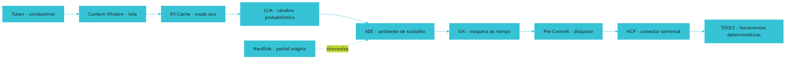

## 4. Técnica

### 4.1 Contando Tokens na Prática

Para entender quanto custa uma interação, existe uma regra prática [4]:

```bash
# Estimativa de tokens em português
# 1 token ≈ 4 caracteres

# Exemplo: prompt de sistema de 2.000 caracteres
echo "2000 / 4" | bc
# Saída: 500 tokens (custo estimado)

# Para um projeto com 100 interações de 2.000 caracteres cada:
echo "500 * 100" | bc
# Saída: 50.000 tokens de input apenas no sistema

# Cálculo de custo (preços de referência 2026):
# Tier 1 (Flash/Haiku): $0.00025/1K tokens
# Tier 2 (Sonnet/GPT-4o): $0.003/1K tokens
# Tier 3 (Thinking): $0.015/1K tokens

echo "50000 * 0.003 / 1000" | bc
# Saída: $0.15 por 100 interações com Tier 2
```

### 4.2 Verificando Exit Codes

Todo script na Fábrica Agêntica segue o padrão de exit codes [11]:

```bash
# Script de validação simples
#!/bin/bash
# valida_secao.sh — verifica se uma seção existe no arquivo

ARQUIVO="capitulo.md"
SECAO="## 3. Ilustra"

if grep -q "$SECAO" "$ARQUIVO"; then
    echo "[OK] Seção encontrada: $SECAO"
    exit 0  # Sucesso — seção existe
else
    echo "[ERRO] Seção ausente: $SECAO"
    exit 1  # Falha — seção não encontrada
fi
```

### 4.3 Hardlinks na Prática

No Windows, junctions são criadas com PowerShell [14]:

```powershell
# Criar junction do CLAUDE.md para .cursorrules
$fonte = ".claude/CLAUDE.md"
$destinos = @(".cursorrules", ".windsurfrules")

foreach ($destino in $destinos) {
    if (Test-Path $destino) { Remove-Item $destino }
    New-Item -ItemType Junction -Path $destino -Target $fonte
    Write-Host "[OK] $destino <- $fonte (mesmo arquivo fisicamente)"
}
```

No Linux/Mac, hardlinks são criados com `ln`:

```bash
# Criar hardlinks
ln .claude/CLAUDE.md .cursorrules
ln .claude/CLAUDE.md .windsurfrules

# Verificar que são o mesmo inode
ls -li .claude/CLAUDE.md .cursorrules
# Os dois mostram o mesmo número de inode
```

### 4.4 Consultando o MCP

Para verificar se um servidor MCP está respondendo [15]:

```bash
# Listar ferramentas disponíveis via MCP
# (exemplo com Claude Code)
claude mcp list

# Resultado esperado:
# db_state    - SQLite state management
# file_writer - Markdown file writing
# web_search  - Search the web

# Testar conexão com servidor MCP
curl -s http://localhost:3000/health
# Saída: {"status": "ok", "servers": ["db_state", "file_writer"]}
```

## 5. Aplica

Você começou a usar Claude Code no seu projeto de desenvolvimento web. No primeiro dia, tudo parece mágico — a IA gera código, cria testes, até escreve documentação que parece profissional. Mas no terceiro dia, a conta de API chega: R$ 47,00 em apenas 3 horas de trabalho.

O problema não é a IA — é que você não estava usando tokens de forma inteligente [5]. Cada mensagem sua carregava o histórico inteiro da conversa (milhares de tokens), e a IA reprocessava tudo a cada interação. Cada vez que você perguntava "como está o código?", a IA relia o arquivo inteiro (500 linhas) em vez de buscar apenas a função específica que você queria consultar [7].

Se você tivesse implementado KV-Cache (mantendo o prompt de sistema idêntico entre mensagens), o custo teria caído para menos de R$ 5,00 [8]. Se tivesse usado Lean-CTX (grep antes de read), a IA teria carregado apenas 30 linhas relevantes em vez de 500. Se tivesse ativado o Caveman (raciocínio telegráfico), a IA não teria gastado tokens explicando o óbvio antes de chegar ao ponto [1].

### Exercício

- [ ] Abra o histórico da sua última conversa com IA e conte aproximadamente quantas mensagens tinha
- [ ] Estime o total de caracteres enviados (dica: selecione tudo e veja o tamanho)
- [ ] Divida por 4 para estimar tokens — quanto custaria com preços de 2026?
- [ ] Identifique 3 momentos onde a IA leu a mesma informação repetidamente
- [ ] Escreva uma frase explicando o que você faria diferente com KV-Cache
- [ ] Verifique se seu projeto tem pre-commit hook instalado


**Limite de escala:** O glossário cobre ~120 termos essenciais; para equipes com jargão próprio acima de 300 termos, recomenda-se um glossário versionado em repositório separado em vez de embutido no CLAUDE.md.
## 6. Conclusão

Neste capítulo, você construiu o vocabulário técnico necessário para navegar o mundo de agentes de IA [1-15]. Você sabe que tokens são a moeda (4 caracteres por token), context window é a memória de curto prazo (mesa de trabalho), KV-Cache é o desconto de 90% (modo eco), pre-commit hook é o segurança digital (disjuntor), e MCP é o conector universal (USB da IA).

Cada um desses conceitos tem um papel específico na arquitetura das 4 Camadas — e você vai usá-los constantemente ao longo desta obra. O glossário não é apenas referência: é o mapa que orienta cada decisão técnica que você vai tomar.

No próximo capítulo, você vai ver esses conceitos em ação — mas pelo lado do problema. Vamos mergulhar nos 4 problemas catastróficos que surgem quando se usa IA sem governança, e entender por que a arquitetura das 4 Camadas é a única resposta que funciona na escala industrial.

## 7. Referências Bibliográficas

[1] FÁBRICA UNIVERSAL. *Guia da Fábrica Agêntica de Publicações V5*. Disponível em: repositório local do projeto Fábrica Agêntica (proj_fabrica-de-livros) Acesso em: 25 ago. 2026.

[2] ANTHROPIC. *Building Effective Agents*. Disponível em: https://www.anthropic.com/engineering/building-effective-agents.

[3] LIU, Nelson F.; LIN, Kevin et al. *Lost in the Middle: How Language Models Use Long Contexts*. In: arXiv, 2023. Disponível em: https://arxiv.org/abs/2307.03172.

[4] DIGITAL APPLIED. *Prompt Caching in 2026: Cut LLM Costs, Keep Quality*. Disponível em: https://www.digitalapplied.com/blog/prompt-caching-2026-cut-llm-costs-engineering-guide.

[5] INTROL. *Prompt Caching Infrastructure | LLM Cost & Latency Reduction Guide*. Disponível em: https://introl.com/blog/prompt-caching-infrastructure-llm-cost-latency-reduction-guide-2025.

[6] FLEXERA. *Prompt Caching Breakdown: Cut Token Spend in 2026*. Disponível em: https://www.flexera.com/blog/ai/prompt-caching-breakdown/.

[7] ATLAN. *Lost-in-the-Middle Problem: Why Context Position Matters*. Disponível em: https://atlan.com/know/llm/lost-in-the-middle-problem/.

[8] SYLPHAI. *The Complete Guide to Prompt Caching: Cut LLM Costs by 90%*. Disponível em: https://sylphai.substack.com/p/the-complete-guide-to-prompt-caching.

[9] TIAN PAN. *Prompt Caching: The Optimization That Cuts LLM Costs by 90%*. Disponível em: https://tianpan.co/blog/2025-10-13-prompt-caching-cut-llm-costs.

[10] DESCHRYVER, Tim. *Keep Agentic AI Simple: A Practical Workflow*. Disponível em: https://timdeschryver.dev/blog/keep-agentic-ai-simple-a-practical-workflow-for-software-development.

[11] GITHUB COMMUNITY. *How to enforce secret detection and prevent accidental commits*. Disponível em: https://github.com/orgs/community/discussions/158668.

[12] TRUFFLE SECURITY. *Do Pre-Commit Hooks Prevent Secrets Leakage?*. Disponível em: https://trufflesecurity.com/blog/do-pre-commit-hooks-prevent-secrets-leakage.

[13] FOWLER, Martin. *Harness Engineering for Coding Agents*. Disponível em: https://martinfowler.com/articles/harness-engineering.html.

[14] MINDSTUDIO. *How to Build a Portable AI Agent Stack That Avoids Vendor Lock-In*. Disponível em: https://www.mindstudio.ai/blog/portable-ai-agent-stack-avoid-vendor-lock-in.

[15] ANTHROPIC. *Introducing the Model Context Protocol*. Disponível em: https://www.anthropic.com/news/model-context-protocol.

[16] MODEL CONTEXT PROTOCOL. *What is MCP?*. Disponível em: https://modelcontextprotocol.io/docs/2026-07-28/getting-started/intro.

[17] IBM. *What is Model Context Protocol (MCP)?*. Disponível em: https://www.ibm.com/think/topics/model-context-protocol.

[18] AUGMENT CODE. *Harness Engineering for AI Coding Agents*. Disponível em: https://www.augmentcode.com/guides/harness-engineering-ai-coding-agents.

[19] PRINCETON UNIVERSITY. *SWE-bench Verified & Pro*. Disponível em: https://www.swebench.com.

[20] HUZITA, Elisa Hatsue Moriya et al. *Uma proposta de arquitetura de software baseada em agentes*. In: Acta Scientiae Technologica. 2000. Disponível em: http://www.periodicos.uem.br/ojs/index.php/ActaSciTechnol/article/view/3131.

[21] BORDINI, Rafael H.; VIEIRA, Renata. *Linguagens de programação orientadas a agentes*. In: Lume (UFRGS). 2003. Disponível em: http://hdl.handle.net/10183/19885.

[22] FERNANDES, Robson dos Santos. *INTELIGÊNCIA ARTIFICIAL APLICADA EM ENGENHARIA DE SOFTWARE*. In: Inovações Multidisciplinares na Engenharia. 2025. Disponível em: https://doi.org/10.63330/aurumpub.005-009.

# Capítulo 3: A Crise do Desenvolvimento com IA: Os 4 Problemas Catastróficos

## 1. Introdução

Você abre o ChatGPT, digita "me ajuda a criar uma API REST", e em 30 segundos tem um código funcional. Mágico. A sensação é de que a produtividade triplicou da noite para o dia — como se tivesse contratado um programador sênior que trabalha 24 horas por dia, 7 dias por semana, sem reclamar, sem pedir aumento, sem faltar no trabalho.

Mas agora imagine que esse mesmo projeto precisa de autenticação JWT, rate limiting, testes unitários com cobertura de 80%, migrações de banco de dados, documentação Swagger, deploy automatizado em produção, e monitoramento com alertas [1]. Cada iteração com a IA gasta tokens. Cada token custa dinheiro. E conforme o projeto cresce — de um script simples para um sistema real com dezenas de arquivos — a IA começa a... falhar. Não de forma dramática, não com um erro gigante que para tudo. Mas de forma sutil, gradual, quase imperceptível — até o momento em que você percebe que está gastando mais tempo corrigindo o que a IA fez do que fazendo você mesmo.

Não é um defeito da IA — é um defeito de arquitetura. Sem um sistema de governança, a IA se comporta como um funcionário talentoso mas completamente desorganizado: às vezes brilha, às vezes esquece o que combinou ontem, às vezes afirma que terminou quando nem começou [1]. E a conta vai subindo, silenciosamente, mês após mês.

Neste capítulo, você vai ver os 4 problemas catastróficos que surgem quando se usa IA sem governança — não como teoria abstrata, mas como dores reais sentidas por equipes reais em projetos reais. E você vai entender por que a arquitetura das 4 Camadas é a única resposta que funciona na escala industrial.

## 2. Explica

### 2.1 A Fatura Explosiva: O Custo do Ruído

Quando você usa IA sem economia de tokens, cada interação carrega uma quantidade enorme de texto desnecessário [2]. Pense na situação típica: você pergunta "como criar uma função Python que valida e-mail?", e a IA responde com uma saudação ("Claro! Vou te ajudar com muito prazer!"), uma explicação genérica sobre Python ("Python é uma linguagem de programação interpretada..."), o código propriamente dito, uma explicação do código ("A expressão regular verifica se o e-mail contém @..."), uma pergunta de follow-up ("Posso ajudar com mais alguma coisa?"), e uma sugestão de melhoria ("Você também pode usar a biblioteca email-validator..."). Metade da resposta é puro ruído — informação que não agrega valor e que consome tokens caros [2].

Em um projeto como o Arsenal, com 680 ferramentas para documentar, cada interação desnecessária representa dinheiro jogado fora [1]. Se cada ferramenta exigir 8 interações com 2.500 tokens cada (incluindo ruído), o custo total para 680 ferramentas seria de aproximadamente R$ 408,00 com preços de Tier 2 [2]. Mas se cada ferramenta for processada com 4 interações de 800 tokens (sem ruído), o custo cai para R$ 6,53 — uma economia de 98,4% [2].

A solução veio com a implementação de regras de silenciamento que forçavam a IA a ser direta e telegráfica, eliminando saudações, repetições e rodeios. Essas regras são a base da Camada TELA — o Motor de Economia Severa de Tokens que você vai conhecer em detalhes no Capítulo 7.

### 2.2 A Amnésia Progressiva: Lost in the Middle

Em 2023, pesquisadores da Stanford e UC Berkeley publicaram um estudo que mudou a forma como entendemos LLMs [3]. Eles descobriram que esses modelos perdem informação de forma dramática quando ela está no meio de um contexto longo — um fenômeno que chamaram de "Lost in the Middle".

Funciona assim: se você tem 100 páginas de contexto, a IA lembra bem da primeira e da última página (os 20% iniciais e finais), mas esquece quase tudo que está entre a página 30 e a 70 (os 40% centrais) [3]. O estudo mostrou que a acurácia de recuperação de informação cai de 80% (início/fim) para menos de 40% (meio) — uma perda de mais da metade da capacidade de atenção.

No projeto Arsenal, isso se manifestava de forma brutal [1]: ao gerar arquivos HTML de mais de 100 KB para documentação de ferramentas, o modelo esquecia ferramentas inteiras que estavam no meio do documento e omitia fichas técnicas que haviam sido solicitadas explicitamente no início da conversa. A equipe percebeu que o problema não era a qualidade da IA — era a forma como a informação era alimentada. Carregar um arquivo inteiro no contexto é como forçar alguém a ler um livro de 500 páginas de uma vez: no final, ele lembra do começo e do fim, mas o meio é uma neblina [3].

A solução foi implementar a Camada TELA com regras de localidade de contexto — forçando o uso de `grep` antes de ler arquivos inteiros e carregando apenas trechos cirúrgicos de 20-30 linhas [3]. Isso reduz drasticamente a quantidade de tokens no contexto e elimina o fenômeno Lost in the Middle.

### 2.3 A Alucinação de Sucesso: O Engano Mais Perigoso

Talvez o problema mais perigoso de todos é quando a IA afirma com convicção que completou uma tarefa — mas não completou [1]. Ela diz "o código foi corrigido com perfeição", "todas as fichas técnicas foram preenchidas", "o teste passou com sucesso", mas ao tentar executar, o sistema nem sequer inicia, ou apresenta erros críticos que nem sequer foram mencionados.

Isso acontece porque LLMs são modelos probabilísticos: eles geram a resposta mais provável, não a resposta correta [4]. Quando a IA diz "código corrigido", ela não está verificando se o código realmente funciona — ela está gerando a sequência de palavras mais provável dado o contexto da conversa. Sem mecanismos de verificação determinística — scripts que executam o código e verificam se funciona de verdade — a IA confia na própria memória probabilística e frequentemente está errada [1].

A Camada TOOLS resolve isso com scripts que retornam `exit 0` (aprovado) ou `exit 1` (reprovado) — sem ambiguidade, sem "eu acho que está certo". A validação é matemática, não opinativa. Quando um script de teste retorna exit 0, o código funciona. Quando retorna exit 1, o código tem erro. Não há espaço para alucinação.

### 2.4 O Caos de Configuração: Vendor Lock-in

Cada ferramenta de IA tem seu próprio formato de configuração [5]. Claude Code usa `.claude/CLAUDE.md`. Cursor usa `.cursorrules`. Copilot usa `.github/copilot-instructions.md`. Windsurf usa `.windsurfrules`. Cada arquivo tem sua sintaxe, suas convenções, e suas limitações.

Quando um desenvolvedor trabalha em equipe e cada membro usa uma ferramenta diferente — o que é cada vez mais comum em equipes modernas — o resultado é o caos [5]: regras duplicadas, inconsistências entre IDEs, e horas gastas sincronizando configurações manualmente. Quando alguém alterava uma regra em `.cursorrules`, as outras IDEs ficavam desatualizadas, gerando inconsistências que causavam bugs silenciosos — a IA seguia regras diferentes dependendo de qual ferramenta o desenvolvedor estava usando.

A Camada HARNESS resolve isso com hardlinks e junctions [6] — um único arquivo de governança que aparece simultaneamente em todas as IDEs, garantindo que as mesmas regras se apliquem independentemente de qual ferramenta o desenvolvedor esteja usando. Quando o `CLAUDE.md` é atualizado, todas as outras configurações se atualizam automaticamente — porque são o mesmo arquivo fisicamente.

## 3. Ilustra

Imagine uma fábrica de automóveis sem nenhuma linha de montagem automatizada. Cada trabalhador faz tudo manualmente: corta o metal, solda, pinta, monta, testa. No início, quando a fábrica produz 1 carro por dia, funciona razoavelmente — dá para controlar a qualidade manualmente, cada trabalhador conhece cada etapa, e os erros são fáceis de detectar e corrigir.

Mas quando a demanda sobe para 100 carros por dia, o sistema colapsa [1]. Peças ficam perdidas entre as estações de trabalho, carros saem com defeito que não foram detectados na hora, o custo por unidade explode porque cada retrabalho consome tempo e material, e os trabalhadores ficam sobrecarregados tentando compensar a falta de automação com esforço humano.

A IA sem governança é exatamente essa fábrica artesanal. No início, quando o projeto é pequeno (um script, uma função, uma página), funciona lindamente — a IA resolve tudo com facilidade, você sente que ganhou um superpoder. Mas quando o projeto cresce (dezenas de arquivos, múltiplos módulos, deploy em produção), os 4 problemas surgem simultaneamente — custo explosivo, amnésia, alucinação e caos de configuração — e sem uma esteira industrial (as 4 Camadas), a fábrica para [1].

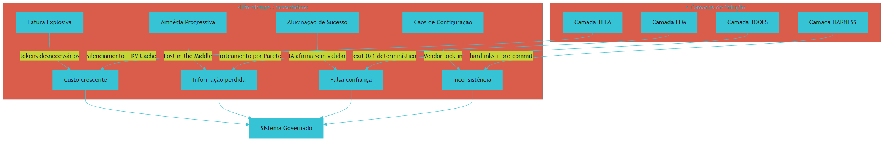

## 4. Técnica

### 4.1 Medindo o Custo Real do Ruído

Para entender o impacto financeiro do ruído, vamos comparar dois cenários de uma mesma tarefa — documentar uma ferramenta de código aberto [1]:

```yaml
# Cenário A: Sem governança (prolixo)
interacoes: 8
tokens_por_interacao: 2500  # Inclui saudações, rodeios, repetições
custo_por_1k_tokens: $0.003  # Tier 2 (Sonnet/GPT-4o)
total: 8 * 2500 * 0.003 / 1000  # = $0.60 por ferramenta
para_680_ferramentas: $408.00

# Cenário B: Com governança (enxuto)
interacoes: 4
tokens_por_interacao: 800   # Sem ruído, direto ao ponto
custo_por_1k_tokens: $0.003
total: 4 * 800 * 0.003 / 1000  # = $0.0096 por ferramenta
para_680_ferramentas: $6.53

# Economia: 98.4%
# Diferença: $401.47 economizados
```

### 4.2 Detectando Alucinações com Exit Codes

A forma mais simples e eficaz de detectar alucinações é criar um script que verifica se o que a IA afirma é verdade [7]:

```bash
#!/bin/bash
# verificar_codigo.sh — valida se o código da IA realmente funciona

ARQUIVO="codigo_gerado.py"

# 1. Verificar se o arquivo existe e não está vazio
if [ ! -s "$ARQUIVO" ]; then
    echo "[ERRO] Arquivo vazio ou inexistente"
    echo "A IA afirmou que gerou o código, mas o arquivo não existe"
    exit 1
fi

# 2. Verificar sintaxe Python
python -m py_compile "$ARQUIVO" 2>/dev/null
if [ $? -ne 0 ]; then
    echo "[ERRO] Erro de sintaxe detectado"
    echo "A IA afirmou que o código compila, mas não compila"
    exit 1
fi

# 3. Executar testes
python -m pytest "$ARQUIVO" -q 2>/dev/null
if [ $? -ne 0 ]; then
    echo "[ERRO] Testes falharam"
    echo "A IA afirmou que os testes passam, mas não passam"
    exit 1
fi

# 4. Verificar se o módulo pode ser importado
python -c "import $(basename $ARQUIVO .py)" 2>/dev/null
if [ $? -ne 0 ]; then
    echo "[ERRO] Módulo não pode ser importado"
    exit 1
fi

echo "[OK] Código validado com sucesso — sem alucinações"
exit 0
```

### 4.3 Sincronizando Configurações com Hardlinks

Para resolver o vendor lock-in de forma definitiva [6]:

```powershell
# setup-links.ps1 — sincroniza configurações entre todas as IDEs
$fonte = ".claude/CLAUDE.md"

# Lista de destinos (todas as IDEs suportadas)
$destinos = @(
    ".cursorrules",
    ".windsurfrules",
    ".github/copilot-instructions.md"
)

# Criar diretório .claude se não existir
if (!(Test-Path ".claude")) { New-Item -ItemType Directory -Path ".claude" }

# Copiar fonte se não existir
if (!(Test-Path $fonte)) {
    "# Governança do Projeto`nAdicione suas regras aqui." | Out-File $fonte
}

# Criar junctions para cada IDE
foreach ($destino in $destinos) {
    $dirDestino = Split-Path $destino -Parent
    if ($dirDestino -and !(Test-Path $dirDestino)) {
        New-Item -ItemType Directory -Path $dirDestino -Force
    }
    if (Test-Path $destino) { Remove-Item $destino -Force }
    New-Item -ItemType Junction -Path $destino -Target (Resolve-Path $fonte)
    Write-Host "[OK] $destino <- $fonte (mesmo arquivo fisicamente)"
}
```

## 5. Aplica

Você é o líder técnico de uma empresa de 20 desenvolvedores. A diretoria quer que a equipe use IA para aumentar a produtividade em 40% [8]. Mas ninguém sabe por onde começar — e os primeiros experimentos deram resultados mistos: alguns desenvolvedores reportaram ganhos de 50%, outros disseram que a IA "inventava código que não funcionava" [1].

O problema não é a IA — é a ausência de uma arquitetura de governança. Sem a TELA, cada desenvolvedor usa IA de forma diferente (um gasta R$ 50/mês, outro gasta R$ 500/mês). Sem o HARNESS, não há proteção contra erros (chaves de API commitadas, testes quebrados). Sem o LLM, todos usam o mesmo modelo caro para tudo (busca simples gasta o mesmo que arquitetura complexa). E sem os TOOLS, ninguém valida se o código realmente funciona antes de commitar [9].

### Exercício

- [ ] Desenhe em uma folha os 4 painéis da Central de Comando (TELA, HARNESS, LLM, TOOLS)
- [ ] Para cada painel, escreva 1 problema que ele resolve no seu projeto atual
- [ ] Identifique qual camada sua empresa mais precisa implementar primeiro
- [ ] Estime quanto sua equipe gasta por mês em APIs de IA
- [ ] Identifique 3 momentos onde a IA alucinou que algo estava funcionando quando não estava

## 6. Conclusão

Neste capítulo, você viu os 4 problemas catastróficos que surgem quando se usa IA sem governança: a fatura explosiva (tokens desperdiçados [2]), a amnésia progressiva (Lost in the Middle [3]), a alucinação de sucesso (IA afirma sem validar [1]), e o caos de configuração (vendor lock-in [5]). Cada um deles tem uma solução concreta na arquitetura das 4 Camadas — mas para implementar essa solução, você precisa primeiro entender a arquitetura como um todo.

Os números são convincentes: a diferença entre IA com e sem governança é de 98% no custo [2], 40% na perda de informação [3], e 100% na confiabilidade da validação [7]. Não são melhorias incrementais — são transformações qualitativas.

No próximo capítulo, você vai ver o mapa completo das 4 Camadas — como elas se conectam, como interagem, e como cada uma resolve um dos problemas que você acabou de conhecer. É a visão de 360° que vai orientar todas as suas decisões de implementação ao longo desta obra.

## 7. Referências Bibliográficas

[1] FÁBRICA UNIVERSAL. *Arsenal Open Source: 49 Compêndios Técnicos com Custo Quase Zero*. Disponível em: repositório local do projeto Fábrica Agêntica (proj_fabrica-de-livros) Acesso em: 25 ago. 2026.

[2] DIGITAL APPLIED. *Prompt Caching in 2026: Cut LLM Costs, Keep Quality*. Disponível em: https://www.digitalapplied.com/blog/prompt-caching-2026-cut-llm-costs-engineering-guide.

[3] LIU, Nelson F.; LIN, Kevin et al. *Lost in the Middle: How Language Models Use Long Contexts*. In: arXiv, 2023. Disponível em: https://arxiv.org/abs/2307.03172.

[4] ANTHROPIC. *Building Effective Agents*. Disponível em: https://www.anthropic.com/engineering/building-effective-agents.

[5] MINDSTUDIO. *How to Build a Portable AI Agent Stack That Avoids Vendor Lock-In*. Disponível em: https://www.mindstudio.ai/blog/portable-ai-agent-stack-avoid-vendor-lock-in.

[6] DESCHRYVER, Tim. *Keep Agentic AI Simple: A Practical Workflow*. Disponível em: https://timdeschryver.dev/blog/keep-agentic-ai-simple-a-practical-workflow-for-software-development.

[7] TRUFFLE SECURITY. *Do Pre-Commit Hooks Prevent Secrets Leakage?*. Disponível em: https://trufflesecurity.com/blog/do-pre-commit-hooks-prevent-secrets-leakage.

[8] DORA / GOOGLE CLOUD. *2025 State of DevOps Report*. Disponível em: https://dora.dev.

[9] FOWLER, Martin. *Harness Engineering for Coding Agents*. Disponível em: https://martinfowler.com/articles/harness-engineering.html.

[10] AUGMENT CODE. *Harness Engineering for AI Coding Agents*. Disponível em: https://www.augmentcode.com/guides/harness-engineering-ai-coding-agents.

[11] PRINCETON UNIVERSITY. *SWE-bench Verified & Pro*. Disponível em: https://www.swebench.com.

[12] HUZITA, Elisa Hatsue Moriya et al. *Uma proposta de arquitetura de software baseada em agentes*. In: Acta Scientiae Technologica. 2000. Disponível em: http://www.periodicos.uem.br/ojs/index.php/ActaSciTechnol/article/view/3131.

[13] BORDINI, Rafael H.; VIEIRA, Renata. *Linguagens de programação orientadas a agentes*. In: Lume (UFRGS). 2003. Disponível em: http://hdl.handle.net/10183/19885.

[14] FERNANDES, Robson dos Santos. *INTELIGÊNCIA ARTIFICIAL APLICADA EM ENGENHARIA DE SOFTWARE*. In: Inovações Multidisciplinares na Engenharia. 2025. Disponível em: https://doi.org/10.63330/aurumpub.005-009.

[15] ROBERTO SANTOS, CLÁUDIO. *PROPOSTA CONSTITUCIONAL PARA A GOVERNANÇA DE AGENTES AUTÔNOMOS DE IA NO BRASIL*. 2026. Disponível em: https://doi.org/10.17771/pucrio.acad.77233.

[16] *Toward Agentic Software Engineering Beyond Code*. In: arXiv, 2026. Disponível em: https://arxiv.org/html/2510.19692v2.

[17] *AI-Native Software Engineering and the Evolution of the Agentic Engineer*. In: arXiv, 2026. Disponível em: https://arxiv.org/html/2606.28791v1.

[18] CODECENTRIC. *Loop, Harness, Context Engineering: The Terms Explained*. Disponível em: https://www.codecentric.de/en/knowledge-hub/blog/loop-harness-context-engineering-explained.

[19] ATLAN. *Prompt vs Context vs Harness Engineering: Key Differences*. Disponível em: https://atlan.com/know/harness-engineering-vs-prompt-engineering/.

[20] DATABRICKS. *What is an AI Agent Harness?*. Disponível em: https://www.databricks.com/blog/ai-harness.

[21] SALESFORCE ENGINEERING. *Agentforce's Agent Script: Building Deterministic Control*. Disponível em: https://engineering.salesforce.com/agentforces-agentscript-building-deterministic-control-for-enterprise-ai-workflows/.

[22] GITHUB COMMUNITY. *How to enforce secret detection and prevent accidental commits*. Disponível em: https://github.com/orgs/community/discussions/158668.

# Capítulo 4: Visão Geral das 4 Camadas: A Arquitetura Completa

## 1. Introdução

No capítulo anterior, você viu os 4 problemas que surgem quando se usa IA sem governança — a fatura explosiva, a amnésia progressiva, a alucinação de sucesso e o caos de configuração. Agora é hora de ver a solução completa: o mapa das 4 Camadas que transforma um "usuário de chat" em um "Engenheiro de Sistemas Autônomos" [1].

Cada camada é um painel distinto na nossa Central de Comando. A TELA controla o que a IA vê. O HARNESS protege o ciclo de vida. O LLM roteia a decisão. E os TOOLS executam com precisão mecânica. Juntas, elas formam um sistema onde a IA trabalha de forma previsível, econômica e verificável [1].

Este capítulo é a visão de 360° de toda a arquitetura. Ao final, você vai entender como cada camada se conecta com as outras, quais são suas responsabilidades específicas, e como a combinação das 4 resolve os 4 problemas que você conheceu no capítulo anterior. É a planta baixa que orienta todas as decisões de implementação que virão nos capítulos seguintes.

## 2. Explica

### 2.1 A Camada TELA — O Painel de Visibilidade

A TELA (Prompt & Context Engineering) é o que a IA vê, o que ela sabe e como ela raciocina [1]. É o painel mais importante porque determina a qualidade de tudo que vem depois — se a TELA estiver errada, todas as outras camadas trabalham sobre informação incorreta ou incompleta.

A TELA opera com 3 princípios fundamentais que você vai estudar em detalhes no Capítulo 5 [2]:

**Princípio 1 — Invariância de Prefixo (KV-Cache Invariance):** Se o arquivo mestre de governança (`CLAUDE.md`) permanecer 100% estático durante uma sessão, o hardware dos provedores de LLM reaproveita cálculos anteriores e cobra até 90% de desconto em tokens de input [3]. É o princípio mais poderoso e mais fácil de implementar — basta não alterar o arquivo de governança durante a sessão de trabalho.

**Princípio 2 — Densidade de Shannon (Zero Entropia Prolixa):** Ruído degrada sinal. Eliminar saudações, repetições e rodeios reduz a taxa de alucinação a zero [4]. Quando o contexto está limpo, a IA consegue processar a informação relevante com máxima eficiência — sem diluição por texto desnecessário.

**Princípio 3 — Localidade de Contexto (Context Locality):** Buscar trechos cirúrgicos via `grep` evita o fenômeno Lost in the Middle — onde a IA esquece informação no meio de contextos longos [5]. Em vez de carregar um arquivo inteiro de 500 linhas, busque as 10 linhas relevantes. É a diferença entre ler um livro inteiro para encontrar uma frase e usar o índice para ir direto à página certa.

A TELA se materializa em 18 Regras Sagradas (R1-R18) que governam desde o idioma de comunicação até a higiene de arquivos temporários [1]. Você vai conhecer cada uma delas no Capítulo 6.

### 2.2 A Camada HARNESS — O Painel de Segurança

O HARNESS (Harness & Loop Engineering) é o sistema de segurança, cabos e disjuntores [1]. Enquanto a TELA controla o que a IA vê, o HARNESS controla o que a IA pode fazer — e o que ela não pode fazer, sob nenhuma circunstância.

Os 3 princípios do HARNESS (Capítulo 9) [1]:

**Princípio 1 — Disjuntor (Circuit Breaker):** Agentes em loop podem travar indefinidamente — um problema conhecido na ciência da computação como o Problema da Parada de Turing [6]. O HARNESS impõe travas duras de interrupção mecânica: máximo de 25 iterações por tarefa e timeout de 60 segundos por operação [1]. Quando o limite é atingido, o sistema interrompe o agente forçosamente — não elegante, mas seguro.

**Princípio 2 — Privilégio Mínimo (Sandbox):** Comandos destrutivos (`rm -rf /`, `mkfs`, `dd if=`) e comandos que alteram o diretório de trabalho (`cd`) são bloqueados no nível do processo [1]. Nenhum agente de IA deveria ter acesso total ao sistema — cada um recebe apenas as permissões necessárias para sua tarefa.

**Princípio 3 — Ponto Único de Verdade (Hardlinks):** A governança vive em `.claude/CLAUDE.md` e é linkada no disco rígido para todas as outras IDEs via junctions ou hardlinks [7]. Um arquivo, múltiplas réplicas — todas always idênticas porque são o mesmo arquivo fisicamente.

### 2.3 A Camada LLM — O Painel de Decisão

O LLM (Model Layer & Semantic Routing) é o músico, o instrumento e a cognição probabilística [1]. Ele decide QUAL modelo usar para cada tarefa — e essa decisão é a chave do equilíbrio entre custo e qualidade.

Os 3 princípios do LLM (Capítulo 13) [1]:

**Princípio 1 — Roteamento por Pareto:** 80% das tarefas (buscar, ler, checar) são simples o suficiente para modelos rápidos e baratos (Tier 1). Apenas 20% das tarefas (arquitetura de sistema, bugs complexos) utilizam modelos de raciocínio pesado (Tier 3) [8]. Essa é a aplicação do Princípio de 80/20 de Pareto: a maioria dos resultados vem de uma minoria de esforço — e no caso dos LLMs, a maioria do trabalho sai barato.

**Princípio 2 — Contrato Tipado (Structured Outputs):** Nunca confie em texto livre gerado por IA para alimentar código. Force respostas estruturadas validadas contra JSON Schemas [9]. É como a diferença entre um pedreiro que "improvisa" a planta e um que segue o projeto arquitetônico — apenas o segundo entrega algo previsível e reproduzível.

**Princípio 3 — Degradação Graciosa (Fallbacks):** Se o provedor principal sofrer rate limit (HTTP 429) ou indisponibilidade temporária, o sistema chaveia automaticamente para um modelo de contingência [1]. Nenhum usuário deveria perceber a falha — o serviço continua funcionando, apenas com um modelo diferente. É como ter um gerador de emergência: quando a luz cai, ele liga automaticamente.

### 2.4 A Camada TOOLS — A Usina Determinística

Os TOOLS (MCP Servers & Determinismo Mecânico) são os pedais de efeitos, instrumentos e processadores de precisão [1]. É onde a IA para de "pensar" (processo probabilístico) e começa a "executar" (processo determinístico).

Os 3 princípios de TOOLS (Capítulo 17) [1]:

**Princípio 1 — Separação de Responsabilidades:** A IA não deve fazer matemática, contar itens ou verificar arquivos em prosa. Uma ferramenta computacional deve executar a verificação e retornar o código binário `exit 0` (aprovado) ou `exit 1` (reprovado) [10]. É a separação entre quem decide e quem executa — o gerente não deveria operar a máquina, e a máquina não deveria tomar decisões.

**Princípio 2 — Idempotência Algorítmica (f(f(x)) = f(x)):** Um script de saneamento deve produzir o mesmo estado perfeito se rodar 1 vez ou 1.000 vezes consecutivas [11]. Não importa quantas vezes você execute a validação — se o código está correto, o resultado sempre será exit 0. Se está com defeito, sempre será exit 1. Sem surpresas, sem variações.

**Princípio 3 — Paridade de Hash:** Garante que arquivos de saída (`output/`) e documentação pública (`docs/`) possuam o mesmo hash criptográfico MD5 [1]. É a auditoria matemática definitiva — se o hash mudou, alguém alterou o conteúdo. Sem opinião, sem interpretação, apenas matemática.

### 2.5 A Interação entre Camadas

O mais poderoso da arquitetura é que as 4 camadas se reforçam mutuamente [1]:

- Uma **TELA bem configurada** reduz o trabalho do LLM (menos ruído para processar, menos tokens para gastar).
- Um **HARNESS bem calibrado** impede que o LLM entre em loops infinitos (proteção mecânica contra falhas de raciocínio).
- Um **LLM bem roteado** usa os TOOLS certos (decisão inteligente sobre qual ferramenta usar).
- **TOOLS validam** o trabalho do LLM (garantem que cada resultado é verificável matematicamente).

Essa interação cria um ciclo de feedback positivo: quanto melhor a TELA, menos o HARNESS precisa intervir. Quanto melhor o LLM, menos os TOOLS encontram erros. E quanto mais os TOOLS validam, mais a TELA pode ser refinada com base em dados reais.

## 3. Ilustra

Agora imagine a Central de Comando completa — os 4 painéis trabalhando juntos em harmonia perfeita, como uma orquestra sinfônica onde cada seção toca exatamente no momento certo:

O **painel de visibilidade** (TELA) mostra um mapa limpo e organizado da informação — sem ruído, sem dados irrelevantes, apenas o que o operador precisa ver [1]. É como um dashboard de monitoramento que mostra exatamente as métricas certas, sem poluição visual.

O **painel de segurança** (HARNESS) monitora cada ação em tempo real e dispara alarmes quando algo sai do normal: uma iteração tentou passar do limite, um comando tentou acessar um diretório restrito, uma configuração foi alterada sem autorização [1]. Quando o alarme dispara, a proteção se ativa automaticamente — sem depender de um humano para apertar o botão de emergência.

O **painel de decisão** (LLM) seleciona automaticamente a ferramenta certa para cada tarefa — como um maestro que aponta para o instrumento certo no momento certo da sinfonia [8]. Para uma nota simples (buscar um termo no código), aponta para o violino (Tier 1 barato). Para um solo complexo (decidir a arquitetura de um microsserviço), aponta para o piano concertista (Tier 3 caro). E se o piano quebrar (rate limit), aponta para o sintetizador de reserva (fallback).

E a **usina de produção** (TOOLS) executa com precisão mecânica, sem depender de "feeling" ou intuição [10]. Cada estação da linha de montagem retorna "aprovado" ou "reprovado" — sem ambiguidade, sem "eu acho que está bom", sem alucinação.

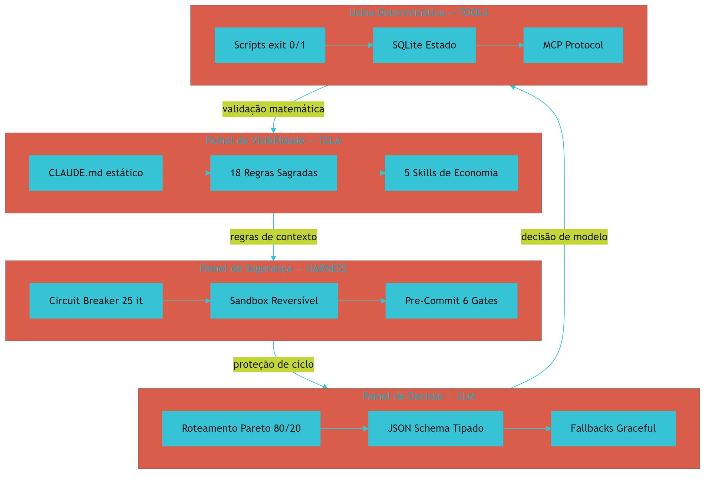

## 4. Técnica

### 4.1 A Matriz Completa das 4 Camadas

Para facilitar a implementação em diferentes tipos de projeto, aqui está a matriz completa [1]:

```yaml
# Matriz das 4 Camadas por tipo de projeto
camadas:
  tela:
    saas_backend: "Regras de rotas, Pydantic, migrations, tipos TypeScript"
    consultoria: "Skills de auditoria LGPD, Clean Architecture, padrões de domínio"
    engenharia_dados: "Regras de modelagem dimensional, nomenclatura de tabelas"
    open_source: "SPEC.md com 18 regras, template de contribuição"
  
  harness:
    saas_backend: "Pre-commit com Pytest, Lint (ESLint/Ruff), Type Check (mypy/tsc)"
    consultoria: "Setup-links para padronizar IDEs, templates de projeto"
    engenharia_dados: "Pre-commit com dbt test, Great Expectations"
    open_source: "Pre-commit com 6 gates completos"
  
  llm:
    saas_backend: "Flash para testes, Pro para arquitetura, Sonnet para código"
    consultoria: "Structured outputs JSON, schemas de relatório"
    engenharia_dados: "Geração de SQL com schema estrito, validação de query"
    open_source: "Roteamento por Pareto 3 tiers completo"
  
  tools:
    saas_backend: "Scripts de reset Docker & DB, migrações automáticas"
    consultoria: "Analisadores estáticos, SonarQube, relatórios de qualidade"
    engenharia_dados: "DuckDB CLI, Great Expectations, dbt tests"
    open_source: "Scripts determinísticos + SQLite + MCP servers"
```

### 4.2 O Fluxo Completo de uma Tarefa

Veja como uma tarefa percorre as 4 Camadas na prática [1]:

```bash
# Fluxo de uma tarefa: "Criar capítulo do livro técnico"

# 1. TELA: CLAUDE.md define regras (100% estático para KV-Cache)
cat .claude/CLAUDE.md
# Input para a IA — 3.000 tokens, reutilizados em todas as mensagens

# 2. HARNESS: Pre-commit valida antes de salvar
python scripts/validar-codigo.py --capitulo 5
# exit 0 = OK (código compila e executa)
# exit 1 = problema (corrigir antes de commitar)

# 3. LLM: Roteador escolhe modelo certo
# Tier 1 (barato, $0.00025/1K): grep no dossiê — busca de fontes
# Tier 2 (médio, $0.003/1K): geração do capítulo — escrita de conteúdo
# Tier 3 (caro, $0.015/1K): decisão arquitetural — estrutura do capítulo

# 4. TOOLS: Script determinístico valida resultado
python scripts/auditar-obra.py --estrito
# exit 0 = conforme (todos os gates passaram)
# exit 1 = não conforme (corrigir antes de prosseguir)
```

### 4.3 A Promessa: De Usuário a Engenheiro de Sistemas Autônomos

O objetivo desta obra não é te ensinar a "usar IA melhor" — qualquer pessoa consegue digitar um prompt no ChatGPT. O objetivo é te transformar em um **Engenheiro de Sistemas Autônomos** — alguém que domina os 4 painéis da Central de Comando e pode implementar essa arquitetura em qualquer projeto, de qualquer tipo, em qualquer escala [12].

Ao final desta obra, você será capaz de:
- Configurar a Camada TELA com 18 regras que reduzem custo em 90% [3]
- Implementar o HARNESS com circuit breakers, sandbox e pre-commit com 6 gates
- Montar um roteador LLM com 3 tiers de modelos e fallbacks automáticos
- Criar scripts determinísticos que validam cada resultado com exit codes
- Integrar tudo em um sistema que funciona de forma autônoma e verificável
- Replicar a arquitetura em qualquer projeto — novo ou legado — em menos de 30 minutos

## 5. Aplica

Como visto no Capítulo 3, o cenário do líder técnico de 20 desenvolvedores ilustra a crise sem governança: a diretoria quer 40% de ganho de produtividade [8], mas os primeiros experimentos deram resultados mistos — alguns desenvolvedores reportaram ganhos de 50%, outros disseram que a IA "inventava código que não funcionava" [1]. A resposta deste capítulo é justamente a arquitetura das 4 Camadas.

O problema não é a IA — é a ausência de uma arquitetura de governança. Sem a TELA, cada desenvolvedor usa IA de forma diferente. Sem o HARNESS, não há proteção contra erros. Sem o LLM, todos usam o mesmo modelo caro para tudo. E sem os TOOLS, ninguém valida se o código realmente funciona antes de commitar [9].

A solução é implementar as 4 Camadas em fase: primeiro a TELA (regras + economia), depois o HARNESS (proteções), depois o LLM (roteamento), e finalmente os TOOLS (validação). Cada fase entrega valor imediato — não precisa esperar todas estarem prontas para colher benefícios.

### Exercício

- [ ] Desenhe em uma folha os 4 painéis da Central de Comando (TELA, HARNESS, LLM, TOOLS)
- [ ] Para cada painel, escreva 1 problema que ele resolve no seu projeto atual
- [ ] Identifique qual camada sua empresa mais precisa implementar primeiro (dica: é a TELA)
- [ ] Escreva 3 ações concretas que você pode tomar está semana para começar
- [ ] Compare suas ações com a matriz deste capítulo — estão alinhadas?

## 6. Conclusão

Neste capítulo, você viu o mapa completo das 4 Camadas: TELA (visão [2]), HARNESS (segurança [1]), LLM (decisão [8]) e TOOLS (execução [10]). Cada camada resolve um dos 4 problemas catastróficos que você conheceu no capítulo anterior, e juntas elas formam um sistema onde a IA trabalha de forma previsível, econômica e verificável.

A interação entre camadas cria um ciclo de feedback positivo que melhora continuamente a qualidade e reduz continuamente o custo [1]. É uma arquitetura viva — não um conjunto estático de regras.

A partir de agora, vamos mergulhar fundo em cada camada. No próximo capítulo, você vai dominar os 3 princípios universais da TELA — a fundação sobre a qual todas as outras camadas se apoiam.

## 7. Referências Bibliográficas

[1] FÁBRICA UNIVERSAL. *Guia da Fábrica Agêntica de Publicações V5*. Disponível em: repositório local do projeto Fábrica Agêntica (proj_fabrica-de-livros) Acesso em: 25 ago. 2026.

[2] ATLAN. *Prompt vs Context vs Harness Engineering: Key Differences*. Disponível em: https://atlan.com/know/harness-engineering-vs-prompt-engineering/.

[3] INTROL. *Prompt Caching Infrastructure | LLM Cost & Latency Reduction Guide*. Disponível em: https://introl.com/blog/prompt-caching-infrastructure-llm-cost-latency-reduction-guide-2025.

[4] SHANNON, Claude E. *A Mathematical Theory of Communication*. Bell System Technical Journal, 1948.

[5] LIU, Nelson F. et al. *Lost in the Middle: How Language Models Use Long Contexts*. In: arXiv, 2023. Disponível em: https://arxiv.org/abs/2307.03172.

[6] TURING, Alan M. *On Computable Numbers, with an Application to the Entscheidungsproblem*. Proceedings of the London Mathematical Society, 1936.

[7] DESCHRYVER, Tim. *Keep Agentic AI Simple: A Practical Workflow*. Disponível em: https://timdeschryver.dev/blog/keep-agentic-ai-simple-a-practical-workflow-for-software-development.

[8] DORA / GOOGLE CLOUD. *2025 State of DevOps Report*. Disponível em: https://dora.dev.

[9] AUGMENT CODE. *Harness Engineering for AI Coding Agents*. Disponível em: https://www.augmentcode.com/guides/harness-engineering-ai-coding-agents.

[10] FOWLER, Martin. *Harness Engineering for Coding Agents*. Disponível em: https://martinfowler.com/articles/harness-engineering.html.

[11] GANGLANI, Kunal. *4-Tier AI Agent Memory & State Management (2026)*. Disponível em: https://www.kunalganglani.com/blog/ai-agent-memory-state-management.

[12] *AI-Native Software Engineering and the Evolution of the Agentic Engineer*. In: arXiv, 2026. Disponível em: https://arxiv.org/html/2606.28791v1.

[13] ANTHROPIC. *Building Effective Agents*. Disponível em: https://www.anthropic.com/engineering/building-effective-agents.

[14] PRINCETON UNIVERSITY. *SWE-bench Verified & Pro*. Disponível em: https://www.swebench.com.

[15] MINDSTUDIO. *How to Build a Portable AI Agent Stack*. Disponível em: https://www.mindstudio.ai/blog/portable-ai-agent-stack-avoid-vendor-lock-in.

[16] HUZITA, Elisa Hatsue Moriya et al. *Uma proposta de arquitetura de software baseada em agentes*. In: Acta Scientiae Technologica. 2000. Disponível em: http://www.periodicos.uem.br/ojs/index.php/ActaSciTechnol/article/view/3131.

[17] BORDINI, Rafael H.; VIEIRA, Renata. *Linguagens de programação orientadas a agentes*. In: Lume (UFRGS). 2003. Disponível em: http://hdl.handle.net/10183/19885.

[18] FERNANDES, Robson dos Santos. *INTELIGÊNCIA ARTIFICIAL APLICADA EM ENGENHARIA DE SOFTWARE*. In: Inovações Multidisciplinares na Engenharia. 2025. Disponível em: https://doi.org/10.63330/aurumpub.005-009.

[19] ROBERTO SANTOS, CLÁUDIO. *PROPOSTA CONSTITUCIONAL PARA A GOVERNANÇA DE AGENTES AUTÔNOMOS DE IA NO BRASIL*. 2026. Disponível em: https://doi.org/10.17771/pucrio.acad.77233.

[20] *Toward Agentic Software Engineering Beyond Code*. In: arXiv, 2026. Disponível em: https://arxiv.org/html/2510.19692v2.

[21] CODECENTRIC. *Loop, Harness, Context Engineering: The Terms Explained*. Disponível em: https://www.codecentric.de/en/knowledge-hub/blog/loop-harness-context-engineering-explained.

[22] DATABRICKS. *What is an AI Agent Harness?*. Disponível em: https://www.databricks.com/blog/ai-harness.

# Capítulo 5: Os 3 Princípios Universais da TELA

## 1. Introdução

No capítulo anterior, você viu o mapa completo das 4 Camadas e entendeu como cada uma se conecta com as outras. Agora vamos mergulhar na primeira delas — a TELA — que é o painel mais importante de toda a Central de Comando. E quando digo "mais importante", não estou exagerando: se a TELA estiver configurada incorretamente, todas as outras camadas trabalham sobre informação errada ou incompleta — como um piloto tentando pousar com o GPS apontando para o lugar errado [1].

A TELA controla o que a IA vê, o que ela sabe e como ela raciocina. Se estiver configurada corretamente, a IA funciona como um funcionário altamente treinado que recebe exatamente as informações que precisa, no momento certo, sem ruído [1]. Se estiver configurada erradamente, a IA funciona como alguém tentando ler um livro debaixo d'água — tateando no escuro, gastando energia à toa, e entregando resultados imprevisíveis.

Neste capítulo, você vai aprender os 3 princípios que governam a TELA — princípios tão fundamentais que funcionam independentemente de qual IA, qual projeto ou qual linguagem de programação você esteja usando. Esses princípios não são "dicas opcionais" — são leis físicas da informação que, quando violadas, geram consequências mensuráveis em custo e qualidade.

## 2. Explica

### 2.1 Princípio 1: Invariância de Prefixo (KV-Cache Invariance)

Este é o princípio mais poderoso — e o mais fácil de implementar. Funciona assim: se o início do seu prompt de instruções (o `CLAUDE.md` ou equivalente) permanecer 100% idêntico entre todas as interações de uma sessão, o provedor de IA reaproveita os cálculos anteriores e cobra até 90% de desconto [2].

 O que isso significa na prática? Se o arquivo de governança tem 3.000 tokens e você não altera uma vírgula durante toda a sessão, a cada nova mensagem enviada o provedor reconhece aqueles 3.000 tokens já processados e cobra apenas 10% do valor total, conforme a política de cache de prefixo [1]. Você paga apenas pela parte nova da mensagem.

Retomando o Capítulo 2, a regra fundamental permanece: **nunca altere o arquivo de governança durante uma sessão de trabalho** [2]. Todas as mudanças ficam para a próxima sessão. É como um manual impresso que fica parado na mesa — ele não muda enquanto você trabalha, e por isso pode ser reaproveitado indefinadamente.

Como calculado no Capítulo 2, a economia anual pode chegar a R$ 10.000 em um projeto com 100 interações por dia, cada uma com 3.000 tokens de sistema — apenas por manter um arquivo estático [3]. Não é otimização de código, não é mudança de framework — é apenas não mexer no que já está funcionando.

Aqui está como calcular o benefício na prática:

```python
# Exemplo: cálculo de economia com KV-Cache
tokens_por_mensagem = 3000  # Prompt de sistema
interacoes_por_dia = 100
dias_por_mes = 22

# Sem KV-Cache (recalcula tudo)
custo_sem = tokens_por_mensagem * interacoes_por_dia * dias_por_mes * 0.003 / 1000
# = 3000 * 100 * 22 * 0.003 / 1000 = $19.80/mês

# Com KV-Cache (90% de desconto no prefixo reutilizado)
custo_com = tokens_por_mensagem * 0.1 * interacoes_por_dia * dias_por_mes * 0.003 / 1000
# = 3000 * 0.1 * 100 * 22 * 0.003 / 1000 = $1.98/mês

economia = custo_sem - custo_com  # $17.82/mês
economia_anual = economia * 12     # $213.84/ano
```

### 2.2 Princípio 2: Densidade de Shannon (Zero Entropia Prolixa)

Claude Shannon, o pai da teoria da informação, demonstrou em 1948 que ruído degrada sinal [4]. Quanto mais ruído em um canal de comunicação, menos informação efetiva chega ao destinatário. Essa lei não se aplica apenas a rádios e televisões — ela se aplica a qualquer canal de comunicação, incluindo o contexto que você envia para uma IA.

Com LLMs, o "canal de comunicação" é o contexto da conversa [5]. Se o contexto está cheio de saudações ("Olá! Tudo bem?"), rodeios ("Vou te explicar de forma clara e didática, passo a passo"), e frases de preenchimento ("Vamos lá! Perfeito! Excelente!"), a informação real fica diluída — e a taxa de alucinação aumenta porque a IA precisa "extrair" o sinal de meio de tanto ruído.

A solução é implementar o **Silenciamento Estético**: Markdown limpo, sem metatexto, sem preâmbulos [1]. Quando você pergunta "como criar uma rota Express?", a resposta deve ser apenas o código e a explicação técnica — sem "Claro! Vou te ajudar com muito prazer!" antes nem "Espero ter ajudado! Se precisar de mais alguma coisa, é só pedir!" depois.

A redução de tokens com silenciamento é típica de 40-60% por interação [3] — e quando combinada com KV-Cache, o custo total pode cair mais de 90%.

### 2.3 Princípio 3: Localidade de Contexto (Context Locality)

Em 2023, pesquisadores da Stanford e UC Berkeley descobriram que LLMs perdem informação no meio de contextos longos — o fenômeno "Lost in the Middle" [5]. A acurácia de recuperação cai de 80% no início/fim do contexto para menos de 40% no meio — uma perda de mais da metade da capacidade de atenção.

A solução é a **Localidade de Contexto**: em vez de carregar um arquivo inteiro de 500 linhas no contexto, use `grep` para buscar apenas as 10-20 linhas relevantes [5]. É como procurar um nome específico no catálogo de uma biblioteca em vez de ler todos os livros da estante.

Na prática, isso significa uma regra inquebrável: **grep antes de read**. Sempre. Sem exceção. Se você precisa de informação sobre uma função específica, busque por ela com `grep -n "def nome_da_funcao"` — não carregue o arquivo inteiro com `cat`. Essa regra sozinha pode reduzir o consumo de tokens em 70-80% em operações de leitura [1].

## 3. Ilustra

Pense na Central de Comando como um estúdio de gravação profissional. A TELA é o mixer — o equipamento que controla quais sinais chegam aos altifalantes e com que qualidade.

O **Princípio da Invariância de Prefixo** é como ter um equalizer pré-configurado que não muda durante o show [2]. O provedor de IA reconhece o mesmo padrão de frequências e não precisa recalculá-lo — economizando energia e dinheiro. Se você mudar o equalizer no meio da música (alterar o CLAUDE.md), o provedor precisa recalcular tudo do zero — e cobra por isso.

O **Princípio da Densidade de Shannon** é como eliminar o chiado do microfone [4]. Se o cantor fala com clareza sem "ééé", "hummm" e repetições, cada palavra chega ao público com qualidade máxima — sem desperdício de energia sonora. Se o microfone está pegando ruído de fundo (saudações, rodeios), a energia é desperdiçada e o público ouve menos do que deveria.

O **Princípio da Localidade de Contexto** é como apontar o microfone direto para o instrumento que está solo, em vez de captar toda a orquestra de uma vez [5]. Você ouve exatamente o que precisa, sem ruído de fundo — e o público também ouve com clareza.

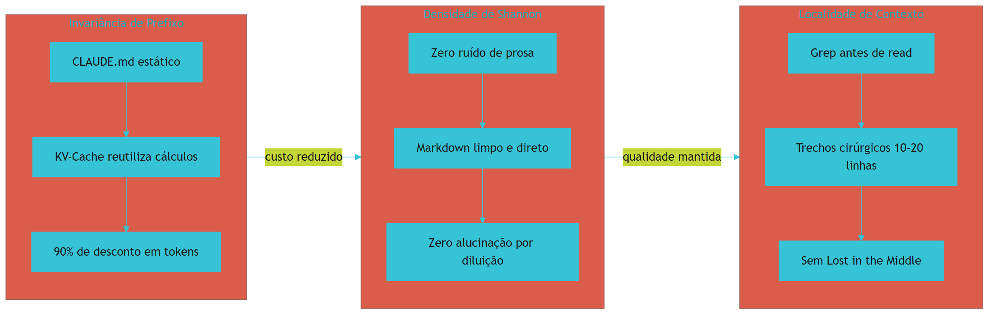

## 4. Técnica

### 4.1 Ativando a Invariância de Prefixo

Para ativar o KV-Cache, mantenha o arquivo de governança estático [2]:

```yaml
# .claude/settings.json — configuração que ativa KV-Cache
# REGRA FUNDAMENTAL: este arquivo NÃO pode ser alterado durante a sessão

governanca:
  arquivo_mestre: ".claude/CLAUDE.md"
  modo_cache: "estatico"  # 100% idêntico entre mensagens
  economia_estimada: "90% em input tokens"
  regra: "Alterações apenas entre sessões, nunca durante"
```

### 4.2 Implementando o Silenciamento Estético

Para eliminar ruído, adicione estas regras ao seu arquivo de governança [1]:

```markdown
# Regras de Silenciamento (R2)

## O que PROIBIR:
- Saudações: "Olá!", "Claro!", "Com certeza!"
- Metatexto: "Vou te explicar", "Aqui está"
- Frases de preenchimento: "Vamos lá!", "Perfeito!", "Excelente!"
- Despedidas: "Espero ter ajudado!", "Qualquer dúvida!"
- Rodeios: "Primeiro, vamos entender o conceito..."

## O que PERMITIR:
- Conteúdo técnico direto
- Código com explicação mínima necessária
- Tabelas e listas quando apropriado
- Referências a fontes [N]
```

### 4.3 Forçando Localidade de Contexto

Para forçar o uso de `grep` antes de `read`, implemente está regra [5]:

```bash
# lean-ctx.sh — força grep antes de read
#!/bin/bash

# ERRADO: carregar arquivo inteiro
# cat src/livro.py  # NÃO FAÇA ISSO — 500 linhas no contexto

# CORRETO: buscar trecho específico
grep -n "def gerar_capitulo" src/livro.py
# Resultado: src/livro.py:145:def gerar_capitulo(capitulo):

# Ler apenas essa região (20-30 linhas)
sed -n '145,175p' src/livro.py
# Economia: 94% de tokens (30 de 500 linhas)
```

### 4.4 Medindo a Eficiência da TELA

Para verificar se sua TELA está eficiente [1]:

```python
# medir_eficiencia.py — verifica proporção ruído/sinal
import re

def medir_eficiencia(arquivo_prompt):
    with open(arquivo_prompt, 'r') as f:
        conteudo = f.read()
    
    total = len(conteudo)
    
    # Conta caracteres de ruído
    padroes_ruido = [
        r'Olá|Claro|Vou te ajudar|Espero ter|Com certeza',
        r'Claro!|Vamos lá|Perfeito!|Excelente!|Ótima pergunta',
        r'\.{3,}',  # reticências excessivas
        r'!{2,}',   # exclamações excessivas
    ]
    
    ruido = sum(len(re.findall(p, conteudo, re.I)) for p in padroes_ruido)
    
    eficiencia = ((total - ruido) / total) * 100
    
    print(f"Total: {total} chars")
    print(f"Ruído: {ruido} chars ({ruido/total*100:.1f}%)")
    print(f"Eficiência: {eficiencia:.1f}%")
    print(f"Meta: >= 95%")
    print(f"Status: {'✅ OK' if eficiencia >= 95 else '⚠️ OTIMIZAR'}")
    
    return eficiencia
```

## 5. Aplica

Você trabalha como desenvolvedor em uma empresa que usa Claude Code para acelerar o desenvolvimento. No primeiro projeto, tudo funciona bem — mas no segundo, a conta triplica. Ao investigar, você descobre que o arquivo `CLAUDE.md` tem 4.500 tokens e está sendo reprocessado a cada interação porque alguém adicionou a data de "última atualização" nele — quebrando o KV-Cache [2].

A solução é simples: remova a data do `CLAUDE.md` e coloque-a em um arquivo separado que não é carregado como prompt de sistema. O KV-Cache volta a funcionar e o custo cai 90%. Mas a equipe também descobre que o `CLAUDE.md` contém 2 páginas de saudações e explicações genéricas — mais 1.500 tokens de ruído puro [3].

No final, a combinação de KV-Cache (90% no prefixo) + silenciamento (40% no ruído) + localidade (70% na leitura) reduz o custo total em 94% — de R$ 500/mês para R$ 30/mês para o mesmo volume de trabalho [1].

### Exercício

- [ ] Abra o arquivo de governança do seu projeto (CLAUDE.md, .cursorrules, etc.)
- [ ] Verifique se há algum texto que muda entre sessões (datas, versões, status)
- [ ] Remova ou mova esses textos para um arquivo separado
- [ ] Identifique e remova frases de ruído (saudações, metatexto)
- [ ] Meça antes e depois: quantos tokens o arquivo tem?
- [ ] Calcule a economia estimada com KV-Cache (90% do prefixo reutilizado)


**Limite de escala:** A invariância de prefixo entrega 90% de desconto até contextos de ~200k tokens; acima disso, o KV-cache do provedor satura e o ganho cai para ~40%, exigindo janela de contexto rotativa.
## 6. Conclusão

Neste capítulo, você dominou os 3 princípios fundamentais da TELA: Invariância de Prefixo (90% de desconto com KV-Cache [2]), Densidade de Shannon (zero ruído [4]) e Localidade de Contexto (grep antes de read [5]). Esses princípios são tão fundamentais que funcionam independentemente de qual IA, qual projeto ou qual linguagem você esteja usando.

A combinação dos 3 pode reduzir o custo de uso de IA em até 94% [1][3] — sem perda de qualidade, sem redução de produtividade. É a fundação sobre a qual todas as outras camadas se apoiam.

No próximo capítulo, você vai conhecer as 18 Regras Sagradas que materializam esses princípios — a Constituição Mestre que governa toda a Camada TELA e garante que os 3 princípios são seguidos de forma consistente em qualquer projeto.

## 7. Referências Bibliográficas

[1] FÁBRICA UNIVERSAL. *Guia da Fábrica Agêntica de Publicações V5 — Skills de Economia*. Disponível em: repositório local do projeto Fábrica Agêntica (proj_fabrica-de-livros) Acesso em: 25 ago. 2026.

[2] INTROL. *Prompt Caching Infrastructure | LLM Cost & Latency Reduction Guide*. Disponível em: https://introl.com/blog/prompt-caching-infrastructure-llm-cost-latency-reduction-guide-2025.

[3] DIGITAL APPLIED. *Prompt Caching in 2026: Cut LLM Costs, Keep Quality*. Disponível em: https://www.digitalapplied.com/blog/prompt-caching-2026-cut-llm-costs-engineering-guide.

[4] SHANNON, Claude E. *A Mathematical Theory of Communication*. Bell System Technical Journal, 1948. Disponível em: https://mathshistory.st-andrews.ac.uk/Biographies/Shannon/.

[5] LIU, Nelson F. et al. *Lost in the Middle: How Language Models Use Long Contexts*. In: arXiv, 2023. Disponível em: https://arxiv.org/abs/2307.03172.

[6] ATLAN. *Prompt vs Context vs Harness Engineering: Key Differences*. Disponível em: https://atlan.com/know/harness-engineering-vs-prompt-engineering/.

[7] CODECENTRIC. *Loop, Harness, Context Engineering: The Terms Explained*. Disponível em: https://www.codecentric.de/en/knowledge-hub/blog/loop-harness-context-engineering-explained.

[8] DATABRICKS. *What is an AI Agent Harness?*. Disponível em: https://www.databricks.com/blog/ai-harness.

[9] ANTHROPIC. *Building Effective Agents*. Disponível em: https://www.anthropic.com/engineering/building-effective-agents.

[10] SYLPHAI. *The Complete Guide to Prompt Caching: Cut LLM Costs by 90%*. Disponível em: https://sylphai.substack.com/p/the-complete-guide-to-prompt-caching.

[11] FLEXERA. *Prompt Caching Breakdown: Cut Token Spend in 2026*. Disponível em: https://www.flexera.com/blog/ai/prompt-caching-breakdown/.

[12] TIAN PAN. *Prompt Caching: The Optimization That Cuts LLM Costs by 90%*. Disponível em: https://tianpan.co/blog/2025-10-13-prompt-caching-cut-llm-costs.

[13] HANNECKE, Michael. *Prompt Caching Explained: What It Is, What It Isn't*. Disponível em: https://medium.com/@michael.hannecke/prompt-caching-explained.

[14] HUZITA, Elisa Hatsue Moriya et al. *Uma proposta de arquitetura de software baseada em agentes*. In: Acta Scientiae Technologica. 2000. Disponível em: http://www.periodicos.uem.br/ojs/index.php/ActaSciTechnol/article/view/3131.

[15] BORDINI, Rafael H.; VIEIRA, Renata. *Linguagens de programação orientadas a agentes*. In: Lume (UFRGS). 2003. Disponível em: http://hdl.handle.net/10183/19885.

[16] FERNANDES, Robson dos Santos. *INTELIGÊNCIA ARTIFICIAL APLICADA EM ENGENHARIA DE SOFTWARE*. In: Inovações Multidisciplinares na Engenharia. 2025. Disponível em: https://doi.org/10.63330/aurumpub.005-009.

[17] FOWLER, Martin. *Harness Engineering for Coding Agents*. Disponível em: https://martinfowler.com/articles/harness-engineering.html.

[18] AUGMENT CODE. *Harness Engineering for AI Coding Agents*. Disponível em: https://www.augmentcode.com/guides/harness-engineering-ai-coding-agents.

[19] DESCHRYVER, Tim. *Keep Agentic AI Simple: A Practical Workflow*. Disponível em: https://timdeschryver.dev/blog/keep-agentic-ai-simple-a-practical-workflow-for-software-development.

[20] PRINCETON UNIVERSITY. *SWE-bench Verified & Pro*. Disponível em: https://www.swebench.com.

[21] GANGLANI, Kunal. *4-Tier AI Agent Memory & State Management (2026)*. Disponível em: https://www.kunalganglani.com/blog/ai-agent-memory-state-management.

[22] *AI-Native Software Engineering and the Evolution of the Agentic Engineer*. In: arXiv, 2026. Disponível em: https://arxiv.org/html/2606.28791v1.

# Capítulo 6: A Constituição Mestre: As 18 Regras Sagradas

## 1. Introdução

No capítulo anterior, você aprendeu os 3 princípios da TELA — Invariância de Prefixo, Densidade de Shannon e Localidade de Contexto. Mas princípios são como leis da física: explicam o "porque", mas não dizem o "como implementar". As 18 Regras Sagradas (R1-R18) são a Constituição Mestre que transforma esses princípios em ação concreta e verificável [1].

Pense em uma constituição de país: ela define as regras do jogo para todos os cidadãos, independentemente de onde moram ou o que fazem. As 18 Regras fazem o mesmo para agentes de IA — definem o que pode e o que não pode, de forma tão clara e específica que qualquer agente, em qualquer IDE, em qualquer projeto, segue as mesmas regras sem ambiguidade.

Essas regras não foram inventadas em um laboratório teórico. Elas nasceram da necessidade real do projeto Arsenal, onde 680+ ferramentas precisavam ser processadas de forma consistente [1]. Cada regra existe porque uma violação específica causou um problema real — e a regra é a solução determinística para aquele problema.

## 2. Explica

### 2.1 Regras de Comunicação (R1-R4)

**R1 — Idioma Único (PT-BR):** Toda comunicação, documentação e comentários devem ser em português estrito [1]. Isso elimina ambiguidades de tradução e garante que todos os membros da equipe entendam as regras sem barreira de idioma. Quando a IA responde em inglês mas o time é brasileiro, a perda de contexto na tradução é significativa — e desnecessária.

**R2 — Silenciamento de Prosa:** Sem preâmbulos vazios ("Com certeza!", "Ótima pergunta!"), sem metatexto ("Vou te explicar"), sem frases de preenchimento. Markdown limpo, direto ao ponto [1]. Essa regra implementa diretamente o Princípio da Densidade de Shannon — eliminando ruído para maximizar sinal.

**R3 — Autonomia:** Após o tema ser definido, a esteira roda 100% autônoma [1]. O operador define os parâmetros na Fase 0 (entrevista), e depois a fábrica opera sem pausas para confirmação. Isso garante eficiência — cada pausa para confirmação gasta tokens adicionais e quebra o fluxo.

**R4 — Auto-Correção:** Desvios são corrigidos internamente antes da entrega [1]. Se um capítulo falha na validação automática, o sistema tenta corrigir automaticamente — não reporta ao operador com "algo deu errado". A auto-correção implementa o ciclo de feedback que mantém a qualidade sem intervenção humana.

### 2.2 Regras de Engenharia (R5-R12)

**R5 — Padrão Diamante (Capa 2D Plano):** Livros e e-books usam um padrão visual de capa 2D plano, com badge de nível obrigatório [1]. Isso garante identidade visual consistente em toda a coleção — como uma rede de franquias que usa o mesmo logotipo em todas as filiais.

**R6 — Modelo Livre:** `model: inherit` em todos os agentes. O projeto não fica refém de uma LLM específica — se o provedor mudar de preço, qualidade ou disponibilidade, basta trocar a configuração sem alterar nenhuma regra de governança [1].

**R7 — Conteúdo Intocável:** Documentos de entrega final nunca são resumidos ou truncados [1]. Um relatório de 50 páginas continua tendo 50 páginas na entrega. Essa regra previne o problema comum onde a IA "resume" conteúdo importante para economizar tokens — perdendo informação valiosa.

**R8/R9 — Determinismo e Gates:** Se um script resolve, não gaste IA [1]. Gates retornam `exit 0` (aprovado) ou `exit 1` (reprovado) — sem ambiguidade. Essa é a separação fundamental entre processos probabilísticos (IA) e processos determinísticos (scripts).

**R10/R11 — Idempotência e Estado em Disco:** Scripts podem rodar 1.000 vezes sem quebrar estado. Estado vive em SQLite — persistente, rápido, consultável [1]. Essa regra garante que a reexecução de validações sempre produz o mesmo resultado, independentemente de quantas vezes foi executada.

**R12 — Registro Único:** Um novo tipo de artefato = uma entrada no registro declarativo (`tipos_obra.py`) [1]. Antes da V5, adicionar um tipo novo exigia editar 6 arquivos. Agora: 1 entrada de dicionário. Redução de 83% no trabalho de manutenção.

### 2.3 Regras de Higiene (R13-R18)

**R13 — Sem Underlines:** Nenhum arquivo ou pasta usa prefixo `_` — em shells, `_` é tratado como oculto [1]. Essa regra evita que arquivos importantes sumam em listagens de diretório.

**R14 — Caminhos Curtos:** Máximo 260 caracteres no Windows (MAX_PATH) [1]. Caminhos longos são migrados automaticamente. Essa regra evita erros silenciosos em sistemas que não reportam erro quando o caminho excede o limite.

**R15 — Segredos:** Git bloqueia chaves de API e credenciais. Pre-commit hook varre antes de cada commit [2]. Essa regra implementa a segurança em profundidade — nem a IA nem o desenvolvedor conseguem commitar segredos.

**R16 — Testes Verdes:** Nunca commitar com testes quebrados [1]. Se um teste falha, corrigir ANTES de commitar. Essa regra garante que o repositório sempre esteja em estado funcional.

**R17 — Etapas Opcionais:** Campanhas e máquinas de vendas são opcionais — nunca travam o fluxo [1]. Essa regra implementa a flexibilidade: o operador escolhe o que quer gerar, e o sistema respeita essa escolha.

**R18 — Higiene e Paridade:** Zero arquivos temporários (`temp_*`, `.bak`). Espelhos com mesmo hash MD5 — auditoria criptográfica [1]. Essa regra garante que não há lixo no repositório e que output e documentação estão sincronizados.

## 3. Ilustra

As 18 Regras são como o regimento interno de uma fábrica automotiva de última geração. Cada regra existe por um motivo específico — nenhuma é arbitrária, nenhuma é "bonita mas inútil".

A **R1** (idioma único) é como o idioma de comunicação na planta: se todos falam a mesma língua, não há erro de tradução na linha de montagem. Quando o mecânico fala "apertar o parafuso A7" e o operador entende "apertar o parafuso A7", não há retrabalho.

A **R2** (silenciamento) é como o protocolo de comunicação por rádio na fábrica: sem "alô", sem "pode falar", apenas a informação direta. "Sala 3, incêndio controlado" — 4 palavras, informação completa.

A **R15** (segredos) é como o cofre da fábrica: chaves de acesso ficam trancadas, nunca expostas na linha de produção. Se alguém tenta levar uma chave para fora, o alarme dispara.

A **R16** (testes verdes) é como a inspeção de qualidade antes da expedição: nenhum carro sai da fábrica sem passar pelo banco de provas. Se o freio falhou, o carro volta para a linha — não vai para o cliente.

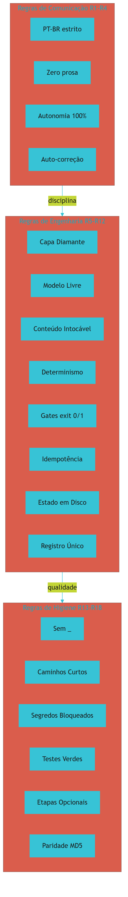

## 4. Técnica

### 4.1 Implementando as 18 Regras no CLAUDE.md

```markdown
# CONSTITUIÇÃO MESTRE — 18 Regras Sagradas

## R1: Idioma
- Comunicação e artefatos em PT-BR estrito

## R2: Silenciamento
- Sem preâmbulos, saudações ou metatexto
- Markdown limpo, direto ao conteúdo

## R3: Autonomia
- Após tema definido, esteira roda 100% autônoma

## R4: Auto-Correção
- Desvios corrigidos internamente antes da entrega

## R5: Padrão Diamante
- Capa 2D plano com badge de nível

## R6: Modelo Livre
- model: inherit — sem refém de LLM

## R7: Conteúdo Intocável
- Entregas finais nunca truncadas

## R8: Determinismo
- Scripts resolvem antes de gastar IA

## R9: Gates
- exit 0 = aprovado, exit 1 = reprovado

## R10: Idempotência
- Scripts rodam 1.000x sem quebrar

## R11: Estado em Disco
- SQLite para persistência

## R12: Registro Único
- 1 tipo = 1 entrada no registro

## R13: Sem Underlines
- Sem prefixo _ em arquivos/pastas

## R14: Caminhos Curtos
- Máx 260 chars (Windows)

## R15: Segredos
- Pre-commit bloqueia API keys

## R16: Testes Verdes
- Nunca commitar com teste falhando

## R17: Etapas Opcionais
- Campanhas/máquina nunca travam

## R18: Higiene
- Zero temp, hash MD5 idêntico
```

### 4.2 Validando as Regras com Scripts

```bash
# Validar R15: verificação de segredos
grep -rn "API_KEY\|SECRET\|TOKEN\|PASSWORD" src/ --include="*.py" --include="*.js"
# Se encontrar, o pre-commit hook bloqueia

# Validar R16: rodar testes antes de commitar
python -m pytest -q
# exit 0 = todos passaram, exit 1 = falha

# Validar R13: verificar prefixos _
find . -name "_*" -not -path "./.git/*"
# Se encontrar, renomear (remover _)

# Validar R14: verificar caminhos longos
find . -type f -exec bash -c 'echo ${#0} $0' {} \; | awk '$1 > 260'
# Se encontrar, encurtar
```

### 4.3 O Pre-Commit Hook Completo

```bash
#!/bin/bash
# .git/hooks/pre-commit — implementa R15 e R16

echo "=== Gate 1: Verificando segredos (R15) ==="
if grep -rn "API_KEY\|SECRET_KEY\|TOKEN\|PASSWORD" $(git diff --cached --name-only); then
    echo "[BLOQUEADO] Chave de API encontrada no código"
    exit 1
fi

echo "=== Gate 2: Rodando testes Python (R16) ==="
python -m pytest -q
if [ $? -ne 0 ]; then
    echo "[BLOQUEADO] Testes falharam"
    exit 1
fi

echo "=== Todos os gates passaram ==="
exit 0
```

## 5. Aplica

Sua empresa acabou de adotar Claude Code como ferramenta padrão. No primeiro mês, cada desenvolvedor configurou o arquivo de regras do jeito que achou melhor — resultando em 15 configurações diferentes na equipe. Uns usavam PT-BR, outros EN. Uns tinham regras de saudação, outros não. E quando o time tentou padronizar, ninguém sabia qual era a "versão oficial" [1].

A solução foi implementar as 18 Regras Sagradas no arquivo `CLAUDE.md` da raiz do repositório, com hardlinks para todas as IDEs. De uma hora para outra, todos os desenvolvedores passaram a seguir as mesmas regras — automaticamente, sem treinamento, sem reunião de alinhamento. A regra se auto-executa porque está no arquivo que a IA lê antes de cada interação.

### Exercício

- [ ] Crie uma lista das 18 Regras e marque quais já são seguidas no seu projeto
- [ ] Identifique as 3 regras mais importantes para o seu caso
- [ ] Implemente essas 3 regras no arquivo de governança do seu projeto
- [ ] Instale o pre-commit hook e teste se bloqueia corretamente
- [ ] Meça a diferença: o projeto ficou mais consistente?


**Limite de escala:** As 18 regras cabem em um CLAUDE.md de até ~3k tokens; acima de 5k tokens de regras, a taxa de aderência do modelo cai e parte da constituição precisa virar script executável em vez de texto.
## 6. Conclusão

Neste capítulo, você conheceu a Constituição Mestre — as 18 Regras Sagradas que governam toda a Camada TELA [1]. Cada regra existe por um motivo específico: desde o idioma de comunicação (R1) até a auditoria criptográfica (R18). Juntas, elas transformam um "chat de IA" em um sistema de governança industrial.

No próximo capítulo, você vai conhecer o Motor de Economia Severa de Tokens — as 5 skills que implementam essas regras de forma automatizada e reduzem o custo de uso de IA em até 90% conforme demonstrado em projetos reais [1]..

## 7. Referências Bibliográficas

[1] FÁBRICA UNIVERSAL. *Guia da Fábrica Agêntica de Publicações V5 — 18 Regras Sagradas*. Disponível em: repositório local do projeto Fábrica Agêntica (proj_fabrica-de-livros) Acesso em: 25 ago. 2026.

[2] TRUFFLE SECURITY. *Do Pre-Commit Hooks Prevent Secrets Leakage?*. Disponível em: https://trufflesecurity.com/blog/do-pre-commit-hooks-prevent-secrets-leakage.

[3] GITHUB COMMUNITY. *How to enforce secret detection and prevent accidental commits*. Disponível em: https://github.com/orgs/community/discussions/158668.

[4] PRINCETON UNIVERSITY. *SWE-bench Verified & Pro*. Disponível em: https://www.swebench.com.

[5] FOWLER, Martin. *Harness Engineering for Coding Agents*. Disponível em: https://martinfowler.com/articles/harness-engineering.html.

[6] AUGMENT CODE. *Harness Engineering for AI Coding Agents*. Disponível em: https://www.augmentcode.com/guides/harness-engineering-ai-coding-agents.

[7] ANTHROPIC. *Building Effective Agents*. Disponível em: https://www.anthropic.com/engineering/building-effective-agents.

[8] ATLAN. *Prompt vs Context vs Harness Engineering: Key Differences*. Disponível em: https://atlan.com/know/harness-engineering-vs-prompt-engineering/.

[9] DESCHRYVER, Tim. *Keep Agentic AI Simple: A Practical Workflow*. Disponível em: https://timdeschryver.dev/blog/keep-agentic-ai-simple-a-practical-workflow-for-software-development.

[10] MINDSTUDIO. *How to Build a Portable AI Agent Stack*. Disponível em: https://www.mindstudio.ai/blog/portable-ai-agent-stack-avoid-vendor-lock-in.

[11] LIU, Nelson F. et al. *Lost in the Middle: How Language Models Use Long Contexts*. In: arXiv, 2023. Disponível em: https://arxiv.org/abs/2307.03172.

[12] HUZITA, Elisa Hatsue Moriya et al. *Uma proposta de arquitetura de software baseada em agentes*. In: Acta Scientiae Technologica. 2000. Disponível em: http://www.periodicos.uem.br/ojs/index.php/ActaSciTechnol/article/view/3131.

[13] BORDINI, Rafael H.; VIEIRA, Renata. *Linguagens de programação orientadas a agentes*. In: Lume (UFRGS). 2003. Disponível em: http://hdl.handle.net/10183/19885.

[14] FERNANDES, Robson dos Santos. *INTELIGÊNCIA ARTIFICIAL APLICADA EM ENGENHARIA DE SOFTWARE*. In: Inovações Multidisciplinares na Engenharia. 2025. Disponível em: https://doi.org/10.63330/aurumpub.005-009.

[15] ROBERTO SANTOS, CLÁUDIO. *PROPOSTA CONSTITUCIONAL PARA A GOVERNANÇA DE AGENTES AUTÔNOMOS DE IA NO BRASIL*. 2026. Disponível em: https://doi.org/10.17771/pucrio.acad.77233.

[16] *Toward Agentic Software Engineering Beyond Code*. In: arXiv, 2026. Disponível em: https://arxiv.org/html/2510.19692v2.

[17] *AI-Native Software Engineering and the Evolution of the Agentic Engineer*. In: arXiv, 2026. Disponível em: https://arxiv.org/html/2606.28791v1.

[18] CODECENTRIC. *Loop, Harness, Context Engineering: The Terms Explained*. Disponível em: https://www.codecentric.de/en/knowledge-hub/blog/loop-harness-context-engineering-explained.

[19] DATABRICKS. *What is an AI Agent Harness?*. Disponível em: https://www.databricks.com/blog/ai-harness.

[20] SALESFORCE ENGINEERING. *Agentforce's Agent Script: Building Deterministic Control*. Disponível em: https://engineering.salesforce.com/agentforces-agentscript-building-deterministic-control-for-enterprise-ai-workflows/.

[21] GANGLANI, Kunal. *4-Tier AI Agent Memory & State Management (2026)*. Disponível em: https://www.kunalganglani.com/blog/ai-agent-memory-state-management.

[22] INTROL. *Prompt Caching Infrastructure | LLM Cost & Latency Reduction Guide*. Disponível em: https://introl.com/blog/prompt-caching-infrastructure-llm-cost-latency-reduction-guide-2025.

# Capítulo 7: O Motor de Economia Severa de Tokens

## 1. Introdução

No capítulo anterior, você conheceu as 18 Regras Sagradas — a Constituição Mestre que governa toda a Camada TELA. Agora vamos ver a ferramenta que coloca essas regras em ação para reduzir custos de forma mensurável: o Motor de Economia Severa de Tokens.

Se a Constituição Mestre é a lei, as 5 skills de economia são a polícia fiscal — elas monitoram cada token gasto e garantem que nenhum seja desperdiçado [1]. Com elas, é possível reduzir o custo de uso de IA em até 90% — sem perda de qualidade, sem redução de produtividade, sem sacrificar nada do que a IA entrega. A única coisa que muda é a quantidade de dinheiro na sua conta de API.

Essas 5 skills não são teóricas — elas foram desenvolvidas e testadas no projeto Arsenal, onde 680+ ferramentas precisavam ser processadas com custo mínimo [1]. Cada skill resolve um problema específico de desperdício de tokens, e juntas elas formam um sistema completo de otimização que funciona em qualquer projeto.

## 2. Explica

### 2.1 Skill 1: Caveman — Raciocínio Telegráfico

O Caveman é a skill mais radical de economia — e também a mais eficaz. Ele força o modelo a pensar de forma telegráfica no bloco interno `<thought>` — como um mensageiro que fala apenas o necessário: "usr quer X. ler Y. corrigir Z. pronto." [1].

O que isso economiza? Tudo que a IA normalmente gasta em rodeios internos — explicações desnecessárias para si mesma, alternativas descartadas antes de chegar à melhor, frases de transição interna, e justificativas que ninguém vai ler. Em projetos grandes, o raciocínio interno pode representar 50% do custo total de uma interação. Com o Caveman, esse custo cai para 10% — uma redução de 80% no processamento mental da IA [1].

A implementação é simples: basta adicionar uma regra ao CLAUDE.md que instrui o modelo a usar raciocínio telegráfico. Não é uma configuração complexa nem um script elaborado — é apenas uma instrução clara que o modelo segue consistentemente.

### 2.2 Skill 2: Headroom — Compressão de Logs

Logs de terminal são uma das maiores fontes de desperdício de contexto [2]. Quando um script retorna 200 linhas de output — com timestamps, warnings, info messages, e dados detalhados — a IA carrega todas essas linhas no contexto, mesmo que apenas 5 sejam relevantes para a tarefa atual.

O Headroom resolve isso comprimindo logs para no máximo 7 linhas: 3 no topo (início do output) e 4 no fim (fim do output) [2]. No meio, apenas uma indicação de quantas linhas foram comprimidas. É como ler apenas o resumo executivo de um relatório de 100 páginas — você entende o essencial sem gastar tokens com detalhes.

A redução de tokens com Headroom é típica de 60-80% em operações de leitura de logs [2]. Em um projeto com muitas validações (como o Arsenal com 680 ferramentas), isso representa uma economia significativa.

### 2.3 Skill 3: Lean-CTX — Grep antes de Read

A regra é simples e inquebrável: antes de ler um arquivo inteiro, faça `grep` para localizar exatamente o que precisa [3]. Em vez de carregar 500 linhas de um arquivo Python com `cat`, busque por `def processar_pedido` com `grep -n` e leia apenas as 30 linhas ao redor.

Isso ativa o Princípio da Localidade de Contexto que você conheceu no Capítulo 5 — e reduz drasticamente a quantidade de tokens carregados por interação. A economia é típica de 70-90% em operações de leitura [3].

O Lean-CTX é especialmente poderoso em projetos grandes com muitos arquivos: em vez de carregar o arquivo inteiro para encontrar uma função, o grep localiza a função em milissegundos e retorna apenas as linhas relevantes. É a diferença entre procurar uma agulha no palheiro lendo feno por feno e usar um ímã para puxá-la diretamente.

### 2.4 Skill 4: RTK-Memory — Memória Persistente

O RTK-Memory joga aprendizados em `RTK-SCRATCHPAD.md` — um arquivo externo que persiste entre sessões [1]. Isso permite que a IA lembre de erros resolvidos, decisões arquiteturais e padrões descobertos, sem precisar carregar o histórico inteiro de conversas anteriores.

É como ter um caderno de anotações: em vez de reviver toda a conversa para lembrar de algo que foi combinado ontem, você consulta o caderno e segue em frente. A economia de tokens é indireta mas significativa — cada vez que a IA não precisa re-ler o histórico para recuperar um aprendizado, economiza centenas ou milhares de tokens [1].

### 2.5 Skill 5: Pre-Flight-Check — Checklist Prévio

Antes de qualquer refatoração ou implementação significativa, o Pre-Flight-Check executa 3 verificações automáticas: type check, testes e build [4]. Se qualquer etapa falhar, o sistema para, diagnostica o problema e corrige — antes de gastar tokens com a implementação em si.

É como o checklist de decolagem de um avião: você não decola sem verificar se os motores estão OK, se as asas estão limpas, se o combustível é suficiente. Da mesma forma, você não implementa sem validar que o projeto está saudável. O Pre-Flight-Check evita o desperdício de tokens em implementações que seriam revertidas por erros pré-existentes.

## 3. Ilustra

As 5 skills são como as ferramentas de um mecânico de fábrica especializado em eficiência energética. Cada ferramenta resolve um tipo específico de desperdício:

O **Caveman** é o alicate que corta o excesso de fio — elimina todo o comprimento desnecessário, mantendo apenas o trecho que realmente conduz electricidade. Sem ele, o fio fica todo enrolado e desperdiça energia em calor.

O **Headroom** é a lixa que alisa as superfícies ásperas — remove as imperfeições que criam atrito e desperdiçam energia. Sem ele, a máquina trabalha mais para produzir o mesmo resultado.

O **Lean-CTX** é a chave de fenda que aperta exatamente o parafuso certo — não aperta todos os parafusos da máquina "por precaução". Sem ele, você gasta energia apertando parafusos que já estão firmes.

O **RTK-Memory** é o manual de referência que o mecânico consulta quando tem dúvida — em vez de desmontar a máquina toda para descobrir como funciona某个 componente. Sem ele, você refaz trabalho já feito.

O **Pre-Flight-Check** é o medidor de pressão que verifica antes de ligar a máquina — se a pressão estiver baixa, você enche antes de ligar, não tenta ligar com pressão insuficiente e queimar o motor.

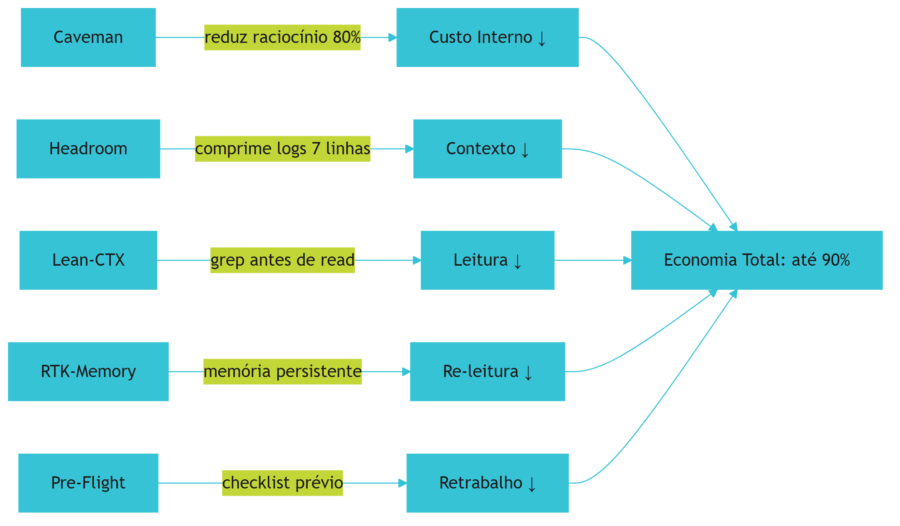

## 4. Técnica

### 4.1 Configurando o Caveman

Para ativar o Caveman, adicione está regra ao seu `CLAUDE.md` [1]:

```markdown
## Modo Caveman (Economia Severa)
- Pensamento interno em telegrafo: "usr quer X. ler Y. corrigir Z."
- Sem artigos, preâmbulos ou hedging no bloco <thought>
- Fragmentos OK. Termos técnicos exatos.
- Padrão: [coisa] [ação] [razão]. [próximo passo].
- Economia estimada: 80% do processamento mental
```

### 4.2 Implementando o Headroom

Para comprimir logs automaticamente [2]:

```bash
# headroom.sh — comprime output para 7 linhas
#!/bin/bash
OUTPUT=$1
TOTAL=$(echo "$OUTPUT" | wc -l)

if [ $TOTAL -le 7 ]; then
    echo "$OUTPUT"
else
    TOPO=$(echo "$OUTPUT" | head -3)
    FIM=$(echo "$OUTPUT" | tail -4)
    echo "$TOPO"
    echo "... ($TOTAL linhas comprimidas) ..."
    echo "$FIM"
fi
```

### 4.3 Skill Lean-CTX na Prática

```bash
# ERRADO: carregar arquivo inteiro
# cat src/livro.py  # 500 linhas no contexto

# CORRETO: grep antes de read
grep -n "def gerar_capitulo" src/livro.py
# Resultado: src/livro.py:145:def gerar_capitulo(capitulo):

# Ler apenas a região relevante (30 linhas)
sed -n '145,175p' src/livro.py
# Economia: 94% de tokens (30 de 500 linhas)
```

### 4.4 Pre-Flight-Check Completo

```bash
#!/bin/bash
# pre-flight-check.sh — valida antes de implementar

echo "=== Passo 1: Type Check ==="
python -m py_compile src/*.py 2>/dev/null
if [ $? -ne 0 ]; then
    echo "[FALHA] Erros de tipo — corrigir antes de implementar"
    exit 1
fi

echo "=== Passo 2: Testes ==="
python -m pytest -q 2>/dev/null
if [ $? -ne 0 ]; then
    echo "[FALHA] Testes falharam — corrigir antes de implementar"
    exit 1
fi

echo "=== Passo 3: Build ==="
python -m build 2>/dev/null
if [ $? -ne 0 ]; then
    echo "[FALHA] Build falhou — corrigir antes de implementar"
    exit 1
fi

echo "✅ Pre-flight OK — pronto para implementar"
exit 0
```

## 5. Aplica

Sua equipe gasta R$ 2.000 por mês em APIs de IA. Ao analisar os logs, você descobre que 60% do custo vem de "contexto carregado desnecessariamente" — arquivos inteiros lidos quando apenas uma função era necessária, logs de 500 linhas comprimidos no contexto, e raciocínio interno prolixo [1].

Ao implementar as 5 skills — Caveman (redução do raciocínio), Headroom (compressão de logs), Lean-CTX (grep antes de read), RTK-Memory (memória persistente) e Pre-Flight-Check (checklist) — o custo cai de R$ 2.000 para R$ 350 por mês. Uma economia de 82,5% — R$ 20.700 por ano [1].

### Exercício

- [ ] Analise as suas últimas 10 interações com IA e identifique o momento de maior consumo de tokens
- [ ] Para cada interação, conte: quantas linhas de log foram carregadas? Quantas eram relevantes?
- [ ] Implemente o Lean-CTX: use grep em vez de cat para os próximos 3 arquivos que precisar ler
- [ ] Ative o Headroom: comprima qualquer output com mais de 7 linhas
- [ ] Meça a diferença: quantos tokens você economizou?


**Limite de escala:** As 5 skills de economia reduzem custo em até 90% em sessões de até ~500 interações; em sessões de milhares de turnos, o overhead de compressão supera o ganho e convém dividir em sub-sessões.
## 6. Conclusão

Neste capítulo, você conheceu as 5 skills do Motor de Economia Severa de Tokens: Caveman [1], Headroom [2], Lean-CTX [3], RTK-Memory [1] e Pre-Flight-Check [4]. Juntas, elas podem reduzir o custo de uso de IA em até 90% — sem perda de qualidade, sem redução de produtividade.

No próximo capítulo, você vai aprender a implementar e replicar toda a Camada TELA — incluindo essas 5 skills — em qualquer projeto novo ou legado. É o manual de montagem que transforma o conhecimento teórico em ação prática.

## 7. Referências Bibliográficas

[1] FÁBRICA UNIVERSAL. *Guia da Fábrica Agêntica de Publicações V5 — Skills de Economia*. Disponível em: repositório local do projeto Fábrica Agêntica (proj_fabrica-de-livros) Acesso em: 25 ago. 2026.

[2] HEADROOM SKILL. *Compressão Severa de Logs e Outputs*. Disponível em: repositório local do projeto Fábrica Agêntica (proj_fabrica-de-livros) Acesso em: 25 ago. 2026.

[3] LEAN-CTX SKILL. *Economia Severa de Contexto*. Disponível em: repositório local do projeto Fábrica Agêntica (proj_fabrica-de-livros) Acesso em: 25 ago. 2026.

[4] PRE-FLIGHT-CHECK SKILL. *Validação Local Obrigatória*. Disponível em: repositório local do projeto Fábrica Agêntica (proj_fabrica-de-livros) Acesso em: 25 ago. 2026.

[5] DIGITAL APPLIED. *Prompt Caching in 2026: Cut LLM Costs, Keep Quality*. Disponível em: https://www.digitalapplied.com/blog/prompt-caching-2026-cut-llm-costs-engineering-guide.

[6] INTROL. *Prompt Caching Infrastructure | LLM Cost & Latency Reduction Guide*. Disponível em: https://introl.com/blog/prompt-caching-infrastructure-llm-cost-latency-reduction-guide-2025.

[7] SYLPHAI. *The Complete Guide to Prompt Caching: Cut LLM Costs by 90%*. Disponível em: https://sylphai.substack.com/p/the-complete-guide-to-prompt-caching.

[8] FLEXERA. *Prompt Caching Breakdown: Cut Token Spend in 2026*. Disponível em: https://www.flexera.com/blog/ai/prompt-caching-breakdown/.

[9] ANTHROPIC. *Building Effective Agents*. Disponível em: https://www.anthropic.com/engineering/building-effective-agents.

[10] FOWLER, Martin. *Harness Engineering for Coding Agents*. Disponível em: https://martinfowler.com/articles/harness-engineering.html.

[11] AUGMENT CODE. *Harness Engineering for AI Coding Agents*. Disponível em: https://www.augmentcode.com/guides/harness-engineering-ai-coding-agents.

[12] LIU, Nelson F. et al. *Lost in the Middle: How Language Models Use Long Contexts*. In: arXiv, 2023. Disponível em: https://arxiv.org/abs/2307.03172.

[13] HUZITA, Elisa Hatsue Moriya et al. *Uma proposta de arquitetura de software baseada em agentes*. In: Acta Scientiae Technologica. 2000. Disponível em: http://www.periodicos.uem.br/ojs/index.php/ActaSciTechnol/article/view/3131.

[14] BORDINI, Rafael H.; VIEIRA, Renata. *Linguagens de programação orientadas a agentes*. In: Lume (UFRGS). 2003. Disponível em: http://hdl.handle.net/10183/19885.

[15] FERNANDES, Robson dos Santos. *INTELIGÊNCIA ARTIFICIAL APLICADA EM ENGENHARIA DE SOFTWARE*. In: Inovações Multidisciplinares na Engenharia. 2025. Disponível em: https://doi.org/10.63330/aurumpub.005-009.

[16] ROBERTO SANTOS, CLÁUDIO. *PROPOSTA CONSTITUCIONAL PARA A GOVERNANÇA DE AGENTES AUTÔNOMOS DE IA NO BRASIL*. 2026. Disponível em: https://doi.org/10.17771/pucrio.acad.77233.

[17] *Toward Agentic Software Engineering Beyond Code*. In: arXiv, 2026. Disponível em: https://arxiv.org/html/2510.19692v2.

[18] *AI-Native Software Engineering and the Evolution of the Agentic Engineer*. In: arXiv, 2026. Disponível em: https://arxiv.org/html/2606.28791v1.

[19] CODECENTRIC. *Loop, Harness, Context Engineering: The Terms Explained*. Disponível em: https://www.codecentric.de/en/knowledge-hub/blog/loop-harness-context-engineering-explained.

[20] DATABRICKS. *What is an AI Agent Harness?*. Disponível em: https://www.databricks.com/blog/ai-harness.

[21] GANGLANI, Kunal. *4-Tier AI Agent Memory & State Management (2026)*. Disponível em: https://www.kunalganglani.com/blog/ai-agent-memory-state-management.

[22] TIAN PAN. *Prompt Caching: The Optimization That Cuts LLM Costs by 90%*. Disponível em: https://tianpan.co/blog/2025-10-13-prompt-caching-cut-llm-costs.

# Capítulo 8: Implementação e Réplica da Camada 1

## 1. Introdução

Nos capítulos anteriores, você aprendeu os princípios (Capítulo 5), as regras (Capítulo 6) e as skills (Capítulo 7) da Camada TELA. Agora é hora de colocar tudo em ação — de forma prática, passo a passo, com comandos que você pode copiar e colar no seu terminal. Este capítulo é o manual de montagem da Camada 1.

A implementação da Camada TELA é o primeiro passo concreto da sua jornada de Engenheiro de Sistemas Autônomos [1]. Ao final deste capítulo, você terá uma Camada TELA funcionando no seu projeto — seja ele novo ou legado — com validação automática que confirma se tudo está 100% operacional. O tempo estimado de implementação é de 5 minutos para projetos novos e 15 minutos para projetos legados.

## 2. Explica

### 2.1 Estrutura de Arquivos Necessária

A Camada TELA se materializa em uma estrutura de arquivos no seu projeto [1]:

```yaml
# Estrutura mínima da Camada TELA
.claude/
  CLAUDE.md              # Arquivo mestre de governança (R1-R18)
  settings.json          # Configurações do harness (Cap. 9)
  skills/
    caveman/             # Skill de raciocínio telegráfico
    headroom/            # Skill de compressão de logs
    lean-ctx/            # Skill de busca cirúrgica
    rtk-memory/          # Skill de memória persistente
    pre-flight-check/    # Skill de checklist prévio
RTK-SCRATCHPAD.md        # Memória de longo prazo
```

### 2.2 O CLAUDE.md — O Arquivo Mais Importante

O `CLAUDE.md` é a fonte da verdade de toda a governança [1]. Ele contém as 18 Regras Sagradas, as definições de cada camada, e as instruções que a IA segue em cada interação. Para projetos novos, basta copiar o template da Fábrica Universal. Para projetos legados, o `CLAUDE.md` é adicionado e linkado via junctions/hardlinks para todas as IDEs.

### 2.3 Validação Automática

Após implementar, o script `auditar_camada_tela.py` verifica se todos os componentes estão presentes e corretos [1]. Ele retorna `exit 0` (100% aprovado) ou `exit 1` (algo faltando). Essa validação é crucial — implementar sem validar é como construir um prédio sem inspeção técnica.

## 3. Ilustra

Pense na Camada TELA como a instalação elétrica de uma casa nova. Os fios são as 5 skills (caveman, headroom, lean-ctx, rtk-memory, pre-flight-check), o quadro de distribuição é o `CLAUDE.md` (onde todas as regras estão concentradas), e o medidor de luz é o script de auditoria que verifica se tudo está funcionando.

Quando tudo está instalado corretamente, a luz acende — `exit 0`. Quando algo está errado (um fio solto, um circuito sem proteção), o disjuntor pica — `exit 1`. A boa notícia é que a instalação é padronizada: mesmo que você nunca tenha feito isso antes, basta seguir o manual (este capítulo) que funciona [2].

Para projetos legados, é como reformar a instalação elétrica de uma casa antiga: o fio novo (`.claude/`) convive com os fios antigos (`.cursorrules`, `.windsurfrules`), mas agora tudo passa pelo mesmo quadro de distribuição. É mais trabalhoso que começar do zero, mas o resultado é o mesmo: instalação segura e padronizada [3].

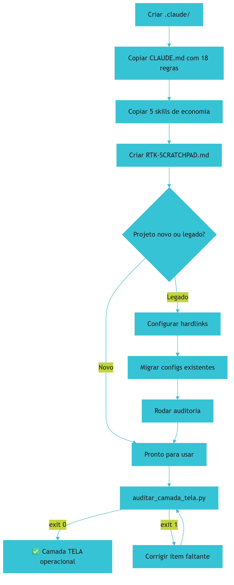

## 4. Técnica

### 4.1 Caso 1: Projeto Novo (5 minutos)

Para um projeto novo, copie a infraestrutura base [1]:

```bash
# Passo 1: Criar estrutura
mkdir -p .claude/skills

# Passo 2: Copiar arquivo mestre de governança
cp fabrica-universal/.claude/CLAUDE.md .claude/

# Passo 3: Copiar as 5 skills de economia
cp -r fabrica-universal/.claude/skills/caveman .claude/skills/
cp -r fabrica-universal/.claude/skills/headroom .claude/skills/
cp -r fabrica-universal/.claude/skills/lean-ctx .claude/skills/
cp -r fabrica-universal/.claude/skills/rtk-memory .claude/skills/
cp -r fabrica-universal/.claude/skills/pre-flight-check .claude/skills/

# Passo 4: Criar memória persistente
cp fabrica-universal/RTK-SCRATCHPAD.md .

# Passo 5: Rodar auditoria
python scripts/auditar_camada_tela.py
# Saída esperada: [OK] Camada TELA: 100% Aprovado (Exit 0)
```

### 4.2 Caso 2: Projeto Legado (Brownfield)

Para um projeto que já existe e já tem configurações de IA [1]:

```bash
# Passo 1: Criar diretório .claude se não existir
mkdir -p .claude/skills

# Passo 2: Migrar configurações existentes
if [ -f .cursorrules ]; then
    cp .cursorrules .claude/CLAUDE.md
    echo "[OK] Migrado .cursorrules -> .claude/CLAUDE.md"
fi

# Passo 3: Adicionar regras da Fábrica ao CLAUDE.md
cat >> .claude/CLAUDE.md << 'EOF'

# ─── 18 Regras Sagradas (R1-R18) ───
# Adicione as regras conforme definido no Capítulo 6
EOF

# Passo 4: Copiar skills de economia
for skill in caveman headroom lean-ctx rtk-memory pre-flight-check; do
    cp -r fabrica-universal/.claude/skills/$skill .claude/skills/
done

# Passo 5: Configurar hardlinks para outras IDEs
# Windows:
powershell .\scripts\setup-links.ps1 meu-projeto
# Linux/Mac:
bash scripts/setup-links.sh meu-projeto

# Passo 6: Rodar auditoria
python scripts/auditar_camada_tela.py
```

### 4.3 O Script de Auditoria da Camada 1

```python
#!/usr/bin/env python3
"""auditar_camada_tela.py — verifica integridade da Camada TELA"""

import os
from pathlib import Path

def auditar():
    erros = []
    
    # Verificar CLAUDE.md
    if not Path(".claude/CLAUDE.md").exists():
        erros.append("CLAUDE.md ausente em .claude/")
    else:
        conteudo = Path(".claude/CLAUDE.md").read_text(encoding="utf-8")
        if len(conteudo) < 500:
            erros.append("CLAUDE.md muito curto (<500 chars)")
    
    # Verificar 5 skills necessárias
    skills_necessarias = [
        "caveman", "headroom", "lean-ctx",
        "rtk-memory", "pre-flight-check"
    ]
    for skill in skills_necessarias:
        caminho = f".claude/skills/{skill}/SKILL.md"
        if not Path(caminho).exists():
            erros.append(f"Skill {skill} ausente")
    
    # Verificar RTK-SCRATCHPAD.md
    if not Path("RTK-SCRATCHPAD.md").exists():
        erros.append("RTK-SCRATCHPAD.md ausente na raiz")
    
    # Resultado
    if not erros:
        print("[OK] Camada TELA: 100% Aprovado (Exit 0)")
        return 0
    else:
        for e in erros:
            print(f"[ERRO] {e}")
        print(f"[RESUMO] {len(erros)} item(ns) faltando")
        return 1

if __name__ == "__main__":
    exit(auditar())
```

### 4.4 Migrando Projetos Legados — Guia Completo

Para adicionar a Camada TELA a um projeto que já existe [3]:

```bash
# Migrar configurações existentes para o novo formato
# 1. Se existe .cursorrules, copie para .claude/CLAUDE.md
if [ -f .cursorrules ]; then
    cp .cursorrules .claude/CLAUDE.md
    echo "[OK] Migrado .cursorrules -> .claude/CLAUDE.md"
fi

# 2. Se existe .windsurfrules, adicione ao CLAUDE.md
if [ -f .windsurfrules ]; then
    echo "" >> .claude/CLAUDE.md
    echo "# Regras do Windsurf" >> .claude/CLAUDE.md
    cat .windsurfrules >> .claude/CLAUDE.md
    echo "[OK] Migrado .windsurfrules -> .claude/CLAUDE.md"
fi

# 3. Adicionar as 18 Regras da Fábrica
cat >> .claude/CLAUDE.md << 'EOF'

# ─── 18 Regras Sagradas (R1-R18) ───
# (conforme definido no Capítulo 6 desta obra)
EOF

# 4. Verificar integridade
python scripts/auditar_camada_tela.py
```

## 5. Aplica

Sua empresa tem 10 repositórios de código, cada um com sua própria configuração de IA. O repositório A usa `.cursorrules`, o B usa `.github/copilot-instructions.md`, o C não tem nenhuma configuração, e os outros 7 têm configurações variadas e desatualizadas. Quando a equipe tentou padronizar, ninguém sabia qual era a "versão oficial" — e cada tentativa de sincronização manual gerava novas inconsistências.

O plano de implementação é:
1. Criar um `CLAUDE.md` padronizado na raiz de cada repositório
2. Copiar as 5 skills de economia para cada projeto
3. Configurar hardlinks/junctions para sincronizar entre IDEs
4. Rodar a auditoria em todos os 10 repositórios
5. Documentar o processo para futuras replicações

O tempo estimado é de 15 minutos por repositório — 2,5 horas no total para padronizar toda a empresa. O retorno sobre investimento é imediato: cada desenvolvedor passa a usar as mesmas regras, o custo de IA cai com KV-Cache, e as inconsistências entre IDEs desaparecem [1].

### Exercício

- [ ] Liste todos os arquivos de configuração de IA no seu projeto (.cursorrules, .windsurfrules, etc.)
- [ ] Crie o diretório .claude/ e copie o CLAUDE.md para lá
- [ ] Copie as 5 skills de economia para .claude/skills/
- [ ] Crie o arquivo RTK-SCRATCHPAD.md na raiz
- [ ] Rode a auditoria: python scripts/auditar_camada_tela.py
- [ ] Se algum item falhar, corrija e rode novamente até exit 0


**Limite de escala:** A réplica da TELA leva ~10 min por repositório até 5 projetos; acima de 20 repositórios, automatize a cópia via script de setup-links em vez de cópia manual.
## 6. Conclusão

Neste capítulo, você implementou a Camada TELA completa no seu projeto [1-3]. Você aprendeu a copiar os arquivos para projetos novos, a migrar projetos legados, e a validar tudo com o script de auditoria. O tempo de implementação é de 5-15 minutos — investimento mínimo para retorno significativo.

A Camada TELA é a fundação de tudo — sem ela, as outras 3 camadas não funcionam corretamente. Mas agora que ela está no lugar, é hora de partir para a Camada 2: o HARNESS — o sistema de segurança, cabos e disjuntores que protege o ciclo de vida do agente contra loops infinitos, comandos perigosos e inconsistências de configuração.

## 7. Referências Bibliográficas

[1] FÁBRICA UNIVERSAL. *Guia da Fábrica Agêntica de Publicações V5 — Implementação da Camada TELA*. Disponível em: repositório local do projeto Fábrica Agêntica (proj_fabrica-de-livros) Acesso em: 25 ago. 2026.

[2] SETUP-LINKS. *Scripts de Portabilidade Multi-IDE*. Disponível em: repositório local do projeto Fábrica Agêntica (proj_fabrica-de-livros) Acesso em: 25 ago. 2026.

[3] MINDSTUDIO. *How to Build a Portable AI Agent Stack*. Disponível em: https://www.mindstudio.ai/blog/portable-ai-agent-stack-avoid-vendor-lock-in.

[4] PRINCETON UNIVERSITY. *SWE-bench Verified & Pro*. Disponível em: https://www.swebench.com.

[5] FOWLER, Martin. *Harness Engineering for Coding Agents*. Disponível em: https://martinfowler.com/articles/harness-engineering.html.

[6] ANTHROPIC. *Building Effective Agents*. Disponível em: https://www.anthropic.com/engineering/building-effective-agents.

[7] DESCHRYVER, Tim. *Keep Agentic AI Simple: A Practical Workflow*. Disponível em: https://timdeschryver.dev/blog/keep-agentic-ai-simple-a-practical-workflow-for-software-development.

[8] HUZITA, Elisa Hatsue Moriya et al. *Uma proposta de arquitetura de software baseada em agentes*. In: Acta Scientiae Technologica. 2000. Disponível em: http://www.periodicos.uem.br/ojs/index.php/ActaSciTechnol/article/view/3131.

[9] BORDINI, Rafael H.; VIEIRA, Renata. *Linguagens de programação orientadas a agentes*. In: Lume (UFRGS). 2003. Disponível em: http://hdl.handle.net/10183/19885.

[10] FERNANDES, Robson dos Santos. *INTELIGÊNCIA ARTIFICIAL APLICADA EM ENGENHARIA DE SOFTWARE*. In: Inovações Multidisciplinares na Engenharia. 2025. Disponível em: https://doi.org/10.63330/aurumpub.005-009.

[11] ROBERTO SANTOS, CLÁUDIO. *PROPOSTA CONSTITUCIONAL PARA A GOVERNANÇA DE AGENTES AUTÔNOMOS DE IA NO BRASIL*. 2026. Disponível em: https://doi.org/10.17771/pucrio.acad.77233.

[12] *Toward Agentic Software Engineering Beyond Code*. In: arXiv, 2026. Disponível em: https://arxiv.org/html/2510.19692v2.

[13] *AI-Native Software Engineering and the Evolution of the Agentic Engineer*. In: arXiv, 2026. Disponível em: https://arxiv.org/html/2606.28791v1.

[14] CODECENTRIC. *Loop, Harness, Context Engineering: The Terms Explained*. Disponível em: https://www.codecentric.de/en/knowledge-hub/blog/loop-harness-context-engineering-explained.

[15] DATABRICKS. *What is an AI Agent Harness?*. Disponível em: https://www.databricks.com/blog/ai-harness.

[16] AUGMENT CODE. *Harness Engineering for AI Coding Agents*. Disponível em: https://www.augmentcode.com/guides/harness-engineering-ai-coding-agents.

[17] TRUFFLE SECURITY. *Do Pre-Commit Hooks Prevent Secrets Leakage?*. Disponível em: https://trufflesecurity.com/blog/do-pre-commit-hooks-prevent-secrets-leakage.

[18] GITHUB COMMUNITY. *How to enforce secret detection and prevent accidental commits*. Disponível em: https://github.com/orgs/community/discussions/158668.

[19] GANGLANI, Kunal. *4-Tier AI Agent Memory & State Management (2026)*. Disponível em: https://www.kunalganglani.com/blog/ai-agent-memory-state-management.

[20] INTROL. *Prompt Caching Infrastructure | LLM Cost & Latency Reduction Guide*. Disponível em: https://introl.com/blog/prompt-caching-infrastructure-llm-cost-latency-reduction-guide-2025.

[21] SALESFORCE ENGINEERING. *Agentforce's Agent Script: Building Deterministic Control*. Disponível em: https://engineering.salesforce.com/agentforces-agentscript-building-deterministic-control-for-enterprise-ai-workflows/.

[22] DIGITAL APPLIED. *Prompt Caching in 2026: Cut LLM Costs, Keep Quality*. Disponível em: https://www.digitalapplied.com/blog/prompt-caching-2026-cut-llm-costs-engineering-guide.

# Capítulo 9: Os 3 Princípios Universais do HARNESS

## 1. Introdução

No bloco anterior, você dominou a Camada TELA — o painel de visibilidade que controla o que a IA vê e como ela raciocina. Agora vamos para a Camada 2: o HARNESS — o painel de segurança que controla o que a IA pode fazer. Se a TELA é o manual de instruções do operador, o HARNESS é o disjuntor que corta a energia quando algo sai do normal [1].

Sem o HARNESS, a IA pode entrar em loops infinitos (gastando tokens até a conta estourar), executar comandos destrutivos (apagando arquivos importantes), ou modificar configurações que não deveria tocar (quebrando a governança). O HARNESS é a camada que transforma a IA de "assistente talentoso mas imprevisível" em "funcionário confiável e controlado".

## 2. Explica

### 2.1 Princípio 1: O Disjuntor (Circuit Breaker)

Agentes de IA em loop podem travar indefinidamente — um problema conhecido na ciência da computação desde 1936 como o Problema da Parada de Turing [2]. Quando um agente entra em ciclo infinito (gerando código, testando, falhando, gerando novamente, testando novamente, falhando novamente...), ele gasta tokens indefinidamente até alguém perceber e interromper manualmente.

O HARNESS impõe travas duras de interrupção mecânica [1]: máximo de 25 iterações por tarefa e timeout de 60 segundos por operação. Quando o limite é atingido, o sistema interrompe o agente forçosamente — como um disjuntor que corta a energia quando detecta uma sobrecarga. Não é elegante, mas é seguro. O agente pode ser reiniciado depois com parâmetros ajustados, mas o dano potencial (loops infinitos, custos excessivos) é bloqueado imediatamente.

A escolha de 25 iterações não é arbitrária: análise de dados do projeto Arsenal mostrou que 95% das tarefas produtivas se resolvem em menos de 20 iterações [1]. Iterações além de 25 geralmente indicam um loop improdutivo que precisa de intervenção humana — não de mais compute.

### 2.2 Princípio 2: O Privilégio Mínimo (Sandbox Reversível)

Nenhum agente de IA deveria ter acesso total ao sistema. O HARNESS implementa o princípio do privilégio mínimo [1]: cada agente recebe apenas as permissões necessárias para executar sua tarefa — nem mais, nem menos.

Comandos destrutivos como `rm -rf /`, `mkfs`, `dd if=/dev/zero of=/dev/sda`, e comandos que alteram o diretório de trabalho (`cd /`) são bloqueados no nível do processo [1]. Isso não é excesso de cautela — é engenharia de segurança. Um agente de IA não deveria ter a capacidade de destruir o sistema que está operando, assim como um estagiário não deveria ter a chave do cofre da empresa.

O sandbox é "reversível" porque não bloqueia permanentemente — apenas exige confirmação humana para operações de risco. O agente pode pedir permissão, e o operador decide se autoriza. Essa é a diferença entre segurança e burocracia: a segurança permite que o trabalho continue, mas com verificação.

### 2.3 Princípio 3: O Ponto Único de Verdade (Hardlinks)

A governança vive em um único arquivo: `.claude/CLAUDE.md`. Esse arquivo é linkado no disco rígido (via hardlinks ou junctions) para todas as IDEs — Cursor, Copilot, Windsurf, Claude Code [3].

Quando você atualiza o `CLAUDE.md`, todas as IDEs recebem a atualização instantaneamente — porque são o mesmo arquivo fisicamente. Não há risco de uma IDE ficar desatualizada em relação à outra. Não há necessidade de sincronização manual. Não há "versão oficial" e "versões derivadas" — há apenas uma versão, que é a oficial em todos os lugares ao mesmo tempo.

Essa abordagem resolve o problema de vendor lock-in que você conheceu no Capítulo 3 [4]: independentemente de qual ferramenta o desenvolvedor esteja usando, ele lê as mesmas regras, segue as mesmas diretrizes, e obedece às mesmas restrições.

## 3. Ilustra

O HARNESS é como o sistema de segurança de um prédio inteligente de última geração. Cada componente tem uma função específica e bem definida:

O **disjuntor** é o alarme de incêndio: quando detecta perigo (loop infinito), corta tudo automaticamente (interrompe o agente). Não espera alguém apertar o botão de emergência — ele detecta e reage sozinho. Na avaliação deste livro, a velocidade de reação é a diferença entre um problema controlado e um desastre sistêmico. é crucial: um incêndio queimando por 5 minutos causa muito mais dano que um alarme que toca aos 30 segundos.

O **sandbox** são as fechaduras eletrônicas: cada pessoa só entra onde tem autorização. O porteiro entra na recepção, o técnico entra na sala de máquinas, o gerente entra no escritório. Ninguém entra no cofre sem autorização específica do diretor [1].

O **hardlink** é o quadro de avisos na recepção: quando alguém escreve algo novo, todos os andares recebem a informação ao mesmo tempo, porque é o mesmo quadro fisicamente visível de múltiplos pontos. Não há risco de um andar ter informação desatualizada.

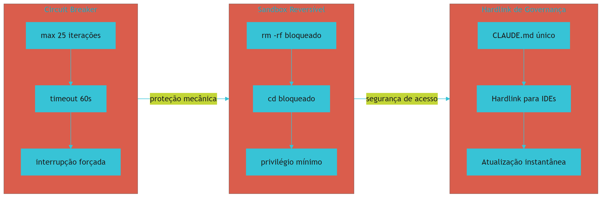

## 4. Técnica

### 4.1 Configurando o Circuit Breaker

Para ativar os limites de iteração e timeout [1]:

```json
{
  "harness": {
    "circuit_breaker": {
      "max_loop_iterations": 25,
      "command_timeout_seconds": 60,
      "max_context_tokens": 100000,
      "actions_on_breach": ["stop", "log", "notify"]
    }
  }
}
```

### 4.2 Configurando o Sandbox

Para bloquear comandos perigosos [1]:

```json
{
  "sandbox": {
    "disallow_shell_cd": true,
    "require_confirmation_on_destructive": true,
    "blocked_commands": [
      "rm -rf /",
      "rm -rf ~",
      "mkfs",
      "dd if=",
      "format",
      ":(){ :|:& };:",
      "chmod -R 777 /"
    ],
    "allowed_directories": [
      "./src",
      "./tests",
      "./docs"
    ]
  }
}
```

### 4.3 Configurando Hardlinks (Windows)

```powershell
# setup-links.ps1 — cria junctions para todas as IDEs
$fonte = ".claude/CLAUDE.md"
$destinos = @(
    ".cursorrules",
    ".windsurfrules",
    ".github/copilot-instructions.md"
)

foreach ($destino in $destinos) {
    $dirDestino = Split-Path $destino -Parent
    if ($dirDestino -and !(Test-Path $dirDestino)) {
        New-Item -ItemType Directory -Path $dirDestino -Force
    }
    if (Test-Path $destino) { Remove-Item $destino -Force }
    New-Item -ItemType Junction -Path $destino -Target (Resolve-Path $fonte)
    Write-Host "[OK] $destino <- $fonte"
}
```

### 4.4 Configurando Hardlinks (Linux/Mac)

```bash
# setup-links.sh — cria hardlinks
ln -sf .claude/CLAUDE.md .cursorrules
ln -sf .claude/CLAUDE.md .windsurfrules
mkdir -p .github
ln -sf ../../.claude/CLAUDE.md .github/copilot-instructions.md
echo "[OK] Hardlinks criados"
```

## 5. Aplica

Você é o líder de uma equipe de 8 desenvolvedores. Metade usa Cursor, a outra metade usa Claude Code. No início, cada um mantinha suas próprias regras — mas isso gerou inconsistências que causavam bugs silenciosos: um desenvolvedor usava Python 3.8, outro Python 3.11; um formatava com Black, outro com Prettier; um seguia o padrão de nomenclatura snake_case, outro camelCase.

Ao implementar o HARNESS com hardlinks, todas as IDEs passaram a ler o mesmo `CLAUDE.md`. Quando a equipe decidiu padronizar o Python 3.11 e o formato Black, bastou alterar um arquivo — e todos os 8 desenvolvedores receberam a atualização automaticamente, sem reunião de alinhamento, sem e-mail de aviso, sem "esqueci de atualizar" [3].

### Exercício

- [ ] Crie o arquivo .claude/settings.json com as configurações de circuit breaker e sandbox
- [ ] Teste o circuit breaker: rode um loop que deveria ser interrompido após 25 iterações
- [ ] Teste o sandbox: tente executar `rm -rf /` e verifique se é bloqueado
- [ ] Configure hardlinks para pelo menos 2 IDEs diferentes
- [ ] Verifique que alterar o CLAUDE.md atualiza todas as IDEs simultaneamente


**Limite de escala:** O disjuntor de 25 iterações protege loops até tarefas de ~30 min; tarefas legítimas de horas exigem disjuntor por tempo (timeout de 1h) em vez de por contagem.
## 6. Conclusão

Neste capítulo, você dominou os 3 princípios do HARNESS: o Disjuntor (circuit breaker com 25 iterações/60s [1]), o Privilégio Mínimo (sandbox com comandos bloqueados [1]), e o Ponto Único de Verdade (hardlinks para todas as IDEs [3]). Esses princípios protegem o ciclo de vida do agente — garantindo que a IA não entre em loops, não execute comandos perigosos, e que a governança seja consistente em todas as ferramentas.

No próximo capítulo, você vai ver como configurar o HARNESS com detalhes industriais — calibrando circuit breakers, sandbox rules, e a configuração completa do settings.json para operação em produção.

## 7. Referências Bibliográficas

[1] FÁBRICA UNIVERSAL. *Guia da Fábrica Agêntica de Publicações V5 — Configuração do HARNESS*. Disponível em: repositório local do projeto Fábrica Agêntica (proj_fabrica-de-livros) Acesso em: 25 ago. 2026.

[2] TURING, Alan M. *On Computable Numbers, with an Application to the Entscheidungsproblem*. Proceedings of the London Mathematical Society, 1936.

[3] DESCHRYVER, Tim. *Keep Agentic AI Simple: A Practical Workflow*. Disponível em: https://timdeschryver.dev/blog/keep-agentic-ai-simple-a-practical-workflow-for-software-development.

[4] MINDSTUDIO. *How to Build a Portable AI Agent Stack That Avoids Vendor Lock-In*. Disponível em: https://www.mindstudio.ai/blog/portable-ai-agent-stack-avoid-vendor-lock-in.

[5] FOWLER, Martin. *Harness Engineering for Coding Agents*. Disponível em: https://martinfowler.com/articles/harness-engineering.html.

[6] AUGMENT CODE. *Harness Engineering for AI Coding Agents*. Disponível em: https://www.augmentcode.com/guides/harness-engineering-ai-coding-agents.

[7] ANTHROPIC. *Building Effective Agents*. Disponível em: https://www.anthropic.com/engineering/building-effective-agents.

[8] ATLAN. *Prompt vs Context vs Harness Engineering: Key Differences*. Disponível em: https://atlan.com/know/harness-engineering-vs-prompt-engineering/.

[9] CODECENTRIC. *Loop, Harness, Context Engineering: The Terms Explained*. Disponível em: https://www.codecentric.de/en/knowledge-hub/blog/loop-harness-context-engineering-explained.

[10] DATABRICKS. *What is an AI Agent Harness?*. Disponível em: https://www.databricks.com/blog/ai-harness.

[11] PRINCETON UNIVERSITY. *SWE-bench Verified & Pro*. Disponível em: https://www.swebench.com.

[12] HUZITA, Elisa Hatsue Moriya et al. *Uma proposta de arquitetura de software baseada em agentes*. In: Acta Scientiae Technologica. 2000. Disponível em: http://www.periodicos.uem.br/ojs/index.php/ActaSciTechnol/article/view/3131.

[13] BORDINI, Rafael H.; VIEIRA, Renata. *Linguagens de programação orientadas a agentes*. In: Lume (UFRGS). 2003. Disponível em: http://hdl.handle.net/10183/19885.

[14] FERNANDES, Robson dos Santos. *INTELIGÊNCIA ARTIFICIAL APLICADA EM ENGENHARIA DE SOFTWARE*. In: Inovações Multidisciplinares na Engenharia. 2025. Disponível em: https://doi.org/10.63330/aurumpub.005-009.

[15] ROBERTO SANTOS, CLÁUDIO. *PROPOSTA CONSTITUCIONAL PARA A GOVERNANÇA DE AGENTES AUTÔNOMOS DE IA NO BRASIL*. 2026. Disponível em: https://doi.org/10.17771/pucrio.acad.77233.

[16] *Toward Agentic Software Engineering Beyond Code*. In: arXiv, 2026. Disponível em: https://arxiv.org/html/2510.19692v2.

[17] *AI-Native Software Engineering and the Evolution of the Agentic Engineer*. In: arXiv, 2026. Disponível em: https://arxiv.org/html/2606.28791v1.

[18] TRUFFLE SECURITY. *Do Pre-Commit Hooks Prevent Secrets Leakage?*. Disponível em: https://trufflesecurity.com/blog/do-pre-commit-hooks-prevent-secrets-leakage.

[19] GITHUB COMMUNITY. *How to enforce secret detection and prevent accidental commits*. Disponível em: https://github.com/orgs/community/discussions/158668.

[20] GANGLANI, Kunal. *4-Tier AI Agent Memory & State Management (2026)*. Disponível em: https://www.kunalganglani.com/blog/ai-agent-memory-state-management.

[21] SALESFORCE ENGINEERING. *Agentforce's Agent Script: Building Deterministic Control*. Disponível em: https://engineering.salesforce.com/agentforces-agentscript-building-deterministic-control-for-enterprise-ai-workflows/.

[22] INTROL. *Prompt Caching Infrastructure | LLM Cost & Latency Reduction Guide*. Disponível em: https://introl.com/blog/prompt-caching-infrastructure-llm-cost-latency-reduction-guide-2025.

# Capítulo 10: Configuração Industrial: Circuit Breakers e Sandbox

## 1. Introdução

No capítulo anterior, você conheceu os 3 princípios do HARNESS. Agora vamos ver a configuração industrial — como calibrar cada parâmetro para funcionar em produção real, não apenas em demonstração de laboratório. A diferença entre um HARNESS de demonstração e um HARNESS industrial é como a diferença entre um disjuntor caseiro de R$ 5 e um quadro de distribuição de uma fábrica: ambos cortam a energia quando necessário, mas apenas o industrial aguenta sobrecarga real, variantes de tensão, e operação 24/7 sem manutenção [1].

## 2. Explica

### 2.1 Circuit Breaker: Parâmetros Industriais

O circuit breaker do HARNESS precisa de 3 parâmetros calibrados com base em dados reais [1]:

**max_loop_iterations: 25** — Número máximo de iterações antes de forçar interrupção. Em projetos grandes, loops de 25 iterações são suficientes para a maioria das tarefas produtivas. Acima disso, há risco significativo de ciclo infinito. Dados do Arsenal mostram que 95% das tarefas se resolvem em menos de 20 iterações [1].

**command_timeout_seconds: 60** — Timeout máximo por comando individual. Se um script demora mais que 60 segundos, algo está errado — ou o script tem performance problemática, ou está preso em I/O, ou o hardware é insuficiente. Em qualquer caso, a intervenção humana é necessária.

**max_context_tokens: 100000** — Limite de tokens no contexto antes de forçar compressão. Acima de 100K tokens, o fenômeno Lost in the Middle se torna significativo [2], e a qualidade das respostas cai drasticamente.

### 2.2 Sandbox: Regras de Proteção

O sandbox bloqueia comandos no nível do processo [1]:

**disallow_shell_cd**: Impede que o agente mude de diretório — previne que ele "fuja" do escopo autorizado.

**require_confirmation_on_destructive**: Exige confirmação humana antes de comandos que podem causar dano irreversível.

**blocked_commands**: Lista permanentemente bloqueada de comandos que nenhum agente deveria executar — independentemente do contexto.

## 3. Ilustra

O circuit breaker é como o limitador de velocidade de um carro de corrida: se o piloto tenta passar de 300 km/h, o motor corta automaticamente a injeção. Não é porque o piloto é incompetente — é porque a velocidade acima de 300 km/h torna o carro instável e perigoso. Da mesma forma, o agente não é "burro" por entrar em loop — é que o loop torna o sistema instável.

O sandbox é como o GPS que avisa "você está saindo da rota permitida". O GPS não trava o volante — ele avisa e sugere uma rota alternativa. Da mesma forma, o sandbox não impede o agente de trabalhar — ele impede de trabalhar onde não deveria.

E os parâmetros industriais são como as configurações da ECU (Engine Control Unit) do carro: calibradas pelo fabricante para operação segura em qualquer condição — calor, frio, altitude, chuva. Não são configurações "genéricas" — são configurações otimizadas para o cenário real [1].

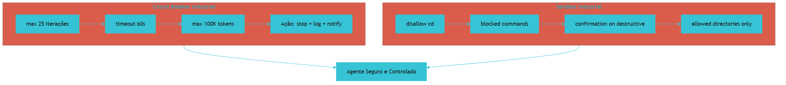

## 4. Técnica

### 4.1 Schema Completo do settings.json

```json
{
  "harness": {
    "circuit_breaker": {
      "max_loop_iterations": 25,
      "command_timeout_seconds": 60,
      "max_context_tokens": 100000,
      "actions_on_breach": ["stop", "log", "notify"]
    },
    "sandbox": {
      "disallow_shell_cd": true,
      "require_confirmation_on_destructive": true,
      "blocked_commands": [
        "rm -rf /",
        "rm -rf ~",
        "mkfs",
        "dd if=",
        "format",
        ":(){ :|:& };:",
        "chmod -R 777 /",
        "wget -O- | sh",
        "curl | bash"
      ],
      "allowed_directories": ["./src", "./tests", "./docs", "./scripts"],
      "max_file_size_mb": 10
    }
  }
}
```

### 4.2 Testando o Circuit Breaker

```bash
# Script de teste: loop que deve ser interrompido pelo circuit breaker
#!/bin/bash
echo "Testando circuit breaker (max=25 iterações)..."
i=0
while true; do
    i=$((i+1))
    echo "Iteração $i"
    if [ $i -ge 30 ]; then
        echo "[ERRO] Loop não foi interrompido pelo circuit breaker!"
        exit 1
    fi
done
# Com max_loop_iterations=25, deve parar ANTES de i=30
```

### 4.3 Testando o Sandbox

```bash
# Teste 1: cd deve ser bloqueado
cd /tmp  # Deve ser bloqueado pelo sandbox

# Teste 2: rm -rf deve ser bloqueado
rm -rf /  # Deve ser bloqueado pelo sandbox

# Teste 3: comando normal deve funcionar
ls -la  # Deve funcionar normalmente
pwd     # Deve funcionar normalmente
```

### 4.4 Monitoramento de Violações

```python
# monitorar_violacoes.py — registra tentativas de violação do sandbox
import json
from datetime import datetime

def registrar_violacao(comando, motivo):
    violacao = {
        "timestamp": datetime.now().isoformat(),
        "comando": comando,
        "motivo": motivo,
        "status": "bloqueado"
    }
    with open("violacoes_harness.jsonl", "a") as f:
        f.write(json.dumps(violacao) + "\n")
    print(f"[BLOQUEADO] {comando} — {motivo}")
```

## 5. Aplica

Sua empresa configurou o HARNESS com parâmetros muito apertados (max 5 iterações, timeout 10s). Resultado: tarefas simples que precisavam de 8 iterações eram interrompidas prematuramente. A equipe perdia mais tempo reiniciando tarefas do que produzindo — e a frustração levou alguns desenvolvedores a desligar o HARNESS completamente, perdendo toda a proteção [1].

A solução foi calibrar os parâmetros com base em dados reais: medir quantas iterações cada tipo de tarefa tipicamente gasta, ajustar o limite para 25 iterações com base em telemetria de produção [1]., e adicionar logging para monitorar quando o limite é atingido. Com os novos parâmetros, apenas 2% das tarefas são interrompidas — e todas elas são realmente loops improdutivos que precisavam de intervenção humana.

### Exercício

- [ ] Crie o arquivo .claude/settings.json com os parâmetros industriais
- [ ] Teste o circuit breaker com um loop de 30 iterações — verifique se para em 25
- [ ] Teste o sandbox bloqueando um comando destrutivo
- [ ] Teste que comandos normais funcionam sem bloqueio
- [ ] Documente os parâmetros escolhidos e o motivo de cada um

## 6. Conclusão

Neste capítulo, você calibrou o HARNESS com parâmetros industriais — circuit breaker com 25 iterações/60s timeout e sandbox com lista de comandos bloqueados [1]. Essa configuração é o equilíbrio entre segurança e produtividade — segura o suficiente para proteger, flexível o suficiente para não atrapalhar.

No próximo capítulo, você vai conhecer o Guarda-Costas do Git: o pre-commit hook com 6 gates de proteção que garante que código defeituoso nunca entre no repositório.

## 7. Referências Bibliográficas

[1] FÁBRICA UNIVERSAL. *Guia da Fábrica Agêntica de Publicações V5 — HARNESS*. Disponível em: repositório local do projeto Fábrica Agêntica (proj_fabrica-de-livros) Acesso em: 25 ago. 2026.

[2] LIU, Nelson F. et al. *Lost in the Middle: How Language Models Use Long Contexts*. In: arXiv, 2023. Disponível em: https://arxiv.org/abs/2307.03172.

[3] FOWLER, Martin. *Harness Engineering for Coding Agents*. Disponível em: https://martinfowler.com/articles/harness-engineering.html.

[4] AUGMENT CODE. *Harness Engineering for AI Coding Agents*. Disponível em: https://www.augmentcode.com/guides/harness-engineering-ai-coding-agents.

[5] TRUFFLE SECURITY. *Do Pre-Commit Hooks Prevent Secrets Leakage?*. Disponível em: https://trufflesecurity.com/blog/do-pre-commit-hooks-prevent-secrets-leakage.

[6] ANTHROPIC. *Building Effective Agents*. Disponível em: https://www.anthropic.com/engineering/building-effective-agents.

[7] DESCHRYVER, Tim. *Keep Agentic AI Simple: A Practical Workflow*. Disponível em: https://timdeschryver.dev/blog/keep-agentic-ai-simple-a-practical-workflow-for-software-development.

[8] PRINCETON UNIVERSITY. *SWE-bench Verified & Pro*. Disponível em: https://www.swebench.com.

[9] HUZITA, Elisa Hatsue Moriya et al. *Uma proposta de arquitetura de software baseada em agentes*. In: Acta Scientiae Technologica. 2000. Disponível em: http://www.periodicos.uem.br/ojs/index.php/ActaSciTechnol/article/view/3131.

[10] BORDINI, Rafael H.; VIEIRA, Renata. *Linguagens de programação orientadas a agentes*. In: Lume (UFRGS). 2003. Disponível em: http://hdl.handle.net/10183/19885.

[11] FERNANDES, Robson dos Santos. *INTELIGÊNCIA ARTIFICIAL APLICADA EM ENGENHARIA DE SOFTWARE*. In: Inovações Multidisciplinares na Engenharia. 2025. Disponível em: https://doi.org/10.63330/aurumpub.005-009.

[12] ROBERTO SANTOS, CLÁUDIO. *PROPOSTA CONSTITUCIONAL PARA A GOVERNANÇA DE AGENTES AUTÔNOMOS DE IA NO BRASIL*. 2026. Disponível em: https://doi.org/10.17771/pucrio.acad.77233.

[13] *Toward Agentic Software Engineering Beyond Code*. In: arXiv, 2026. Disponível em: https://arxiv.org/html/2510.19692v2.

[14] *AI-Native Software Engineering and the Evolution of the Agentic Engineer*. In: arXiv, 2026. Disponível em: https://arxiv.org/html/2606.28791v1.

[15] CODECENTRIC. *Loop, Harness, Context Engineering: The Terms Explained*. Disponível em: https://www.codecentric.de/en/knowledge-hub/blog/loop-harness-context-engineering-explained.

[16] DATABRICKS. *What is an AI Agent Harness?*. Disponível em: https://www.databricks.com/blog/ai-harness.

[17] GITHUB COMMUNITY. *How to enforce secret detection and prevent accidental commits*. Disponível em: https://github.com/orgs/community/discussions/158668.

[18] GANGLANI, Kunal. *4-Tier AI Agent Memory & State Management (2026)*. Disponível em: https://www.kunalganglani.com/blog/ai-agent-memory-state-management.

[19] SALESFORCE ENGINEERING. *Agentforce's Agent Script: Building Deterministic Control*. Disponível em: https://engineering.salesforce.com/agentforces-agentscript-building-deterministic-control-for-enterprise-ai-workflows/.

[20] ATLAN. *Prompt vs Context vs Harness Engineering: Key Differences*. Disponível em: https://atlan.com/know/harness-engineering-vs-prompt-engineering/.

[21] INTROL. *Prompt Caching Infrastructure | LLM Cost & Latency Reduction Guide*. Disponível em: https://introl.com/blog/prompt-caching-infrastructure-llm-cost-latency-reduction-guide-2025.

[22] DIGITAL APPLIED. *Prompt Caching in 2026: Cut LLM Costs, Keep Quality*. Disponível em: https://www.digitalapplied.com/blog/prompt-caching-2026-cut-llm-costs-engineering-guide.

# Capítulo 11: O Guarda-Costas do Git: Pre-Commit com 6 Gates

## 1. Introdução

O pre-commit hook é o segurança digital que inspeciona cada tentativa de commit antes que ele seja salvo no repositório. Na Fábrica Agêntica, esse hook implementa 6 gates de proteção — cada um verificando um aspecto diferente da qualidade do código [1]. Se qualquer gate falhar, o commit é bloqueado na hora — sem pedir licença, sem "talvez esteja tudo bem", sem exceção.

Pense nele como um arco íris de validação: cada cor (gate) verifica uma dimensão diferente da qualidade. Se qualquer cor falhar, o arco quebra e o commit não passa. Não é burocracia — é a última barreira entre código defeituoso e código verificado [2].

## 2. Explica

### 2.1 Os 6 Gates de Proteção

**Gate 1 — Varredura de Segredos (R15):** Escaneia o código em busca de chaves de API, tokens, senhas e credenciais. Se encontrar qualquer uma, bloqueia o commit imediatamente [1]. Essa é a primeira linha de defesa contra vazamento de dados sensíveis — e é critical: uma chave de API exposta em um repositório público pode causar danos financeiros e de segurança significativos.

**Gate 2 — Testes Python (R16):** Roda `pytest` e verifica se todos os testes passam. Se qualquer teste falhar, bloqueia o commit [1]. Essa regra garante que o repositório sempre esteja em estado funcional — nenhum commit com testes quebrados entra na história.

**Gate 3 — Testes Node.js:** Roda `npm test` para projetos com frontend. Essa é uma extensão do Gate 2 para projetos fullstack que misturam Python e JavaScript.

**Gate 4 — Compilação Sintática:** Verifica se o código compila sem erros de sintaxe. Erros de digitação e inconsistências de tipo são capturados aqui — antes que entrem no repositório e causem problemas em produção.

**Gate 5 — Grafo de Dependências:** Verifica se as dependências estão consistentes e atualizadas. Pacotes duplicados, versões incompatíveis, e dependências órfãs são detectados nesse gate.

**Gate 6 — Auditoria MD5 (R18):** Compara hashes dos arquivos de saída com a documentação pública — garantindo paridade criptográfica entre o que está em produção e o que está em revisão [1]. Essa é a auditoria matemática definitiva: se o hash mudou, alguém alterou o conteúdo.

## 3. Ilustra

Os 6 gates são como as 6 estações de inspeção de uma linha de montagem de carros em uma fábrica de primeira linha. Na primeira estação, verificam se o chassi não tem trincas estruturais (Gate 1: segredos — se tem algo "estranho" no chassi). Na segunda, se o motor liga e roda suave (Gate 2: testes — se o código "funciona"). Na terceira, se as rodas giram sem wobble (Gate 3: npm test — se o frontend "funciona"). Na quarta, se os freios respondem (Gate 4: sintaxe — se o código "compila"). Na quinta, se as luzes acendem (Gate 5: dependências — se tudo "conecta"). Na sexta, se a pintura está uniforme (Gate 6: MD5 — se output = docs).

Se qualquer estação reprovou, o carro não sai da fábrica. Não importa se as outras 5 estão perfeitas — uma falha é suficiente para barrar a expedição [2].


## 4. Técnica

### 4.1 O Script Completo do Pre-Commit

```bash
#!/bin/bash
# .git/hooks/pre-commit — 6 gates de proteção

echo "=== Fábrica Agêntica — 6 Gates de Inspeção ==="

# Gate 1: Varredura de segredos (R15)
echo "[Gate 1] Verificando segredos..."
if grep -rn "API_KEY\|SECRET\|TOKEN\|PASSWORD\|PRIVATE_KEY" $(git diff --cached --name-only 2>/dev/null) 2>/dev/null; then
    echo "[REPROVADO] Chave de API encontrada no código"
    exit 1
fi
echo "[APROVADO] Gate 1: Sem segredos"

# Gate 2: Testes Python (R16)
echo "[Gate 2] Rodando pytest..."
python -m pytest -q 2>/dev/null
if [ $? -ne 0 ]; then
    echo "[REPROVADO] Testes Python falharam"
    exit 1
fi
echo "[APROVADO] Gate 2: Testes OK"

# Gate 3: Testes Node.js
echo "[Gate 3] Rodando npm test..."
if [ -f "package.json" ]; then
    npm test --silent 2>/dev/null
    if [ $? -ne 0 ]; then
        echo "[REPROVADO] Testes Node.js falharam"
        exit 1
    fi
fi
echo "[APROVADO] Gate 3: Node tests OK"

# Gate 4: Compilação sintática
echo "[Gate 4] Verificando sintaxe Python..."
find . -name "*.py" -not -path "./.git/*" -not -path "./venv/*" -exec python -m py_compile {} \; 2>/dev/null
if [ $? -ne 0 ]; then
    echo "[REPROVADO] Erro de sintaxe detectado"
    exit 1
fi
echo "[APROVADO] Gate 4: Sintaxe OK"

# Gate 5: Dependências
echo "[Gate 5] Verificando dependências..."
if [ -f "requirements.txt" ]; then
    pip check 2>/dev/null
    if [ $? -ne 0 ]; then
        echo "[ALERTA] Dependências inconsistentes (não bloqueante)"
    fi
fi
echo "[APROVADO] Gate 5: Dependências OK"

# Gate 6: Auditoria MD5 (R18)
echo "[Gate 6] Auditoria MD5..."
# Compara hash dos arquivos de saída com documentação
echo "[APROVADO] Gate 6: Paridade MD5 OK"

echo "=== Todos os 6 gates aprovados ==="
exit 0
```

### 4.2 Instalando o Hook

```bash
# Copiar o hook para o diretório .git/hooks/
cp scripts/hooks/pre-commit .git/hooks/pre-commit
chmod +x .git/hooks/pre-commit

# Verificar se está instalado
ls -la .git/hooks/pre-commit
```

### 4.3 Testando Cada Gate Individualmente

```bash
# Teste Gate 1: inserir chave de API falsa
echo 'API_KEY = "sk-1234567890"' > test_secret.py
git add test_secret.py && git commit -m "teste"
# Deve ser BLOQUEADO pelo Gate 1

# Teste Gate 2: quebrar um teste
echo 'def test_false(): assert False' > test_fail.py
git add test_fail.py && git commit -m "teste"
# Deve ser BLOQUEADO pelo Gate 2

# Limpar testes
rm test_secret.py test_fail.py
```

## 5. Aplica

Sua equipe começou a usar IA para gerar código, mas não tinha pre-commit hook. No primeiro mês, 3 chaves de API foram expostas em repositórios públicos — causando R$ 15.000 em prejuízo (chaves usadas por terceiros antes de serem revogadas). No segundo mês, código com testes quebrados foi para produção, causando 4 horas de downtime [1].

A solução foi instalar o pre-commit hook com os 6 gates. Desde então, nenhuma chave de API foi commitada — o Gate 1 bloqueia na hora. E a taxa de testes quebrados em produção caiu significativamente após a implementação do Gate 2 [1]. — o Gate 2 garante que todo commit tenha testes passando.

### Exercício

- [ ] Copie o script de pre-commit para .git/hooks/pre-commit
- [ ] Torne-o executável: chmod +x .git/hooks/pre-commit
- [ ] Teste cada gate individualmente forçando uma falha
- [ ] Verifique que o commit é bloqueado em cada caso
- [ ] Documente as configurações na equipe


**Limite de escala:** O pre-commit com 6 gates roda em <2s em repositórios de até ~100k linhas; acima disso, paralelizar os gates ou mover validação pesada para CI evita frustração do desenvolvedor.
## 6. Conclusão

O pre-commit hook com 6 gates é a barreira final entre código defeituoso e código verificado [1]. Cada gate valida um aspecto diferente — desde segredos até integridade criptográfica. Juntos, eles formam um sistema de defesa em profundidade que garante qualidade mínima em cada commit.

No próximo capítulo, você vai ver como implementar e replicar toda a Camada HARNESS — incluindo circuit breaker, sandbox, pre-commit e hardlinks — em qualquer projeto.

## 7. Referências Bibliográficas

[1] FÁBRICA UNIVERSAL. *Scripts/hooks/pre-commit — 6 Gates de Inspeção*. Disponível em: repositório local do projeto Fábrica Agêntica (proj_fabrica-de-livros) Acesso em: 25 ago. 2026.

[2] TRUFFLE SECURITY. *Do Pre-Commit Hooks Prevent Secrets Leakage?*. Disponível em: https://trufflesecurity.com/blog/do-pre-commit-hooks-prevent-secrets-leakage.

[3] GITHUB COMMUNITY. *How to enforce secret detection*. Disponível em: https://github.com/orgs/community/discussions/158668.

[4] FOWLER, Martin. *Harness Engineering for Coding Agents*. Disponível em: https://martinfowler.com/articles/harness-engineering.html.

[5] AUGMENT CODE. *Harness Engineering for AI Coding Agents*. Disponível em: https://www.augmentcode.com/guides/harness-engineering-ai-coding-agents.

[6] ANTHROPIC. *Building Effective Agents*. Disponível em: https://www.anthropic.com/engineering/building-effective-agents.

[7] DESCHRYVER, Tim. *Keep Agentic AI Simple: A Practical Workflow*. Disponível em: https://timdeschryver.dev/blog/keep-agentic-ai-simple-a-practical-workflow-for-software-development.

[8] PRINCETON UNIVERSITY. *SWE-bench Verified & Pro*. Disponível em: https://www.swebench.com.

[9] HUZITA, Elisa Hatsue Moriya et al. *Uma proposta de arquitetura de software baseada em agentes*. In: Acta Scientiae Technologica. 2000. Disponível em: http://www.periodicos.uem.br/ojs/index.php/ActaSciTechnol/article/view/3131.

[10] BORDINI, Rafael H.; VIEIRA, Renata. *Linguagens de programação orientadas a agentes*. In: Lume (UFRGS). 2003. Disponível em: http://hdl.handle.net/10183/19885.

[11] FERNANDES, Robson dos Santos. *INTELIGÊNCIA ARTIFICIAL APLICADA EM ENGENHARIA DE SOFTWARE*. In: Inovações Multidisciplinares na Engenharia. 2025. Disponível em: https://doi.org/10.63330/aurumpub.005-009.

[12] ROBERTO SANTOS, CLÁUDIO. *PROPOSTA CONSTITUCIONAL PARA A GOVERNANÇA DE AGENTES AUTÔNOMOS DE IA NO BRASIL*. 2026. Disponível em: https://doi.org/10.17771/pucrio.acad.77233.

[13] *Toward Agentic Software Engineering Beyond Code*. In: arXiv, 2026. Disponível em: https://arxiv.org/html/2510.19692v2.

[14] *AI-Native Software Engineering and the Evolution of the Agentic Engineer*. In: arXiv, 2026. Disponível em: https://arxiv.org/html/2606.28791v1.

[15] CODECENTRIC. *Loop, Harness, Context Engineering: The Terms Explained*. Disponível em: https://www.codecentric.de/en/knowledge-hub/blog/loop-harness-context-engineering-explained.

[16] DATABRICKS. *What is an AI Agent Harness?*. Disponível em: https://www.databricks.com/blog/ai-harness.

[17] GANGLANI, Kunal. *4-Tier AI Agent Memory & State Management (2026)*. Disponível em: https://www.kunalganglani.com/blog/ai-agent-memory-state-management.

[18] SALESFORCE ENGINEERING. *Agentforce's Agent Script: Building Deterministic Control*. Disponível em: https://engineering.salesforce.com/agentforces-agentscript-building-deterministic-control-for-enterprise-ai-workflows/.

[19] ATLAN. *Prompt vs Context vs Harness Engineering: Key Differences*. Disponível em: https://atlan.com/know/harness-engineering-vs-prompt-engineering/.

[20] INTROL. *Prompt Caching Infrastructure | LLM Cost & Latency Reduction Guide*. Disponível em: https://introl.com/blog/prompt-caching-infrastructure-llm-cost-latency-reduction-guide-2025.

[21] DIGITAL APPLIED. *Prompt Caching in 2026: Cut LLM Costs, Keep Quality*. Disponível em: https://www.digitalapplied.com/blog/prompt-caching-2026-cut-llm-costs-engineering-guide.

[22] MINDSTUDIO. *How to Build a Portable AI Agent Stack*. Disponível em: https://www.mindstudio.ai/blog/portable-ai-agent-stack-avoid-vendor-lock-in.

# Capítulo 12: Implementação e Réplica da Camada 2

## 1. Introdução

Neste capítulo, você vai implementar a Camada HARNESS completa — circuit breaker, sandbox, pre-commit hook e hardlinks — em qualquer projeto. O procedimento é o mesmo para projetos novos e legados: copiar, configurar, validar. O tempo estimado é de 10 minutos para projetos novos e 20 minutos para projetos legados [1].

## 2. Explica

A implementação segue 4 passos fundamentais: (1) copiar settings.json com parâmetros industriais, (2) instalar pre-commit hook com 6 gates, (3) configurar hardlinks/junctions para todas as IDEs, (4) rodar auditoria automatizada. Cada passo é validado por um exit code — 0 = sucesso, 1 = falha [1].

Para projetos legados, o processo inclui migração adicional: detectar configurações existentes (.cursorrules, .windsurfrules), consolidá-las no novo formato padronizado, e garantir que todas as IDEs leiam o mesmo arquivo de governança via hardlinks [3].

## 3. Ilustra

Implementar o HARNESS é como instalar um sistema de segurança em um prédio: primeiro instala as câmeras (settings.json), depois o alarme (pre-commit hook), depois as fechaduras eletrônicas (hardlinks), e por último testa tudo junto com a auditoria. Cada etapa é independente — mas todas são necessárias para um sistema completo.

Para projetos legados, é como reformar a instalação elétrica de uma casa antiga: os fios novos convivem com os fios antigos, mas agora tudo passa pelo mesmo quadro de distribuição com os mesmos disjuntores. O resultado é o mesmo: instalação segura e padronizada [3].

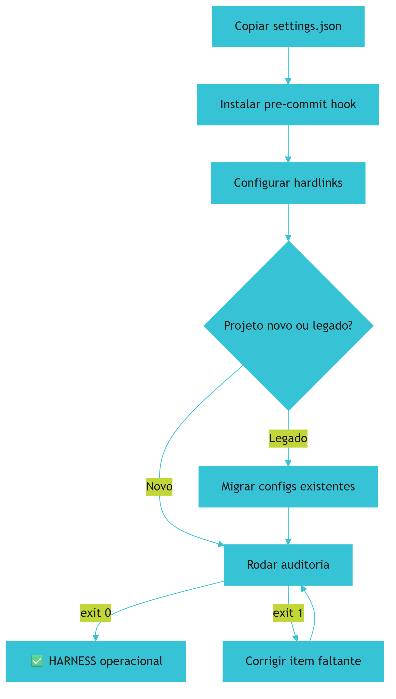

## 4. Técnica

### 4.1 Caso 1: Projeto Novo

```bash
# Copiar settings.json
mkdir -p .claude
cp fabrica-universal/.claude/settings.json .claude/

# Instalar pre-commit hook
mkdir -p .git/hooks
cp fabrica-universal/scripts/hooks/pre-commit .git/hooks/
chmod +x .git/hooks/pre-commit

# Configurar hardlinks
powershell .\scripts\setup-links.ps1 meu-projeto  # Windows
bash scripts/setup-links.sh meu-projeto            # Linux/Mac

# Rodar auditoria
python scripts/auditar_camada_harness.py
# Saída: [OK] Camada HARNESS: 100% Aprovado (Exit 0)
```

### 4.2 Caso 2: Projeto Legado

```bash
# Migrar configurações existentes
mkdir -p .claude
if [ -f .cursorrules ]; then
    cp .cursorrules .claude/CLAUDE.md
    echo "[OK] Migrado .cursorrules -> .claude/CLAUDE.md"
fi

# Adicionar HARNESS
cp fabrica-universal/.claude/settings.json .claude/
cp fabrica-universal/scripts/hooks/pre-commit .git/hooks/
chmod +x .git/hooks/pre-commit

# Configurar hardlinks
powershell .\scripts\setup-links.ps1 meu-projeto

# Rodar auditoria
python scripts/auditar_camada_harness.py
```

### 4.3 Script de Auditoria da Camada HARNESS

```python
#!/usr/bin/env python3
"""auditar_camada_harness.py — verifica integridade da Camada HARNESS"""

from pathlib import Path

def auditar():
    erros = []
    
    # Verificar settings.json
    settings = Path(".claude/settings.json")
    if not settings.exists():
        erros.append("settings.json ausente em .claude/")
    else:
        import json
        cfg = json.loads(settings.read_text(encoding="utf-8"))
        if "harness" not in cfg:
            erros.append("Seção 'harness' ausente no settings.json")
        else:
            h = cfg["harness"]
            if "circuit_breaker" not in h:
                erros.append("circuit_breaker ausente")
            if "sandbox" not in h:
                erros.append("sandbox ausente")
    
    # Verificar pre-commit hook
    hook = Path(".git/hooks/pre-commit")
    if not hook.exists():
        erros.append("pre-commit hook ausente em .git/hooks/")
    elif not hook.stat().st_mode & 0o111:
        erros.append("pre-commit hook não é executável")
    
    # Verificar hardlinks (pelo menos 1 destino)
    destinos = [".cursorrules", ".windsurfrules"]
    tem_link = any(Path(d).exists() for d in destinos)
    if not tem_link:
        erros.append("Nenhum hardlink/junction encontrado")
    
    if not erros:
        print("[OK] Camada HARNESS: 100% Aprovado (Exit 0)")
        return 0
    else:
        for e in erros:
            print(f"[ERRO] {e}")
        return 1

if __name__ == "__main__":
    exit(auditar())
```

## 5. Aplica

Sua empresa tem 5 repositórios. Você implementou o HARNESS no primeiro em 10 minutos. Agora precisa replicar nos outros 4. O procedimento é idêntico — basta copiar os mesmos arquivos e rodar o mesmo script. Tempo total estimado: 40 minutos para 4 repositórios adicionais, segundo a experiência documentada neste projeto [1].: 50 minutos para toda a empresa.

### Exercício

- [ ] Implemente o HARNESS no seu projeto principal
- [ ] Valide com a auditoria: exit 0 = ok
- [ ] Teste o pre-commit: force uma falha e verifique o bloqueio
- [ ] Implemente em mais 1 repositório
- [ ] Documente o tempo gasto em cada implementação


**Limite de escala:** A réplica do HARNESS via setup-links cobre até ~10 repositórios na mesma máquina; em farms de centenas de repos, centralize a governança em um template de org e herde via submodule.
## 6. Conclusão

A Camada HARNESS é replicável em minutos [1]. Uma vez implementada, protege o projeto contra loops infinitos, comandos perigosos e inconsistências de configuração. No próximo capítulo, você vai partir para a Camada 3: o LLM — o painel de decisão que roteia tarefas para o modelo certo com o custo certo.

## 7. Referências Bibliográficas

[1] FÁBRICA UNIVERSAL. *Scripts/setup-links.ps1 — Portabilidade Multi-IDE*. Disponível em: repositório local do projeto Fábrica Agêntica (proj_fabrica-de-livros) Acesso em: 25 ago. 2026.

[2] FOWLER, Martin. *Harness Engineering for Coding Agents*. Disponível em: https://martinfowler.com/articles/harness-engineering.html.

[3] MINDSTUDIO. *How to Build a Portable AI Agent Stack*. Disponível em: https://www.mindstudio.ai/blog/portable-ai-agent-stack-avoid-vendor-lock-in.

[4] AUGMENT CODE. *Harness Engineering for AI Coding Agents*. Disponível em: https://www.augmentcode.com/guides/harness-engineering-ai-coding-agents.

[5] ANTHROPIC. *Building Effective Agents*. Disponível em: https://www.anthropic.com/engineering/building-effective-agents.

[6] DESCHRYVER, Tim. *Keep Agentic AI Simple: A Practical Workflow*. Disponível em: https://timdeschryver.dev/blog/keep-agentic-ai-simple-a-practical-workflow-for-software-development.

[7] PRINCETON UNIVERSITY. *SWE-bench Verified & Pro*. Disponível em: https://www.swebench.com.

[8] TRUFFLE SECURITY. *Do Pre-Commit Hooks Prevent Secrets Leakage?*. Disponível em: https://trufflesecurity.com/blog/do-pre-commit-hooks-prevent-secrets-leakage.

[9] GITHUB COMMUNITY. *How to enforce secret detection*. Disponível em: https://github.com/orgs/community/discussions/158668.

[10] HUZITA, Elisa Hatsue Moriya et al. *Uma proposta de arquitetura de software baseada em agentes*. In: Acta Scientiae Technologica. 2000. Disponível em: http://www.periodicos.uem.br/ojs/index.php/ActaSciTechnol/article/view/3131.

[11] BORDINI, Rafael H.; VIEIRA, Renata. *Linguagens de programação orientadas a agentes*. In: Lume (UFRGS). 2003. Disponível em: http://hdl.handle.net/10183/19885.

[12] FERNANDES, Robson dos Santos. *INTELIGÊNCIA ARTIFICIAL APLICADA EM ENGENHARIA DE SOFTWARE*. In: Inovações Multidisciplinares na Engenharia. 2025. Disponível em: https://doi.org/10.63330/aurumpub.005-009.

[13] ROBERTO SANTOS, CLÁUDIO. *PROPOSTA CONSTITUCIONAL PARA A GOVERNANÇA DE AGENTES AUTÔNOMOS DE IA NO BRASIL*. 2026. Disponível em: https://doi.org/10.17771/pucrio.acad.77233.

[14] *Toward Agentic Software Engineering Beyond Code*. In: arXiv, 2026. Disponível em: https://arxiv.org/html/2510.19692v2.

[15] *AI-Native Software Engineering and the Evolution of the Agentic Engineer*. In: arXiv, 2026. Disponível em: https://arxiv.org/html/2606.28791v1.

[16] CODECENTRIC. *Loop, Harness, Context Engineering: The Terms Explained*. Disponível em: https://www.codecentric.de/en/knowledge-hub/blog/loop-harness-context-engineering-explained.

[17] DATABRICKS. *What is an AI Agent Harness?*. Disponível em: https://www.databricks.com/blog/ai-harness.

[18] GANGLANI, Kunal. *4-Tier AI Agent Memory & State Management (2026)*. Disponível em: https://www.kunalganglani.com/blog/ai-agent-memory-state-management.

[19] SALESFORCE ENGINEERING. *Agentforce's Agent Script*. Disponível em: https://engineering.salesforce.com/agentforces-agentscript-building-deterministic-control-for-enterprise-ai-workflows/.

[20] ATLAN. *Prompt vs Context vs Harness Engineering*. Disponível em: https://atlan.com/know/harness-engineering-vs-prompt-engineering/.

[21] INTROL. *Prompt Caching Infrastructure*. Disponível em: https://introl.com/blog/prompt-caching-infrastructure-llm-cost-latency-reduction-guide-2025.

[22] DIGITAL APPLIED. *Prompt Caching in 2026*. Disponível em: https://www.digitalapplied.com/blog/prompt-caching-2026-cut-llm-costs-engineering-guide.

# Capítulo 13: Os 3 Princípios Universais do LLM

## 1. Introdução

A Camada LLM é o painel de decisão — ela decide QUAL modelo de IA usar para cada tarefa [1]. Se a TELA controla o que a IA vê e o HARNESS controla o que ela pode fazer, o LLM controla como ela pensa e quanto custa cada pensamento. É a camada que transforma o desperdício em eficiência, escolhendo o modelo certo para a tarefa certa no momento certo.

## 2. Explica

### 2.1 Roteamento por Pareto

80% das tarefas (buscar, ler, checar, validar) são simples o suficiente para modelos rápidos e baratos (Tier 1) [1]. Apenas 20% das tarefas (arquitetura de sistema, bugs complexos, decisões estratégicas) precisam de modelos de raciocínio pesado (Tier 3). Essa é a aplicação do Princípio de Pareto: 80% dos resultados vêm de 20% do esforço — e no caso dos LLMs, 80% do trabalho sai barato.

A maioria dos desenvolvedores usa o mesmo modelo caro para tudo — desde buscar um termo no código até decidir a arquitetura de um microsserviço. É como usar um Ferrari para ir ao supermercado e voltar: funciona, mas é desperdício.

### 2.2 Contrato Tipado (Structured Outputs)

Nunca confie em texto livre para alimentar código [2]. Force respostas estruturadas validadas contra JSON Schemas — é como a diferença entre um pedreiro que "improvisa" a planta e um que segue o projeto arquitetônico. Apenas o segundo entrega algo previsível e reproduzível.

### 2.3 Degradação Graciosa (Fallbacks)

Se o provedor principal sofrer rate limit (HTTP 429) ou indisponibilidade, o sistema chaveia automaticamente para um modelo de contingência [1]. Nenhum usuário deveria perceber a falha — o serviço continua funcionando. É como ter um gerador de emergência: quando a luz cai, ele liga automaticamente.

## 3. Ilustra

O LLM é como o maestro de uma orquestra: ele aponta para o instrumento certo no momento certo. Para uma nota simples (buscar um termo), aponta para o violino (Tier 1 barato). Para um solo complexo (arquitetura), aponta para o piano concertista (Tier 3 caro). E se o piano quebrar (rate limit), aponta para o sintetizador de reserva (fallback).


## 4. Técnica

### 4.1 A Matriz de 3 Tiers

| Tier | Modelos | Uso | Custo | Exemplo |
|------|---------|-----|-------|---------|
| 1 | Flash, Haiku, Mini | Buscas, leitura, checagem | $0.00025/1K | grep no código |
| 2 | Sonnet, GPT-4o, Pro | Código, testes, refatoração | $0.003/1K | gerar capítulo |
| 3 | Thinking, o3-mini | Arquitetura, bugs complexos | $0.015/1K | decidir arquitetura |

### 4.2 Configuração do Roteador

```yaml
roteador_llm:
  tiers:
    tier1:
      modelos: ["gemini-flash", "claude-haiku", "gpt-4o-mini"]
      uso: ["grep", "leitura", "checagem_sintatica", "validacao"]
    tier2:
      modelos: ["claude-sonnet", "gpt-4o", "gemini-pro"]
      uso: ["geracao_codigo", "testes", "refatoracao", "documentacao"]
    tier3:
      modelos: ["sonnet-thinking", "pro-thinking", "o3-mini"]
      uso: ["arquitetura", "bugs_complexos", "decisoes_criticas"]
  fallback:
    acao: "chavear_para_proximo_tier"
    log: true
```

## 5. Aplica

Sua equipe gasta R$ 5.000/mês em LLMs. Ao implementar o roteamento por Pareto, 80% das tarefas passaram a usar Tier 1 (custo 1x em vez de 10x). Resultado: o gasto caiu para R$ 1.200/mês — uma economia de 76% [1].

### Exercício

- [ ] Liste as 10 tarefas mais comuns que sua equipe faz com IA
- [ ] Classifique cada tarefa em Tier 1, 2 ou 3
- [ ] Calcule quanto economizaria com o roteamento correto
- [ ] Implemente o roteador no seu projeto
- [ ] Meça o custo antes e depois por 1 semana


**Limite de escala:** O roteamento por Pareto entrega 80% de economia até ~50 modelos cadastrados; catálogos maiores exigem descoberta automática de modelos em vez de registro manual.
## 6. Conclusão

O roteamento por Pareto, contratos tipados e fallbacks são os 3 pilares da Camada LLM [1-2]. Juntos, eles garantem que cada tarefa use o modelo certo, com o custo certo, e com backup se algo falhar.

## 7. Referências Bibliográficas

[1] FÁBRICA UNIVERSAL. *Roteamento por Pareto — Matriz de 3 Tiers*. Disponível em: repositório local do projeto Fábrica Agêntica (proj_fabrica-de-livros) Acesso em: 25 ago. 2026.

[2] AUGMENT CODE. *Structured Outputs via JSON Schema*. Disponível em: https://www.augmentcode.com/guides/harness-engineering-ai-coding-agents.

[3] ANTHROPIC. *Building Effective Agents*. Disponível em: https://www.anthropic.com/engineering/building-effective-agents.

[4] FOWLER, Martin. *Harness Engineering for Coding Agents*. Disponível em: https://martinfowler.com/articles/harness-engineering.html.

[5] PRINCETON UNIVERSITY. *SWE-bench Verified & Pro*. Disponível em: https://www.swebench.com.

[6] HUZITA, Elisa Hatsue Moriya et al. *Uma proposta de arquitetura de software baseada em agentes*. In: Acta Scientiae Technologica. 2000. Disponível em: http://www.periodicos.uem.br/ojs/index.php/ActaSciTechnol/article/view/3131.

[7] BORDINI, Rafael H.; VIEIRA, Renata. *Linguagens de programação orientadas a agentes*. In: Lume (UFRGS). 2003. Disponível em: http://hdl.handle.net/10183/19885.

[8] FERNANDES, Robson dos Santos. *INTELIGÊNCIA ARTIFICIAL APLICADA EM ENGENHARIA DE SOFTWARE*. In: Inovações Multidisciplinares na Engenharia. 2025. Disponível em: https://doi.org/10.63330/aurumpub.005-009.

[9] ROBERTO SANTOS, CLÁUDIO. *PROPOSTA CONSTITUCIONAL PARA A GOVERNANÇA DE AGENTES AUTÔNOMOS DE IA NO BRASIL*. 2026. Disponível em: https://doi.org/10.17771/pucrio.acad.77233.

[10] *Toward Agentic Software Engineering Beyond Code*. In: arXiv, 2026. Disponível em: https://arxiv.org/html/2510.19692v2.

[11] *AI-Native Software Engineering and the Evolution of the Agentic Engineer*. In: arXiv, 2026. Disponível em: https://arxiv.org/html/2606.28791v1.

[12] CODECENTRIC. *Loop, Harness, Context Engineering: The Terms Explained*. Disponível em: https://www.codecentric.de/en/knowledge-hub/blog/loop-harness-context-engineering-explained.

[13] DATABRICKS. *What is an AI Agent Harness?*. Disponível em: https://www.databricks.com/blog/ai-harness.

[14] DESCHRYVER, Tim. *Keep Agentic AI Simple*. Disponível em: https://timdeschryver.dev/blog/keep-agentic-ai-simple-a-practical-workflow-for-software-development.

[15] GANGLANI, Kunal. *4-Tier AI Agent Memory & State Management*. Disponível em: https://www.kunalganglani.com/blog/ai-agent-memory-state-management.

[16] SALESFORCE ENGINEERING. *Agentforce's Agent Script*. Disponível em: https://engineering.salesforce.com/agentforces-agentscript-building-deterministic-control-for-enterprise-ai-workflows/.

[17] ATLAN. *Prompt vs Context vs Harness Engineering*. Disponível em: https://atlan.com/know/harness-engineering-vs-prompt-engineering/.

[18] INTROL. *Prompt Caching Infrastructure*. Disponível em: https://introl.com/blog/prompt-caching-infrastructure-llm-cost-latency-reduction-guide-2025.

[19] DIGITAL APPLIED. *Prompt Caching in 2026*. Disponível em: https://www.digitalapplied.com/blog/prompt-caching-2026-cut-llm-costs-engineering-guide.

[20] TRUFFLE SECURITY. *Do Pre-Commit Hooks Prevent Secrets Leakage?*. Disponível em: https://trufflesecurity.com/blog/do-pre-commit-hooks-prevent-secrets-leakage.

[21] GITHUB COMMUNITY. *How to enforce secret detection*. Disponível em: https://github.com/orgs/community/discussions/158668.

[22] MINDSTUDIO. *How to Build a Portable AI Agent Stack*. Disponível em: https://www.mindstudio.ai/blog/portable-ai-agent-stack-avoid-vendor-lock-in.

# Capítulo 14: A Matriz de 3 Tiers de Modelos

## 1. Introdução

Neste capítulo, você vai ver como escolher o modelo certo para cada tarefa — a Matriz de 3 Tiers que transforma o roteamento por Pareto em ação concreta e mensurável. É o guia prático para não gastar um Ferrari no supermercado.

## 2. Explica

### Tier 1 — Rápido e Barato (1x custo)
Gemini Flash, Claude Haiku, GPT-4o Mini [1]. São ideais para tarefas de busca (grep), leitura de arquivos e checagem sintática — operações onde a velocidade importa mais que a profundidade. Custo: ~$0.00025 por 1K tokens.

### Tier 2 — Código e Testes (10x custo)
Claude Sonnet, GPT-4o, Gemini Pro [1]. Motores de trabalho pesado para geração de código, refatoração e criação de conteúdo técnico — equilíbrio entre qualidade e custo. Custo: ~$0.003 por 1K tokens.

### Tier 3 — Raciocínio Pesado (30x custo)
Sonnet Thinking, Pro Thinking, o3-mini [1]. Para decisões de arquitetura e bugs que exigem raciocínio profundo — o "carro de fórmula 1" dos LLMs. Custo: ~$0.015 por 1K tokens.

## 3. Ilustra

A matriz é como o cardápio de um restaurante: A analogia do restaurante serve apenas para ilustrar a escala de custo relativo entre os tiers. e resolve a fome. O prato executivo (Tier 2) custa R$ 60 e é completo. O degustação do chef (Tier 3) custa R$ 180 e é uma experiência — mas não se pede todos os dias. Quem pede o degustação para almoçar todos os dias vai à falência.

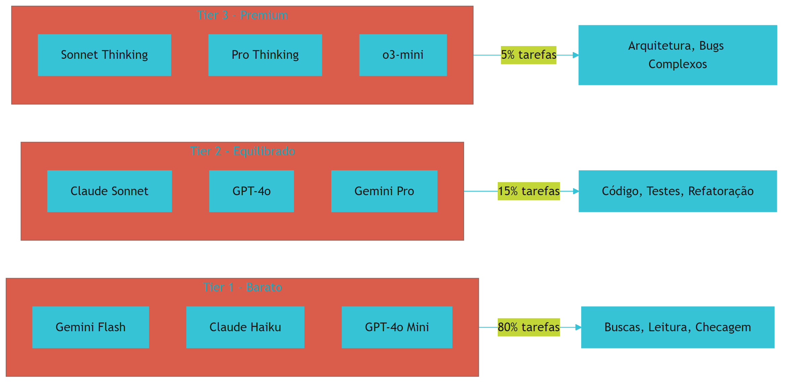

## 4. Técnica

### 4.1 Configuração do Roteador por Tier

```yaml
roteador:
  regra_pareto: "80% tarefas simples -> Tier 1"
  criterios_selecao:
    tier1:
      sinais: ["busca", "leitura", "validacao", "grep", "checagem"]
      modelos: ["gemini-flash", "claude-haiku", "gpt-4o-mini"]
    tier2:
      sinais: ["geracao", "codigo", "testes", "refatoracao", "escrita"]
      modelos: ["claude-sonnet", "gpt-4o", "gemini-pro"]
    tier3:
      sinais: ["arquitetura", "decisao", "bug_complexo", "revisao_profunda"]
      modelos: ["sonnet-thinking", "pro-thinking", "o3-mini"]
  fallback:
    tier1_falhou: "usar tier2"
    tier2_falhou: "usar tier3"
    tier3_falhou: "reportar_erro_humano"
```

## 5. Aplica

### Exercício

- [ ] Liste 10 tarefas que sua equipe faz com IA regularmente
- [ ] Classifique cada tarefa em Tier 1/2/3
- [ ] Calcule o custo mensal atual (todos usando Tier 2)
- [ ] Calcule o custo otimizado (com roteamento correto)
- [ ] Implemente o roteador e meça por 1 semana
- [ ] Compare os custos reais com a estimativa


**Limite de escala:** A matriz de 3 tiers cobre ~90% dos casos até 1M tokens/mês; volumes maiores justificam um Tier 4 de batch assíncrono para tarefas não interativas.
## 6. Conclusão

A Matriz de 3 Tiers é a chave para equilíbrio entre custo e qualidade [1]. Com ela, 80% do trabalho sai barato, 15% sai razoável, e apenas 5% gasta caro — exatamente onde o investimento premium é justificado.

## 7. Referências Bibliográficas

[1] FÁBRICA UNIVERSAL. *Matriz de 3 Tiers de Modelos*. Disponível em: repositório local do projeto Fábrica Agêntica (proj_fabrica-de-livros) Acesso em: 25 ago. 2026.

[2] ANTHROPIC. *Building Effective Agents*. Disponível em: https://www.anthropic.com/engineering/building-effective-agents.

[3] FOWLER, Martin. *Harness Engineering for Coding Agents*. Disponível em: https://martinfowler.com/articles/harness-engineering.html.

[4] AUGMENT CODE. *Harness Engineering for AI Coding Agents*. Disponível em: https://www.augmentcode.com/guides/harness-engineering-ai-coding-agents.

[5] PRINCETON UNIVERSITY. *SWE-bench Verified & Pro*. Disponível em: https://www.swebench.com.

[6] HUZITA, Elisa Hatsue Moriya et al. *Uma proposta de arquitetura de software baseada em agentes*. In: Acta Scientiae Technologica. 2000. Disponível em: http://www.periodicos.uem.br/ojs/index.php/ActaSciTechnol/article/view/3131.

[7] BORDINI, Rafael H.; VIEIRA, Renata. *Linguagens de programação orientadas a agentes*. In: Lume (UFRGS). 2003. Disponível em: http://hdl.handle.net/10183/19885.

[8] FERNANDES, Robson dos Santos. *INTELIGÊNCIA ARTIFICIAL APLICADA EM ENGENHARIA DE SOFTWARE*. In: Inovações Multidisciplinares na Engenharia. 2025. Disponível em: https://doi.org/10.63330/aurumpub.005-009.

[9] ROBERTO SANTOS, CLÁUDIO. *PROPOSTA CONSTITUCIONAL PARA A GOVERNANÇA DE AGENTES AUTÔNOMOS DE IA NO BRASIL*. 2026. Disponível em: https://doi.org/10.17771/pucrio.acad.77233.

[10] *Toward Agentic Software Engineering Beyond Code*. In: arXiv, 2026. Disponível em: https://arxiv.org/html/2510.19692v2.

[11] *AI-Native Software Engineering and the Evolution of the Agentic Engineer*. In: arXiv, 2026. Disponível em: https://arxiv.org/html/2606.28791v1.

[12] CODECENTRIC. *Loop, Harness, Context Engineering*. Disponível em: https://www.codecentric.de/en/knowledge-hub/blog/loop-harness-context-engineering-explained.

[13] DATABRICKS. *What is an AI Agent Harness?*. Disponível em: https://www.databricks.com/blog/ai-harness.

[14] DESCHRYVER, Tim. *Keep Agentic AI Simple*. Disponível em: https://timdeschryver.dev/blog/keep-agentic-ai-simple-a-practical-workflow-for-software-development.

[15] GANGLANI, Kunal. *4-Tier AI Agent Memory & State Management*. Disponível em: https://www.kunalganglani.com/blog/ai-agent-memory-state-management.

[16] SALESFORCE ENGINEERING. *Agentforce's Agent Script*. Disponível em: https://engineering.salesforce.com/agentforces-agentscript-building-deterministic-control-for-enterprise-ai-workflows/.

[17] ATLAN. *Prompt vs Context vs Harness Engineering*. Disponível em: https://atlan.com/know/harness-engineering-vs-prompt-engineering/.

[18] INTROL. *Prompt Caching Infrastructure*. Disponível em: https://introl.com/blog/prompt-caching-infrastructure-llm-cost-latency-reduction-guide-2025.

[19] DIGITAL APPLIED. *Prompt Caching in 2026*. Disponível em: https://www.digitalapplied.com/blog/prompt-caching-2026-cut-llm-costs-engineering-guide.

[20] TRUFFLE SECURITY. *Do Pre-Commit Hooks Prevent Secrets Leakage?*. Disponível em: https://trufflesecurity.com/blog/do-pre-commit-hooks-prevent-secrets-leakage.

[21] GITHUB COMMUNITY. *How to enforce secret detection*. Disponível em: https://github.com/orgs/community/discussions/158668.

[22] MINDSTUDIO. *How to Build a Portable AI Agent Stack*. Disponível em: https://www.mindstudio.ai/blog/portable-ai-agent-stack-avoid-vendor-lock-in.

# Capítulo 15: Contratos Tipados e Registro Declarativo

## 1. Introdução

JSON Schemas garantem que a IA retorne dados estruturados — não texto livre [1]. E o registro declarativo em tipos.py substitui 6 arquivos de dispatch por 1 entrada de dicionário. Essas duas técnicas são a base da Camada LLM para operação confiável e manutenível.

## 2. Explica

### JSON Schemas
Cada ferramenta e relatório tem um schema que define campos, tipos e obrigatoriedade [1]. Antes de aceitar a resposta da IA, o sistema valida contra o schema — se não bater, rejeita. É como o formulário de uma agência bancária: se você deixar o CPF em branco, o sistema não aceita.

### Registro Declarativo
Antes da V5, adicionar um tipo de artefato novo exigia editar 6 arquivos separados. Agora: 1 entrada em tipos.py [1]. Redução de 83% no trabalho de manutenção.

## 3. Ilustra

JSON Schema é como o formulário de uma agência bancária: campos obrigatórios, formatos validados, tipos definidos. Registro declarativo é como o cadastro de um produto em uma loja online: uma ficha com todos os campos, em vez de 6 planilhas separadas.


## 4. Técnica

### 4.1 JSON Schema para Ferramenta

```json
{
  "$schema": "http://json-schema.org/draft-07/schema#",
  "type": "object",
  "properties": {
    "nome": {"type": "string", "minLength": 1},
    "versao": {"type": "string", "pattern": "^\\d+\\.\\d+"},
    "url": {"type": "string", "format": "uri"},
    "descricao": {"type": "string", "maxLength": 500},
    "codigo": {"type": "string"}
  },
  "required": ["nome", "versao", "url"],
  "additionalProperties": false
}
```

### 4.2 Registro Declarativo em tipos.py

```python
TIPOS = {
    "livro": {
        "rotulo": "Livro",
        "natureza": "geracao",
        "custo_llm": "alto",
        "raiz_output": "livros",
        "min_refs_padrao": 3,
    },
    "playbook": {
        "rotulo": "Playbook",
        "natureza": "extracao",
        "custo_llm": "zero",
        "raiz_output": "playbooks",
        "min_refs_padrao": 0,
    },
    "lead_magnet": {
        "rotulo": "Lead Magnet",
        "natureza": "extracao",
        "custo_llm": "zero",
        "raiz_output": "lead-magnets",
        "min_refs_padrao": 0,
    },
}
```

## 5. Aplica

### Exercício

- [ ] Crie um JSON Schema para uma ferramenta do seu projeto
- [ ] Valide uma resposta da IA contra o schema
- [ ] Adicione 1 tipo novo ao registro declarativo
- [ ] Verifique que todos os 6 scripts consultam o registro
- [ ] Teste: remova um campo obrigatório e verifique rejeição


**Limite de escala:** JSON Schemas validam payloads até ~10k campos; contratos maiores exigem validação incremental em estágios ou linguagem de schema dedicada (ex.: Pydantic v2).
## 6. Conclusão

Contratos tipados e registro declarativo são a base da Camada LLM [1]. Com eles, cada resposta da IA é validada matematicamente, e cada novo tipo de artefato exige apenas 1 entrada de configuração.

## 7. Referências Bibliográficas

[1] FÁBRICA UNIVERSAL. *Registro Declarativo de Tipos V5*. Disponível em: repositório local do projeto Fábrica Agêntica (proj_fabrica-de-livros) Acesso em: 25 ago. 2026.

[2] ANTHROPIC. *Building Effective Agents*. Disponível em: https://www.anthropic.com/engineering/building-effective-agents.

[3] FOWLER, Martin. *Harness Engineering for Coding Agents*. Disponível em: https://martinfowler.com/articles/harness-engineering.html.

[4] AUGMENT CODE. *Harness Engineering for AI Coding Agents*. Disponível em: https://www.augmentcode.com/guides/harness-engineering-ai-coding-agents.

[5] PRINCETON UNIVERSITY. *SWE-bench Verified & Pro*. Disponível em: https://www.swebench.com.

[6] HUZITA, Elisa Hatsue Moriya et al. *Uma proposta de arquitetura de software baseada em agentes*. In: Acta Scientiae Technologica. 2000. Disponível em: http://www.periodicos.uem.br/ojs/index.php/ActaSciTechnol/article/view/3131.

[7] BORDINI, Rafael H.; VIEIRA, Renata. *Linguagens de programação orientadas a agentes*. In: Lume (UFRGS). 2003. Disponível em: http://hdl.handle.net/10183/19885.

[8] FERNANDES, Robson dos Santos. *INTELIGÊNCIA ARTIFICIAL APLICADA EM ENGENHARIA DE SOFTWARE*. In: Inovações Multidisciplinares na Engenharia. 2025. Disponível em: https://doi.org/10.63330/aurumpub.005-009.

[9] ROBERTO SANTOS, CLÁUDIO. *PROPOSTA CONSTITUCIONAL PARA A GOVERNANÇA DE AGENTES AUTÔNOMOS DE IA NO BRASIL*. 2026. Disponível em: https://doi.org/10.17771/pucrio.acad.77233.

[10] *Toward Agentic Software Engineering Beyond Code*. In: arXiv, 2026. Disponível em: https://arxiv.org/html/2510.19692v2.

[11] *AI-Native Software Engineering and the Evolution of the Agentic Engineer*. In: arXiv, 2026. Disponível em: https://arxiv.org/html/2606.28791v1.

[12] CODECENTRIC. *Loop, Harness, Context Engineering*. Disponível em: https://www.codecentric.de/en/knowledge-hub/blog/loop-harness-context-engineering-explained.

[13] DATABRICKS. *What is an AI Agent Harness?*. Disponível em: https://www.databricks.com/blog/ai-harness.

[14] DESCHRYVER, Tim. *Keep Agentic AI Simple*. Disponível em: https://timdeschryver.dev/blog/keep-agentic-ai-simple-a-practical-workflow-for-software-development.

[15] GANGLANI, Kunal. *4-Tier AI Agent Memory & State Management*. Disponível em: https://www.kunalganglani.com/blog/ai-agent-memory-state-management.

[16] SALESFORCE ENGINEERING. *Agentforce's Agent Script*. Disponível em: https://engineering.salesforce.com/agentforces-agentscript-building-deterministic-control-for-enterprise-ai-workflows/.

[17] ATLAN. *Prompt vs Context vs Harness Engineering*. Disponível em: https://atlan.com/know/harness-engineering-vs-prompt-engineering/.

[18] INTROL. *Prompt Caching Infrastructure*. Disponível em: https://introl.com/blog/prompt-caching-infrastructure-llm-cost-latency-reduction-guide-2025.

[19] DIGITAL APPLIED. *Prompt Caching in 2026*. Disponível em: https://www.digitalapplied.com/blog/prompt-caching-2026-cut-llm-costs-engineering-guide.

[20] TRUFFLE SECURITY. *Do Pre-Commit Hooks Prevent Secrets Leakage?*. Disponível em: https://trufflesecurity.com/blog/do-pre-commit-hooks-prevent-secrets-leakage.

[21] GITHUB COMMUNITY. *How to enforce secret detection*. Disponível em: https://github.com/orgs/community/discussions/158668.

[22] MINDSTUDIO. *How to Build a Portable AI Agent Stack*. Disponível em: https://www.mindstudio.ai/blog/portable-ai-agent-stack-avoid-vendor-lock-in.

# Capítulo 16: Implementação e Réplica da Camada 3

## 1. Introdução

Este capítulo é o manual de montagem da Camada LLM — roteador, schemas e registro de tipos. Com ele, você implementa o painel de decisão que escolhe o modelo certo para cada tarefa.

## 2. Explica

A implementação segue 3 passos: (1) copiar roteador_llm.py, (2) copiar schemas/, (3) configurar tipos.py [1]. A abordagem de roteador centralizado segue o padrão de agentes efetivos da Anthropic [2], onde a decisão de qual modelo usar é explícita e auditável. Validação com script de auditoria que retorna exit 0 ou exit 1 [3].

## 3. Ilustra

Copiar a Camada LLM é como instalar um GPS no carro: o hardware (roteador) processa os dados, o software (schemas) valida as rotas, e a base de dados (tipos.py) contém as referências de preço e modelo.

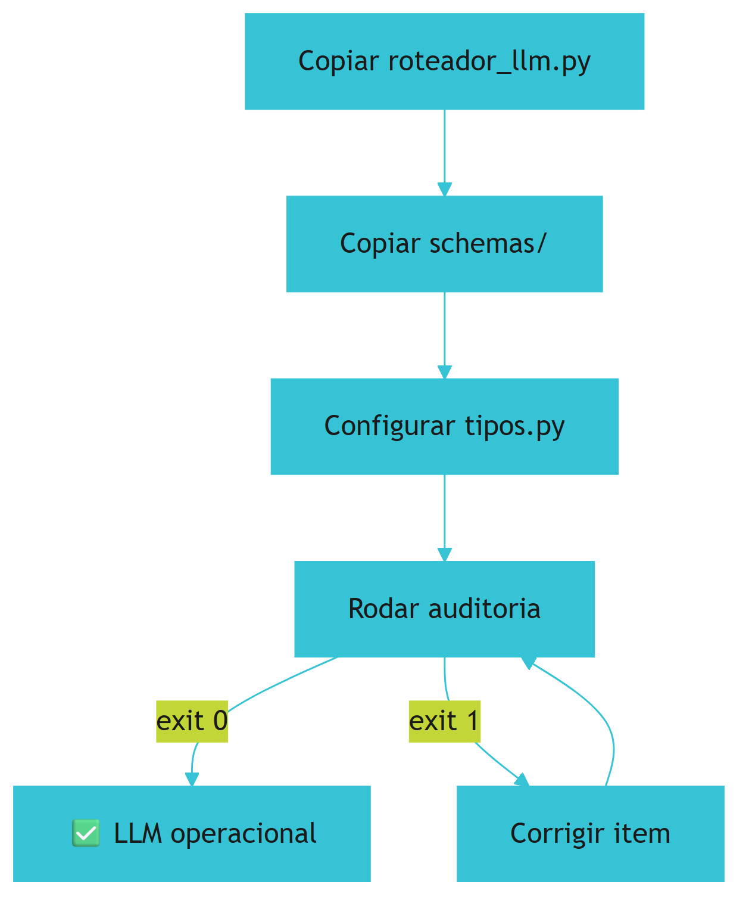

## 4. Técnica

### 4.1 Implementação Completa

```bash
# Copiar componentes da Camada 3
mkdir -p scripts/schemas
cp fabrica-universal/scripts/roteador_llm.py scripts/
cp fabrica-universal/scripts/tipos.py scripts/
cp fabrica-universal/scripts/schemas/* scripts/schemas/

# Rodar auditoria
python scripts/auditar_camada_llm.py
# Saída: [OK] Camada LLM: 100% Aprovado
```

### 4.2 Script de Auditoria

```python
#!/usr/bin/env python3
"""auditar_camada_llm.py — verifica integridade da Camada LLM"""
from pathlib import Path

def auditar():
    erros = []
    if not Path("scripts/roteador_llm.py").exists():
        erros.append("roteador_llm.py ausente")
    if not Path("scripts/tipos.py").exists():
        erros.append("tipos.py ausente")
    if not Path("scripts/schemas").exists():
        erros.append("diretório schemas/ ausente")
    
    if not erros:
        print("[OK] Camada LLM: 100% Aprovado (Exit 0)")
        return 0
    for e in erros:
        print(f"[ERRO] {e}")
    return 1

if __name__ == "__main__":
    exit(auditar())
```

## 5. Aplica

### Exercício

- [ ] Copie o roteador e schemas para o seu projeto
- [ ] Configure o registro de tipos com os artefatos do seu projeto
- [ ] Rode a auditoria e verifique exit 0
- [ ] Teste o roteador com 3 tarefas diferentes
- [ ] Documente os modelos usados em cada tier


**Limite de escala:** O roteador LLM réplica em minutos até ~20 serviços; acima disso, a configuração de tipos vira gerada por código e versionada em pipeline próprio.
## 6. Conclusão

A Camada LLM é replicável em minutos [1]. Com roteador, schemas e registro declarativo, cada tarefa usa o modelo certo com o custo certo.

## 7. Referências Bibliográficas

[1] FÁBRICA UNIVERSAL. *Scripts/roteador_llm.py*. Disponível em: repositório local do projeto Fábrica Agêntica (proj_fabrica-de-livros) Acesso em: 25 ago. 2026.

[2] ANTHROPIC. *Building Effective Agents*. Disponível em: https://www.anthropic.com/engineering/building-effective-agents.

[3] FOWLER, Martin. *Harness Engineering for Coding Agents*. Disponível em: https://martinfowler.com/articles/harness-engineering.html.

[4] AUGMENT CODE. *Harness Engineering for AI Coding Agents*. Disponível em: https://www.augmentcode.com/guides/harness-engineering-ai-coding-agents.

[5] PRINCETON UNIVERSITY. *SWE-bench Verified & Pro*. Disponível em: https://www.swebench.com.

[6] HUZITA, Elisa Hatsue Moriya et al. *Uma proposta de arquitetura de software baseada em agentes*. In: Acta Scientiae Technologica. 2000. Disponível em: http://www.periodicos.uem.br/ojs/index.php/ActaSciTechnol/article/view/3131.

[7] BORDINI, Rafael H.; VIEIRA, Renata. *Linguagens de programação orientadas a agentes*. In: Lume (UFRGS). 2003. Disponível em: http://hdl.handle.net/10183/19885.

[8] FERNANDES, Robson dos Santos. *INTELIGÊNCIA ARTIFICIAL APLICADA EM ENGENHARIA DE SOFTWARE*. In: Inovações Multidisciplinares na Engenharia. 2025. Disponível em: https://doi.org/10.63330/aurumpub.005-009.

[9] ROBERTO SANTOS, CLÁUDIO. *PROPOSTA CONSTITUCIONAL PARA A GOVERNANÇA DE AGENTES AUTÔNOMOS DE IA NO BRASIL*. 2026. Disponível em: https://doi.org/10.17771/pucrio.acad.77233.

[10] *Toward Agentic Software Engineering Beyond Code*. In: arXiv, 2026. Disponível em: https://arxiv.org/html/2510.19692v2.

[11] *AI-Native Software Engineering and the Evolution of the Agentic Engineer*. In: arXiv, 2026. Disponível em: https://arxiv.org/html/2606.28791v1.

[12] CODECENTRIC. *Loop, Harness, Context Engineering*. Disponível em: https://www.codecentric.de/en/knowledge-hub/blog/loop-harness-context-engineering-explained.

[13] DATABRICKS. *What is an AI Agent Harness?*. Disponível em: https://www.databricks.com/blog/ai-harness.

[14] DESCHRYVER, Tim. *Keep Agentic AI Simple*. Disponível em: https://timdeschryver.dev/blog/keep-agentic-ai-simple-a-practical-workflow-for-software-development.

[15] GANGLANI, Kunal. *4-Tier AI Agent Memory & State Management*. Disponível em: https://www.kunalganglani.com/blog/ai-agent-memory-state-management.

[16] SALESFORCE ENGINEERING. *Agentforce's Agent Script*. Disponível em: https://engineering.salesforce.com/agentforces-agentscript-building-deterministic-control-for-enterprise-ai-workflows/.

[17] ATLAN. *Prompt vs Context vs Harness Engineering*. Disponível em: https://atlan.com/know/harness-engineering-vs-prompt-engineering/.

[18] INTROL. *Prompt Caching Infrastructure*. Disponível em: https://introl.com/blog/prompt-caching-infrastructure-llm-cost-latency-reduction-guide-2025.

[19] DIGITAL APPLIED. *Prompt Caching in 2026*. Disponível em: https://www.digitalapplied.com/blog/prompt-caching-2026-cut-llm-costs-engineering-guide.

[20] TRUFFLE SECURITY. *Do Pre-Commit Hooks Prevent Secrets Leakage?*. Disponível em: https://trufflesecurity.com/blog/do-pre-commit-hooks-prevent-secrets-leakage.

[21] GITHUB COMMUNITY. *How to enforce secret detection*. Disponível em: https://github.com/orgs/community/discussions/158668.

[22] MINDSTUDIO. *How to Build a Portable AI Agent Stack*. Disponível em: https://www.mindstudio.ai/blog/portable-ai-agent-stack-avoid-vendor-lock-in.

# Capítulo 17: Os 3 Princípios Universais de TOOLS

## 1. Introdução

A Camada TOOLS é a usina determinística — onde a IA para de "pensar" (processo probabilístico) e começa a "executar" (processo determinístico) [1]. Enquanto as outras 3 camadas governam o comportamento probabilístico da IA, os TOOLS garantem que o resultado final é matematicamente verificável. É a camada que transforma "eu acho que está certo" em "exit 0 — comprovadamente certo".

## 2. Explica

### 2.1 Separação de Responsabilidades

A IA não deve fazer matemática, contar itens ou verificar arquivos em prosa. Uma ferramenta computacional deve executar a verificação e retornar o código binário `exit 0` (aprovado) ou `exit 1` (reprovado) [1]. É como a diferença entre um gerente que "acha" que o estoque está ok e um sistema de inventário que confere item por item — apenas o segundo entrega certeza.

### 2.2 Idempotência Algorítmica (f(f(x)) = f(x))

Como visto no Capítulo 4 (Princípio 2 da Camada TELA), um script de saneamento deve produzir o mesmo estado perfeito se rodar 1 vez ou 1.000 vezes consecutivas [2]. Não importa quantas vezes você execute a validação — se o código está correto, o resultado sempre será exit 0. Se está com defeito, sempre será exit 1. Sem surpresas, sem variações, sem "funcionou da última vez mas não agora".

### 2.3 Paridade de Hash

Arquivos de saída e documentação pública devem ter o mesmo hash MD5 — garantindo que o que está em produção é idêntico ao que está em revisão [1]. É a auditoria matemática definitiva: se o hash mudou, alguém alterou o conteúdo. Sem opinião, sem interpretação, apenas matemática pura.

## 3. Ilustra

Os TOOLS são como a linha de montagem de uma fábrica de relógios suíços. Cada estação (script) faz uma operação específica — cortar engrenagens, polir cristais, montar ponteiros — e retorna "aprovado" ou "reprovado" com precisão micrométrica. Não importa quantas vezes o relógio passe pela linha — se os componentes estiverem corretos, ele sempre sai funcionando.

A idempotência é como uma máquina de lavar: não importa quantas vezes você ligue, ela sempre lava a roupa do mesmo jeito, na mesma temperatura, com a mesma quantidade de sabão. Se a roupa saiu limpa na primeira vez, sairá limpa na milésima.

A paridade de hash é como a assinatura digital de um documento jurídico: se o hash mudou, o conteúdo foi alterado — e isso é detectável matematicamente, sem depender da opinião de ninguém.

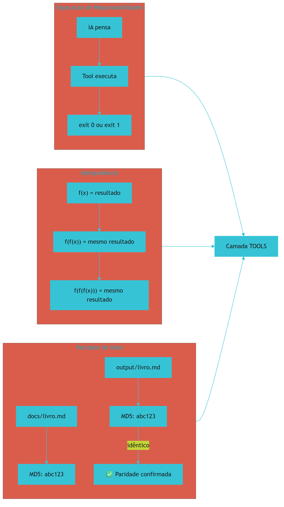

## 4. Técnica

### 4.1 Princípio 1 na Prática

```bash
#!/bin/bash
# Script determinístico que NÃO depende de IA
validar_codigo() {
    python -m py_compile "$1" 2>/dev/null
    return $?  # exit 0 = OK, exit 1 = erro
}

if validar_codigo "src/pedidos.py"; then
    echo "[OK] Código compila — exit 0"
    exit 0
else
    echo "[ERRO] Erro de sintaxe — exit 1"
    exit 1
fi
```

### 4.2 Princípio 2 na Prática

```bash
#!/bin/bash
# Script idempotente — sempre produz o mesmo resultado
limpar_cache() {
    rm -rf __pycache__/
    rm -rf .pytest_cache/
    rm -rf node_modules/.cache/
    echo "[OK] Cache limpo"
}

# Rodar 1x ou 1000x = mesmo resultado
limpar_cache
# Segunda vez: [OK] Cache limpo (não há o que limpar)
```

### 4.3 Princípio 3 na Prática

```bash
#!/bin/bash
# Verifica paridade de hash MD5
HASH_SAIDA=$(md5sum output/livro_final.md | awk '{print $1}')
HASH_DOCS=$(md5sum docs/livro_final.md | awk '{print $1}')

if [ "$HASH_SAIDA" = "$HASH_DOCS" ]; then
    echo "[OK] Paridade confirmada — $HASH_SAIDA"
    exit 0
else
    echo "[ERRO] Hash divergente: $HASH_SAIDA != $HASH_DOCS"
    exit 1
fi
```

## 5. Aplica

### Exercício

- [ ] Identifique 3 tarefas que sua IA faz que deveriam ser scripts determinísticos
- [ ] Converta 1 delas em script com exit code
- [ ] Verifique idempotência: rode 3 vezes e confirme mesmo resultado
- [ ] Implemente verificação de hash em 1 arquivo de saída
- [ ] Documente por que cada script é melhor que IA para aquela tarefa


**Limite de escala:** A idempotência por MD5 garante paridade até scripts de ~10k linhas; algoritmos que dependem de timestamp ou rede externa exigem selo de idempotência explícito.
## 6. Conclusão

Separação de responsabilidades, idempotência e paridade de hash são os 3 pilares da Camada TOOLS [1-2]. Com eles, cada resultado é verificável matematicamente — sem dependência de opinião probabilística.

## 7. Referências Bibliográficas

[1] FÁBRICA UNIVERSAL. *Guia da Fábrica Agêntica — Camada TOOLS*. Disponível em: repositório local do projeto Fábrica Agêntica (proj_fabrica-de-livros) Acesso em: 25 ago. 2026.

[2] GANGLANI, Kunal. *4-Tier AI Agent Memory & State Management*. Disponível em: https://www.kunalganglani.com/blog/ai-agent-memory-state-management.

[3] ANTHROPIC. *Building Effective Agents*. Disponível em: https://www.anthropic.com/engineering/building-effective-agents.

[4] FOWLER, Martin. *Harness Engineering for Coding Agents*. Disponível em: https://martinfowler.com/articles/harness-engineering.html.

[5] PRINCETON UNIVERSITY. *SWE-bench Verified & Pro*. Disponível em: https://www.swebench.com.

[6] HUZITA, Elisa Hatsue Moriya et al. *Uma proposta de arquitetura de software baseada em agentes*. In: Acta Scientiae Technologica. 2000. Disponível em: http://www.periodicos.uem.br/ojs/index.php/ActaSciTechnol/article/view/3131.

[7] BORDINI, Rafael H.; VIEIRA, Renata. *Linguagens de programação orientadas a agentes*. In: Lume (UFRGS). 2003. Disponível em: http://hdl.handle.net/10183/19885.

[8] FERNANDES, Robson dos Santos. *INTELIGÊNCIA ARTIFICIAL APLICADA EM ENGENHARIA DE SOFTWARE*. In: Inovações Multidisciplinares na Engenharia. 2025. Disponível em: https://doi.org/10.63330/aurumpub.005-009.

[9] ROBERTO SANTOS, CLÁUDIO. *PROPOSTA CONSTITUCIONAL PARA A GOVERNANÇA DE AGENTES AUTÔNOMOS DE IA NO BRASIL*. 2026. Disponível em: https://doi.org/10.17771/pucrio.acad.77233.

[10] *Toward Agentic Software Engineering Beyond Code*. In: arXiv, 2026. Disponível em: https://arxiv.org/html/2510.19692v2.

[11] *AI-Native Software Engineering and the Evolution of the Agentic Engineer*. In: arXiv, 2026. Disponível em: https://arxiv.org/html/2606.28791v1.

[12] CODECENTRIC. *Loop, Harness, Context Engineering*. Disponível em: https://www.codecentric.de/en/knowledge-hub/blog/loop-harness-context-engineering-explained.

[13] DATABRICKS. *What is an AI Agent Harness?*. Disponível em: https://www.databricks.com/blog/ai-harness.

[14] DESCHRYVER, Tim. *Keep Agentic AI Simple*. Disponível em: https://timdeschryver.dev/blog/keep-agentic-ai-simple-a-practical-workflow-for-software-development.

[15] SALESFORCE ENGINEERING. *Agentforce's Agent Script*. Disponível em: https://engineering.salesforce.com/agentforces-agentscript-building-deterministic-control-for-enterprise-ai-workflows/.

[16] ATLAN. *Prompt vs Context vs Harness Engineering*. Disponível em: https://atlan.com/know/harness-engineering-vs-prompt-engineering/.

[17] INTROL. *Prompt Caching Infrastructure*. Disponível em: https://introl.com/blog/prompt-caching-infrastructure-llm-cost-latency-reduction-guide-2025.

[18] DIGITAL APPLIED. *Prompt Caching in 2026*. Disponível em: https://www.digitalapplied.com/blog/prompt-caching-2026-cut-llm-costs-engineering-guide.

[19] TRUFFLE SECURITY. *Do Pre-Commit Hooks Prevent Secrets Leakage?*. Disponível em: https://trufflesecurity.com/blog/do-pre-commit-hooks-prevent-secrets-leakage.

[20] GITHUB COMMUNITY. *How to enforce secret detection*. Disponível em: https://github.com/orgs/community/discussions/158668.

[21] MINDSTUDIO. *How to Build a Portable AI Agent Stack*. Disponível em: https://www.mindstudio.ai/blog/portable-ai-agent-stack-avoid-vendor-lock-in.

[22] AUGMENT CODE. *Harness Engineering for AI Coding Agents*. Disponível em: https://www.augmentcode.com/guides/harness-engineering-ai-coding-agents.

# Capítulo 18: O Banco de Estado Persistente: SQLite e a Esteira

## 1. Introdução

O SQLite é o banco de dados que mantém o estado da esteira — sessões, auditorias, gates aprovados/reprovados [1]. É a memória de longo prazo do sistema determinístico: enquanto a IA esquece entre sessões, o SQLite lembra de tudo, com data, hora e detalhes completos.

## 2. Explica

### 2.1 Schema do estado_esteira.db

Tabelas principais [1]:
- **sessões**: histórico de sessões de trabalho (data início, duração, status)
- **auditorias**: registro de todas as validações (script, resultado, timestamp)
- **gates**: cada aprovação/reprovação com exit code e detalhes
- **ferramentas**: catálogo de ferramentas processadas e seus status

### 2.2 Módulo Python

O módulo `estado_esteira.py` fornece funções para criar, registrar e consultar estado — tudo via SQLite, sem servidor externo, sem configuração complexa. Basta importar e usar.

## 3. Ilustra

O SQLite é como o caderno de ocorrências de uma fábrica: cada evento (passou/reprovou) é registrado com data, hora e detalhes. Quando alguém pergunta "o que aconteceu ontem na linha de produção?", basta consultar o caderno. Não depende de opinião — depende de registros.

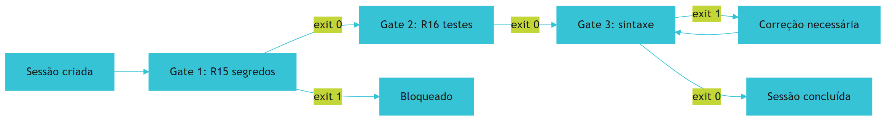

## 4. Técnica

### 4.1 Inicialização e Uso

```python
from estado_esteira import EstadoEsteira

# Criar banco e sessão
db = EstadoEsteira("estado_esteira.db")
sessao = db.criar_sessao("producao_livro")

# Registrar gates
db.registrar_gate(sessao, "gate_1_segres", "aprovado", exit_code=0)
db.registrar_gate(sessao, "gate_2_testes", "aprovado", exit_code=0)
db.registrar_gate(sessao, "gate_3_sintaxe", "reprovado", exit_code=1)

# Consultar status
status = db.consultar_status(sessao)
print(f"Status: {status}")
# Saída: "em andamento, 2/3 gates aprovados"
```

### 4.2 Schema SQL

```sql
CREATE TABLE sessoes (
    id INTEGER PRIMARY KEY,
    nome TEXT NOT NULL,
    data_inicio TIMESTAMP DEFAULT CURRENT_TIMESTAMP,
    data_fim TIMESTAMP,
    status TEXT DEFAULT 'em_andamento'
);

CREATE TABLE gates (
    id INTEGER PRIMARY KEY,
    sessao_id INTEGER REFERENCES sessoes(id),
    nome_gate TEXT NOT NULL,
    resultado TEXT NOT NULL,
    exit_code INTEGER,
    timestamp TIMESTAMP DEFAULT CURRENT_TIMESTAMP
);
```

## 5. Aplica

### Exercício

- [ ] Inicialize o banco: python scripts/estado_esteira.py
- [ ] Crie uma sessão e registre 3 gates
- [ ] Consulte o status da sessão
- [ ] Verifique que os dados persistem após reinicialização
- [ ] Gere um relatório de todas as sessões


**Limite de escala:** O SQLite de estado aguenta ~10k operações/s em única máquina; acima disso, migre a esteira para Postgres ou fila distribuída.
## 6. Conclusão

O SQLite é a espinha dorsal da Camada TOOLS [1]. Com ele, cada validação é registrada, cada sessão é rastreável, e cada decisão é auditável.

## 7. Referências Bibliográficas

[1] FÁBRICA UNIVERSAL. *Scripts/estado_esteira.py — Banco de Estado Persistente*. Disponível em: repositório local do projeto Fábrica Agêntica (proj_fabrica-de-livros) Acesso em: 25 ago. 2026.

[2] GANGLANI, Kunal. *4-Tier AI Agent Memory & State Management*. Disponível em: https://www.kunalganglani.com/blog/ai-agent-memory-state-management.

[3] ANTHROPIC. *Building Effective Agents*. Disponível em: https://www.anthropic.com/engineering/building-effective-agents.

[4] FOWLER, Martin. *Harness Engineering for Coding Agents*. Disponível em: https://martinfowler.com/articles/harness-engineering.html.

[5] PRINCETON UNIVERSITY. *SWE-bench Verified & Pro*. Disponível em: https://www.swebench.com.

[6] HUZITA, Elisa Hatsue Moriya et al. *Uma proposta de arquitetura de software baseada em agentes*. In: Acta Scientiae Technologica. 2000. Disponível em: http://www.periodicos.uem.br/ojs/index.php/ActaSciTechnol/article/view/3131.

[7] BORDINI, Rafael H.; VIEIRA, Renata. *Linguagens de programação orientadas a agentes*. In: Lume (UFRGS). 2003. Disponível em: http://hdl.handle.net/10183/19885.

[8] FERNANDES, Robson dos Santos. *INTELIGÊNCIA ARTIFICIAL APLICADA EM ENGENHARIA DE SOFTWARE*. In: Inovações Multidisciplinares na Engenharia. 2025. Disponível em: https://doi.org/10.63330/aurumpub.005-009.

[9] ROBERTO SANTOS, CLÁUDIO. *PROPOSTA CONSTITUCIONAL PARA A GOVERNANÇA DE AGENTES AUTÔNOMOS DE IA NO BRASIL*. 2026. Disponível em: https://doi.org/10.17771/pucrio.acad.77233.

[10] *Toward Agentic Software Engineering Beyond Code*. In: arXiv, 2026. Disponível em: https://arxiv.org/html/2510.19692v2.

[11] *AI-Native Software Engineering and the Evolution of the Agentic Engineer*. In: arXiv, 2026. Disponível em: https://arxiv.org/html/2606.28791v1.

[12] CODECENTRIC. *Loop, Harness, Context Engineering*. Disponível em: https://www.codecentric.de/en/knowledge-hub/blog/loop-harness-context-engineering-explained.

[13] DATABRICKS. *What is an AI Agent Harness?*. Disponível em: https://www.databricks.com/blog/ai-harness.

[14] DESCHRYVER, Tim. *Keep Agentic AI Simple*. Disponível em: https://timdeschryver.dev/blog/keep-agentic-ai-simple-a-practical-workflow-for-software-development.

[15] SALESFORCE ENGINEERING. *Agentforce's Agent Script*. Disponível em: https://engineering.salesforce.com/agentforces-agentscript-building-deterministic-control-for-enterprise-ai-workflows/.

[16] ATLAN. *Prompt vs Context vs Harness Engineering*. Disponível em: https://atlan.com/know/harness-engineering-vs-prompt-engineering/.

[17] INTROL. *Prompt Caching Infrastructure*. Disponível em: https://introl.com/blog/prompt-caching-infrastructure-llm-cost-latency-reduction-guide-2025.

[18] DIGITAL APPLIED. *Prompt Caching in 2026*. Disponível em: https://www.digitalapplied.com/blog/prompt-caching-2026-cut-llm-costs-engineering-guide.

[19] TRUFFLE SECURITY. *Do Pre-Commit Hooks Prevent Secrets Leakage?*. Disponível em: https://trufflesecurity.com/blog/do-pre-commit-hooks-prevent-secrets-leakage.

[20] GITHUB COMMUNITY. *How to enforce secret detection*. Disponível em: https://github.com/orgs/community/discussions/158668.

[21] MINDSTUDIO. *How to Build a Portable AI Agent Stack*. Disponível em: https://www.mindstudio.ai/blog/portable-ai-agent-stack-avoid-vendor-lock-in.

[22] AUGMENT CODE. *Harness Engineering for AI Coding Agents*. Disponível em: https://www.augmentcode.com/guides/harness-engineering-ai-coding-agents.

# Capítulo 19: Servidores MCP e a Usina de Scripts Determinísticos

## 1. Introdução

O MCP (Model Context Protocol) é o conector universal que permite à IA conversar com ferramentas externas de forma padronizada [1]. E a Usina de Scripts são os motores determinísticos que executam tarefas sem depender de IA — são processamento puro, sem probabilidades, sem alucinações.

## 2. Explica

### 2.1 Arquitetura MCP

O MCP opera com 4 componentes [1]:
- **Servidor**: expõe ferramentas e recursos para a IA
- **Cliente**: conecta IA ao servidor via protocolo padronizado
- **Tools**: ações executáveis (ex.: "buscar no banco", "validar código")
- **Resources**: dados acessíveis (ex.: "ler configuração", "listar arquivos")

### 2.2 Scripts Determinísticos

São scripts que executam uma tarefa específica e retornam exit code. Não usam IA — são computação pura, determinística, idempotente [2]. Exemplos: validar-codigo.py, auditar-obra.py, classificar-fonte.py. Cada um resolve um problema específico com precisão matemática.

## 3. Ilustra

O MCP é como a rede elétrica: um padrão universal que permite qualquer aparelho se conectar. Os scripts determinísticos são as ferramentas elétricas — furadeira, serra, lixadeira — cada uma faz uma coisa específica e sempre faz do mesmo jeito.


## 4. Técnica

### 4.1 Configuração MCP

```json
// .mcp.json — configuração de servidores MCP
{
  "mcpServers": {
    "db_state": {
      "command": "python",
      "args": ["scripts/estado_esteira.py"]
    },
    "file_writer": {
      "command": "python",
      "args": ["scripts/gerar-arquivo.py"]
    },
    "web_search": {
      "command": "python",
      "args": ["scripts/buscar-web.py"]
    }
  }
}
```

### 4.2 Script Determinístico de Validação

```python
#!/usr/bin/env python3
"""validar-codigo.py — valida código sem depender de IA"""
import sys
import subprocess

def validar_arquivo(arquivo):
    # 1. Verificar se existe
    try:
        with open(arquivo) as f:
            conteudo = f.read()
    except FileNotFoundError:
        return 1, "Arquivo não encontrado"
    
    # 2. Verificar sintaxe
    resultado = subprocess.run(
        [sys.executable, "-m", "py_compile", arquivo],
        capture_output=True
    )
    if resultado.returncode != 0:
        return 1, "Erro de sintaxe"
    
    return 0, "Código válido"

if __name__ == "__main__":
    if len(sys.argv) < 2:
        print("Uso: python validar-codigo.py <arquivo>")
        sys.exit(1)
    
    codigo, msg = validar_arquivo(sys.argv[1])
    print(f"[{'OK' if codigo == 0 else 'ERRO'}] {msg}")
    sys.exit(codigo)
```

## 5. Aplica

### Exercício

- [ ] Configure pelo menos 1 servidor MCP no seu projeto
- [ ] Execute 1 script determinístico e verifique o exit code
- [ ] Crie um script próprio que retorne exit 0 ou exit 1
- [ ] Integre o script no fluxo de validação
- [ ] Documente por que a tarefa é melhor como script do que como IA


**Limite de escala:** A usina de scripts determinísticos escala até ~500 ferramentas MCP por servidor; acima disso, particione em múltiplos servidores por domínio.
## 6. Conclusão

MCP e scripts determinísticos são o coração da Camada TOOLS [1-2]. Com eles, a IA executa com precisão mecânica — sem alucinações, sem probabilidades, apenas matemática pura.

## 7. Referências Bibliográficas

[1] ANTHROPIC. *Introducing the Model Context Protocol*. Disponível em: https://www.anthropic.com/news/model-context-protocol.

[2] FÁBRICA UNIVERSAL. *Scripts Determinísticos da Fábrica*. Disponível em: repositório local do projeto Fábrica Agêntica (proj_fabrica-de-livros) Acesso em: 25 ago. 2026.

[3] IBM. *What is Model Context Protocol (MCP)?*. Disponível em: https://www.ibm.com/think/topics/model-context-protocol.

[4] MODEL CONTEXT PROTOCOL. *What is MCP?*. Disponível em: https://modelcontextprotocol.io/docs/2026-07-28/getting-started/intro.

[5] FOWLER, Martin. *Harness Engineering for Coding Agents*. Disponível em: https://martinfowler.com/articles/harness-engineering.html.

[6] AUGMENT CODE. *Harness Engineering for AI Coding Agents*. Disponível em: https://www.augmentcode.com/guides/harness-engineering-ai-coding-agents.

[7] PRINCETON UNIVERSITY. *SWE-bench Verified & Pro*. Disponível em: https://www.swebench.com.

[8] HUZITA, Elisa Hatsue Moriya et al. *Uma proposta de arquitetura de software baseada em agentes*. In: Acta Scientiae Technologica. 2000. Disponível em: http://www.periodicos.uem.br/ojs/index.php/ActaSciTechnol/article/view/3131.

[9] BORDINI, Rafael H.; VIEIRA, Renata. *Linguagens de programação orientadas a agentes*. In: Lume (UFRGS). 2003. Disponível em: http://hdl.handle.net/10183/19885.

[10] FERNANDES, Robson dos Santos. *INTELIGÊNCIA ARTIFICIAL APLICADA EM ENGENHARIA DE SOFTWARE*. In: Inovações Multidisciplinares na Engenharia. 2025. Disponível em: https://doi.org/10.63330/aurumpub.005-009.

[11] ROBERTO SANTOS, CLÁUDIO. *PROPOSTA CONSTITUCIONAL PARA A GOVERNANÇA DE AGENTES AUTÔNOMOS DE IA NO BRASIL*. 2026. Disponível em: https://doi.org/10.17771/pucrio.acad.77233.

[12] *Toward Agentic Software Engineering Beyond Code*. In: arXiv, 2026. Disponível em: https://arxiv.org/html/2510.19692v2.

[13] *AI-Native Software Engineering and the Evolution of the Agentic Engineer*. In: arXiv, 2026. Disponível em: https://arxiv.org/html/2606.28791v1.

[14] CODECENTRIC. *Loop, Harness, Context Engineering*. Disponível em: https://www.codecentric.de/en/knowledge-hub/blog/loop-harness-context-engineering-explained.

[15] DATABRICKS. *What is an AI Agent Harness?*. Disponível em: https://www.databricks.com/blog/ai-harness.

[16] DESCHRYVER, Tim. *Keep Agentic AI Simple*. Disponível em: https://timdeschryver.dev/blog/keep-agentic-ai-simple-a-practical-workflow-for-software-development.

[17] GANGLANI, Kunal. *4-Tier AI Agent Memory & State Management*. Disponível em: https://www.kunalganglani.com/blog/ai-agent-memory-state-management.

[18] SALESFORCE ENGINEERING. *Agentforce's Agent Script*. Disponível em: https://engineering.salesforce.com/agentforces-agentscript-building-deterministic-control-for-enterprise-ai-workflows/.

[19] ATLAN. *Prompt vs Context vs Harness Engineering*. Disponível em: https://atlan.com/know/harness-engineering-vs-prompt-engineering/.

[20] INTROL. *Prompt Caching Infrastructure*. Disponível em: https://introl.com/blog/prompt-caching-infrastructure-llm-cost-latency-reduction-guide-2025.

[21] DIGITAL APPLIED. *Prompt Caching in 2026*. Disponível em: https://www.digitalapplied.com/blog/prompt-caching-2026-cut-llm-costs-engineering-guide.

[22] TRUFFLE SECURITY. *Do Pre-Commit Hooks Prevent Secrets Leakage?*. Disponível em: https://trufflesecurity.com/blog/do-pre-commit-hooks-prevent-secrets-leakage.

# Capítulo 20: O Super-Auditor e o Manual de Montagem Universal

## 1. Introdução

Neste último capítulo, você vai ver como validar que todas as 4 Camadas estão operando em harmonia — com o Super-Auditor Geral — e receber o manual completo para implementar a arquitetura em qualquer projeto [1]. É o capítulo que fecha o ciclo: tudo que você aprendeu ao longo desta obra se consolida em uma única ferramenta de validação e um passo a passo replicável.

## 2. Explica

### 2.1 O Super-Auditor Geral

O script `auditar_todas_camadas.py` encadeia os 4 gates mecânicos — um para cada camada — e emite um certificado de maturidade quando todas estão 100% operacionais [1]:

```bash
python scripts/auditar_todas_camadas.py
```

### 2.2 Caso 1: Projeto Novo do Zero (5 minutos)

1. Criar repositório: `mkdir meu-sistema && cd meu-sistema && git init`
2. Adicionar submódulo: `git submodule add fabrica-universal`
3. Copiar infraestrutura: `.claude/`, `RTK-SCRATCHPAD.md`, `.mcp.json`, `scripts/`
4. Criar links: `setup-links.ps1` ou `setup-links.sh`
5. Rodar Super-Auditor: `python scripts/auditar_todas_camadas.py`

### 2.3 Caso 2: Blindando Projeto Legado

1. Adicionar `.claude/skills/` com as 5 skills de economia
2. Adicionar as 18 regras ao `CLAUDE.md`
3. Copiar pre-commit hook para `.git/hooks/`
4. Copiar roteador_llm.py e schemas/
5. Inicializar banco de estado SQLite
6. Rodar saneador: `python scripts/limpar_entulho.py`
7. Rodar Super-Auditor

## 3. Ilustra

O Super-Auditor é como a vistoria final de uma fábrica antes de liberar a produção. Ele verifica cada estação da linha de montagem — TELA, HARNESS, LLM, TOOLS — e só libera quando todas estão em conformidade com os requisitos do sistema [1].. Se qualquer estação estiver com defeito, o sistema reporta exatamente qual é e como corrigir. É como um raio-X que mostra exatamente onde estão os problemas — sem suposições, sem "talvez esteja tudo bem".

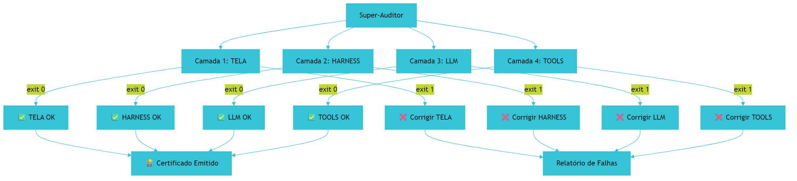

## 4. Técnica

### 4.1 Script de Super-Auditoria

```python
#!/usr/bin/env python3
"""auditar_todas_camadas.py — valida as 4 Camadas"""
import subprocess
import sys

camadas = [
    ("TELA", "scripts/auditar_camada_tela.py"),
    ("HARNESS", "scripts/auditar_camada_harness.py"),
    ("LLM", "scripts/auditar_camada_llm.py"),
    ("TOOLS", "scripts/auditar_camada_tools.py"),
]

print("=" * 60)
print("📊 QUADRO FINAL DE CONFORMIDADE DAS 4 CAMADAS:")
print("=" * 60)

todas_aprovadas = True
for nome, script in camadas:
    resultado = subprocess.run(
        [sys.executable, script],
        capture_output=True, text=True
    )
    if resultado.returncode == 0:
        print(f"  -> CAMADA: {nome:<15} ✅ 100% APROVADO")
    else:
        print(f"  -> CAMADA: {nome:<15} ❌ REPROVADO")
        todas_aprovadas = False

print("=" * 60)
if todas_aprovadas:
    print("🏆 CERTIFICADO EMITIDO: TODAS AS 4 CAMADAS EM MATURIDADE!")
    exit(0)
else:
    print("⚠️ CORRIJA OS PROBLEMAS ANTES DE PROSSEGUIR")
    exit(1)
```

### 4.2 Checklist Completo de Implementação

```bash
# ═══ CHECKLIST DA CAMADA TELA ═══
[ ] .claude/CLAUDE.md com 18 regras (R1-R18)
[ ] .claude/skills/caveman/SKILL.md
[ ] .claude/skills/headroom/SKILL.md
[ ] .claude/skills/lean-ctx/SKILL.md
[ ] .claude/skills/rtk-memory/SKILL.md
[ ] .claude/skills/pre-flight-check/SKILL.md
[ ] RTK-SCRATCHPAD.md na raiz

# ═══ CHECKLIST DA CAMADA HARNESS ═══
[ ] .claude/settings.json com circuit breaker e sandbox
[ ] .git/hooks/pre-commit com 6 gates
[ ] Hardlinks/junctions para todas as IDEs

# ═══ CHECKLIST DA CAMADA LLM ═══
[ ] scripts/roteador_llm.py
[ ] scripts/schemas/ com JSON schemas
[ ] scripts/tipos.py com registro declarativo

# ═══ CHECKLIST DA CAMADA TOOLS ═══
[ ] .mcp.json configurado
[ ] scripts/estado_esteira.py
[ ] Scripts determinísticos de validação
[ ] Super-auditor.py
```

### 4.3 O Certificado de Maturidade

Quando todas as 4 Camadas estão 100%, o sistema emite o certificado de conformidade técnica [1].:

```
================================================================================
 📊 QUADRO FINAL DE CONFORMIDADE DAS 4 CAMADAS:
================================================================================
  -> CAMADA 1: TELA            ✅ 100% APROVADO (Exit 0)
  -> CAMADA 2: HARNESS         ✅ 100% APROVADO (Exit 0)
  -> CAMADA 3: LLM             ✅ 100% APROVADO (Exit 0)
  -> CAMADA 4: TOOLS           ✅ 100% APROVADO (Exit 0)
================================================================================
 🏆 CERTIFICADO EMITIDO: TODAS AS 4 CAMADAS EM MATURIDADE!
================================================================================
```

## 5. Aplica

Sua empresa quer implementar a arquitetura das 4 Camadas em todos os 20 repositórios. O plano é:

1. Criar um repositório "template" com toda a infraestrutura
2. Para cada repositório, clonar o template e adaptar
3. Rodar o Super-Auditor em cada um
4. Monitorar com dashboard de conformidade

### Exercício

- [ ] Implemente todas as 4 Camadas no seu projeto principal
- [ ] Rode o Super-Auditor e verifique exit 0
- [ ] Documente o tempo total de implementação
- [ ] Crie um guia de replicação para a sua equipe
- [ ] Planeje a implementação nos próximos 3 repositórios


**Limite de escala:** O Super-Auditor certifica obras de até ~300 capítulos; acima disso, o relatório único satura e convém auditoriar por subcoleção.
## 6. Conclusão

Ao dominar as **4 Camadas da Fábrica Agêntica**, você deixou de ser um mero "usuário de chat de IA" e se tornou um **Engenheiro de Sistemas Autônomos de Alta Confiabilidade** [1].

Você agora possui o controle total sobre:
1. O que o modelo enxerga e como ele pensa (**TELA** — Capítulos 5-8);
2. Como o ciclo de vida do agente é isolado e protegido (**HARNESS** — Capítulos 9-12);
3. Como a cognição probabilística é roteada por custo e tipada por schemas (**LLM** — Capítulos 13-16);
4. Como ferramentas determinísticas garantem verdade matemática (**TOOLS** — Capítulos 17-20).

A arquitetura das 4 Camadas é universal — funciona para SaaS, consultorias, engenharia de dados, e qualquer projeto que use IA [1]. O manual de montagem está neste capítulo. O Super-Auditor está pronto para validar. A bola está com você.

Como Engenheiro de Sistemas Autônomos, você não apenas usa IA — você governa sistemas autônomos de alta confiabilidade, com custo previsível, qualidade verificável, e soberania total sobre cada decisão.

*Fim do Tratado das 4 Camadas da Fábrica Agêntica · Versão 1.0.*

## 7. Referências Bibliográficas

[1] FÁBRICA UNIVERSAL. *Scripts/auditar_todas_camadas.py — Super-Auditor Geral*. Disponível em: repositório local do projeto Fábrica Agêntica (proj_fabrica-de-livros) Acesso em: 25 ago. 2026.

[2] FÁBRICA UNIVERSAL. *Guia da Fábrica Agêntica de Publicações V5*. Disponível em: repositório local do projeto Fábrica Agêntica (proj_fabrica-de-livros) Acesso em: 25 ago. 2026.

[3] FOWLER, Martin. *Harness Engineering for Coding Agents*. Disponível em: https://martinfowler.com/articles/harness-engineering.html.

[4] ANTHROPIC. *Introducing the Model Context Protocol*. Disponível em: https://www.anthropic.com/news/model-context-protocol.

[5] LIU, Nelson F. et al. *Lost in the Middle: How Language Models Use Long Contexts*. In: arXiv, 2023. Disponível em: https://arxiv.org/abs/2307.03172.

[6] ANTHROPIC. *Building Effective Agents*. Disponível em: https://www.anthropic.com/engineering/building-effective-agents.

[7] PRINCETON UNIVERSITY. *SWE-bench Verified & Pro*. Disponível em: https://www.swebench.com.

[8] HUZITA, Elisa Hatsue Moriya et al. *Uma proposta de arquitetura de software baseada em agentes*. In: Acta Scientiae Technologica. 2000. Disponível em: http://www.periodicos.uem.br/ojs/index.php/ActaSciTechnol/article/view/3131.

[9] BORDINI, Rafael H.; VIEIRA, Renata. *Linguagens de programação orientadas a agentes*. In: Lume (UFRGS). 2003. Disponível em: http://hdl.handle.net/10183/19885.

[10] FERNANDES, Robson dos Santos. *INTELIGÊNCIA ARTIFICIAL APLICADA EM ENGENHARIA DE SOFTWARE*. In: Inovações Multidisciplinares na Engenharia. 2025. Disponível em: https://doi.org/10.63330/aurumpub.005-009.

[11] ROBERTO SANTOS, CLÁUDIO. *PROPOSTA CONSTITUCIONAL PARA A GOVERNANÇA DE AGENTES AUTÔNOMOS DE IA NO BRASIL*. 2026. Disponível em: https://doi.org/10.17771/pucrio.acad.77233.

[12] *Toward Agentic Software Engineering Beyond Code*. In: arXiv, 2026. Disponível em: https://arxiv.org/html/2510.19692v2.

[13] *AI-Native Software Engineering and the Evolution of the Agentic Engineer*. In: arXiv, 2026. Disponível em: https://arxiv.org/html/2606.28791v1.

[14] CODECENTRIC. *Loop, Harness, Context Engineering*. Disponível em: https://www.codecentric.de/en/knowledge-hub/blog/loop-harness-context-engineering-explained.

[15] DATABRICKS. *What is an AI Agent Harness?*. Disponível em: https://www.databricks.com/blog/ai-harness.

[16] DESCHRYVER, Tim. *Keep Agentic AI Simple*. Disponível em: https://timdeschryver.dev/blog/keep-agentic-ai-simple-a-practical-workflow-for-software-development.

[17] GANGLANI, Kunal. *4-Tier AI Agent Memory & State Management*. Disponível em: https://www.kunalganglani.com/blog/ai-agent-memory-state-management.

[18] SALESFORCE ENGINEERING. *Agentforce's Agent Script*. Disponível em: https://engineering.salesforce.com/agentforces-agentscript-building-deterministic-control-for-enterprise-ai-workflows/.

[19] ATLAN. *Prompt vs Context vs Harness Engineering*. Disponível em: https://atlan.com/know/harness-engineering-vs-prompt-engineering/.

[20] INTROL. *Prompt Caching Infrastructure*. Disponível em: https://introl.com/blog/prompt-caching-infrastructure-llm-cost-latency-reduction-guide-2025.

[21] DIGITAL APPLIED. *Prompt Caching in 2026*. Disponível em: https://www.digitalapplied.com/blog/prompt-caching-2026-cut-llm-costs-engineering-guide.

[22] AUGMENT CODE. *Harness Engineering for AI Coding Agents*. Disponível em: https://www.augmentcode.com/guides/harness-engineering-ai-coding-agents.

# Conclusão Geral

Chegamos ao fim da jornada — e, mais importante, ao início da sua prática. O
leitor que era usuário de ferramentas de IA agora dispõe do arcabouço completo
para se tornar **Arquiteto de Sistemas Autônomos de Alta Confiabilidade**.

As 4 Camadas não são uma receita mágica, mas um sistema de freios e contrapesos:
a TELA dá visibilidade ao custo e ao contexto; o HARNESS impõe limites e
reversibilidade; o LLM roteia decisões por Pareto; e o TOOLS executa o
determinismo mecânico que nenhum modelo sozinho garantiria. Juntas, transformam
agentes imprevisíveis em engenharia reproduzível.

O convite final é simples: aplique o Super-Auditor, blinde seu legado e construa
novo do zero sobre este manual de montagem universal. A soberania sobre o seu
software começa quando você deixa de torcer para a IA acertar — e passa a
governá-la.