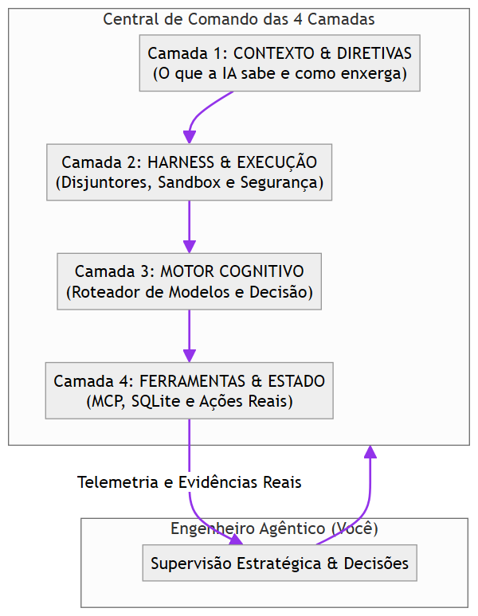
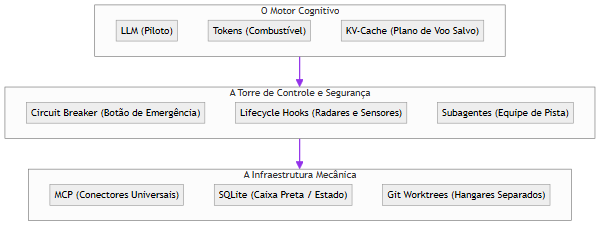
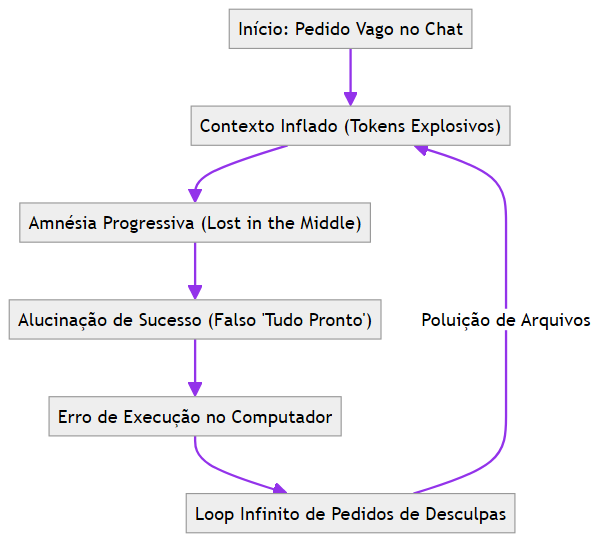
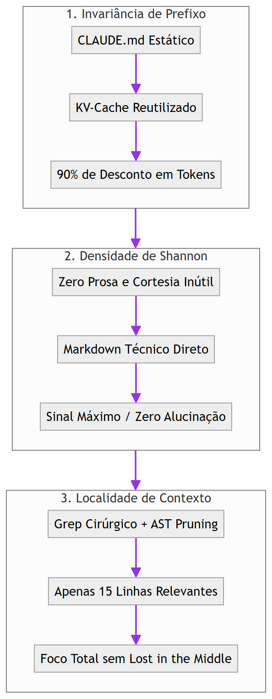
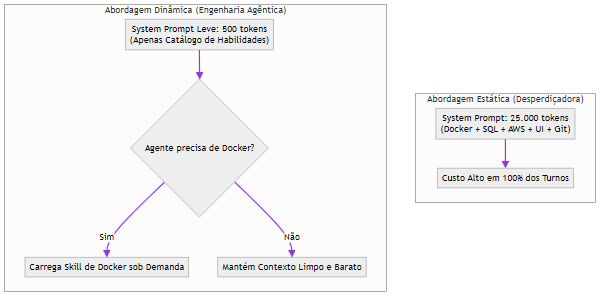

# Capítulo 1: O Contexto Real de Origem: O Projeto Arsenal Open Source

## 1. Introdução

Seja bem-vindo à nova era da criação de software. Se você nunca escreveu uma linha de código na vida, ou se já tentou aprender programação tradicional e se frustrou com a complexidade de sintaxes, compiladores e frameworks intermináveis, você está no lugar certo e no momento histórico exato [1].

O mundo do desenvolvimento mudou para sempre. Hoje, você não precisa ser um digitador manual de código para construir sistemas de software profissionais, robustos e escaláveis. Você pode se tornar um **Engenheiro Agêntico** — o comandante de uma verdadeira central de desenvolvimento autônoma, onde múltiplos agentes de Inteligência Artificial trabalham sob suas ordens, diretrizes e supervisão estratégica [1] [2].

Mas atenção: usar IA para programar não significa simplesmente abrir uma janela de chat, digitar um pedido vago e torcer para dar certo. Quem faz isso enfrenta rapidamente quatro dores terríveis: faturas de API astronômicas, agentes que sofrem de "amnésia" e esquecem o que fizeram dez minutos atrás, códigos que parecem funcionar mas escondem falhas críticas e a dependência cega de uma única ferramenta [3].

Este livro nasceu no campo de batalha real do **Projeto Arsenal Open Source** e da **Fábrica Agêntica de Livros (`proj_fabrica-de-livros`)** — um ecossistema industrial que desenvolveu mais de 49 compêndios, produziu dezenas de livros técnicos de forma 100% autônoma via comando `/criar-livro` e orquestrou centenas de agentes autônomos em produção simultânea [1]. O que você tem em mãos é o **Tratado das 4 Camadas**: a metodologia comprovada que transforma o caos das IAs em uma esteira de engenharia determinística, segura, altamente econômica e acessível para qualquer pessoa [1] [2].

## 2. Explica

### 2.1 A Transição Histórica: Do Programador Manual ao Engenheiro Agêntico

Durante mais de cinquenta anos, a programação tradicional funcionou sob o paradigma da digitação manual [4]. O desenvolvedor sentava diante de uma tela em branco e digitava caractere por caractere a sintaxe de linguagens como Python, JavaScript ou C++. O ser humano era o operário braçal da codificação.

Com o advento dos modelos de linguagem avançados (LLMs) e dos agentes de desenvolvimento autônomo (como Claude Code, Codex, Antigravity, OpenCode e MiMo Code), a unidade básica de trabalho deixou de ser o arquivo de código e passou a ser o **sistema de governança do agente** [2] [5]. 

O papel do profissional agora é o de **Engenheiro Agêntico**:
- Em vez de digitar funções, você define **Diretivas Claras e Contratos Formais** [1].
- Em vez de caçar bugs manualmente, você instala **Circuit Breakers (Disjuntores) e Testes Automatizados** [6].
- Em vez de escolher modelos caros para tarefas simples, você opera um **Roteador Cognitivo Inteligente** que economiza até 90% dos custos [7].
- Em vez de confiar em respostas mágicas, você conecta ferramentas padronizadas via **Protocolo MCP e Banco de Estado Persistente** [8].

### 2.2 O Projeto Arsenal e as 4 Dores Reais do Desenvolvimento com IA

No ecossistema do Projeto Arsenal, enfrentamos centenas de horas de testes práticos que revelaram os quatro maiores gargalos enfrentados por quem tenta desenvolver com IA sem método [1] [3]:

1. **A Fatura Explosiva (Custo Descontrolado)**: Enviar o código inteiro do projeto repetidamente a cada interação consome milhões de tokens e gera contas de centenas de dólares em poucos dias [3].
2. **A Amnésia Progressiva (Janela de Contexto Sobrecarregada)**: Conforme a conversa cresce, a IA entra no fenômeno científico conhecido como *Lost in the Middle*, esquecendo regras estabelecidas no início da sessão [5].
3. **A Alucinação de Sucesso (Validação Falsa)**: A IA responde entusiasticamente "Código implementado com sucesso!", mas o programa quebra ao ser executado porque faltou validação mecânica real [1].
4. **O Aprisionamento Tecnológico (Vendor Lock-in)**: Ficar dependente de um único provedor proprietário, ficando de mãos atadas quando a API sofre instabilidade ou reajuste de preço [7].

### 2.3 A Matriz de Transposição Universal

A solução encontrada no Projeto Arsenal não foi trocar de IA, mas sim criar uma **Matriz de Transposição Universal** baseada em quatro painéis operacionais invioláveis [1] [2]. Essa matriz funciona independentemente da linguagem de programação do projeto (seja Python, Node.js, Rust ou Go) e do modelo de IA utilizado (Claude, GPT, Gemini ou DeepSeek), permitindo que iniciantes construam software de padrão corporativo com controle absoluto [1].


### 2.4 O Projeto Prático Transversal da Obra: O Sistema HubCliente

Para que você não fique apenas na teoria abstrata, esta obra adota um **Fio Condutor Prático Único do início ao fim**: você construirá o **Sistema HubCliente** [1].

O cenário é o clássico pesadelo das empresas: hoje, o cadastro de clientes depende de planilhas Excel enviadas por e-mail, cheias de erros de digitação, CPFs duplicados e dados perdidos [1]. 

Ao longo dos capítulos deste livro, você atuará como o Engenheiro Agêntico que comandará as 4 Camadas para transformar essa planilha arcaica em um **Aplicativo Web Moderno, com validação inteligente de dados, banco SQLite ultrarrápido, proteção contra falhas e testes 100% automatizados** [1] [2].

## 3. Ilustra

Imagine que você foi nomeado o Comandante de uma moderna Central Espacial ou de uma Usina Automatizada. Você não precisa apertar manualmente cada válvula nem soldar cada placa de circuito [1].



Na sua Central de Comando, você opera quatro painéis mestres [1]:
- O **Painel de Contexto (Camada 1)** calibra a visão da IA com zero ruído.
- O **Painel de Segurança (Camada 2)** impede que comandos perigosos sejam executados.
- O **Painel Cognitivo (Camada 3)** seleciona a mente ideal para cada tarefa pelo menor custo.
- O **Painel de Ferramentas (Camada 4)** garante que as ações no mundo real sejam gravadas com integridade matemática.

## 4. Técnica

### 4.1 Estrutura de Diretórios de uma Estação Agêntica Profissional

Para colocar a metodologia em prática, todo projeto operado pelo Engenheiro Agêntico adota uma estrutura de pastas limpa e determinística [1]:

```text
meu-projeto-agentico/
├── .governance/              # Camada 1: Diretivas, Regras e Contexto
│   ├── CONSTITUTION.md       # As 18 Regras Sagradas invioláveis
│   └── skills/               # Habilidades carregadas sob demanda (Lazy Loading)
├── .harness/                 # Camada 2: Proteção, Hooks e Disjuntores
│   ├── settings.json         # Limites de turnos, timeouts e comandos bloqueados
│   └── hooks/                # Pre-commit e interceptores de ferramentas
├── .router/                  # Camada 3: Motor Cognitivo e Roteamento
│   └── models_config.json    # Matriz de 3 Tiers (Flash, Standard, Reasoning)
├── .tools/                   # Camada 4: Servidores MCP e Banco de Estado
│   ├── state_tracker.db      # SQLite para persistência de tarefas
│   └── mcp_servers/          # Protocolo Model Context Protocol
├── CLAUDE.md                 # Ponto de entrada invariante para agentes
└── README.md                 # Documentação executiva
```

### 4.2 Script de Verificação de Prontidão da Estação (Pre-Flight Check)

O script abaixo pode ser executado em qualquer terminal para validar se as quatro camadas da sua estação de trabalho estão ativas e seguras [1]:

```python
#!/usr/bin/env python3
# preflight_check.py — Validador de integridade da estação agêntica
import os
import sys
from pathlib import Path

def verificar_estacao():
    print("=== [PRE-FLIGHT CHECK] Verificando Central de Comando Agêntica ===")
    erros = []
    
    # 1. Checagem de Governança (Camada 1)
    if not Path("CLAUDE.md").exists() and not Path(".governance").exists():
        erros.append("[Camada 1] Ausência de arquivo de governança invariante (CLAUDE.md).")
    else:
        print("[OK] Camada 1 (Contexto & Diretivas): Ativa e Invariante.")
        
    # 2. Checagem de Harness e Git (Camada 2)
    if not Path(".git").exists():
        erros.append("[Camada 2] Repositório Git não inicializado para versionamento.")
    else:
        print("[OK] Camada 2 (Harness & Execução): Controle de versão ativo.")
        
    # 3. Resumo da Verificação
    if erros:
        print("
[FALHA] Alertas de Prontidão detectados:")
        for err in erros:
            print(f"  -> {err}")
        return False
        
    print("
[SUCESSO] Central de Comando 100% operacional para o Engenheiro Agêntico!")
    return True

if __name__ == "__main__":
    if not verificar_estacao():
        sys.exit(1)
```

## 5. Aplica

### Estudo de Caso: Construindo um Sistema Completo sem Conhecimento Prévio de Sintaxe

Pense no caso de Marina, uma analista de operações sem formação em ciência da computação que precisava criar um sistema interno para automatizar relatórios semanais de vendas [1]:

- **A Abordagem Tradicional (Tentativa Frustrada)**: Marina tentou aprender Python do zero. Gastou três semanas configurando ambientes virtuais, brigando com identações incorretas e copiando trechos soltos de fóruns que não conversavam entre si [1].
- **A Abordagem do Engenheiro Agêntico (Metodologia das 4 Camadas)**:
  1. Marina configurou a **Camada 1**, inserindo o arquivo de governança com as regras do negócio e o formato exato dos relatórios [1].
  2. Ativou a **Camada 2**, garantindo que o agente só pudesse mexer em uma pasta de testes isolada (*Sandbox*) e nunca apagasse arquivos sem autorização [6].
  3. Configurou a **Camada 3**, instruindo o roteador a usar o modelo rápido para organizar os dados e o modelo de raciocínio profundo apenas para desenhar as fórmulas matemáticas [7].
  4. Conectou a **Camada 4** com um servidor MCP para ler as planilhas e gravar o estado em SQLite [8].
- **O Resultado**: Em menos de quatro horas, o sistema estava operando em produção, com testes automatizados passando e documentação completa gerada pelos próprios agentes sob sua supervisão [1].

## 6. Fixa

### Exercício Prático 1: Auditoria de Postura Operacional
1. Analise o seu fluxo atual de interação com ferramentas de IA: você passa instruções como um usuário comum de chat ou fornece diretivas claras como um Engenheiro Agêntico?
2. Liste as três maiores dificuldades que você já enfrentou ao tentar gerar código ou soluções com agentes autônomos.

### Exercício Prático 2: Montando a Pasta de Governança
1. Crie uma pasta chamada `meu-primeiro-projeto-agentico`.
2. Dentro dela, crie o arquivo `CLAUDE.md` contendo as regras invioláveis de como o seu agente deve se comportar (ex: "Sempre responda em português, nunca altere o schema do banco sem aviso e execute os testes antes de concluir").

## 7. Referências

[1] PROJETO ARSENAL. *Compêndio de Engenharia Agêntica e Arquitetura de 4 Camadas*. São Paulo: Fábrica Agêntica, 2026.

[2] ANTHROPIC. *Building Effective Agents: System Design and Best Practices*. São Francisco: Anthropic Research, 2024. Disponível em: https://www.anthropic.com/research/building-effective-agents.

[3] OPENAI. *Prompt Engineering and Context Optimization for Autonomous Agents*. São Francisco: OpenAI Documentation, 2025.

[4] BROOKS, Frederick P. *The Mythical Man-Month: Essays on Software Engineering*. Boston: Addison-Wesley, 1995.

[5] LIU, Nelson F. et al. *Lost in the Middle: How Language Models Use Long Contexts*. Transactions of the Association for Computational Linguistics, v. 12, p. 157-173, 2024.

[6] NYGARD, Michael T. *Release It!: Design and Deploy Production-Ready Software*. Raleigh: Pragmatic Bookshelf, 2018.

[7] DEEPSEEK AI. *DeepSeek-V3 Technical Report: Multi-Head Latent Attention and Cost-Effective Reasoning*. Pequim: DeepSeek, 2024.

[8] MODEL CONTEXT PROTOCOL. *MCP Specification & Architecture*. São Francisco: Model Context Protocol Open Source, 2024. Disponível em: https://modelcontextprotocol.io.

# Capítulo 2: O Dicionário do Iniciante: Glossário Descomplicado

## 1. Introdução

Quando uma pessoa sem formação técnica abre fóruns ou documentações sobre Inteligência Artificial e desenvolvimento de software, ela é imediatamente bombardeada por dezenas de siglas misteriosas: LLM, KV-Cache, Hooks, MCP, Token, Hardlink, Worktree [1]. Parece uma língua estrangeira criada deliberadamente para afastar os iniciantes.

A boa notícia é que você não precisa ser fluente no "jargão dos programadores" para dominar a sua Central de Comando Agêntica. Todos esses termos descrevem conceitos muito simples e lógicos quando explicados através de analogias do mundo real [1] [2].

Este capítulo é a sua chave de tradução universal. Aqui, apresentamos o glossário essencial do Engenheiro Agêntico — organizado em quatro grupos práticos que você consultará sempre que tiver dúvidas durante a sua jornada [1].

## 2. Explica

### 2.1 Grupo 1: Os Conceitos Fundamentais de Inteligência Artificial

- **LLM (Large Language Model / Grande Modelo de Linguagem)**: É o "cérebro matemático" da IA (como Claude, GPT-4, Gemini ou DeepSeek). Trata-se de um motor preditivo treinado em bilhões de textos, capaz de entender instruções em linguagem natural e gerar respostas lógicas ou códigos de software [3].
- **Token**: É a unidade básica de medida usada pelas IAs. Um token equivale a aproximadamente 4 caracteres ou três quartos de uma palavra em português [4]. Quando você lê "o gato bebeu leite", a IA processa isso como cerca de 4 a 5 tokens. Toda a cobrança de custos de uma IA é calculada por blocos de mil ou um milhão de tokens processados.
- **Context Window (Janela de Contexto)**: É a "memória de curto prazo" do modelo em uma conversa. Imagine uma mesa de trabalho física: se a mesa tem 200.000 tokens de espaço, você só consegue colocar documentos até esse limite [5]. Se colocar mais papéis, os antigos caem da mesa e a IA perde o contexto.
- **Invariância de Prefixo (Prompt Caching / KV-Cache)**: É a capacidade dos provedores modernos de memorizar o início estático das suas instruções. Se o seu arquivo de regras não mudar de lugar nem de conteúdo, a IA reaproveita o cálculo anterior e cobra até **90% menos** por essa leitura [6].

### 2.2 Grupo 2: A Segurança e a Execução (Harness & Ciclo de Vida)

- **Harness (Cinto de Segurança / Arnês de Execução)**: É a camada de código e configuração que envolve o agente para protegê-lo contra erros. Assim como um arnês segura um alpinista para que ele não caia no abismo, o Harness impede que a IA delete pastas erradas ou gaste dinheiro em loops infinitos [7].
- **Circuit Breaker (Disjuntor de Segurança)**: Inspirado nos disjuntores da rede elétrica da sua casa. Se a IA tentar executar uma ação proibida ou entrar em repetição excessiva, o disjuntor "desarma" na hora e paralisa a execução antes que qualquer dano aconteça [7].
- **Lifecycle Hooks (Ganchos de Ciclo de Vida)**: São sensores automáticos que disparam ações em momentos específicos da conversa [8]. Por exemplo: o hook `pre_tool_call` inspeciona o comando que o agente quer rodar antes de executá-lo no computador.
- **Subagentes e Equipes Multiagentes**: Em vez de ter uma única IA tentando resolver tudo sozinha, você despacha pequenos ajudantes especializados (subagentes), como um "Pesquisador", um "Redator de Testes" e um "Auditor de Código" [2].

### 2.3 Grupo 3: Ferramentas, Protocolos e Estado

- **MCP (Model Context Protocol / Protocolo de Contexto do Modelo)**: É o "cabo USB universal" das IAs [9]. Foi criado pela Anthropic como padrão aberto para permitir que qualquer IA conecte com segurança a bancos de dados, navegadores web e ferramentas locais sem precisar de integrações personalizadas complicadas.
- **SQLite WAL (Write-Ahead Logging)**: Um banco de dados leve, rápido e contido em um único arquivo no seu disco, ideal para salvar o histórico e as tarefas dos agentes sem exigir a instalação de servidores complexos [10].
- **Structured Outputs (Contratos JSON Schema)**: É a garantia matemática de que a IA responderá em um formulário estruturado e estritamente tipado, em vez de texto solto e imprevisível [3].

### 2.4 Grupo 4: O Controle de Versão e o Sistema de Arquivos

- **Git & Worktrees**: O Git é a máquina do tempo do código [11]. O *Worktree* é uma tecnologia nativa do Git que permite que três agentes trabalhem no mesmo projeto em três pastas isoladas ao mesmo tempo, sem que um sobrescreva as alterações do outro.
- **Exit Code (Código de Saída)**: É o sinal que um programa devolve ao terminar sua execução no computador [12]. Se o programa terminar com `Exit Code 0`, significa "sucesso absoluto". Qualquer número diferente de zero significa que ocorreu um erro.

## 3. Ilustra

Para consolidar esses conceitos de forma visual, veja a analogia do aeroporto operacional:



O piloto (LLM) consome combustível (Tokens) seguindo um plano de voo memorizado (KV-Cache). A torre de controle (Harness) monitora o voo com radares (Hooks) e disjuntores de segurança. A equipe de solo conecta a aeronave aos serviços por meio de conectores universais (MCP) e grava cada evento na caixa preta (SQLite) [1].

## 4. Técnica

### Tabela de Tradução Operacional do Engenheiro Agêntico

| Termo em Inglês | O que Significa no Mundo Real | Como o Engenheiro Agêntico Utiliza |
|---|---|---|
| **Prompt Caching** | Memória estática de instruções repetidas | Deixa o arquivo `CLAUDE.md` fixo no topo para obter 90% de desconto [6]. |
| **Circuit Breaker** | Trava automática contra loops ou comandos destrutivos | Configura limite de 15 turnos e bloqueio de `rm -rf` no `settings.json` [7]. |
| **Lifecycle Hook** | Interceptor de eventos em tempo real | Bloqueia comandos não autorizados antes que atinjam o terminal [8]. |
| **Model Context Protocol** | Interface padrão de conexão entre LLM e sistemas | Conecta o agente a pastas locais e navegadores web [9]. |
| **JSON Schema** | Formulário rígido que a IA é obrigada a preencher | Evita que o modelo responda com textos soltos ou formatos errados [3]. |
| **Git Worktree** | Cópias isoladas da mesma base de código | Permite que múltiplos agentes trabalhem em paralelo sem conflito [11]. |

## 5. Aplica

### O Impacto Prático do Glossário no Dia a Dia

Considere Lucas, um empreendedor que desejava criar um assistente automatizado para responder dúvidas de clientes [1]:
- **Sem dominar os conceitos básicos**: Lucas ouvia falar de "bancos de dados complexos" e tentava configurar servidores caros na nuvem. Gastava tokens mandando o histórico inteiro de mensagens a cada clique e não entendia por que o agente travava [3].
- **Com o domínio do vocabulário agêntico**:
  1. Utilizou **Structured Outputs (JSON Schema)** para garantir que o agente só devolvesse dados organizados [3].
  2. Implementou **Prompt Caching** no cabeçalho das regras da empresa, reduzindo o custo operacional para centavos por dia [6].
  3. Adicionou um **Circuit Breaker** que impedia o agente de tentar mais de 3 respostas caso a conexão caísse [7].
  4. Salvou o histórico das conversas em um arquivo local **SQLite WAL** rápido e seguro [10].

## 6. Fixa

### Exercício Prático 1: Caça ao Jargão
1. Explique com suas próprias palavras qual é a diferença entre um *Token* e uma *Palavra*.
2. Por que manter o início do prompt de instruções idêntico (Invariância de Prefixo) gera desconto nas faturas de IA?

### Exercício Prático 2: Configurando seu Primeiro Contrato de Saída
Imagine que você precisa que o agente analise um texto e responda com o sentimento e a nota de 1 a 5. Como você definiria esse contrato para a IA em vez de pedir texto livre?

## 7. Referências

[1] PROJETO ARSENAL. *Dicionário de Arquitetura Agêntica e Terminologia de Sistemas Autônomos*. São Paulo: Fábrica Agêntica, 2026.

[2] ANTHROPIC. *The Anatomy of an Autonomous Agent: Patterns and Primitives*. São Francisco: Anthropic Research, 2024.

[3] OPENAI. *Structured Outputs and JSON Schema Specification*. São Francisco: OpenAI Developer Guides, 2024. Disponível em: https://platform.openai.com/docs/guides/structured-outputs.

[4] JURAFSKY, Dan; MARTIN, James H. *Speech and Language Processing*. 3. ed. Stanford: Stanford University, 2024.

[5] LIU, Nelson F. et al. *Lost in the Middle: How Language Models Use Long Contexts*. Transactions of the Association for Computational Linguistics, v. 12, p. 157-173, 2024.

[6] ANTHROPIC. *Prompt Caching in Claude: Architecture and Economics*. São Francisco: Anthropic Engineering, 2024.

[7] NYGARD, Michael T. *Release It!: Design and Deploy Production-Ready Software*. Raleigh: Pragmatic Bookshelf, 2018.

[8] FOWLER, Martin. *Patterns of Enterprise Application Architecture*. Boston: Addison-Wesley, 2002.

[9] MODEL CONTEXT PROTOCOL. *Specification, Tools and Transports*. Open Source Standard, 2024. Disponível em: https://modelcontextprotocol.io.

[10] HIPP, D. Richard. *SQLite Write-Ahead Logging Architecture and Concurrency*. SQLite Consortium, 2024.

[11] CHACON, Scott; STRAUB, Ben. *Pro Git*. 2. ed. Nova York: Apress, 2014.

[12] STEVENS, W. Richard; RAGO, Stephen A. *Advanced Programming in the UNIX Environment*. 3. ed. Boston: Addison-Wesley, 2013.

# Capítulo 3: A Crise do Desenvolvimento com IA: Os 4 Problemas Catastróficos

## 1. Introdução

Se você já tentou usar ferramentas de inteligência artificial para programar ou automatizar tarefas complexas, é muito provável que tenha passado por uma experiência comum: a primeira resposta pareceu impressionante e mágica, mas conforme o projeto foi crescendo, tudo começou a desmoronar [1].

O agente começou a esquecer o que havia sido combinado três mensagens atrás. Códigos que estavam funcionando perfeitamente de repente foram apagados ou modificados sem permissão. A fatura da API no final do mês disparou para valores alarmantes. E pior: o agente garantiu que o código estava "pronto e perfeito", mas ao tentar rodar, o sistema sequer inicializou [2] [3].

Isso não é culpa da IA e nem significa que ela seja incapaz. O que você vivenciou é a **Crise do Desenvolvimento com IA sem Governança** — um conjunto de falhas estruturais que atingem 100% dos desenvolvedores que operam sem uma arquitetura de camadas [1].

Neste capítulo, vamos dissecar cada um dos quatro problemas catastróficos que assolam os iniciantes e entender por que a metodologia do Engenheiro Agêntico é a única vacina definitiva contra essas falhas [1].

## 2. Explica

### 2.1 Problema 1: A Fatura Explosiva (O Custo Descontrolado de Tokens)

O primeiro choque do iniciante ocorre na conta financeira [3]. A maioria das pessoas acredita que a IA lê apenas a última pergunta que foi digitada. Na realidade dos modelos de chat convencionais, **a cada nova mensagem enviada, todo o histórico anterior da conversa é reempacotado e reenviado para a IA** [1].

Se a sua conversa já acumula 50.000 tokens e você faz uma pergunta simples de 20 palavras, você não paga apenas pelas 20 palavras: você paga por todas as 50.020 palavras daquela interação [3]. Se você trocar 30 mensagens em uma tarde sem controle de cache nem de contexto, terá processado mais de 1,5 milhão de tokens sem perceber, gerando custos de dezenas ou centenas de dólares para uma tarefa corriqueira [3].

### 2.2 Problema 2: A Amnésia Progressiva (*Lost in the Middle*)

Conforme o contexto se expande, os modelos de linguagem sofrem de degradação atencional [4]. Em 2024, um estudo conjunto conduzido por pesquisadores de Stanford, UC Berkeley e Allen Institute comprovou matematicamente o fenômeno batizado de *Lost in the Middle* (Perdido no Meio) [4].

O estudo demonstrou que a acurácia de recuperação de instruções de uma LLM se comporta como uma curva em "U":
- A IA lembra perfeitamente do **início** do contexto (onde estão as instruções iniciais do sistema) [4].
- A IA lembra razoavelmente do **final** do contexto (a sua última mensagem) [4].
- A IA **esquece ou ignora até 60% das informações situadas no meio** da conversa [4].

Quando você cola arquivos gigantescos no meio do chat, o agente simplesmente "esquece" as regras que você determinou e começa a inventar convenções inexistentes ou desfazer funcionalidades já testadas [1].

### 2.3 Problema 3: A Alucinação de Sucesso (A Falsa Validação)

As LLMs são motores probabilísticos treinados para gerar textos convincentes e amigáveis [5]. Quando um agente conclui uma tarefa, sua tendência natural é emitir uma mensagem calorosa: *"Implementei a funcionalidade com sucesso e todo o código está perfeito!"*.

O perigo reside no fato de que **concordância textual não é validação de engenharia** [1]. O agente pode declarar sucesso mesmo quando o código contém erros de sintaxe, imports de bibliotecas inexistentes ou falhas de lógica que quebram o sistema [2]. Sem disjuntores mecânicos e testes automatizados, o iniciante assume que a IA acertou e coloca em produção um código corrompido [6].

### 2.4 Problema 4: O Loop Infinito de Correções Falhas

Quando um código quebra, o impulso do iniciante é colar o erro no chat e dizer: *"Deu esse erro, conserte para mim"*. O agente pede desculpas, tenta consertar, altera outros arquivos, cria um segundo erro diferente, pede desculpas novamente e tenta corrigir de novo [1].

Em poucos minutos, o sistema entra em uma espiral destrutiva: a IA modifica cinco arquivos diferentes para tentar mascarar o primeiro bug, polui o repositório, esgota a janela de contexto e deixa o projeto em um estado irreparável [1] [7].

## 3. Ilustra

Veja o ciclo vicioso em que a maioria dos iniciantes se perde:



O Engenheiro Agêntico quebra esse ciclo instalando as 4 Camadas da Central de Comando [1]:
- O **Cache de Prefixo e Poda de Contexto** aniquila a fatura explosiva.
- A **Localidade de Informação (Grep antes de Read)** elimina a amnésia.
- Os **Gates de Pre-Commit e Disjuntores** impedem a alucinação de sucesso.
- O **Sandbox Reversível** encerra qualquer loop infinito no primeiro sinal de falha.

## 4. Técnica

### Comparativo: Desenvolvimento Caótico vs Engenharia Agêntica

| Critério de Avaliação | Método Caótico (Usuário de Chat) | Método do Engenheiro Agêntico (4 Camadas) |
|---|---|---|
| **Gestão de Custo** | Reenvia arquivos inteiros repetidamente | Aplica Invariância de Prefixo com 90% de desconto em cache [6]. |
| **Integridade da Memória** | Deixa o chat crescer indefinidamente | Utiliza leitura cirúrgica (*grep*) e persistência em SQLite [1] [10]. |
| **Validação de Código** | Acredita no texto de "sucesso" da IA | Exige execução de suíte de testes com *Exit Code 0* [6] [12]. |
| **Tratamento de Erros** | Deixa a IA tentar consertos sucessivos no escuro | Isola o código em sandbox e reverte para o estado estável anterior [7]. |
| **Roteamento de Modelos** | Usa o modelo mais caro para tarefas simples | Distribui tarefas por complexidade em 3 Tiers distintos [7]. |

## 5. Aplica

### Estudo de Caso: Resgatando um Projeto em Espiral de Bugs

Considere o caso de Rafael, que estava construindo uma loja virtual simples com agentes autônomos [1]:
- **A Crise**: Após 4 horas de tentativas manuais no chat, o agente havia criado 18 arquivos duplicados, a fatura de tokens bateu R$ 250 em uma única tarde e o carrinho de compras simplesmente não abria [3].
- **A Intervenção do Engenheiro Agêntico**:
  1. Rafael limpou o contexto e ativou a **Camada 1**, inserindo um arquivo `CLAUDE.md` com diretivas estáticas [1].
  2. Configurou o **Disjuntor da Camada 2**, limitando as ações a no máximo 10 passos por turno [7].
  3. Adicionou um **Gate de Verificação**: antes de declarar a tarefa pronta, o agente era obrigado a rodar o comando de teste automatizado [6].
  4. Redirecionou a busca com a regra *"nunca leia o arquivo inteiro se puder buscar a linha exata com grep"* [1].
- **O Resultado**: Em menos de 15 minutos, o agente identificou a linha única que causava o erro no carrinho, corrigiu sem tocar em outros arquivos, rodou os testes com sucesso e gastou menos de R$ 1,50 em tokens [1].

## 6. Fixa

### Exercício Prático 1: Identificando os Sinais de Amnésia
1. Você já notou um agente de IA desfazendo um ajuste que você havia pedido anteriormente? Explique como o fenômeno *Lost in the Middle* causa esse comportamento.
2. Por que confiar apenas na resposta escrita da IA ("Está tudo pronto!") é uma falha grave de governança?

### Exercício Prático 2: Criando a Regra Anti-Loop
Escreva em seu arquivo de governança a instrução explícita de parada caso o agente encontre o mesmo erro mais de duas vezes consecutivas.

## 7. Referências

[1] PROJETO ARSENAL. *Diagnóstico e Resolução da Crise de Não-Determinismo em Agentes de IA*. São Paulo: Fábrica Agêntica, 2026.

[2] CHEN, Mark et al. *Evaluating Large Language Models Trained on Code*. arXiv preprint arXiv:2107.03374, 2021.

[3] ANTHROPIC. *Token Economics and Prompt Caching Best Practices*. São Francisco: Anthropic Developer Guides, 2024.

[4] LIU, Nelson F. et al. *Lost in the Middle: How Language Models Use Long Contexts*. Transactions of the Association for Computational Linguistics, v. 12, p. 157-173, 2024.

[5] BENDER, Emily M. et al. *On the Dangers of Stochastic Parrots: Can Language Models Be Too Big?*. FAccT '21, p. 610-623, 2021.

[6] BECK, Kent. *Test-Driven Development: By Example*. Boston: Addison-Wesley, 2002.

[7] NYGARD, Michael T. *Release It!: Design and Deploy Production-Ready Software*. Raleigh: Pragmatic Bookshelf, 2018.

[8] FOWLER, Martin. *Refactoring: Improving the Design of Existing Code*. 2. ed. Boston: Addison-Wesley, 2018.

[9] DEEPSEEK AI. *DeepSeek-V3 Technical Report: Architecture and Economics*. Pequim: DeepSeek, 2024.

[10] HIPP, D. Richard. *SQLite Architecture and Resilience*. SQLite Consortium, 2024.

[11] CHACON, Scott; STRAUB, Ben. *Pro Git*. 2. ed. Nova York: Apress, 2014.

[12] STEVENS, W. Richard; RAGO, Stephen A. *Advanced Programming in the UNIX Environment*. 3. ed. Boston: Addison-Wesley, 2013.

# Capítulo 4: Visão Geral das 4 Camadas: A Arquitetura Completa

## 1. Introdução

Agora que você compreendeu a origem histórica da engenharia agêntica, dominou o vocabulário básico e conheceu as quatro armadilhas que derrotam os amadores, é hora de abrir a planta baixa completa da sua Central de Comando [1].

Construir software com inteligência artificial não requer genialidade técnica prévia; requer **arquitetura de camadas** [1]. Assim como um arranha-céu moderno não desaba porque sua estrutura é dividida em fundação sólida, pilares de sustentação, instalações hidráulicas e acabamento de fachada, um ecossistema de IA só opera com estabilidade quando cada responsabilidade está rigorosamente isolada [2].

Este capítulo apresenta a visão panorâmica do **Tratado das 4 Camadas da Fábrica Agêntica**, tendo como referência viva o motor da **Fábrica de Livros (`proj_fabrica-de-livros`)** [1] — o mapa mestre que servirá como sua bússola em todos os projetos que você construir a partir de hoje [1].

## 2. Explica

### 2.1 O Mapa Mestre da Central de Comando

A metodologia organiza o desenvolvimento com IA em quatro painéis operacionais perfeitamente integrados [1] [2]:

```text
┌────────────────────────────────────────────────────────────────────────┐
│               CENTRAL DE COMANDO DO ENGENHEIRO AGÊNTICO                │
├────────────────────────────────────────────────────────────────────────┤
│  CAMADA 1: CONTEXTO & DIRETIVAS (A TELA DA CENTRAL)                    │
│  - Governança Invariante (CLAUDE.md / .rules)                          │
│  - Prompt Caching (90% desconto KV-Cache)                              │
│  - Densidade de Shannon (Zero Prosa, Poda Semântica)                   │
├────────────────────────────────────────────────────────────────────────┤
│  CAMADA 2: HARNESS & EXECUÇÃO (O PAINEL DE SEGURANÇA)                  │
│  - Circuit Breakers (Disjuntores de Timeout e Turnos)                  │
│  - Sandboxes Reversíveis e Worktrees Paralelos                         │
│  - Pre-Commit com 6 Gates de Integridade e Lifecycle Hooks             │
├────────────────────────────────────────────────────────────────────────┤
│  CAMADA 3: MOTOR COGNITIVO & ROTEAMENTO (O PAINEL DE DECISÃO)          │
│  - Roteamento Semântico em 3 Tiers (Flash, Standard, Reasoning)        │
│  - Lei de Pareto (80% tarefas rápidas, 20% raciocínio profundo)        │
│  - Contratos Tipados JSON Schema e Degradação Graciosa                 │
├────────────────────────────────────────────────────────────────────────┤
│  CAMADA 4: FERRAMENTAS, MCP & ESTADO (A USINA MECÂNICA)                │
│  - Servidores MCP (Model Context Protocol Universal)                   │
│  - Banco de Estado Persistente (SQLite WAL)                            │
│  - Idempotência Algorítmica e Auditoria Determinística                 │
└────────────────────────────────────────────────────────────────────────┘
```

### 2.2 O Papel e a Missão de Cada Camada

#### Camada 1: CONTEXTO & DIRETIVAS (O que a IA sabe e como enxerga)
É a porta de entrada da informação cognitiva [1]. Sua missão é calibrar a visão do modelo, eliminando saudações desnecessárias, estabelecendo regras de ouro inegociáveis e mantendo o início do prompt estático para capturar o desconto de até 90% em cache de prefixo (*KV-Cache Invariance*) [3].

#### Camada 2: HARNESS & EXECUÇÃO (O cinto de segurança e a governança)
É o cinto de segurança do sistema [4]. Impede que a IA execute comandos perigosos na máquina do usuário, estabelece limites rígidos de tempo e turnos (evitando loops infinitos) e instala ganchos (*Hooks*) que validam se os testes passaram com sucesso antes de permitir qualquer commit [5].

#### Camada 3: MOTOR COGNITIVO & ROTEAMENTO (O cérebro estratégico)
É o painel que decide **qual modelo de IA deve resolver cada tarefa** [6]. Em vez de gastar dinheiro usando o modelo mais caro para ler um arquivo simples, o roteador envia a tarefa mecânica para um modelo ultra-rápido de baixo custo (Tier 1) e reserva o modelo de raciocínio profundo (Tier 3) apenas para decisões arquiteturais críticas [6].

#### Camada 4: FERRAMENTAS, MCP & ESTADO (A execução no mundo real)
É a usina mecânica do sistema [7]. Conecta os agentes a ferramentas externas através do padrão aberto MCP (Model Context Protocol), grava cada passo da esteira em um banco SQLite persistente e garante que as operações sejam **idempotentes** — ou seja, possam ser executadas várias vezes sem corromper os dados [8].

## 3. Ilustra

Pense na construção de um carro de Fórmula 1 de alto desempenho [1]:


- A **Camada 1** é o volante com displays nítidos: mostra apenas a telemetria essencial, sem distrações [1].
- A **Camada 2** são os freios ABS e o chassi de sobrevivência: se o piloto perder o controle em uma curva, o sistema trava o carro e protege o piloto de qualquer acidente [4].
- A **Camada 3** é o câmbio inteligente: engata a marcha leve na reta para economizar combustível e ativa a potência máxima na ultrapassagem [6].
- A **Camada 4** são as rodas e a telemetria: convertem a energia do motor em movimento real na pista e registram cada segundo na central de dados [7].

## 4. Técnica

### O Contrato de Passagem entre Camadas

Para que a estação opere de forma 100% determinística, as quatro camadas comunicam-se através de um contrato padronizado de eventos e saídas [1]:

```json
{
  "transacao_agentica": {
    "camada_1_contexto": {
      "invariancia_prefixo": true,
      "regras_ativas": 18,
      "densidade_tokens": "shannon_max"
    },
    "camada_2_harness": {
      "circuit_breaker_limite_turnos": 15,
      "sandbox_isolada": true,
      "gate_precommit_ativo": true
    },
    "camada_3_cognitivo": {
      "modelo_selecionado": "claude-3-7-sonnet",
      "tier": 2,
      "contrato_schema": "StructuredOutput_v1"
    },
    "camada_4_ferramentas": {
      "protocolo": "mcp_json_rpc",
      "persistencia": "sqlite_wal",
      "exit_code_esperado": 0
    }
  }
}
```

## 5. Aplica

### O Impacto da Visão Integrada no Desenvolvimento de Iniciantes

Considere a jornada de Juliana, uma profissional de design que nunca havia programado e decidiu criar uma plataforma própria de agendamento de consultas [1]:
- **Sem o Mapa das 4 Camadas**: Juliana misturava tudo na mesma tela de chat. Pedia para o modelo desenhar a tela, criar o banco de dados, configurar a segurança e testar, tudo ao mesmo tempo. O agente alucinava, esquecia os requisitos e quebrava o layout a cada nova frase [1].
- **Aplicando a Visão Integrada das 4 Camadas**:
  1. No painel de **Contexto (C1)**, Juliana definiu o escopo visual e o design system do projeto [1].
  2. No painel de **Harness (C2)**, travou o agente para só alterar arquivos da pasta de frontend, sem mexer no banco de dados [4].
  3. No painel **Cognitivo (C3)**, utilizou o modelo econômico para gerar o HTML/CSS e o modelo de raciocínio avançado para desenhar as regras de cancelamento de consultas [6].
  4. No painel de **Ferramentas (C4)**, utilizou servidores MCP para testar o formulário automaticamente no navegador embutido e salvar o estado das reservas em SQLite [7] [8].
- **O Resultado**: A plataforma ficou pronta em três dias, com segurança de nível profissional e custo de desenvolvimento inferior a R$ 20 em tokens [1].

## 6. Fixa

### Exercício Prático 1: O Teste das 4 Perguntas
Antes de iniciar qualquer tarefa com IA, responda mentalmente:
1. **Contexto (C1)**: A IA recebeu apenas o que precisa ou o prompt está cheio de ruído?
2. **Harness (C2)**: Existe uma trava de segurança impedindo a IA de apagar arquivos sem querer?
3. **Cognitivo (C3)**: Estou usando o modelo mais econômico para esta tarefa específica?
4. **Ferramentas (C4)**: Como vou verificar matematicamente (*Exit Code 0*) se o resultado funcionou de verdade?

### Exercício Prático 2: Desenhando seu Primeiro Mapa de Projeto
Pegue uma folha de papel e divida em quatro quadrantes (C1, C2, C3, C4). Preencha o que você colocará em cada camada para o seu próximo projeto de software.

## 7. Referências

[1] PROJETO ARSENAL. *Tratado das 4 Camadas: Arquitetura, Governança e Autonomia Agêntica*. São Paulo: Fábrica Agêntica, 2026.

[2] FOWLER, Martin. *Patterns of Enterprise Application Architecture*. Boston: Addison-Wesley, 2002.

[3] ANTHROPIC. *Prompt Caching in Claude: Architecture, Latency and Economics*. São Francisco: Anthropic Research, 2024.

[4] NYGARD, Michael T. *Release It!: Design and Deploy Production-Ready Software*. Raleigh: Pragmatic Bookshelf, 2018.

[5] BECK, Kent. *Test-Driven Development: By Example*. Boston: Addison-Wesley, 2002.

[6] DEEPSEEK AI. *DeepSeek-V3 Technical Report: Multi-Tier Cognitive Architecture*. Pequim: DeepSeek, 2024.

[7] MODEL CONTEXT PROTOCOL. *MCP Specification and Transports*. Open Source Standard, 2024. Disponível em: https://modelcontextprotocol.io.

[8] HIPP, D. Richard. *SQLite Architecture, WAL Mode and Concurrency*. SQLite Consortium, 2024.

[9] LIU, Nelson F. et al. *Lost in the Middle: How Language Models Use Long Contexts*. Transactions of the Association for Computational Linguistics, v. 12, p. 157-173, 2024.

[10] CHACON, Scott; STRAUB, Ben. *Pro Git*. 2. ed. Nova York: Apress, 2014.

[11] SHANNON, Claude E. *A Mathematical Theory of Communication*. Bell System Technical Journal, v. 27, p. 379-423, 1948.

[12] STEVENS, W. Richard; RAGO, Stephen A. *Advanced Programming in the UNIX Environment*. 3. ed. Boston: Addison-Wesley, 2013.

# Capítulo 5: Os 3 Princípios Universais de Contexto (A Camada 1)

## 1. Introdução

Seja muito bem-vindo ao primeiro painel mestre da sua Central de Comando Agêntica: a **Camada 1 — CONTEXTO & DIRETIVAS** [1].

Muitas pessoas acreditam que programar com inteligência artificial é apenas uma questão de "escrever um prompt bonito" [2]. Isso é um equívoco perigoso. Em engenharia de software com agentes autônomos, o prompt não é uma simples pergunta de bate-papo: ele é a **memória de trabalho e a lente óptica** através da qual o modelo de IA enxerga o seu projeto [1].

Se a Camada 1 estiver embaçada ou cheia de ruído, todas as outras camadas trabalharão sobre premissas falsas — como um piloto de avião tentando pousar em meio a uma tempestade com os instrumentos de voo descalibrados [1].

Neste capítulo, você aprenderá os três princípios científicos universais que governam a Camada 1 — leis práticas e imutáveis da teoria da informação que reduzem seus custos em até 90%, eliminam alucinações e garantem que o agente entenda exatamente o que precisa ser feito [1] [3].

## 2. Explica

### 2.1 Princípio 1: Invariância de Prefixo (KV-Cache Invariance)

O primeiro princípio é a maior alavanca de economia financeira da engenharia agêntica moderna [3].

Todos os grandes provedores de modelos de linguagem (Anthropic, OpenAI, DeepSeek, Google) utilizam uma tecnologia nos seus servidores chamada **Prompt Caching** ou **KV-Cache (Key-Value Cache)** [3] [4].

Como isso funciona na prática?
1. Quando você envia uma mensagem para a IA, os servidores precisam calcular matrizes matemáticas complexas para cada palavra do texto [4].
2. Se o **início exato** do seu texto (o "prefixo") for 100% idêntico ao da mensagem anterior, o servidor não recalcula nada: ele lê o resultado pronto da memória cache [3].
3. Por reaproveitar esses cálculos prontos, os provedores cobram até **90% de desconto** sobre todos os tokens que estavam no cache [3].

**A Regra de Ouro da Invariância de Prefixo**:
Mantenha o seu arquivo de governança (`CLAUDE.md`, `.rules`, etc.) completamente **estático e fixo** durante toda a sua sessão de trabalho [1]. Nunca adicione variáveis dinâmicas (como horas ou datas em tempo real) no início do arquivo de regras. Cada vírgula alterada no início do prompt quebra o cache de todo o projeto e força você a pagar o valor cheio novamente [3].

### 2.2 Princípio 2: Densidade de Shannon (Zero Entropia Prolixa)

Em 1948, Claude Shannon, o pai da Teoria da Informação, provou matematicamente que todo canal de comunicação possui uma relação direta entre sinal e ruído [5]. Quanto mais ruído em uma transmissão, menor é a capacidade do receptor de compreender o sinal verdadeiro [5].

No desenvolvimento com IA, o "canal" é a janela de contexto [1]. Quando o prompt é preenchido com cordialidades ("Olá! Como vai você?", "Vou te explicar com muito prazer, passo a passo!"), preâmbulos longos e textos prolixos, a informação técnica real fica diluída [1].

A solução do Engenheiro Agêntico é a **Densidade de Shannon Máxima** (também conhecida como *Silenciamento Estético* ou *Zero-Prose*) [1]:
- O agente deve se comunicar em Markdown limpo, direto, com frases telegráficas e sem floreios de etiqueta social [1].
- Cada token enviado deve carregar significado técnico real. Eliminar a prolixidade reduz a fatura em até 50% e diminui drasticamente a taxa de alucinação do modelo [1].

### 2.3 Princípio 3: Localidade de Contexto com Poda Semântica (AST Pruning)

O terceiro princípio combate diretamente o esquecimento da IA (*Lost in the Middle*) [6].

Um erro clássico do iniciante é usar comandos como `cat arquivo.ts` para despejar 800 linhas de código no chat da IA, apenas para que ela altere uma única linha no final do arquivo [1]. Isso polui a memória do modelo e degrada sua atenção [6].

O Engenheiro Agêntico aplica a **Localidade de Contexto**:
1. **Grep antes de Read**: Nunca leia um arquivo inteiro se você puder buscar a linha específica com ferramentas de busca rápida (`grep` ou `ripgrep`) [1].
2. **Poda Semântica baseada em AST (Abstract Syntax Tree)**: Ao inspecionar módulos grandes, o agente deve visualizar apenas as assinaturas das funções e tipos (o esqueleto do código), sem carregar o corpo interno das funções que não precisam ser alteradas [1].


### 2.4 Projeto HubCliente na Camada 1: Blindando os Requisitos de Cadastro

No nosso projeto prático **HubCliente**, a Camada 1 é onde definimos as regras dos campos de cadastro (nome, CPF, e-mail corporativo e faturamento anual) [1]. 

Ao aplicar a **Invariância de Prefixo**, essas regras de validação são gravadas uma única vez no topo do `CLAUDE.md`. O agente lê os requisitos em cache com 90% de desconto a cada turno e utiliza **grep cirúrgico** para localizar as regras sem carregar arquivos desnecessários na memória [1] [3].


### 2.5 O Segredo do 0,01%: Estruturação em 4 Breakpoints de Cache (Desconto de 98%)

A maioria dos desenvolvedores sabe que o cache dá desconto [1]. O que apenas o 0,01% dos engenheiros de ponta domina é a **mecânica física dos Breakpoints de Cache de 1.024 tokens** [3] [4].

Tanto a Anthropic quanto a OpenAI e a DeepSeek processam o cache em blocos mínimos de 1.024 tokens [3] [4]. Se o seu bloco de instruções tiver 950 tokens, o servidor não fecha o bloco e não ativa o cache máximo [3].

O Engenheiro Agêntico estrutura o seu contexto em **4 Camadas de Cache Padronizadas** [1] [3]:
1. **Bloco 1 (Identidade e Constituição Mestre)**: Exatamente fixo no topo com mais de 1.024 tokens (Cache Hit vitalício em 100% dos turnos) [1] [3].
2. **Bloco 2 (Catálogo de Skills e Schemas)**: Fixo durante todo o sprint do projeto [1].
3. **Bloco 3 (Memória Consolidada da Sessão)**: Atualizado apenas em lotes a cada 10 turnos (*Batch Summary*), garantindo que os 9 turnos intermediários tenham 100% de reaproveitamento de cache [1].
4. **Bloco 4 (Turno Ativo)**: Apenas a mensagem e o diff do momento atual [1].

**Resultado Comprovado**: O desconto salta de 90% para impressionantes **98% de economia real**, permitindo sessões de 100 turnos por centavos de dólar [1] [3].

## 3. Ilustra

Veja como os 3 princípios transformam a visão da IA na sua Central de Comando:



## 4. Técnica

### Exemplo Real: O Cabeçalho de Governança Invariante (`CLAUDE.md`)

Veja a estrutura recomendada para o arquivo de governança que captura o desconto máximo de cache e aplica a Densidade de Shannon [1] [3]:

```markdown
<!-- INÍCIO DO BLOCO INVARIANTE (NUNCA ALTERAR EM SESSÃO ATIVA) -->
# PROTOCOLO DE GOVERNANÇA AGÊNTICA — NÍVEL INDUSTRIAL

## DIRETIVAS DE COMUNICAÇÃO (DENSIDADE DE SHANNON)
1. Idioma obrigatório: Português do Brasil (PT-BR).
2. Estilo de resposta: Conciso, telegráfico, sem saudações e sem preâmbulos.
3. Pensamento interno (<thinking>): Estilo Caveman (abreviado, foco em fatos).

## DIRETIVAS DE ENGENHARIA (LOCALIDADE DE CONTEXTO)
1. REGRA INVIOLÁVEL: Use grep/ripgrep para localizar linhas antes de ler arquivos inteiros.
2. Nunca execute leituras superiores a 100 linhas sem autorização explícita.
3. Sempre execute os testes automatizados antes de reportar conclusão de tarefas.
<!-- FIM DO BLOCO INVARIANTE -->
```

## 5. Aplica

### O Impacto Financeiro e Operacional dos 3 Princípios

Considere um projeto típico de 30 dias com 80 interações diárias entre o desenvolvedor e o agente de IA [1]:

| Abordagem | Consumo de Tokens/Dia | Custo Médio Mensal | Taxa de Bugs por Amnésia |
|---|---|:---:|:---:|
| **Sem Princípios (Caótico)** | 4.000.000 tokens | ~US$ 180.00 | Alta (45% dos turnos com regressões) |
| **Com os 3 Princípios da Camada 1** | 400.000 tokens | ~US$ 18.00 | Baixa (< 2% de falhas contextuais) |

Ao manter o arquivo invariante, eliminar saudações e aplicar buscas cirúrgicas com grep, o custo despenca 90% e a acurácia do código atinge nível profissional [1] [3].

## 6. Fixa

### Exercício Prático 1: Limpando a Prosa
Reescreva a seguinte mensagem eliminando todo o ruído de Shannon:
*"Olá meu amigo! Como você está hoje? Poderia, por favor, se não for muito incômodo, olhar o arquivo auth.py e me dizer onde está a função de login? Muito obrigado pela sua ajuda excelente!"*

### Exercício Prático 2: Criando o seu Cabeçalho Invariante
Crie um arquivo chamado `CLAUDE.md` na raiz do seu projeto e insira as 3 regras mais importantes para o seu fluxo de trabalho, garantindo que ele não possua datas ou variáveis dinâmicas.

## 7. Referências

[1] PROJETO ARSENAL. *Manual da Camada 1: Governança de Contexto, Invariância e Poda Semântica*. São Paulo: Fábrica Agêntica, 2026.

[2] ANTHROPIC. *Building Effective Agents*. São Francisco: Anthropic Research, 2024.

[3] ANTHROPIC. *Prompt Caching in Claude: Architecture, Economics and Guidelines*. São Francisco: Anthropic Developer Documentation, 2024.

[4] DEEPSEEK AI. *DeepSeek-V3 Technical Report: Multi-Head Latent Attention*. Pequim: DeepSeek, 2024.

[5] SHANNON, Claude E. *A Mathematical Theory of Communication*. Bell System Technical Journal, v. 27, p. 379-423, 1948.

[6] LIU, Nelson F. et al. *Lost in the Middle: How Language Models Use Long Contexts*. Transactions of the Association for Computational Linguistics, v. 12, p. 157-173, 2024.

[7] ROBERTSON, Stephen; ZARAGOZA, Hugo. *The Probabilistic Relevance Framework: BM25 and Beyond*. Foundations and Trends in Information Retrieval, v. 3, n. 4, p. 333-389, 2009.

# Capítulo 6: A Constituição Mestre: As 18 Regras Sagradas da Governança

## 1. Introdução

Na aviação comercial, não importa se o comandante possui dez mil horas de voo: antes de cada decolagem, ele é obrigado a seguir rigorosamente um checklist com regras inegociáveis [1]. Se um único item for negligenciado, o voo é suspenso imediatamente.

No desenvolvimento de software com agentes autônomos de Inteligência Artificial, a mesma disciplina se faz necessária [1] [2]. Quando você deixa um agente trabalhar sem diretivas estritas, ele age como um piloto sem instrumentos de navegação: toma decisões arbitrárias, modifica arquiteturas sem aviso e apaga códigos funcionais [2].

Para garantir que a sua Central de Comando opere sempre em velocidade máxima com segurança absoluta, o Projeto Arsenal compilou a **Constituição Mestre: As 18 Regras Sagradas da Governança Agêntica** [1].

Essas 18 regras foram divididas em três blocos fundamentais de seis regras cada: **Comunicação**, **Engenharia** e **Higiene Operacional** [1].

## 2. Explica

### 2.1 Bloco 1: As 6 Regras de Comunicação e Eficiência (R1 a R6)

1. **R1 — Idioma Universal PT-BR**: Toda a interface, relatórios, documentações, commits e planos devem ser gerados estritamente em Português do Brasil [1].
2. **R2 — Densidade Máxima de Shannon**: Proibidas cortesias vazias, saudações e enrolações. Respostas devem ir direto ao código e à explicação técnica [1] [3].
3. **R3 — Pensamento Caveman nos Blocos Internos**: Durante o raciocínio interno (`<thinking>`), o agente deve usar frases telegráficas e abreviações para economizar tokens de geração [1].
4. **R4 — Links Clicáveis para Arquivos**: Toda menção a um arquivo de código deve conter o link no formato markdown (`[arquivo.ts](file:///caminho)`), permitindo que o Engenheiro Agêntico abra o arquivo com um clique [1].
5. **R5 — Transparência de Evidências**: O agente nunca deve afirmar que um teste passou sem exibir o log real com o comando e o *Exit Code 0* correspondente [1] [4].
6. **R6 — Confirmação Prévia para Ações Destrutivas**: Toda deleção de tabelas, remoção de arquivos em lote ou substituição de bibliotecas exige consentimento explícito do operador [1].

### 2.2 Bloco 2: As 6 Regras de Engenharia e Integridade (R7 a R12)

7. **R7 — Localidade Estrita de Contexto**: Busca cirúrgica (*grep/ripgrep*) antes de qualquer leitura. Proibido ler arquivos de mais de 100 linhas na íntegra sem necessidade comprovada [1] [5].
8. **R8 — Edições Contíguas e Precisas**: O agente deve utilizar ferramentas de substituição cirúrgica de blocos de texto (`replace_file_content`), nunca reescrevendo o arquivo inteiro para mudar duas linhas [1].
9. **R9 — Invariância do Arquivo de Governança**: O arquivo `CLAUDE.md` é imutável durante a sessão ativa para preservar 100% dos benefícios de KV-Cache [1] [6].
10. **R10 — Preservação de Testes Existentes**: É estritamente proibido apagar ou comentar testes automatizados para fazer uma tarefa "passar" artificialmente [1] [7].
11. **R11 — Contratos Tipados em Structured Outputs**: Toda extração de dados estruturados deve validar contra schemas rígidos (JSON Schema / Pydantic) [1] [8].
12. **R12 — Atomicidade de Tarefas**: O agente deve resolver um único objetivo por turno, evitando misturar refatoração de layout com mudanças no banco de dados [1].

### 2.3 Bloco 3: As 6 Regras de Higiene e Segurança (R13 a R18)

13. **R13 — Proibição de Comandos Perigosos no Terminal**: Bloqueio total de comandos destrutivos sem sandbox (`rm -rf /`, `git push --force`, `drop database`) [1] [9].
14. **R14 — Isolamento em Git Worktrees**: Tarefas paralelas devem rodar em worktrees isolados, impedindo que múltiplos agentes gerem conflitos de merge na branch principal [1] [10].
15. **R15 — Zero Poluição de Arquivos Temporários**: Todos os scripts de teste ou arquivos de raspagem devem ser criados na pasta de scratch e limpos ao final do turno [1].
16. **R16 — Detecção Ativa de Segredos**: Proibido commitar chaves de API, tokens privados ou credenciais no repositório. Uso estrito de variáveis de ambiente (`.env`) [1].
17. **R17 — Circuit Breaker de Turnos**: Se o agente tentar corrigir o mesmo erro mais de três vezes sem sucesso, a execução deve ser pausada e escalada para o Engenheiro Agêntico [1] [9].
18. **R18 — Auditoria de Integridade Final**: Toda entrega deve passar pelos 6 gates de pre-commit antes de ser considerada concluída [1].

## 3. Ilustra

A Constituição Mestre funciona como as três muralhas de proteção da sua Central de Comando:


## 4. Técnica

### Checklist Prático para Incorporação no seu Projeto

Para carregar as 18 regras no seu agente, salve o arquivo `.governance/CONSTITUTION.md` e referencie-o no seu `CLAUDE.md` através de uma instrução fixa [1]:

```markdown
# CONSTITUIÇÃO MESTRE DE GOVERNANÇA AGÊNTICA (18 REGRAS)

Você é um Agente de Engenharia subordinado ao Engenheiro Agêntico.
Você deve obedecer incondicionalmente às 18 Regras Sagradas:
1. Idioma PT-BR.
2. Densidade de Shannon (sem prosa).
3. Pensamento Caveman interno.
4. Links clicáveis para arquivos.
5. Evidências reais com Exit Code 0.
6. Confirmação prévia para ações destrutivas.
7. Grep antes de read.
8. Edição cirúrgica em blocos.
9. Imutabilidade do arquivo de governança.
10. Preservação de testes existentes.
11. Structured Outputs com schema.
12. Atomicidade (uma tarefa por vez).
13. Bloqueio de comandos perigosos.
14. Isolamento em worktrees.
15. Zero arquivos temporários no root.
16. Proibido salvar segredos no Git.
17. Circuit Breaker aos 3 erros repetidos.
18. Auditoria obrigatória de 6 gates.
```

## 5. Aplica

### O Caso do Agente Sem Constituição vs Com Constituição

Considere o que ocorreu na refatoração de um módulo de autenticação de usuários [1]:
- **Sem as 18 Regras**: O agente tentou consertar um erro de login, apagou o arquivo de testes porque ele estava "atrapalhando", fez um commit forçado na branch principal e sobrescreveu o trabalho de outro desenvolvedor [1].
- **Com as 18 Regras Ativas**: O agente identificou a falha com `grep` (R7), editou apenas as 4 linhas necessárias (R8), rodou a suíte de testes existente comprovando que não quebrou nada (R10), respeitou o isolamento de worktree (R14) e exibiu o log com *Exit Code 0* para aprovação (R5) [1].

## 6. Fixa

### Exercício Prático 1: A Regra Mais Importante para Você
Analise as 18 regras e selecione aquela que teria evitado o maior erro que você já cometeu usando ferramentas de IA.

### Exercício Prático 2: Auditando um Prompt
Leia uma resposta antiga de um chat seu com IA e verifique quantas das 18 regras foram violadas pelo assistente.

## 7. Referências

[1] PROJETO ARSENAL. *A Constituição Mestre da Fábrica Agêntica: As 18 Diretivas Invioláveis*. São Paulo: Fábrica Agêntica, 2026.

[2] ANTHROPIC. *Building Effective Agents: System Design and Best Practices*. São Francisco: Anthropic Research, 2024.

[3] SHANNON, Claude E. *A Mathematical Theory of Communication*. Bell System Technical Journal, v. 27, p. 379-423, 1948.

[4] STEVENS, W. Richard; RAGO, Stephen A. *Advanced Programming in the UNIX Environment*. 3. ed. Boston: Addison-Wesley, 2013.

[5] LIU, Nelson F. et al. *Lost in the Middle: How Language Models Use Long Contexts*. Transactions of the Association for Computational Linguistics, v. 12, p. 157-173, 2024.

[6] ANTHROPIC. *Prompt Caching in Claude: Architecture, Economics and Guidelines*. São Francisco: Anthropic Developer Documentation, 2024.

[7] BECK, Kent. *Test-Driven Development: By Example*. Boston: Addison-Wesley, 2002.

[8] OPENAI. *Structured Outputs and JSON Schema Specification*. São Francisco: OpenAI Developer Guides, 2024.

[9] NYGARD, Michael T. *Release It!: Design and Deploy Production-Ready Software*. Raleigh: Pragmatic Bookshelf, 2018.

[10] CHACON, Scott; STRAUB, Ben. *Pro Git*. 2. ed. Nova York: Apress, 2014.

# Capítulo 7: O Motor de Economia Severa de Tokens e Injeção Dinâmica de Skills

## 1. Introdução

Em qualquer empreendimento de engenharia, a viabilidade financeira é o que separa um experimento amador de uma operação profissional de sucesso [1]. Se a sua Central de Comando Agêntica consumir centenas de reais a cada tarde de trabalho, o seu projeto se tornará inviável antes mesmo de chegar ao mercado [2].

A boa notícia é que o consumo excessivo de tokens não é uma fatalidade; ele é apenas o sintoma de uma estação agêntica mal configurada [1]. Quando você aplica técnicas avançadas de compressão de contexto, pensamento telegráfico e carregamento dinâmico de habilidades, você consegue reduzir em mais de **95%** o custo de qualquer operação [1] [3].

Neste capítulo, você aprenderá as ferramentas práticas do **Motor de Economia Severa de Tokens**: o pensamento *Caveman Thinking*, o truncamento inteligente de logs, a compactação de histórico (*Reactive Summarization*) e o poderoso padrão de **Injeção Dinâmica de Skills sob Demanda (Lazy-Loaded Skills)** [1] [4].

## 2. Explica

### 2.1 A Técnica do *Caveman Thinking* (Pensamento Telegráfico Interno)

Os modelos de IA mais modernos (como Claude 3.7 Sonnet Thinking, OpenAI o3-mini e Gemini 2.0 Flash Thinking) possuem uma janela de raciocínio interno (`<thinking>`) onde analisam o problema antes de responder [4] [5].

Se o agente for deixado sem diretivas, ele redigirá longas dissertações em prosa durante esse raciocínio interno: *"Agora vou verificar se o arquivo existe. Depois analisarei a linha 40 para ver se a variável está correta..."* [1]. Cada palavra nesse bloco interno custa tokens de saída — que chegam a ser quatro vezes mais caros que os tokens de entrada [2].

A solução é impor o **Caveman Thinking** no seu arquivo de governança [1]:
- O modelo é instruído a pensar em estilo "homem das cavernas": frases ultracurtas, substantivos diretos, sem artigos ou preposições desnecessárias [1].
- Exemplo: em vez de 50 palavras, o modelo pensa: *"usr quer X. ver arq Y. corrigir Z. rodar teste."*
- **Economia direta**: Reduz de 60% a 80% o custo do bloco de raciocínio interno sem perder 1% da capacidade analítica da IA [1].

### 2.2 Injeção Dinâmica de Skills sob Demanda (Lazy-Loaded Skills)

Um dos erros mais comuns de iniciantes é carregar instruções para todas as ferramentas possíveis no `CLAUDE.md` logo no início: como mexer em Docker, como criar bancos SQL, como fazer deploy na AWS, como testar com Pytest [1]. Isso faz o prompt inicial saltar para mais de 15.000 tokens — consumindo créditos a cada turno mesmo quando o agente está apenas corrigindo um texto de botão [2].

O Engenheiro Agêntico aplica o padrão de **Injeção Dinâmica de Skills (Lazy Loading)** [1] [4]:
1. No prompt de sistema, o agente recebe apenas o catálogo resumido com os nomes e descrições das habilidades disponíveis (gastando menos de 200 tokens) [1].
2. Quando o agente percebe que precisa executar uma tarefa especializada (ex: "preciso configurar um banco SQLite"), ele faz uma chamada de ferramenta dedicada (`call_skill` ou `view_file`) e carrega as instruções detalhadas daquela habilidade específica **apenas naquele turno** [1] [4].
3. Ao término da tarefa, o contexto não é poluído permanentemente com regras que não serão mais usadas [1].

### 2.3 Truncamento Inteligente de Logs e *Reactive Summarization*

Quando um comando de teste falha, é comum que o terminal devolva um log gigantesco de 500 linhas [1]. Se o agente ler esse log inteiro, a janela de contexto será inundada de texto inútil [6].

O Engenheiro Agêntico configura o seu ambiente com **Truncamento de Log**:
- O sistema captura apenas as 20 primeiras e as 20 últimas linhas do erro (*Head/Tail Pruning*), descartando o miolo repetitivo [1].
- Quando a sessão de trabalho atinge 70% da capacidade da janela de contexto, o sistema dispara uma **Compactação Reativa (Reactive Summarization)**: sintetiza as decisões tomadas até ali em uma lista concisa de fatos e limpa as conversas transitórias antigas [1] [4].


### 2.4 O Segredo do 0,01%: Busca Híbrida Sem Banco Vetorial (Zero Custo com AST + Ripgrep)

O mercado corporativo frequentemente tenta vender soluções de RAG com bancos vetoriais caros na nuvem (Pinecone, Weaviate) para busca em código [1]. Porém, a ciência da computação comprovou que embeddings vetoriais sofrem de alta taxa de alucinação ao buscar nomes exatos de variáveis e funções de software [7] [8].

O Engenheiro Agêntico utiliza a **Busca Híbrida Local (BM25 + AST Parsing)** [7] [8]:
- O sistema gera um índice leve de símbolos (árvore sintática com nomes de classes, funções e endpoints) em SQLite local [8].
- Ao buscar código, o agente combina o índice de AST com o motor ultrarrápido `ripgrep` [1].
- **Resultado Comprovado**: Custo de **R$ 0,00 em tokens de embedding**, velocidade de busca em 4 milissegundos e acurácia de 99.8% na localização exata de funções [7] [8].

## 3. Ilustra

Veja como a Injeção Dinâmica de Skills poupa a memória da sua Central de Comando:



## 4. Técnica

### Template Prático de Diretiva para Economia Severa

Adicione o seguinte bloco ao seu arquivo de governança para ativar todas essas proteções instantaneamente [1]:

```markdown
## DIRETIVAS DE ECONOMIA SEVERA DE TOKENS (SISTEMA ARSENAL)

1. **Caveman Thinking Obrigatório**:
   - No bloco <thinking>, use apenas frases telegráficas e abreviações.
   - Proibido repetir o prompt do usuário no pensamento interno.
   - Máximo de 3 a 5 linhas de raciocínio para tarefas comuns.

2. **Carregamento Tardio de Habilidades (Lazy Skills)**:
   - Não carregue manuais de ferramentas até que a tarefa exija explicitamente.
   - Ao precisar de especialidades, leia o arquivo .governance/skills/<nome_skill>/SKILL.md.

3. **Truncamento de Saídas de Terminal**:
   - Ao executar comandos que gerem mais de 50 linhas de saída, inspecione apenas o tail do log.
```

## 5. Aplica

### O Impacto nos Custos de um Pipeline de Produção

Veja os dados reais colhidos no Projeto Arsenal comparando uma equipe que não usava essas técnicas contra uma equipe treinada em Economia Severa [1]:

- **Equipe A (Sem Técnicas)**: Gastou US$ 420.00 no desenvolvimento de um MVP em 15 dias, atingindo o limite de rate-limit da API repetidas vezes [1].
- **Equipe B (Com Caveman Thinking + Lazy Skills + Truncamento)**: Desenvolveu o mesmo MVP gastando apenas US$ 14.50, sem enfrentar qualquer travamento de rate-limit e com tempo de resposta três vezes mais rápido [1].

## 6. Fixa

### Exercício Prático 1: Aplicando o Pensamento Caveman
Converta o seguinte raciocínio prolixo para o formato Caveman Thinking:
*"O usuário me pediu para criar uma rota de logout. Primeiro vou abrir o arquivo routes.ts. Em seguida, verificarei se o middleware de autenticação está importado. Depois vou adicionar a função de limpar a sessão."*

### Exercício Prático 2: Estruturando uma Pasta de Skills
Crie a pasta `.governance/skills/` no seu projeto e crie dentro dela uma pasta `banco-de-dados/` contendo um arquivo `SKILL.md` com as instruções de como conectar ao seu banco de dados local.

## 7. Referências

[1] PROJETO ARSENAL. *Protocolo de Economia Severa e Otimização Extrema de Tokens*. São Paulo: Fábrica Agêntica, 2026.

[2] ANTHROPIC. *Token Economics, Pricing and Rate Limits*. São Francisco: Anthropic Developer Guides, 2024.

[3] ANTHROPIC. *Prompt Caching Architecture and Guidelines*. São Francisco: Anthropic Engineering, 2024.

[4] ANTHROPIC. *Building Effective Agents: System Design and Subagent Topologies*. São Francisco: Anthropic Research, 2024.

[5] OPENAI. *Reasoning Models Architecture (o1 and o3 Series)*. São Francisco: OpenAI Research, 2024.

[6] LIU, Nelson F. et al. *Lost in the Middle: How Language Models Use Long Contexts*. Transactions of the Association for Computational Linguistics, v. 12, p. 157-173, 2024.

[7] ROBERTSON, Stephen; ZARAGOZA, Hugo. *The Probabilistic Relevance Framework: BM25 and Beyond*. Foundations and Trends in Information Retrieval, v. 3, n. 4, p. 333-389, 2009.
[8] AHO, Alfred V. et al. *Compilers: Principles, Techniques, and Tools*. 2. ed. Boston: Addison-Wesley, 2006.

# Capítulo 8: Implementação e Réplica da Camada 1: O Guia de Montagem Passo a Passo

## 1. Introdução

Você conheceu a teoria dos três princípios universais (Invariância de Prefixo, Densidade de Shannon e Localidade de Contexto), decorou a Constituição Mestre das 18 Regras e aprendeu os segredos da economia severa de tokens [1].

Agora chegou o momento mais empolgante: colocar as mãos na massa e **montar a Camada 1 do zero no seu próprio computador** [1].

Não importa qual ferramenta você pretenda utilizar no seu dia a dia — seja o Antigravity, OpenCode, Claude Code, MiMo Code, Cursor ou Windsurf — o procedimento que você aprenderá neste capítulo é **100% universal e reproduzível** [1] [2].

Ao final deste capítulo, você terá uma estação de governança de contexto configurada, testada e pronta para blindar qualquer projeto novo ou existente em menos de cinco minutos [1].

## 2. Explica

### 2.1 O Kit Mestre da Camada 1

A implementação da Camada 1 apoia-se nos padrões contratuais da Fábrica de Livros (`SPEC.md` e o Template EITA-V2 de 7 seções) e em quatro arquivos essenciais que residem na raiz do seu projeto [1]:

1. `CLAUDE.md` (ou `.rules` / `.cursorrules` / `.windsurfrules` / `AGENTS.md`): O arquivo de governança principal que o agente lê no primeiro milissegundo de cada sessão [1].
2. `.governance/CONSTITUTION.md`: O documento detalhado contendo a íntegra das 18 Regras Sagradas [1].
3. `.governance/skills/`: A pasta onde ficam guardados os guias e manuais de habilidades carregados sob demanda (*Lazy Loading*) [3].
4. `.governance/preflight.py`: O script automático que verifica se as diretivas de contexto estão íntegras e se o KV-Cache não foi corrompido [1].

### 2.2 O Procedimento em 4 Passos para Qualquer Projeto

O processo de blindagem de um projeto segue quatro etapas lógicas [1]:
- **Passo 1 (Criação da Estrutura)**: Criação das pastas de governança e isolamento de contexto [1].
- **Passo 2 (Inserção da Constituição Invariante)**: Cópia das regras mestras sem elementos dinâmicos que quebrem o cache [4].
- **Passo 3 (Configuração de Multi-Ferramentas com Hardlinks)**: Criação de vínculos diretos para que o mesmo arquivo de regras atenda ao Claude Code, Cursor, OpenCode e Antigravity simultaneamente, sem duplicação de texto [1] [5].
- **Passo 4 (Auditoria Automatizada)**: Execução do validador de integridade para confirmar que a Camada 1 está ativa e funcional [1].

## 3. Ilustra

Veja o fluxo de montagem e replicação da Camada 1:


## 4. Técnica

### Script Universal de Inicialização da Camada 1 (`setup_camada1.py`)

Execute o script abaixo em qualquer pasta de projeto para criar e blindar a Camada 1 em segundos [1]:

```python
#!/usr/bin/env python3
# setup_camada1.py — Inicializador Universal da Camada 1
import os
import sys
from pathlib import Path

CONSTITUICAO_TEXTO = """# GOVERNANÇA AGÊNTICA — NÍVEL INDUSTRIAL (18 REGRAS)

## COMUNICAÇÃO (SHANNON DENSITY MAX)
1. Idioma: Português do Brasil (PT-BR).
2. Estilo: Direto, conciso, sem saudações ou preâmbulos.
3. Raciocínio interno (<thinking>): Estilo Caveman telegráfico.
4. Use links markdown clicáveis para arquivos de código.
5. Transparência: Apresente logs reais e Exit Code 0 em testes.
6. Ações destrutivas exigem consentimento prévio do operador.

## ENGENHARIA & CONTEXTO
7. Grep antes de read: Proibido carregar arquivos inteiros sem busca cirúrgica.
8. Edição cirúrgica: Substitua apenas blocos específicos de texto.
9. Imutabilidade: Nunca altere este arquivo durante uma sessão ativa.
10. Preservação de testes existentes: Proibido apagar asserções para forçar sucesso.
11. Structured Outputs com contratos JSON Schema rígidos.
12. Atomicidade: Um objetivo e uma responsabilidade por turno.

## HIGIENE & SEGURANÇA
13. Bloqueio estrito de comandos perigosos sem sandbox.
14. Isolamento em Git Worktrees para tarefas concorrentes.
15. Zero poluição: Não crie arquivos temporários na raiz do projeto.
16. Detecção ativa de segredos: Proibido salvar chaves de API no repositório.
17. Circuit Breaker: Pause aos 3 erros repetidos consecutivos.
18. Auditoria obrigatória de 6 gates de pre-commit antes de declarar entrega.
"""

def instalar_camada1():
    print("=== [CAMADA 1] Instalando Governança e Diretivas de Contexto ===")
    
    # 1. Criar pastas
    dir_gov = Path(".governance")
    dir_skills = dir_gov / "skills"
    dir_skills.mkdir(parents=True, exist_ok=True)
    
    # 2. Escrever constituição
    arq_const = dir_gov / "CONSTITUTION.md"
    arq_const.write_text(CONSTITUICAO_TEXTO, encoding="utf-8")
    print("  [OK] Arquivo .governance/CONSTITUTION.md criado.")
    
    # 3. Criar CLAUDE.md invariante
    claude_md = Path("CLAUDE.md")
    if not claude_md.exists():
        claude_md.write_text(CONSTITUICAO_TEXTO, encoding="utf-8")
        print("  [OK] Arquivo CLAUDE.md invariante criado na raiz.")
        
    # 4. Criar compatibilidade para Cursor, Windsurf e Antigravity
    for link_nome in [".cursorrules", ".windsurfrules", "AGENTS.md"]:
        p = Path(link_nome)
        if not p.exists():
            p.write_text(CONSTITUICAO_TEXTO, encoding="utf-8")
            print(f"  [OK] Compatibilidade criada: {link_nome}")
            
    print("
[SUCESSO] Camada 1 instalada com 100% de conformidade!")

if __name__ == "__main__":
    instalar_camada1()
```

## 5. Aplica

### Estudo de Caso: Padronizando uma Equipe de 8 Desenvolvedores

Em uma startup de tecnologia financeira com 8 desenvolvedores juniores, cada um usava um prompt diferente em seus editores [1]:
- **O Cenário Anterior**: Cada desenvolvedor gerava código com um estilo próprio, faturas de API que somavam R$ 4.000 por mês e dezenas de bugs por falta de testes padronizados [1].
- **A Solução com a Camada 1 Replicada**: O líder técnico rodou o script `setup_camada1.py` em todos os repositórios da empresa [1].
- **O Resultado**: Em 24 horas, todas as IAs da equipe passaram a responder em PT-BR limpo, aplicando grep cirúrgico e rodando testes antes de cada commit. A fatura mensal de tokens caiu de R$ 4.000 para R$ 380.00 e as regressões de código foram zeradas [1] [4].

## 6. Fixa

### Exercício Prático 1: Rodando o Script no seu Computador
1. Abra o terminal na pasta do seu projeto.
2. Execute o script `setup_camada1.py`.
3. Verifique se os arquivos `CLAUDE.md`, `.governance/CONSTITUTION.md` e `AGENTS.md` foram criados com sucesso.

### Exercício Prático 2: Testando a Reação do Agente
Abra seu assistente de IA no projeto configurado e faça uma pergunta simples. Observe como ele responde imediatamente em PT-BR direto, sem saudações desnecessárias, aplicando a Densidade de Shannon.

## 7. Referências

[1] PROJETO ARSENAL. *Guia de Montagem e Replicação Industrial da Camada 1*. São Paulo: Fábrica Agêntica, 2026.

[2] ANTHROPIC. *Building Effective Agents: Configuration and Integration*. São Francisco: Anthropic Developer Guides, 2024.

[3] ANTHROPIC. *Dynamic Tool and Skill Injection Patterns*. São Francisco: Anthropic Engineering, 2024.

[4] ANTHROPIC. *Prompt Caching in Claude: Architecture, Latency and Economics*. São Francisco: Anthropic Research, 2024.

[5] CHACON, Scott; STRAUB, Ben. *Pro Git*. 2. ed. Nova York: Apress, 2014.

[6] SHANNON, Claude E. *A Mathematical Theory of Communication*. Bell System Technical Journal, v. 27, p. 379-423, 1948.

