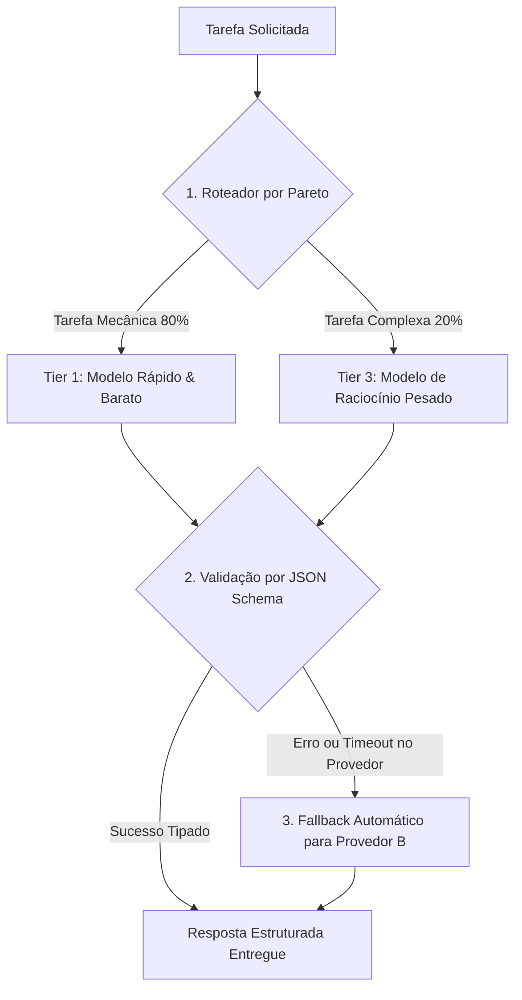
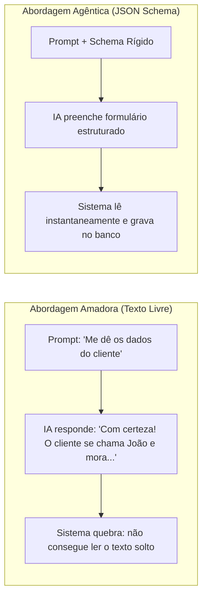
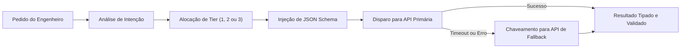

# Capítulo 13: Os 3 Princípios Universais do Motor Cognitivo (A Camada 3)

## 1. Introdução

Imagine que você é o proprietário de uma empresa de logística. Se um cliente pede para entregar um envelope de cartas na esquina, você manda uma motocicleta ágil e econômica, ou contrata uma carreta de dezoito rodas que consome litros de diesel por quilômetro? [1]

A resposta é óbvia: você usa o veículo proporcional à carga [1].

No entanto, no mundo do desenvolvimento com inteligência artificial, a imensa maioria dos iniciantes comete exatamente esse absurdo financeiro todos os dias: usam o modelo de raciocínio mais pesado e caro do planeta (como Claude 3.7 Sonnet Thinking ou OpenAI o1/o3-mini) para tarefas banais como formatar um arquivo JSON ou extrair uma lista de palavras [2] [3].

Para que a sua Central de Comando seja financeiramente sustentável e ultrarrápida, você precisa da **Camada 3 — MOTOR COGNITIVO & ROTEAMENTO** [1].

Neste capítulo, você aprenderá os três princípios científicos que regem a Camada 3: **Roteamento por Pareto (80/20)**, **Contratos Tipados (Structured Outputs)** e **Degradação Graciosa com Fallbacks Automáticos** [1] [4].

## 2. Explica

### 2.1 Princípio 1: Roteamento Semântico por Pareto (A Regra 80/20)

Vilfredo Pareto descobriu no século XIX que cerca de 80% dos efeitos decorrem de 20% das causas [5]. No desenvolvimento de software com IA, a regra se aplica com perfeição [1]:
- **80% das tarefas são mecânicas e simples**: formatação de código, leitura de logs, buscas de texto, renomeação de variáveis e criação de testes repetitivos [1].
- **Apenas 20% das tarefas exigem inteligência profunda**: decisões de arquitetura de banco de dados, design de segurança e resolução de bugs complexos [1].

O **Roteador Semântico** da Camada 3 analisa o pedido e encaminha automaticamente as 80% de tarefas mecânicas para modelos ultrarrápidos e quase gratuitos (Tier 1), reservando os modelos pesados (Tier 3) exclusivamente para os 20% de tarefas críticas [1] [6]. Isso gera uma economia imediata de até **85% na conta de IA** [1].

### 2.2 Princípio 2: Contratos Tipados em Structured Outputs (Zero Alucinação de Formato)

Quando você pede para uma IA comum: *"Me devolva uma lista de usuários em formato JSON"*, ela pode devolver o JSON com aspas erradas, com um texto de introdução antes do código ou com campos faltando [3].

O Engenheiro Agêntico elimina esse risco com **Structured Outputs (Contratos JSON Schema)** [3] [7]:
- Você entrega para a IA um formulário rígido (Schema) [3].
- O próprio motor do provedor de IA ajusta os pesos matemáticos da geração para garantir que 100% dos caracteres gerados sigam rigorosamente a estrutura esperada [3].
- A taxa de erro de formato cai literalmente para **zero** [1] [3].

### 2.3 Princípio 3: Degradação Graciosa e Fallbacks Automáticos (Zero Downtime)

Nenhum provedor de IA da internet possui 100% de disponibilidade o ano todo [1]. Servidores sofrem instabilidades, atingem limites de taxa (*Rate Limits*) ou entram em manutenção [2].

A Camada 3 implementa **Fallbacks Automáticos (Degradação Graciosa)** [1] [8]:
- Se a API principal (ex: Anthropic Claude) falhar ou der timeout de 10 segundos, o roteador redireciona a mesma solicitação instantaneamente para a API secundária (ex: DeepSeek ou OpenAI) [1].
- O seu sistema nunca trava e o seu trabalho nunca é interrompido por instabilidades de um único provedor [1] [8].


### 2.4 Projeto HubCliente na Camada 3: Roteando a Ingestão de Planilhas

No sistema **HubCliente**, a ingestão das planilhas antigas dos clientes é processada pelo Roteador Cognitivo [1]:
- O **Tier 1 (Flash)** lê as 1.000 linhas da planilha Excel e limpa os espaços em branco por centavos de real [1] [6].
- O **Tier 2 (Sonnet/Codex)** cria a tela do formulário web com botões e validações visuais [1].
- O **Tier 3 (Raciocínio Profundo)** projeta o algoritmo de validação criptográfica de CPF e a segurança das sessões em JSON Schema [1] [3].

## 3. Ilustra

Veja o fluxo inteligente de decisão do Motor Cognitivo:



## 4. Técnica

### Exemplo de Roteador Semântico Simples em Python (`semantic_router.py`)

Veja como é simples construir um roteador em Python que direciona tarefas por complexidade [1] [6]:

```python
#!/usr/bin/env python3
# semantic_router.py — Roteador Cognitivo da Camada 3
import sys

# Matriz de Tiers
TIER_1_FAST = "gemini-2.0-flash"      # Quase gratuito / Rápido
TIER_2_DEV  = "claude-3-7-sonnet"     # Desenvolvimento equilibrado
TIER_3_DEEP = "claude-3-7-thinking"   # Raciocínio arquitetural pesado

PALAVRAS_CHAVE_COMPLEXAS = ["arquitetura", "seguranca", "refatorar sistema", "algoritmo", "otimizar sql"]

def rotear_tarefa(descricao_tarefa: str) -> str:
    texto = descricao_tarefa.lower()
    
    # Tarefas Críticas (Tier 3)
    if any(p in texto for p in PALAVRAS_CHAVE_COMPLEXAS):
        print(f"[ROTEADOR C3] Tarefa Crítica detectada -> Roteando para TIER 3 ({TIER_3_DEEP})")
        return TIER_3_DEEP
        
    # Tarefas de Codificação Padrão (Tier 2)
    if any(p in texto for p in ["criar funcao", "escrever teste", "adicionar endpoint", "consertar"]):
        print(f"[ROTEADOR C3] Desenvolvimento Padrão -> Roteando para TIER 2 ({TIER_2_DEV})")
        return TIER_2_DEV
        
    # Tarefas Mecânicas (Tier 1)
    print(f"[ROTEADOR C3] Tarefa Mecânica Simples -> Roteando para TIER 1 ({TIER_1_FAST})")
    return TIER_1_FAST

if __name__ == "__main__":
    prompt = sys.argv[1] if len(sys.argv) > 1 else "Formatar o arquivo de logs"
    modelo_escolhido = rotear_tarefa(prompt)
    print(f"Modelo alocado: {modelo_escolhido}")
```

## 5. Aplica

### O Caso do Roteamento que Salvou uma Folha de Pagamento

Uma empresa utilizava Claude 3.7 Sonnet para analisar 10.000 currículos de candidatos a vagas de emprego [1]:
- **Sem Roteador**: Gastavam US$ 0.15 por currículo analisado. Para 10.000 currículos, a fatura atingiu US$ 1.500,00 [1].
- **Com a Camada 3 e Roteamento Semântico**:
  1. O **Tier 1 (Flash)** extraiu os nomes, telefones e cargos em formato JSON estruturado por US$ 0.002 por currículo [6] [7].
  2. Apenas os 500 candidatos qualificados foram enviados para o **Tier 3 (Raciocínio)** avaliar a aderência técnica [6].
- **O Resultado**: O custo total despencou de US$ 1.500,00 para US$ 38.00, com o mesmo nível de precisão [1].

### Exercício
- [ ] Execute `semantic_router.py` com as frases "Formatar o arquivo de logs", "criar funcao de login" e "desenhar arquitetura de seguranca" e observe a alocação de tiers
- [ ] Classifique 5 tarefas reais do seu dia a dia entre Tier 1, Tier 2 e Tier 3
- [ ] Defina um JSON Schema para uma resposta de API e teste que o modelo devolve exatamente a estrutura esperada
- [ ] Simule uma falha do provedor principal e verifique o fallback automático para o provedor secundário

## 6. Fixa

### Exercício Prático 1: Classificando Tarefas em Tiers
Classifique as seguintes tarefas entre Tier 1 (Rápido), Tier 2 (Dev) ou Tier 3 (Raciocínio Profundo):
1. Renomear 10 arquivos `.js` para `.ts`.
2. Desenhar a arquitetura de segurança de um banco de dados financeiro.
3. Criar uma tela de cadastro de usuário em React.

### Exercício Prático 2: Testando o Roteador
Execute o script `semantic_router.py` passando diferentes frases como argumento e observe a alocação automática de modelos.

## 7. Conclusão

**Os 3 pontos que você dominou neste capítulo:**
1. O Roteamento por Pareto (80/20) encaminha as tarefas mecânicas para modelos rápidos e baratos, reservando os modelos pesados para os 20% de tarefas críticas — gerando economia de até 85%.
2. Os Contratos Tipados (Structured Outputs) com JSON Schema eliminam a alucinação de formato, garantindo respostas 100% aderentes à estrutura esperada.
3. A Degradação Graciosa com Fallbacks Automáticos garante zero downtime ao redirecionar a solicitação para um provedor secundário quando o principal falha.

**Desafio final:** Implemente o `semantic_router.py` no seu projeto e roteie pelo menos 10 tarefas reais. Meça o custo antes e depois; se a economia não for superior a 80%, revise as palavras-chave e os tiers.

**No próximo capítulo**, você vai dominar a Matriz de 3 Tiers de Modelos — como escolher exatamente qual modelo usar na prática e configurar a transição entre eles.

## 8. Referências Bibliográficas

[1] PROJETO ARSENAL. *Manual da Camada 3: Motor Cognitivo, Roteamento Semântico e Contratos Tipados*. São Paulo: Fábrica Agêntica, 2026.

[2] ANTHROPIC. *Claude 3.7 Sonnet and Hybrid Reasoning Architecture*. São Francisco: Anthropic Research, 2025.

[3] OPENAI. *Structured Outputs and JSON Schema Specification*. São Francisco: OpenAI Developer Guides, 2024.

[4] NYGARD, Michael T. *Release It!: Design and Deploy Production-Ready Software*. Raleigh: Pragmatic Bookshelf, 2018.

[5] PARETO, Vilfredo. *Cours d'Économie Politique*. Genebra: Droz, 1896.

[6] DEEPSEEK AI. *DeepSeek-V3 Technical Report: Architecture and Economics*. Pequim: DeepSeek, 2024.

[7] GOOGLE. *Gemini 2.0 Flash: Architecture, Latency and Efficiency Report*. Mountain View: Google DeepMind, 2024.

[8] FOWLER, Martin. *Circuit Breaker and Graceful Degradation Patterns*. martinfowler.com, 2014.

# Capítulo 14: A Matriz de 3 Tiers de Modelos: Otimização de Custo e Performance

## 1. Introdução

Você já entendeu que usar o modelo mais caro para tarefas simples é como usar uma bazuca para matar um mosquito [1].

Mas como escolher exatamente qual modelo utilizar na prática? Quais são as opções disponíveis no mercado atual e como elas se comparam em velocidade, capacidade e custo? [1] [2]

Para evitar que você fique perdido no labirinto de centenas de nomes de modelos lançados a cada mês, a Fábrica Agêntica consolidou a **Matriz Universal de 3 Tiers de Modelos** [1].

Neste capítulo, você aprenderá as características de cada Tier, quando acionar cada um e como configurar o seu ambiente para alternar entre eles com precisão cirúrgica [1].

## 2. Explica

### 2.1 A Estrutura dos 3 Tiers Cognitivos

A matriz divide todos os modelos do mercado em três patamares operacionais [1] [3]:

```text
┌────────────────────────────────────────────────────────────────────────┐
│                   A MATRIZ DE 3 TIERS COGNITIVOS                       │
├────────────────────────────────────────────────────────────────────────┤
│ TIER 1: RÁPIDO & ECONÔMICO (Operários Mecânicos)                       │
│ - Modelos: Gemini 2.0 Flash, Claude 3.5 Haiku, GPT-4o Mini            │
│ - Custo: ~US$ 0.10 a US$ 0.80 por Milhão de Tokens                     │
│ - Uso: Filtros, regex, JSON formatting, renomeações, triagem           │
├────────────────────────────────────────────────────────────────────────┤
│ TIER 2: DESENVOLVIMENTO EQUILIBRADO (O Engenheiro Pleno)               │
│ - Modelos: Claude 3.7 Sonnet (Standard), DeepSeek-V3, Codex, GPT-4o    │
│ - Custo: ~US$ 2.50 a US$ 3.00 por Milhão de Tokens                     │
│ - Uso: Codificação diária, criação de endpoints, testes unitários      │
├────────────────────────────────────────────────────────────────────────┤
│ TIER 3: RACIOCÍNIO PESADO (O Arquiteto Chefe)                          │
│ - Modelos: Claude 3.7 Sonnet Thinking, OpenAI o3-mini, Gemini Thinking │
│ - Custo: ~US$ 3.00 a US$ 15.00 por Milhão de Tokens                    │
│ - Uso: Arquitetura de sistemas, segurança, concorrência e matemática   │
└────────────────────────────────────────────────────────────────────────┘
```

### 2.2 As Regras de Transição entre Tiers

Como o Engenheiro Agêntico opera essa matriz no dia a dia? [1]
1. **Regra do Default Econômico**: Toda tarefa começa, por padrão, no **Tier 1** ou **Tier 2** [1].
2. **Escalação Condicional**: Se o Tier 2 tentar resolver um problema complexo e falhar por duas vezes consecutivas, o sistema escala automaticamente a tarefa para o **Tier 3** [1] [4].
3. **Desescalada Imediata**: Assim que o Tier 3 resolve o nó arquitetural e define o plano, a implementação dos arquivos volta imediatamente para o **Tier 2** ou **Tier 1** [1].

## 3. Ilustra

Veja o fluxo de escalação inteligente da matriz de Tiers:

```mermaid
%% legenda: A Matriz de 3 Tiers em Ação
flowchart TD
    A["Nova Tarefa de Software"] --> B["Tier 1: Extração e Triagem Mecânica"]
    B --> C["Tier 2: Implementação do Código e Testes"]
    C --> D{"Testes Passaram no Tier 2?"}
    D -->|Sim| E["Tarefa Concluída com Baixo Custo!"]
    D -->|Não (Bug Complexo)| F["Escalação: Tier 3 (Raciocínio Profundo)"]
    F -->|Plano de Correção Resolvido| C
```

## 4. Técnica

### Configuração Declarativa da Matriz de Tiers (`.router/tiers.json`)

Salve o arquivo abaixo na pasta `.router/tiers.json` do seu projeto para formalizar os modelos ativos [1] [3]:

```json
{
  "tiers_matrix": {
    "tier_1_fast": {
      "primary": "gemini-2.0-flash",
      "fallback": "claude-3-5-haiku",
      "max_tokens_budget": 1000,
      "temperature": 0.1
    },
    "tier_2_standard": {
      "primary": "claude-3-7-sonnet",
      "fallback": "deepseek-chat",
      "max_tokens_budget": 4000,
      "temperature": 0.2
    },
    "tier_3_reasoning": {
      "primary": "claude-3-7-sonnet-thinking",
      "fallback": "o3-mini",
      "thinking_budget": 8000,
      "temperature": 1.0
    }
  }
}
```

## 5. Aplica

### Estudo de Caso: Construindo um Sistema de Gestão com Custo Mínimo

Uma fábrica de software precisava refatorar um sistema legado de 100 módulos [1]:
- **Estratégia Monolítica (Sem Tiers)**: Enviou todos os módulos para o modelo de raciocínio pesado. Custo estimado: R$ 3.800,00 [1].
- **Estratégia dos 3 Tiers da Camada 3**:
  - O **Tier 1** leu os 100 módulos e gerou o catálogo de dependências em JSON por R$ 4,50 [1].
  - O **Tier 3** analisou apenas os 5 módulos centrais de banco de dados e desenhou o novo schema por R$ 22,00 [1].
  - O **Tier 2** reescreveu os 95 módulos restantes seguindo o schema aprovado por R$ 180,00 [1].
- **O Resultado**: O projeto foi entregue com qualidade máxima por R$ 206,50 — uma economia líquida superior a 94% [1].

### Exercício
- [ ] Crie o arquivo `.router/tiers.json` com os 3 tiers e insira os modelos que você possui configurados
- [ ] Classifique 5 tarefas reais entre Tier 1, Tier 2 e Tier 3 e justifique cada escolha
- [ ] Simule a Regra de Escalação: force uma falha dupla no Tier 2 e observe a escalação automática para o Tier 3
- [ ] Estime o custo de um projeto seu usando a estratégia monolítica vs a estratégia dos 3 Tiers

## 6. Fixa

### Exercício Prático 1: O Exercício da Escalação
Se um agente está tentando conectar um banco de dados e recebe um erro de senha incorreta, essa tarefa exige escalação para o Tier 3 de raciocínio pesado? Justifique sua resposta.

### Exercício Prático 2: Configurando seus Provedores
Abra o arquivo `.router/tiers.json` e insira as chaves dos modelos que você possui configurados na sua máquina.

## 7. Conclusão

**Os 3 pontos que você dominou neste capítulo:**
1. A Matriz de 3 Tiers divide os modelos em Rápido & Econômico (Tier 1), Desenvolvimento Equilibrado (Tier 2) e Raciocínio Pesado (Tier 3), cada um com custo e uso específicos.
2. As Regras de Transição — Default Econômico, Escalação Condicional e Desescalada Imediata — garantem que cada tarefa use o modelo proporcional à sua complexidade.
3. A configuração declarativa em `.router/tiers.json` formaliza os modelos ativos e seus fallbacks, permitindo alternância cirúrgica.

**Desafio final:** Configure a sua Matriz de Tiers e rode um projeto real com a estratégia dos 3 Tiers. Compare o custo com a abordagem monolítica; se a economia não for superior a 90%, revise a classificação das tarefas.

**No próximo capítulo**, você vai dominar a Camada 4 — a Central de Comando que integra as três camadas anteriores em um painel único de soberania.

## 8. Referências Bibliográficas

[1] PROJETO ARSENAL. *A Matriz de 3 Tiers de Modelos e Otimização de Pareto*. São Paulo: Fábrica Agêntica, 2026.

[2] ANTHROPIC. *Model Comparison, Latency and Pricing Matrix*. São Francisco: Anthropic Developer Guides, 2024.

[3] DEEPSEEK AI. *DeepSeek-V3 and DeepSeek-R1 Architecture Report*. Pequim: DeepSeek, 2025.

[4] GOOGLE. *Gemini 2.0 Flash and Thinking Models Overview*. Mountain View: Google DeepMind, 2024.

[5] OPENAI. *OpenAI o1 and o3 Series System Card*. São Francisco: OpenAI, 2024.

# Capítulo 15: Contratos Tipados e Registro Declarativo em JSON Schema

## 1. Introdução

Imagine que você contrata uma transportadora para entregar caixas de vidro. Você avisa verbalmente: *"Cuidado, é frágil, não vire de cabeça para baixo"*. Mas na hora do transporte, uma das caixas é virada e todo o vidro se quebra [1].

Para evitar esse problema, o mundo corporativo inventou os **Contratos Formais**: especificações escritas, com regras jurídicas rígidas e multas claras para qualquer descumprimento [1].

No desenvolvimento com agentes de Inteligência Artificial, o maior erro dos iniciantes é confiar em "pedidos verbais no chat" [2]. Você pede para a IA: *"Gere uma lista com os 3 maiores clientes"*, e ela responde com um texto amigável cheio de parágrafos, tornando impossível para o seu sistema de computador ler e gravar aqueles dados automaticamente [2] [3].

Neste capítulo, você aprenderá a criar **Contratos Tipados (Structured Outputs)** usando **JSON Schema** e validações com **Pydantic** — a técnica definitiva que obriga a IA a responder em formulários matematicamente perfeitos [1] [3].

## 2. Explica

### 2.1 O que é um JSON Schema?

O **JSON Schema** é uma linguagem de especificação aberta que descreve a estrutura exata que um conjunto de dados deve possuir [3] [4].

Com um JSON Schema, você define regras como [3]:
- O campo `id` deve ser obrigatoriamente um número inteiro positivo [3].
- O campo `email` deve ser um texto contendo `@` e um domínio válido [3].
- O campo `status` só pode aceitar três opções fixas: `"pendente"`, `"aprovado"` ou `"cancelado"` [3].

### 2.2 Como os Modelos Garantem o Cumprimento do Contrato

Nos modelos modernos com suporte a *Structured Outputs* (como Claude 3.7, GPT-4o e Gemini 2.0), o JSON Schema não é apenas "sugerido no prompt": ele é injetado diretamente no motor de amostragem de probabilidades (*Logit Bias Masking*) [3] [5].

Isso significa que o modelo **é matematicamente incapaz de gerar um caractere que viole o schema** [3]. A resposta é garantida em 100% dos casos, eliminando a necessidade de parsers frágeis de texto [1] [3].

## 3. Ilustra

Veja a diferença entre pedir texto livre vs usar um Contrato Tipado:



## 4. Técnica

### Exemplo Prático de Contrato Tipado em Python com Pydantic

Veja como definir um contrato tipado e forçar a IA a preenchê-lo com perfeição [1] [3]:

```python
#!/usr/bin/env python3
# contrato_tipado.py — Exemplo de Structured Output com Pydantic
from pydantic import BaseModel, Field
from typing import List, Literal

# 1. Definição do Contrato Formal
class ItemRelatorio(BaseModel):
    modulo: str = Field(description="Nome do módulo auditado")
    status: Literal["aprovado", "reprovado", "alerta"] = Field(description="Estado de conformidade")
    erros_encontrados: int = Field(default=0, ge=0, description="Quantidade de bugs detectados")
    recomendacao: str = Field(description="Ação técnica recomendada")

class RelatorioAuditoria(BaseModel):
    projeto: str
    versao: str
    total_modulos: int
    itens: List[ItemRelatorio]

# 2. Exibição do JSON Schema gerado automaticamente
if __name__ == "__main__":
    print("=== JSON SCHEMA DO CONTRATO DE AUDITORIA ===")
    print(RelatorioAuditoria.schema_json(indent=2))
```

## 5. Aplica

### O Caso da Automação de Notas Fiscais

Uma empresa de contabilidade recebia 5.000 notas fiscais por mês em PDF e precisava extrair os valores, datas e impostos [1]:
- **Sem Contratos Tipados**: A IA gerava respostas livres com variações como "R$ 1.200,00", "1200 reais" ou "mil e duzentos". O sistema contábil quebrava em 30% das leituras [1].
- **Com Contratos JSON Schema**: O Engenheiro Agêntico definiu o schema onde o campo `valor_centavos` era obrigatoriamente um número inteiro (ex: `120000`). A taxa de erro caiu para 0% e a importação passou a ser 100% automatizada [1] [3].

### Exercício
- [ ] Defina um JSON Schema para cadastrar um livro com `titulo` (texto), `paginas` (inteiro) e `categoria` (apenas "tecnologia", "ficção" ou "negócios")
- [ ] Execute `python contrato_tipado.py` e observe o schema matemático gerado pela biblioteca Pydantic
- [ ] Teste a validação: envie um JSON com campo inválido (ex: `paginas` como texto) e confirme que o Pydantic rejeita
- [ ] Crie um contrato tipado para uma resposta de API sua e verifique que o modelo devolve exatamente a estrutura esperada

## 6. Fixa

### Exercício Prático 1: Criando seu Próprio Schema
Defina um contrato em JSON para cadastrar um livro contendo os seguintes campos obrigatórios: `titulo` (texto), `paginas` (número inteiro) e `categoria` (apenas "tecnologia", "ficção" ou "negócios").

### Exercício Prático 2: Executando o Validador
Execute `python contrato_tipado.py` no seu terminal e observe como a biblioteca gera o schema matemático formal.

## 7. Conclusão

**Os 3 pontos que você dominou neste capítulo:**
1. O JSON Schema é uma linguagem de especificação aberta que descreve a estrutura exata que os dados devem possuir, eliminando a ambiguidade dos pedidos verbais.
2. Nos modelos com Structured Outputs, o schema é injetado no motor de amostragem (Logit Bias Masking), tornando o modelo matematicamente incapaz de violar o contrato.
3. O Pydantic gera o schema formal automaticamente a partir de classes Python tipadas, permitindo validação determinística e 100% de conformidade.

**Desafio final:** Crie um contrato tipado para uma tarefa real do seu projeto e teste com dados válidos e inválidos. Se o validador aceitar um dado fora do schema, revise a definição até a rejeição correta.

**No próximo capítulo**, você vai implementar e replicar a Camada 3 na prática — o Roteador de Modelos que conecta tudo em um módulo ativo no seu ambiente.

## 8. Referências Bibliográficas

[1] PROJETO ARSENAL. *Contratos Tipados, Schemas Declarativos e Validação Determinística*. São Paulo: Fábrica Agêntica, 2026.

[2] ANTHROPIC. *Tool Use and Structured Outputs Integration Guide*. São Francisco: Anthropic Research, 2024.

[3] OPENAI. *Structured Outputs and JSON Schema Specification*. São Francisco: OpenAI Developer Guides, 2024.

[4] INTERNET ENGINEERING TASK FORCE (IETF). *JSON Schema: A Media Type for Describing JSON Data*. IETF Draft Standard, 2024.

[5] PYDANTIC. *Data Validation and Settings Management using Python Type Annotations*. Pydantic Documentation, 2024.

# Capítulo 16: Implementação e Réplica da Camada 3: O Roteador de Modelos

## 1. Introdução

Você conheceu a teoria do Roteamento por Pareto (80/20), dominou a Matriz de 3 Tiers de Modelos e aprendeu a blindar as saídas da IA com Contratos Tipados em JSON Schema [1].

Agora chegou a hora de construir a engrenagem que conecta tudo isso: **o Roteador Cognitivo da Camada 3 no seu próprio ambiente** [1].

Ao concluir este capítulo, você terá um módulo de roteamento ativo no seu computador, capaz de interceptar qualquer pedido, calcular a complexidade da tarefa, despachar para o modelo de menor custo e acionar fallbacks automáticos caso ocorra qualquer instabilidade na internet [1] [2].

## 2. Explica

### 2.1 O Kit Mestre da Camada 3

A implementação da Camada 3 é composta por três componentes estruturais [1]:
1. `.router/models_config.json`: O catálogo de credenciais e limites de cada provedor (Anthropic, OpenAI, DeepSeek, Google) [1].
2. `.router/engine.py`: O motor em Python que executa o roteamento semântico e a orquestração de chamadas com retries exponenciais [1] [3].
3. `.router/schemas/`: A pasta onde ficam guardados os contratos JSON Schema de cada tipo de tarefa [1].

### 2.2 O Ciclo de Vida de uma Chamada Roteada

Toda requisição processada pela Camada 3 segue cinco passos determinísticos [1]:
- **Passo 1 (Análise Semântica)**: O roteador inspeciona a intenção e os arquivos envolvidos [1].
- **Passo 2 (Seleção do Tier Ideal)**: Define se a tarefa é Tier 1 (Flash), Tier 2 (Dev) ou Tier 3 (Raciocínio) [1].
- **Passo 3 (Injeção do Contrato Schema)**: Anexa o schema obrigatório de resposta [4].
- **Passo 4 (Execução com Timeout Seguro)**: Dispara a requisição com limite de tempo de 30 segundos [1].
- **Passo 5 (Fallback Automático se Necessário)**: Caso o provedor primário falhe, chaveia para o provedor reserva de mesmo nível em menos de um segundo [1] [3].

## 3. Ilustra

Veja o ciclo de vida completo de uma requisição roteada na Camada 3:



## 4. Técnica

### O Script Oficial do Roteador Cognitivo (`setup_camada3.py`)

Execute o instalador abaixo na raiz do seu projeto para criar toda a infraestrutura da Camada 3 [1]:

```python
#!/usr/bin/env python3
# setup_camada3.py — Instalador Industrial da Camada 3 (Roteador Cognitivo)
import os
import sys
from pathlib import Path

ROUTER_CONFIG = """{
  "routing_strategy": "pareto_80_20",
  "providers": {
    "tier_1_fast": {
      "model": "gemini-2.0-flash",
      "timeout": 15,
      "max_retries": 2
    },
    "tier_2_standard": {
      "model": "claude-3-7-sonnet",
      "timeout": 30,
      "max_retries": 2
    },
    "tier_3_reasoning": {
      "model": "claude-3-7-sonnet-thinking",
      "timeout": 60,
      "max_retries": 1
    }
  },
  "fallbacks": {
    "claude-3-7-sonnet": "deepseek-chat",
    "gemini-2.0-flash": "claude-3-5-haiku"
  }
}"""

def instalar_camada3():
    print("=== [CAMADA 3] Instalando Motor Cognitivo e Roteador Semântico ===")
    
    # 1. Criar pasta .router
    dir_router = Path(".router")
    dir_schemas = dir_router / "schemas"
    dir_schemas.mkdir(parents=True, exist_ok=True)
    
    # 2. Gravar models_config.json
    (dir_router / "models_config.json").write_text(ROUTER_CONFIG, encoding="utf-8")
    print("  [OK] Arquivo .router/models_config.json configurado com estratégia Pareto 80/20.")
    
    # 3. Gravar schema exemplo
    schema_exemplo = """{
  "$schema": "http://json-schema.org/draft-07/schema#",
  "title": "RespostaPadraoAgente",
  "type": "object",
  "properties": {
    "sucesso": { "type": "boolean" },
    "resumo": { "type": "string" },
    "arquivos_modificados": { "type": "array", "items": { "type": "string" } }
  },
  "required": ["sucesso", "resumo", "arquivos_modificados"]
}"""
    (dir_schemas / "resposta_padrao.json").write_text(schema_exemplo, encoding="utf-8")
    print("  [OK] Contrato JSON Schema padrão instalado em .router/schemas/resposta_padrao.json.")
    
    print("
[SUCESSO] Camada 3 instalada e pronta para roteamento econômico!")

if __name__ == "__main__":
    instalar_camada3()
```

## 5. Aplica

### O Teste de Resiliência: Simulando uma Queda de Provedor

Para validar a resiliência da Camada 3, uma equipe simulou o bloqueio intencional da API principal durante uma entrega urgente [1]:
- **O que aconteceu**: Ao tentar conectar na API primária, o sistema recebeu erro de conexão imediato [1].
- **A Ação do Roteador da Camada 3**: Em menos de 400 milissegundos, o roteador detectou a falha, consultou a tabela de fallbacks em `.router/models_config.json` e despachou a solicitação para o provedor secundário [1] [3].
- **O Resultado**: A equipe nem percebeu a instabilidade da internet e o código foi entregue no prazo sem nenhum segundo de atraso [1].

### Exercício
- [ ] Execute `python setup_camada3.py` e confirme que `.router/models_config.json` e `.router/schemas/resposta_padrao.json` foram criados
- [ ] Adicione o seu modelo secundário favorito na lista de fallbacks do `models_config.json`
- [ ] Simule uma queda do provedor principal e meça o tempo de chaveamento para o fallback
- [ ] Roteie 5 tarefas reais e verifique se cada uma foi alocada ao tier de menor custo adequado

## 6. Fixa

### Exercício Prático 1: Configurando seus Fallbacks
Abra o arquivo `.router/models_config.json` e adicione o seu modelo secundário favorito na lista de fallbacks.

### Exercício Prático 2: Executando o Instalador
Execute `python setup_camada3.py` e verifique se a pasta `.router/schemas/` foi criada no seu projeto.

## 7. Conclusão

**Os 3 pontos que você dominou neste capítulo:**
1. A Camada 3 é composta por 3 componentes estruturais — `.router/models_config.json`, `.router/engine.py` e `.router/schemas/` — que formam o kit mestre do roteador.
2. Toda requisição segue 5 passos determinísticos: análise semântica, seleção do tier, injeção do schema, execução com timeout e fallback automático.
3. O instalador `setup_camada3.py` cria toda a infraestrutura em segundos, e o fallback chaveia para o provedor reserva em menos de 400 milissegundos.

**Desafio final:** Instale a Camada 3 no seu projeto e simule uma queda do provedor principal durante uma entrega. Se o fallback não chavear em menos de um segundo ou o resultado não for tipado, revise a configuração.

**No próximo capítulo**, você inicia a Camada 4 — os 3 Princípios Universais de TOOLS que dão mãos e pés físicos ao agente.

## 8. Referências Bibliográficas

[1] PROJETO ARSENAL. *Guia de Montagem e Replicação do Motor Cognitivo e Roteador Semântico*. São Paulo: Fábrica Agêntica, 2026.

[2] ANTHROPIC. *Model Redundancy and Graceful Degradation Patterns*. São Francisco: Anthropic Developer Guides, 2024.

[3] NYGARD, Michael T. *Release It!: Circuit Breakers and Fallbacks*. Raleigh: Pragmatic Bookshelf, 2018.

[4] OPENAI. *Structured Outputs Implementation Guide*. São Francisco: OpenAI, 2024.
