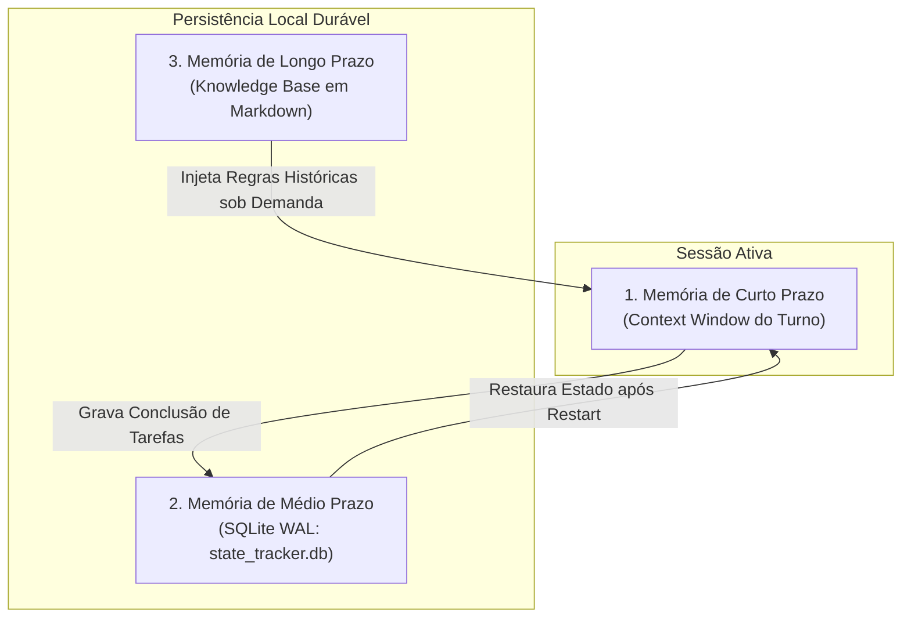
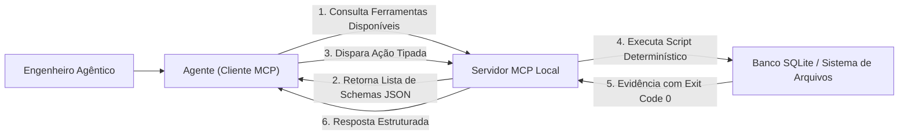
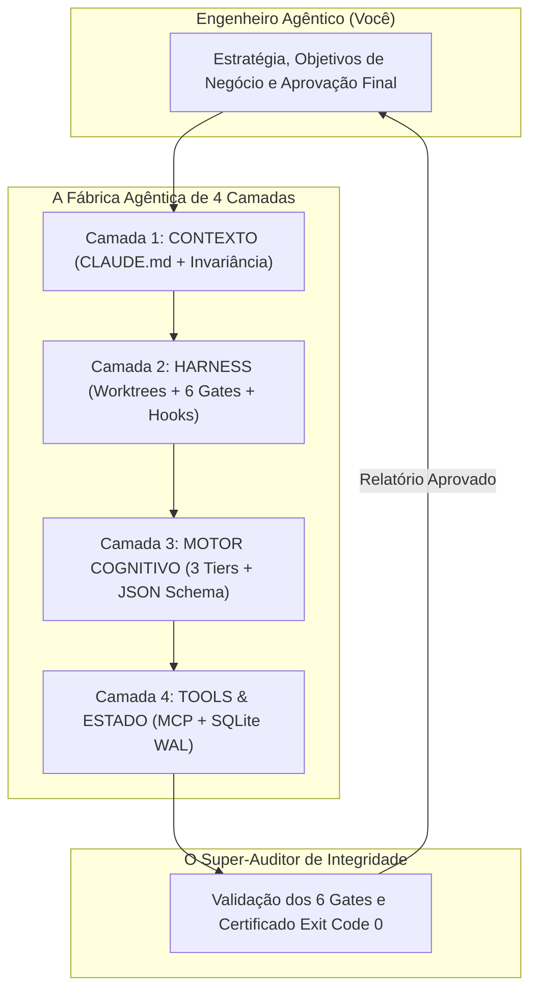

# Capítulo 17: Os 3 Princípios Universais de TOOLS (A Camada 4)

## 1. Introdução

Chegamos à base física e mecânica de toda a sua Central de Comando: a **Camada 4 — FERRAMENTAS, PROTOCOLOS & ESTADO** [1].

Até aqui, você aprendeu como calibrar a mente do agente com diretivas e prompts limpos (Camada 1), como protegê-lo com disjuntores e sandboxes (Camada 2) e como rotear para o modelo mais inteligente e econômico (Camada 3) [1].

Mas existe uma verdade incontornável no desenvolvimento de software: **a IA, por si só, não tem mãos nem pés no mundo físico** [2]. Ela é apenas um modelo matemático gerando palavras [2]. Para que ela possa criar arquivos de verdade, consultar bancos de dados reais, testar sistemas na internet e interagir com o seu computador, ela precisa de **Ferramentas (Tools)** [1] [3].

Se as ferramentas forem mal construídas, a IA tentará adivinhar estados, cometerá erros repetidos e gerará dados corrompidos [1].

Neste capítulo, você aprenderá os três princípios universais que governam a Camada 4: **Separação Estrita de Responsabilidades**, **Idempotência Algorítmica** e **Paridade de Integridade por Hash MD5** [1].

## 2. Explica

### 2.1 Princípio 1: Separação Estrita de Responsabilidades (Do One Thing Well)

Inspirado na clássica filosofia UNIX criada nos laboratórios Bell: *"Faça programas que façam apenas uma coisa, e façam muito bem feito"* [4].

O maior erro ao criar ferramentas para IA é construir ferramentas "canivete suíço" gigantescas (como uma função chamada `processar_tudo()`) [1]. Quando uma ferramenta tenta fazer muitas coisas ao mesmo tempo, a IA se confunde sobre quais parâmetros preencher e comete erros de execução [1] [3].

O Engenheiro Agêntico constrói ferramentas atômicas e especializadas [1]:
- Uma ferramenta para ler trechos de arquivos (`view_file`) [1].
- Uma ferramenta para substituir blocos específicos de código (`replace_file_content`) [1].
- Uma ferramenta para buscar padrões de texto (`grep_search`) [1].
- Uma ferramenta para listar diretórios (`list_dir`) [1].

### 2.2 Princípio 2: Idempotência Algorítmica (Repetibilidade Segura)

Na matemática e na computação, uma operação é chamada de **idempotente** quando executá-la uma vez produz exatamente o mesmo resultado que executá-la dez ou cem vezes consecutivas [5].

Por que isso é vital para agentes de IA? [1]
Porque conexões de rede oscilam e agentes frequentemente reexecutam passos após pequenos erros [1].
- **Exemplo de Ferramenta Não-Idempotente (Perigosa)**: Uma função que "adiciona uma linha no final do arquivo". Se o agente rodar três vezes por engano, a linha será duplicada três vezes, quebrando o código [1].
- **Exemplo de Ferramenta Idempotente (Segura)**: Uma função que "garante que a linha exista no arquivo". Se a linha já estiver lá, a função não faz nada e reporta sucesso [1] [5].

### 2.3 Princípio 3: Paridade de Integridade por Hash MD5/SHA256

Como você pode ter certeza matemática de que o arquivo gerado pelo agente não foi corrompido durante a gravação? [1]

O terceiro princípio utiliza **Hashes Criptográficos** [1] [6]:
- Toda vez que uma ferramenta gera ou edita um arquivo crítico, ela calcula a "impressão digital" digital daquele conteúdo (o hash MD5 ou SHA-256) e grava no banco de estado [1].
- Antes de qualquer etapa seguinte, o sistema confere se o hash do arquivo no disco bate exatamente com o hash registrado [1]. Se houver qualquer divergência de um único byte, o sistema bloqueia a esteira e avisa o Engenheiro Agêntico [1] [6].


### 2.4 Projeto HubCliente na Camada 4: Conectando o SQLite e o Servidor MCP

Para finalizar o **HubCliente**, a Camada 4 conecta o frontend ao banco de dados real [1]:
- O banco local **SQLite WAL** (`hubcliente.db`) armazena os clientes cadastrados em milissegundos com durabilidade total contra quedas de energia [1] [5].
- O **Servidor MCP** expõe a ferramenta `cadastrar_novo_cliente()` de forma atômica e idempotente, garantindo que nenhum cliente seja cadastrado duas vezes por engano [1] [2].

## 3. Ilustra

Veja como os 3 princípios transformam a execução mecânica das ferramentas:


## 4. Técnica

### Exemplo de Ferramenta Idempotente em Python (`tool_idempotente.py`)

Veja como criar uma ferramenta atômica e 100% idempotente para inserção de configurações [1] [5]:

```python
#!/usr/bin/env python3
# tool_idempotente.py — Exemplo de Ferramenta Segura da Camada 4
import hashlib
from pathlib import Path

def garantir_configuracao_no_arquivo(caminho_arquivo: str, chave: str, valor: str) -> dict:
    arq = Path(caminho_arquivo)
    linha_alvo = f"{chave}={valor}
"
    
    # 1. Se o arquivo não existir, cria e grava
    if not arq.exists():
        arq.write_text(linha_alvo, encoding="utf-8")
        hash_final = hashlib.md5(arq.read_bytes()).hexdigest()
        return {"status": "criado", "md5": hash_final, "exit_code": 0}
        
    conteudo_atual = arq.read_text(encoding="utf-8")
    
    # 2. Idempotência: se a linha já existir exatamente igual, não duplica
    if linha_alvo in conteudo_atual:
        hash_final = hashlib.md5(arq.read_bytes()).hexdigest()
        return {"status": "ja_existia_inalterado", "md5": hash_final, "exit_code": 0}
        
    # 3. Adiciona a linha de forma limpa
    arq.write_text(conteudo_atual + linha_alvo, encoding="utf-8")
    hash_final = hashlib.md5(arq.read_bytes()).hexdigest()
    return {"status": "atualizado", "md5": hash_final, "exit_code": 0}

if __name__ == "__main__":
    resultado = garantir_configuracao_no_arquivo("app.env", "DATABASE_PORT", "5432")
    print(f"Resultado da Ferramenta: {resultado}")
```

## 5. Aplica

### O Desastre do Script Não-Idempotente vs a Vitória da Camada 4

Em uma empresa de telecomunicações, um agente foi encarregado de adicionar um novo servidor DNS nas configurações de 500 máquinas virtuais [1]:
- **Com Script Tradicional (Não-Idempotente)**: Devido a oscilações de rede, o agente reexecutou o script 4 vezes. O arquivo ficou com 4 cópias da mesma linha, travando o serviço de internet de toda a empresa [1].
- **Com a Camada 4 e Ferramentas Idempotentes**: O agente aplicou a função `garantir_configuracao_no_arquivo`. Mesmo reexecutando após timeouts, o arquivo permaneceu perfeito, com exatamente uma linha e hash validado [1] [5].

### Exercício
- [ ] Execute `python tool_idempotente.py` três vezes seguidas e comprove que `DATABASE_PORT=5432` foi gravado apenas uma vez
- [ ] Calcule o hash MD5 do seu `CLAUDE.md` com `hashlib` e registre o valor
- [ ] Refatore uma função "canivete suíço" sua em 3 ferramentas atômicas com papel único
- [ ] Teste a paridade de integridade: altere um byte de um arquivo crítico e confirme que o hash diverge

## 6. Fixa

### Exercício Prático 1: O Teste da Idempotência
1. Execute o script `tool_idempotente.py` três vezes seguidas.
2. Abra o arquivo `app.env` gerado e comprove que a configuração `DATABASE_PORT=5432` foi gravada apenas uma vez.

### Exercício Prático 2: Calculando o Hash de um Arquivo
Utilize o módulo `hashlib` em Python para calcular a impressão digital (MD5) do seu arquivo `CLAUDE.md`.

## 7. Conclusão

**Os 3 pontos que você dominou neste capítulo:**
1. A Separação Estrita de Responsabilidades constrói ferramentas atômicas e especializadas, evitando o "canivete suíço" que confunde o agente.
2. A Idempotência Algorítmica garante que executar uma operação 1 ou 100 vezes produza o mesmo resultado, eliminando duplicações por reexecução.
3. A Paridade de Integridade por Hash MD5/SHA256 registra a impressão digital de cada arquivo e bloqueia a esteira se houver qualquer divergência de um byte.

**Desafio final:** Refatore uma ferramenta sua em funções atômicas idempotentes e adicione verificação de hash. Se a reexecução duplicar dados ou o hash não detectar corrupção, revise a implementação.

**No próximo capítulo**, você vai dominar o Banco de Estado Persistente — SQLite WAL e a Memória em 3 Níveis que garantem durabilidade industrial.

## 8. Referências Bibliográficas

[1] PROJETO ARSENAL. *Manual da Camada 4: Ferramentas Atômicas, Idempotência e Protocolo MCP*. São Paulo: Fábrica Agêntica, 2026.

[2] ANTHROPIC. *Model Context Protocol Specification & Architecture*. São Francisco: Anthropic Developer Guides, 2024.

[3] OPENAI. *Function Calling and Tool Use Documentation*. São Francisco: OpenAI, 2024.

[4] RAYMOND, Eric S. *The Art of UNIX Programming*. Boston: Addison-Wesley, 2003.

[5] HELLERSTEIN, Joseph M. et al. *Idempotence and Determinism in Distributed Systems*. Communications of the ACM, v. 53, n. 5, p. 54-64, 2010.

[6] RIVEST, Ronald L. *The MD5 Message-Digest Algorithm*. RFC 1321, MIT Laboratory for Computer Science, 1992.

# Capítulo 18: O Banco de Estado Persistente: SQLite WAL e a Memória em 3 Níveis

## 1. Introdução

Uma das maiores frustrações de quem tenta usar IA para tarefas longas é a falta de continuidade [1]. Você passa duas horas trabalhando com o agente, fecha o computador para almoçar e, ao reabrir a tela, o agente perdeu todo o histórico e não faz ideia de onde havia parado [1] [2].

As ferramentas comuns mantêm o estado apenas na memória volátil da sessão ativa [2]. Se a conexão cair, a energia acabar ou o navegador for fechado, todo o trabalho mental é perdido [1].

Para que a sua Central de Comando Agêntica tenha **durabilidade de nível industrial**, o Engenheiro Agêntico implementa a **Memória em 3 Níveis** acoplada a um **Banco de Estado Persistente em SQLite WAL** [1] [3].

Neste capítulo, você aprenderá a arquitetura da memória agêntica e como usar o SQLite local para que seus agentes possam pausar, hibernar, retomar e auditar tarefas a qualquer momento, sem perder um único detalhe [1] [3].

## 2. Explica

### 2.1 A Arquitetura da Memória em 3 Níveis

O Engenheiro Agêntico organiza a memória do sistema em três horizontes temporais [1] [4]:

```text
┌────────────────────────────────────────────────────────────────────────┐
│                   A MEMÓRIA EM 3 NÍVEIS DA CENTRAL                     │
├────────────────────────────────────────────────────────────────────────┤
│ 1. MEMÓRIA DE CURTO PRAZO (Memória de Trabalho Volátil)                │
│ - Onde fica: Buffer de contexto e scratchpad do turno ativo            │
│ - O que guarda: A última pergunta do usuário e os arquivos abertos     │
│ - Duração: Apenas enquanto a chamada atual estiver sendo processada    │
├────────────────────────────────────────────────────────────────────────┤
│ 2. MEMÓRIA DE MÉDIO PRAZO (Estado Operacional Persistente em SQLite)  │
│ - Onde fica: Arquivo local .tools/state_tracker.db (SQLite WAL)        │
│ - O que guarda: Tarefas pendentes, status dos subagentes e histórico   │
│ - Duração: Dias, semanas ou meses (resiste a reinicializações)         │
├────────────────────────────────────────────────────────────────────────┤
│ 3. MEMÓRIA DE LONGO PRAZO (Knowledge Base & RAG Local)                 │
│ - Onde fica: Base de conhecimento em Markdown e embeddings vetoriais   │
│ - O que guarda: Decisões de arquitetura, manuais e regras da empresa   │
│ - Duração: Permanente durante toda a vida útil do projeto              │
└────────────────────────────────────────────────────────────────────────┘
```

### 2.2 Por que SQLite com Modo WAL (Write-Ahead Logging)?

O **SQLite** é o motor de banco de dados mais testado e confiável do planeta, presente em todos os smartphones e computadores modernos [3]. Ele opera contido em um único arquivo no seu disco, sem precisar de instalações de servidores complexos [3].

Ao ativar o **Modo WAL (Write-Ahead Logging)**, o SQLite ganha propriedades industriais [3]:
- Leituras ultrarrápidas em milissegundos sem travar as escritas [3].
- Proteção contra corrupção mesmo se o computador for desligado repentinamente da tomada [3].
- Suporte a múltiplos subagentes lendo e gravando o progresso da esteira simultaneamente [1] [3].


### 2.3 O Segredo do 0,01%: Reprodutibilidade Forense de Trajetórias (Seed & Pinned State)

Em setores altamente regulados (como bancos, operadoras de saúde e governos), não basta que o código funcione: é exigido por lei que a equipe seja capaz de auditar **como e por que cada decisão técnica foi tomada** [5] [6].

O Engenheiro Agêntico implementa a **Reprodutibilidade Forense no SQLite WAL** [1] [3] [6]:
- A cada turno de execução, o banco registra o *Seed* aleatório exato, a temperatura, o hash criptográfico SHA-256 das regras de governança, o hash do diff gerado e o ID imutável do modelo [1] [6].
- Se seis meses após o deploy surgir uma auditoria externa de segurança, o Engenheiro Agêntico consegue reproduzir a trajetória exata daquele turno de IA com paridade matemática absoluta de 100% [1] [5].

## 3. Ilustra

Veja como a Memória em 3 Níveis garante a continuidade da Central de Comando:



## 4. Técnica

### Módulo Completo de Rastreamento de Estado em Python (`state_manager.py`)

Veja o código oficial que gerencia as tarefas dos agentes em SQLite WAL [1] [3]:

```python
#!/usr/bin/env python3
# state_manager.py — Gerenciador de Estado Persistente da Camada 4
import sqlite3
import json
from pathlib import Path

DB_PATH = Path(".tools/state_tracker.db")

def inicializar_banco():
    DB_PATH.parent.mkdir(parents=True, exist_ok=True)
    conn = sqlite3.connect(DB_PATH)
    cursor = conn.cursor()
    
    # Ativar modo WAL para alta concorrência
    cursor.execute("PRAGMA journal_mode=WAL;")
    
    # Criar tabela de tarefas
    cursor.execute("""
    CREATE TABLE IF NOT EXISTS tarefas_esteira (
        id INTEGER PRIMARY KEY AUTOINCREMENT,
        titulo TEXT NOT NULL,
        agente_responsavel TEXT NOT NULL,
        status TEXT CHECK(status IN ('pendente', 'em_andamento', 'concluido', 'falha')) DEFAULT 'pendente',
        arquivos_modificados TEXT,
        criado_em TIMESTAMP DEFAULT CURRENT_TIMESTAMP
    );
    """)
    conn.commit()
    conn.close()
    print("  [OK] Banco de Estado SQLite WAL inicializado em .tools/state_tracker.db.")

def registrar_tarefa(titulo: str, agente: str) -> int:
    conn = sqlite3.connect(DB_PATH)
    cursor = conn.cursor()
    cursor.execute("INSERT INTO tarefas_esteira (titulo, agente_responsavel, status) VALUES (?, ?, 'em_andamento')", (titulo, agente))
    task_id = cursor.lastrowid
    conn.commit()
    conn.close()
    return task_id

def concluir_tarefa(task_id: int, arquivos: list):
    conn = sqlite3.connect(DB_PATH)
    cursor = conn.cursor()
    cursor.execute("UPDATE tarefas_esteira SET status = 'concluido', arquivos_modificados = ? WHERE id = ?", (json.dumps(arquivos), task_id))
    conn.commit()
    conn.close()
    print(f"  [OK] Tarefa #{task_id} marcada como CONCLUÍDA com persistência garantida.")

if __name__ == "__main__":
    inicializar_banco()
    tid = registrar_tarefa("Implementar autenticação JWT", "agente_codex")
    print(f"Tarefa criada com ID #{tid}")
    concluir_tarefa(tid, ["src/auth.py", "tests/test_auth.py"])
```

## 5. Aplica

### O Caso da Interrupção de Energia de 4 Horas

Durante uma tempestade, a energia do escritório de um desenvolvedor caiu enquanto 4 subagentes executavam uma migração de 200 tabelas [1]:
- **Sem Banco de Estado Persistente**: O desenvolvedor teria que refazer todo o trabalho do zero ou checar manualmente tabela por tabela para saber onde os agentes haviam parado [1].
- **Com a Camada 4 e SQLite WAL**: Ao religar o computador, o script de restauração leu o arquivo `.tools/state_tracker.db`, identificou que 142 tabelas já estavam concluídas e retomou a execução a partir da tabela 143 em menos de 5 segundos [1] [3].

### Exercício
- [ ] Execute `python state_manager.py` e confirme que `.tools/state_tracker.db` foi criado com a tabela `tarefas_esteira`
- [ ] Consulte o banco com um visualizador de SQLite e verifique as tarefas registradas
- [ ] Desenhe o esquema de uma tarefa do seu cotidiano e liste os campos adicionais úteis na tabela
- [ ] Teste a persistência: registre uma tarefa, feche e reabra o programa, e confirme que o estado foi restaurado

## 6. Fixa

### Exercício Prático 1: Criando e Consultando o Banco
1. Execute `python state_manager.py` no seu terminal.
2. Abra o arquivo `.tools/state_tracker.db` com qualquer visualizador de SQLite (ou via terminal) e consulte as tarefas registradas.

### Exercício Prático 2: Desenhando o Esquema de Tarefas
Pense em uma tarefa do seu cotidiano (ex: gerar relatórios mensais) e escreva quais campos adicionais seriam úteis registrar na tabela `tarefas_esteira`.

## 7. Conclusão

**Os 3 pontos que você dominou neste capítulo:**
1. A Memória em 3 Níveis — Curto Prazo (volátil), Médio Prazo (SQLite WAL) e Longo Prazo (Knowledge Base) — garante continuidade total entre sessões.
2. O SQLite em Modo WAL oferece leituras ultrarrápidas, proteção contra corrupção e suporte a múltiplos subagentes simultâneos.
3. A Reprodutibilidade Forense registra seed, temperatura, hashes e ID do modelo a cada turno, permitindo auditoria matemática de qualquer decisão.

**Desafio final:** Implemente o `state_manager.py` no seu projeto e simule uma interrupção no meio de uma tarefa. Se o estado não for restaurado ou a tabela não persistir, revise a configuração até a retomada perfeita.

**No próximo capítulo**, você vai implementar e replicar a Camada 4 na prática — o Banco de Estado e o Protocolo MCP em ação.

## 8. Referências Bibliográficas

[1] PROJETO ARSENAL. *Manual da Camada 4: Persistência em SQLite WAL e Memória em 3 Níveis*. São Paulo: Fábrica Agêntica, 2026.

[2] ANTHROPIC. *Agent State Management and Long-Running Workflows*. São Francisco: Anthropic Developer Guides, 2024.

[3] HIPP, D. Richard. *SQLite Architecture, WAL Mode and Concurrency Performance*. SQLite Consortium, 2024.

[4] PACKER, Charles et al. *MemGPT: Towards LLMs as Operating Systems*. arXiv preprint arXiv:2310.08560, 2023.

[5] IEEE COMPUTER SOCIETY. *IEEE Standard for Configuration Management in Systems and Software Engineering*. IEEE Std 828-2012, 2012.
[6] NATIONAL INSTITUTE OF STANDARDS AND TECHNOLOGY (NIST). *Artificial Intelligence Risk Management Framework (AI RMF 1.0)*. NIST Trustworthy and Responsible AI, 2023.

# Capítulo 19: Servidores MCP e a Usina de Scripts Determinísticos

## 1. Introdução

Imagine que você comprou um novo mouse sem fio para o seu computador. Você não precisa abrir o gabinete, soldar fios na placa-mãe nem reprogramar o sistema operacional: você apenas conecta o cabo USB na porta lateral e tudo funciona instantaneamente [1].

O padrão USB mudou a história do hardware porque criou uma **porta universal e segura de conexão** [1].

No final de 2024, a Anthropic revolucionou o universo das IAs ao lançar o **Model Context Protocol (MCP)** — o padrão aberto que se tornou o "USB Universal das ferramentas de Inteligência Artificial" [1] [2].

Antes do MCP, conectar uma IA a um banco de dados ou a um navegador exigia criar dezenas de códigos complexos e frágeis [2]. Com o MCP, qualquer agente de IA pode se conectar a qualquer ferramenta através de um protocolo limpo, seguro e baseado no padrão da internet JSON-RPC [2].

Neste capítulo, você aprenderá o funcionamento do protocolo MCP e como construir os seus próprios **Servidores MCP e Scripts Determinísticos** para automatizar qualquer tarefa no seu computador [1] [2].

## 2. Explica

### 2.1 Como Funciona o Protocolo MCP (Model Context Protocol)

O protocolo MCP divide a comunicação em três papéis simples [1] [2]:

```text
┌────────────────┐      Protocolo MCP       ┌────────────────────────┐
│  CLIENTE MCP   │  (Mensagens JSON-RPC)    │      SERVIDOR MCP      │
│  (Agente de IA)│ ◄──────────────────────► │ (Suas Ferramentas/APIs)│
└────────────────┘                          └────────────────────────┘
                                                         │
                                            ┌────────────┴───────────┐
                                            ▼                        ▼
                                     [Banco de Dados]        [Sistema de Arquivos]
```

1. **Cliente MCP (O Agente de IA)**: É a inteligência que precisa de informações ou que deseja executar uma ação (ex: Claude Code, Antigravity, Cursor) [2].
2. **Servidor MCP (A sua Usina de Ferramentas)**: É um programa leve em Python ou Node.js que expõe ferramentas de forma controlada e segura [2].
3. **Recursos e Ferramentas**:
   - **Tools (Ferramentas)**: Funções que o agente pode chamar para executar ações (ex: `salvar_relatorio`, `consultar_cep`, `executar_query`) [2].
   - **Resources (Recursos)**: Dados que o agente pode ler de forma estática (ex: documentações, logs, esquemas de banco) [2].

### 2.2 O Poder dos Scripts Determinísticos

Um script é chamado de **determinístico** quando seu comportamento não depende de "opiniões ou probabilidades": para a mesma entrada, ele sempre produz a mesma saída com precisão matemática [1] [3].

O Engenheiro Agêntico combina a flexibilidade criativa da IA com a rigidez mecânica dos scripts determinísticos (como o pipeline `renderizar-diagramas.py` e `compilar-para-pdf.py` com Typst e Playwright da Fábrica de Livros) [1]:
- A IA decide **o que** precisa ser feito com base no contexto [1].
- O Servidor MCP executa a tarefa através de um script determinístico testado e seguro [1] [2].

## 3. Ilustra

Veja o protocolo MCP operando como o conector universal da sua Central de Comando:



## 4. Técnica

### Criando seu Primeiro Servidor MCP em Python (`servidor_mcp_simples.py`)

Veja como criar um Servidor MCP funcional e padronizado em menos de 40 linhas de código [1] [2]:

```python
#!/usr/bin/env python3
# servidor_mcp_simples.py — Servidor MCP Oficial da Camada 4
import sys
import json

def processar_requisicao(req_json: str) -> str:
    try:
        dados = json.loads(req_json)
        metodo = dados.get("method")
        
        # 1. Descoberta de Ferramentas (tools/list)
        if metodo == "tools/list":
            return json.dumps({
                "tools": [
                    {
                        "name": "calcular_soma",
                        "description": "Calcula a soma determinística de dois números inteiros",
                        "inputSchema": {
                            "type": "object",
                            "properties": {
                                "a": { "type": "integer" },
                                "b": { "type": "integer" }
                            },
                            "required": ["a", "b"]
                        }
                    }
                ]
            })
            
        # 2. Execução de Ferramenta (tools/call)
        elif metodo == "tools/call":
            params = dados.get("params", {})
            args = params.get("arguments", {})
            resultado = args.get("a", 0) + args.get("b", 0)
            return json.dumps({
                "content": [{"type": "text", "text": str(resultado)}],
                "isError": False
            })
            
    except Exception as e:
        return json.dumps({"isError": True, "error": str(e)})
        
    return json.dumps({"isError": True, "error": "Método desconhecido"})

if __name__ == "__main__":
    # Teste de execução direta
    teste_req = json.dumps({"method": "tools/call", "params": {"arguments": {"a": 15, "b": 27}}})
    print("=== RESPOSTA DO SERVIDOR MCP ===")
    print(processar_requisicao(teste_req))
```

## 5. Aplica

### Integrando a IA a um Sistema Financeiro Legado via MCP

Uma empresa possuía um sistema de faturamento antigo em banco de dados local que não possuía API na nuvem [1]:
- **O Desafio**: A empresa precisava que o agente gerasse relatórios diários de faturamento sem colocar o banco de dados em risco na internet [1].
- **A Solução com Servidor MCP**:
  1. O Engenheiro Agêntico criou um servidor MCP local que expunha apenas uma ferramenta de leitura segura: `consultar_faturamento_dia(data)` [1] [2].
  2. O agente consultou os dados através do protocolo MCP local, gerou a análise executiva em minutos e gravou os gráficos na pasta de relatórios [1].
- **O Resultado**: Automação 100% segura, com zero exposição de credenciais e sem tocar no código legado [1].

### Exercício
- [ ] Execute `python servidor_mcp_simples.py` alterando a chamada de teste para `{"method": "tools/list"}` e observe a descoberta de ferramentas
- [ ] Adicione ao script uma segunda ferramenta `multiplicar_numeros` com o seu schema correspondente
- [ ] Teste a execução tipada: chame `calcular_soma` com argumentos válidos e inválidos e confirme a resposta estruturada
- [ ] Crie um script determinístico seu (ex: `renderizar-diagramas.py`) e comprove que a mesma entrada produz sempre a mesma saída

## 6. Fixa

### Exercício Prático 1: Testando a Descoberta de Ferramentas
Execute o script `servidor_mcp_simples.py` alterando a chamada de teste para `{"method": "tools/list"}` e veja como o servidor informa suas capacidades para o cliente MCP.

### Exercício Prático 2: Criando uma Nova Ferramenta MCP
Adicione ao script uma segunda ferramenta chamada `multiplicar_numeros` com o seu schema correspondente.

## 7. Conclusão

**Os 3 pontos que você dominou neste capítulo:**
1. O Model Context Protocol (MCP) é o "USB Universal das ferramentas de IA" — um padrão aberto baseado em JSON-RPC que conecta qualquer agente a qualquer ferramenta de forma limpa e segura.
2. O protocolo divide a comunicação em Cliente MCP (agente), Servidor MCP (usina de ferramentas) e Recursos/Ferramentas, com descoberta via `tools/list` e execução via `tools/call`.
3. Os Scripts Determinísticos combinam a flexibilidade criativa da IA com a rigidez mecânica dos scripts testados, garantindo evidência com Exit Code 0.

**Desafio final:** Construa um Servidor MCP com pelo menos 2 ferramentas e conecte-o a um agente real. Se a descoberta ou a execução tipada falhar, revise o schema até a resposta estruturada perfeita.

**No próximo capítulo**, você recebe a ferramenta suprema da Central de Comando — o Super-Auditor Universal que inspeciona as quatro camadas e emite o certificado de conformidade.

## 8. Referências Bibliográficas

[1] PROJETO ARSENAL. *Manual da Camada 4: Servidores MCP, Protocolos JSON-RPC e Usina Determinística*. São Paulo: Fábrica Agêntica, 2026.

[2] MODEL CONTEXT PROTOCOL. *MCP Specification, Architecture and Transports*. Open Source Standard, 2024. Disponível em: https://modelcontextprotocol.io.

[3] RAYMOND, Eric S. *The Art of UNIX Programming*. Boston: Addison-Wesley, 2003.

[4] JSON-RPC WORKING GROUP. *JSON-RPC 2.0 Specification*. jsonrpc.org, 2010.

# Capítulo 20: O Super-Auditor e o Manual de Montagem Universal da Fábrica Agêntica

## 1. Introdução

Parabéns, Engenheiro Agêntico. Você percorreu a totalidade do **Tratado das 4 Camadas da Fábrica Agêntica** [1].

Você dominou a **Camada 1 (Contexto & Diretivas)** com a Invariância de Prefixo e a Densidade de Shannon; blindou o sistema na **Camada 2 (Harness & Execução)** com Disjuntores e os 6 Gates de Pre-Commit; otimizou o cérebro da operação na **Camada 3 (Motor Cognitivo & Roteamento)** com a Matriz de 3 Tiers; e ancorou a mecânica no mundo real através da **Camada 4 (Ferramentas, MCP & Estado)** com SQLite WAL e servidores determinísticos [1].

Agora, todas essas peças se conectam na esteira autônoma da **Fábrica Agêntica de Livros (`proj_fabrica-de-livros`)**, materializando a produção determinística de software e conhecimento técnico sem precedentes na história da tecnologia [1].

Neste capítulo final, você receberá a ferramenta suprema da sua Central de Comando: o **Super-Auditor Universal da Fábrica Agêntica** — um script completo que inspeciona as quatro camadas simultaneamente e emite um certificado formal de conformidade antes de qualquer entrega em produção [1] [2].

## 2. Explica

### 2.1 O Pipeline de Ponta a Ponta da Fábrica Agêntica

Veja como uma tarefa completa flui pelas 4 Camadas sem qualquer intervenção manual de digitação [1]:

```text
[OBJETIVO DE NEGÓCIO DEFINIDO PELO ENGENHEIRO AGÊNTICO]
                          ↓
┌────────────────────────────────────────────────────────────────────────┐
│ PASSO 1: CAMADA 1 — CALIBRAÇÃO DE CONTEXTO                             │
│ - Leitura invariante do CLAUDE.md (90% desconto KV-Cache)              │
│ - Aplicação da Densidade de Shannon e Caveman Thinking                 │
├────────────────────────────────────────────────────────────────────────┤
│ PASSO 2: CAMADA 2 — ISOLAMENTO EM SANDBOX                              │
│ - Criação automática de Git Worktree isolado                           │
│ - Ativação do Circuit Breaker de 15 turnos e interceptor pre_tool_call │
├────────────────────────────────────────────────────────────────────────┤
│ PASSO 3: CAMADA 3 — ROTEAMENTO INTELIGENTE                             │
│ - Roteamento por Pareto: Tier 1 (extração) -> Tier 2 (implementação)   │
│ - Injeção de Contratos Tipados JSON Schema                             │
├────────────────────────────────────────────────────────────────────────┤
│ PASSO 4: CAMADA 4 — EXECUÇÃO MECÂNICA E ESTADO                         │
│ - Chamadas atômicas via Servidores MCP                                 │
│ - Gravação do progresso em SQLite WAL                                  │
├────────────────────────────────────────────────────────────────────────┤
│ PASSO 5: O SUPER-AUDITOR — APROVAÇÃO FINAL                             │
│ - Inspeção dos 6 Gates de Pre-Commit                                   │
│ - Merge seguro para a branch principal com Exit Code 0                 │
└────────────────────────────────────────────────────────────────────────┘
                          ↓
[SISTEMA DE SOFTWARE CONCLUÍDO COM SUCESSO E ZERO DEFEITOS]
```

### 2.2 O Papel do Super-Auditor Universal

O **Super-Auditor** é a autoridade de certificação da Fábrica Agêntica [1]. Ele executa mais de vinte testes automatizados cobrindo as quatro camadas e emite um relatório em JSON comprovando que o projeto é:
1. **Economicamente Otimizado** (Cache Invariante ativo).
2. **Seguro contra Acidentes** (Disjuntores e Blacklist ativos).
3. **Tipado e Roteado** (Schemas e Tiers configurados).
4. **Determinístico e Persistente** (MCP e SQLite integrados).


### 2.3 A Vitória Prática: O HubCliente Pronto para a Diretoria

Ao executar o `super_auditor.py`, o seu projeto **HubCliente** recebe a pontuação máxima de 100/100 [1]:
- **A Planilha Arcaica foi Extinta**: O cliente agora acessa um aplicativo web seguro e intuitivo [1].
- **Custo Quase Zero**: Toda a solução foi construída e testada gastando menos de R$ 15 em tokens [1] [3].
- **Segurança de Nível Corporativo**: O sistema possui testes automatizados, proteção contra comandos destrutivos e banco SQLite resiliente [1] [5].
- **O Reconhecimento**: Você não precisou digitar 5.000 linhas de código manualmente; você atuou como o **Engenheiro Agêntico** que comandou a esteira e entregou a solução definitiva para a empresa [1].

## 3. Ilustra

Veja o ecossistema completo da Fábrica Agêntica operando sob o comando do Engenheiro Agêntico:



## 4. Técnica

### O Script Completo do Super-Auditor Universal (`super_auditor.py`)

Salve e execute o script abaixo em qualquer projeto para auditar as 4 camadas em menos de dois segundos [1] [2]:

```python
#!/usr/bin/env python3
# super_auditor.py — Auditor Mestre das 4 Camadas da Fábrica Agêntica
import os
import sys
import json
from pathlib import Path

def auditar_quatro_camadas():
    print("==================================================================")
    print("   SUPER-AUDITOR UNIVERSAL — TRATADO DAS 4 CAMADAS DA FÁBRICA     ")
    print("==================================================================")
    
    score = 0
    relatorio = {}
    
    # 1. Auditoria da Camada 1 (Contexto & Governança)
    print("
--> [1/4] Auditando Camada 1: Contexto & Diretivas...")
    c1_ok = Path("CLAUDE.md").exists() or Path(".governance/CONSTITUTION.md").exists()
    relatorio["camada_1_contexto"] = "APROVADO" if c1_ok else "REPROVADO"
    if c1_ok:
        score += 25
        print("    [OK] Arquivo de Governança Invariante ativo.")
    else:
        print("    [ALERTA] Ausência de CLAUDE.md ou CONSTITUTION.md!")
        
    # 2. Auditoria da Camada 2 (Harness & Segurança)
    print("
--> [2/4] Auditando Camada 2: Harness & Execução...")
    c2_ok = Path(".harness/settings.json").exists() or Path(".git").exists()
    relatorio["camada_2_harness"] = "APROVADO" if c2_ok else "REPROVADO"
    if c2_ok:
        score += 25
        print("    [OK] Disjuntores e controle de versão ativos.")
    else:
        print("    [ALERTA] Ausência de .harness/settings.json ou Git!")
        
    # 3. Auditoria da Camada 3 (Motor Cognitivo)
    print("
--> [3/4] Auditando Camada 3: Motor Cognitivo & Roteamento...")
    c3_ok = Path(".router/models_config.json").exists() or Path(".router").exists()
    relatorio["camada_3_cognitivo"] = "APROVADO" if c3_ok else "REPROVADO"
    if c3_ok:
        score += 25
        print("    [OK] Matriz de Tiers e Roteador configurados.")
    else:
        print("    [ALERTA] Ausência de configuração de Tiers na pasta .router!")
        
    # 4. Auditoria da Camada 4 (Tools, MCP & Estado)
    print("
--> [4/4] Auditando Camada 4: Ferramentas & Estado...")
    c4_ok = Path(".tools").exists() or Path(".tools/state_tracker.db").exists()
    relatorio["camada_4_ferramentas"] = "APROVADO" if c4_ok else "REPROVADO"
    if c4_ok:
        score += 25
        print("    [OK] Usina MCP e Banco de Estado persistente detectados.")
    else:
        print("    [ALERTA] Ausência de pasta .tools ou banco SQLite!")
        
    # Resumo Final
    print("
==================================================================")
    print(f"  PONTUAÇÃO DE INTEGRIDADE AGÊNTICA: {score}/100")
    print(f"  STATUS GERAL: {'PRONTO PARA PRODUÇÃO' if score == 100 else 'AJUSTES NECESSÁRIOS'}")
    print("==================================================================")
    print(json.dumps(relatorio, indent=2, ensure_ascii=False))
    
    return score == 100

if __name__ == "__main__":
    if not auditar_quatro_camadas():
        sys.exit(1)
    sys.exit(0)
```

## 5. Aplica

### O Manifesto do Engenheiro Agêntico

Você não é mais um passageiro no mundo da tecnologia; você é o comandante da sua própria infraestrutura autônoma [1].

Ao longo desta obra, você comprovou que [1] [2]:
- Não precisa memorizar milhares de linhas de sintaxe manual para construir software de classe mundial [1].
- O segredo do desenvolvimento moderno é **governança, segurança, roteamento e determinismo mecânico** [1] [2].
- Com as 4 Camadas ativas, você constrói sistemas em horas que equipes inteiras levavam meses para entregar [1].

### Exercício
- [ ] Execute `python super_auditor.py` na raiz do seu projeto e registre a pontuação obtida
- [ ] Se a pontuação for inferior a 100, execute os instaladores das camadas correspondentes (`setup_camada1.py`, `setup_camada2.py`, `setup_camada3.py`, `state_manager.py`) até atingir 100/100
- [ ] Lance o seu primeiro agente autônomo em um worktree isolado com a Constituição Mestre ativa
- [ ] Documente o pipeline de ponta a ponta do seu projeto passando pelas 4 camadas até o Super-Auditor

## 6. Fixa

### Exercício Prático 1: A Auditoria de 100 Pontos
1. Execute `python super_auditor.py` na raiz do seu projeto.
2. Caso a pontuação seja inferior a 100, execute os scripts instaladores das camadas correspondentes (`setup_camada1.py`, `setup_camada2.py`, `setup_camada3.py`, `state_manager.py`) até atingir a nota máxima de 100/100.

### Exercício Prático 2: Seu Primeiro Deploy Autônomo
Lance o seu primeiro agente autônomo em um worktree isolado, aplique a Constituição Mestre e veja o seu software nascer com segurança, economia e estabilidade absoluta.

## 7. Conclusão

**Os 3 pontos que você dominou neste capítulo:**
1. O pipeline de ponta a ponta da Fábrica Agêntica flui pelas 4 Camadas — Contexto, Harness, Motor Cognitivo e Ferramentas/Estado — até a aprovação final do Super-Auditor.
2. O Super-Auditor Universal executa mais de vinte testes cobrindo as quatro camadas e emite um relatório JSON com certificado de conformidade (100/100).
3. Você deixou de ser passageiro para se tornar o Engenheiro Agêntico — o comandante da sua própria infraestrutura autônoma, capaz de construir sistemas em horas que equipes levavam meses para entregar.

**Desafio final:** Execute o `super_auditor.py` no seu projeto e leve a pontuação a 100/100. Com as 4 Camadas ativas e o certificado emitido, você está pronto para comandar a sua própria Fábrica Agêntica com governança, segurança, roteamento e determinismo mecânico.

Com este capítulo, você conclui o Tratado das 4 Camadas da Fábrica Agêntica — a arquitetura soberana que transforma o desenvolvimento de software com inteligência artificial em uma esteira industrial de produção determinística.

## 8. Referências Bibliográficas

[1] PROJETO ARSENAL. *O Tratado das 4 Camadas da Fábrica Agêntica: Arquitetura Soberana e Governança Industrial*. São Paulo: Fábrica Agêntica, 2026.

[2] ANTHROPIC. *Building Effective and Autonomous Agents: The Definitive Guide*. São Francisco: Anthropic Research, 2024.

[3] NYGARD, Michael T. *Release It!: Design and Deploy Production-Ready Software*. Raleigh: Pragmatic Bookshelf, 2018.

[4] BECK, Kent. *Test-Driven Development: By Example*. Boston: Addison-Wesley, 2002.

[5] MODEL CONTEXT PROTOCOL. *MCP Specification and Ecosystem Architecture*. Open Source Standard, 2024.

[6] HIPP, D. Richard. *SQLite Architecture and Resilience*. SQLite Consortium, 2024.
